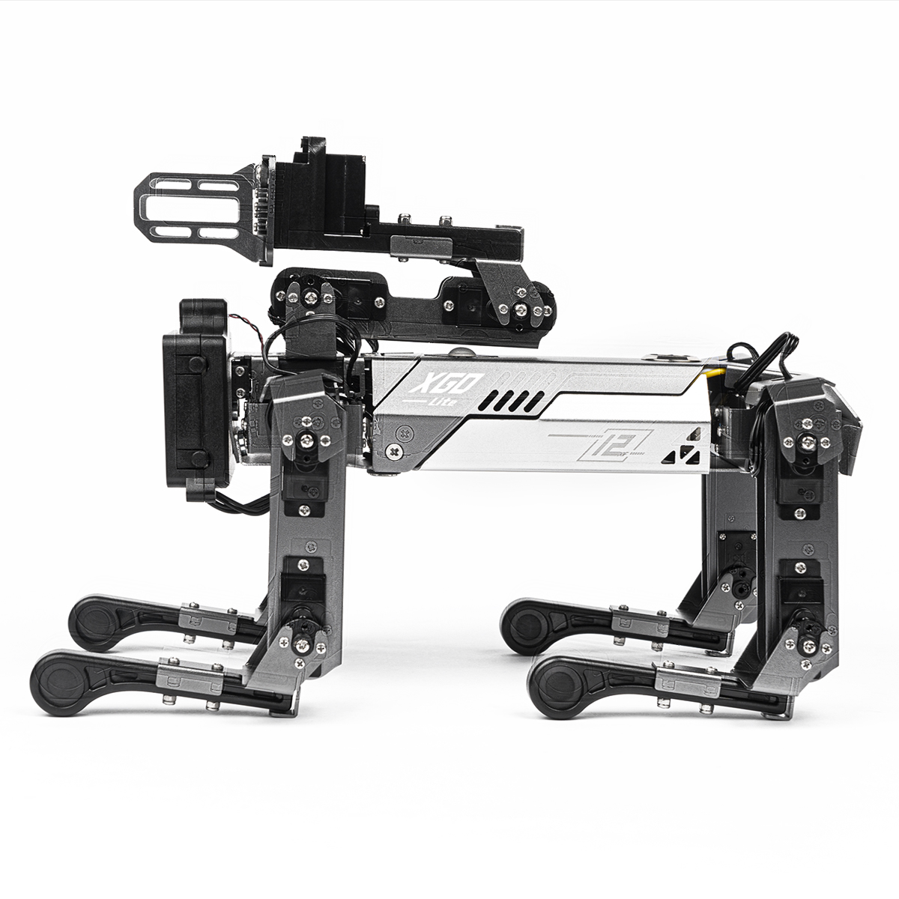
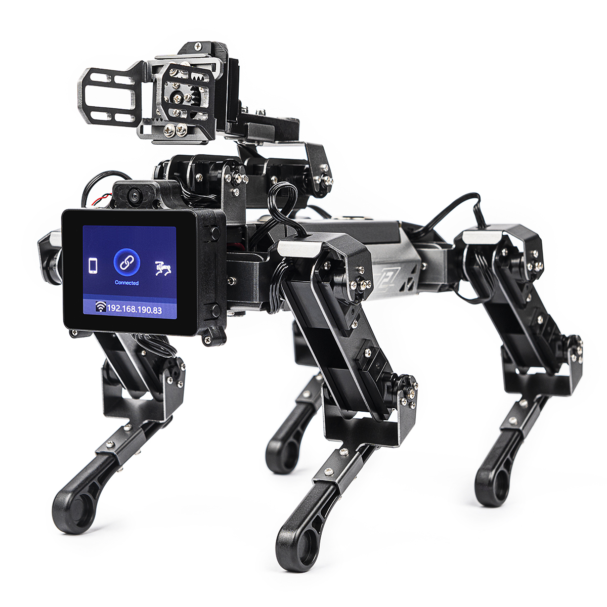
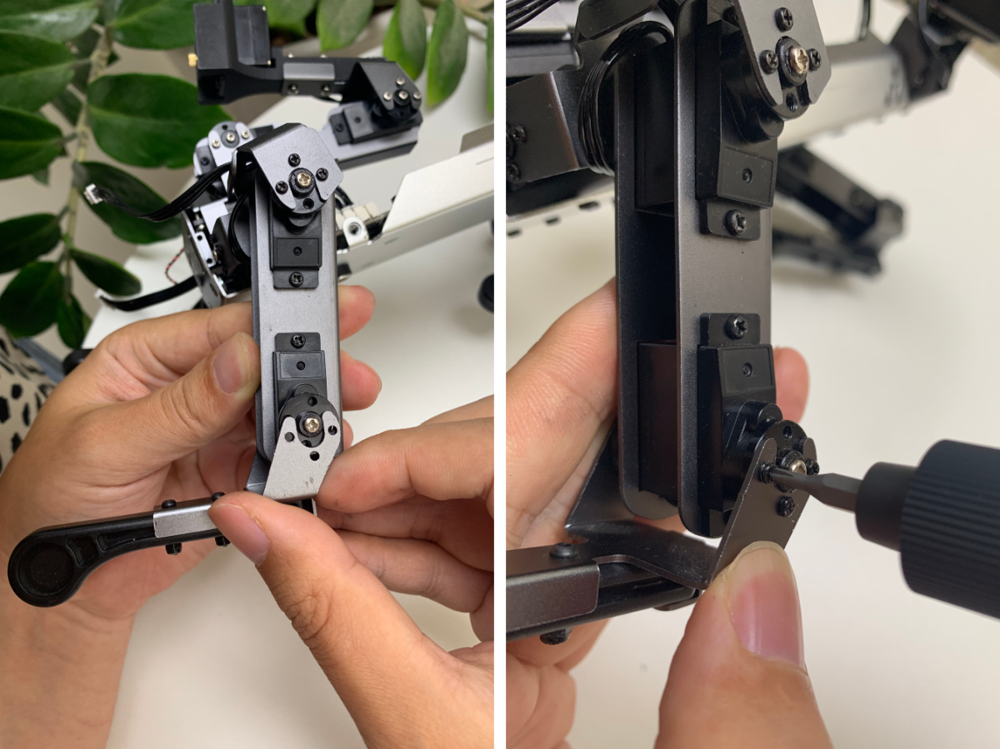

# 硬件问题

## 机器狗走不直

1. 机器狗是通过陀螺仪纠偏的，开机的时候需要将机器狗放在地面或者桌子上，按下开关后陀螺仪会有3-5s的初始化过程，在此其间切勿移动机器狗，待开关灯常亮后再操作。

2. 如果排除陀螺仪初始化的问题后机器狗行走依然偏差很大，则需要对机器狗重新标定。

## 重新标定机器狗

当您发现您的机器狗姿态不正常时，如站立姿态时，某条腿严重偏离导致四条腿无法同时着地或者明显身体歪斜，很有可能是由于螺丝松动或舵机滑齿导致初始位置偏离预设值，此时您可以进行初始位置标定，以重新校准机器狗初始位置预设值。

1. 打开 [XGOBOT APP](https://pan.baidu.com/s/16TQQ3AEBwlI37oNj0oQOzA?pwd=d4qa)，通过 Wifi 连接上机器人后，点击设置按钮按钮，以开发者身份运行，如下图所示。

   

2. 返回主页面，点击标定图标。

3. 进入标定页面，此时会有弹窗提示。

4. 点击“开始标定“，此时机器狗的舵机将不再输出力矩，允许您转动所有关节。将机器狗按照下图姿势摆放，注意，使每条腿肩部垂直于身体，大腿垂直于地面，小腿垂直于大腿,**将夹爪打开至最大量程**，机械臂折叠放在背上，摆放是否垂直将直接影响机器狗工作时的姿态。

5. 摆放标准后，在标定界面中点击“完成标定”按钮，10秒后机器狗将恢复初始站立姿势。

## 更换舵机

以更换膝关节舵机为例，图示更换舵机。**注意：机器狗舵机共有15个不同的ID,必须使用相同ID替换**。

机器狗坐标系，腿，舵机，编号图

#### 步骤一，打开机器狗后盖，从驱动板上拔掉损坏的膝关节舵机线。

#### 步骤二，拆掉膝关节舵机主副舵盘的舵盘螺丝，把小腿取下来。

#### 步骤三，取下损坏的舵机，注意不要使劲拉扯舵机线。

#### 步骤四，把膝关节舵机线穿过对应的位置，并把舵机固定在大腿钣金上。

#### 步骤五，把小腿固定在主副舵盘上，注意小腿和大腿需要形成90°直角。

#### 步骤六，把线插在主板上，关闭机器狗上盖，开机并重新标定机器狗。

