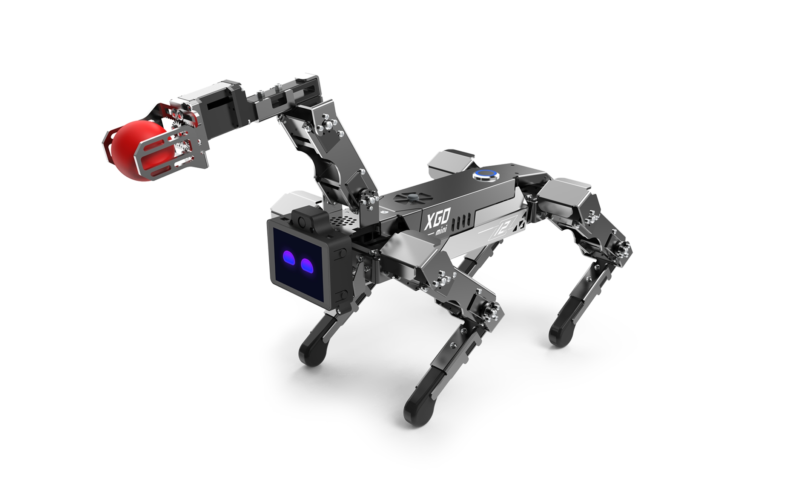
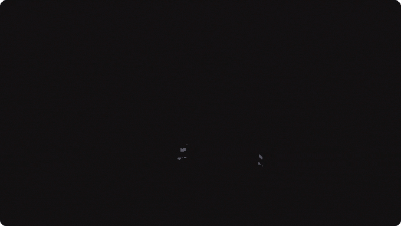
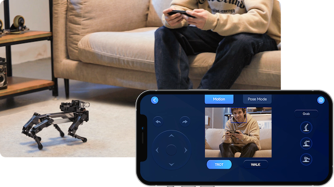
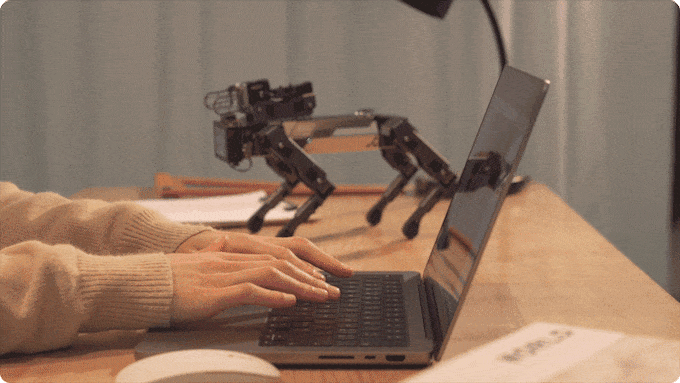
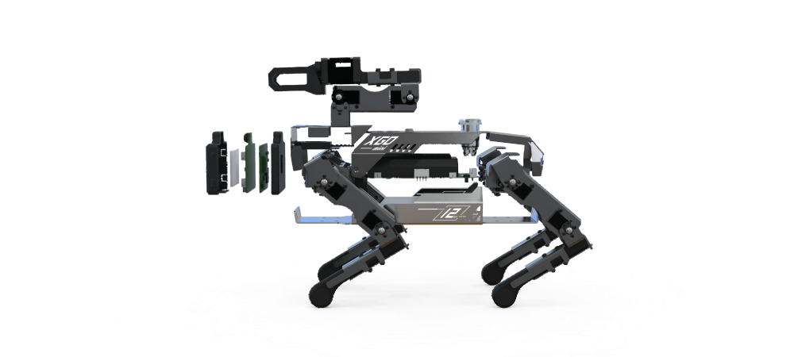
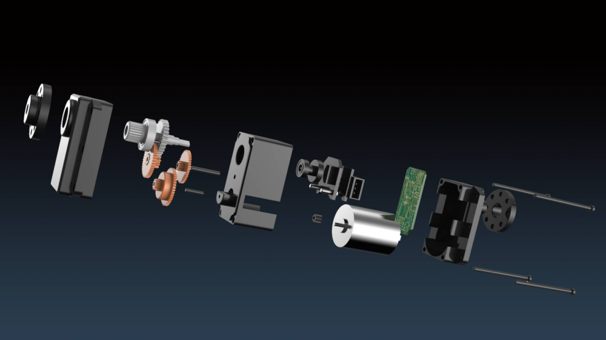

# XGO-mini 机器人套装V2-CM4版

## 简介

XGO-mini2 是一款功能强大的桌面级 Al 机器狗，具有十五自由度和出色的性能。它背部搭载机械臂和末端夹爪，内置树莓派 CM4 模组实现 AI 边缘计算应用。

XGO-mini2 具有全向移动能力，六维姿态控制以及多种运动步态，可以灵活应对不同的场景和任务。它内部搭载了 IMU、关节位置传感器和电流传感器，能够实时反馈自身的姿态、关节角度和力矩信息，为内部算法和二次开发提供支持。

在关节方面，XGO-mini2 采用了4.5KG.CM 全金属磁编码总线串口舵机。这款舵机拥有更大的力矩，在较多负载的情况下保持姿态的稳定。舵机的转速很快，同时具有较高的精度，这种高精度的控制能够确保 XGO-mini2 在运动过程中具有更加平稳和精准的姿态。

除了舵机的强大性能，XGO-mini2 还搭载了强大的AI模组。支持 H.265 和 H.264 视频解码，能够实现高清视频播放和编码。优秀的图形处理能力使得 XGO-mini2 能够呈现出精美的图像效果。

XGO-mini2 的内存容量为 4GB，可以支持大规模的数据处理和存储。它还配备了 4 个可编程按键，提供了更多的交互方式和控制选项。Micro HDMI 视频输出接口和 Type-C USB 接口使得 XGO-mini2 可以与外部设备进行连接和数据传输。

XGO-mini2的电源系统也是非常可靠和安全的。充电器具有过流保护特性，防止过充导致爆炸的情况。电池采用了 18650 标准 3500 毫安3C 放电电池，具有较高的容量和放电能力，能够支持机器狗的长时间运行。

此外，XGO-mini2 支持跨平台图形化编程、Python 编程和 ROS 编程，可以实现丰富的人工智能应用，如人脸检测、物体分类和语音识别等。无论是在家庭娱乐、教育还是研究领域，XGO-mini2 都能够展现出出色的表现和应用潜力。

## 功能描述

1、可实现 AI 边缘计算图形化编程，例如人脸检测，物体分类，语音识别等常用程序。

2、可实现全向移动，六维姿态控制，多种运动步态及运动叠加，内置陀螺仪，可保持身体自平衡。

3、产品配套跨平台图形化和 Python 编程云平台，有相关配套课程。

4、伺服舵机具有关节角度回读功能，允许它记住每个动作的关节位置并执行你设计的动作组，可用于示教编程。

## 产品特性

- IMU 姿势自稳--通过 IMU 获得的姿态数据，采用闭环控制的方式，无论平面如何晃动，机器狗都保持稳定。

- 整机六自由度姿态控制--足尖不动的情况下，实现身体六个自由度的运动控制。

- IMU 姿势柔顺--通过 IMU 获得的姿态数据，闭环控制实现机器狗可以实适应外力，调整到手掰动的目标姿态，实现示教功能。

- 用户通讯与二次编程接口--开放底层串口协议，用于二次开发和验证。

- 运动步态规划--机器狗低中高三种姿势匹配三种速度，采用不同的步态策略和规划算法

- 运动学与动力学仿真接口--在 ros 环境下，在 rviz 和 gazebo 平台上进行运动学与动力学仿真。

- 全向运动控制--由于具有 15 个主动关节，通过运动学解耦实现机器狗前进平移转动全向运动，并支持多个方向的运动叠加。

- 人工智能--机器视觉，人脸识别，语音识别，模型训练等 AI 功能。

## 机械结构

XGO-mini V2 的主体结构是由厚度为1.5mm铝合金结构件，小腿和总线舵机组成，头部的 AI 模组和驱动板由 4pin 信号线连接，内置 2 节 18650 锂电池

- 机器狗前盖，机器狗后盖和机器狗底盖作为机器狗机架，用于联接各部件。前后腿分别通过四颗螺钉固定在机器狗底盖前后侧；核心驱动板通过四颗螺钉固定在机器狗底盖中间。

- 每条腿上各搭载三个舵机作为肘、肩、髋关节。机械上，三个关节舵机使用铝合金结构件进行固定联接。电气上，肘关节舵机和肩关节舵机，肩关节舵机和髋关节舵机，髋关节舵机和核心驱动板之间各使用一条舵机线连接，使得核心驱动板能够驱动并控制所有的关节舵机。

- AI 模组固定在机器狗前盖上，并通过AI模组串口连接线与核心驱动板进行连接。

- 开关通过螺母固定在机器狗后盖上，并与核心驱动板进行连接。开关为自锁类型，即按下后不回弹且机器狗处于持续通电状态；再次按下后机器狗断电并在3~4秒后趴下关机。

- 18650 2S电池通过魔术贴粘在驱动板上，充电孔固定在底板。

## XGO-CM4 模组

AI 模组采用树莓派 CM4 技术方案，配有 2.0 寸 IPS 彩色显示屏幕和 4 个可编程按键，500 万像素摄像头,数字麦克风及腔体扬声器，是一款拥有人机交互能力的 AI 终端，可以实现图像识别，人脸检测，语音识别等功能，帮助学生学习 AI 知识。

## XGO-mini2 驱动板

选用 ESP32-WROVER 模组，ESP32-WROVER 系列模组基于 ESP32-D0WD 双核芯片设计，并且拥有足够的接口与外设通讯，使用串口与串口舵机通信，IIC 接口读取陀螺仪 MPU6050数据，系统使用两节18650锂电池供电。

选用 ESP32-WROVER 模组，ESP32-WROVER 模组是一款高性能、低功耗的 Wi-Fi + 蓝牙/蓝牙 LE 双模组组件，基于 Espressif Systems 的 ESP32 系列芯片而制。在 XGO-mini2 的驱动板中，它起到了非常关键的作用。下面是一段关于 ESP32-WROVER 模组的详细介绍。

主要特性：

- 集成双核心处理器：ESP32-WROVER 模组集成了一个高性能双核 Tensilica LX6 微处理器，工作频率可达 240 MHz，为 XGO-mini2 提供强大的计算能力，满足了实时运动学逆解算的算力需求。
- 无线通信：支持 2.4 GHz Wi-Fi 和蓝牙（包括经典蓝牙和蓝牙低功耗 BLE）双模通信，使得机器狗可以轻松实现远程操控和数据传输。
- 大容量内存：最高可达 4MB SPI Flash 和 8MB PSRAM，为复杂数字处理任务提供充足的内存空间。
- 低功耗模式：支持多种低功耗模式，有利于延长机器狗的使用寿命和降低能源消耗。
- 强大的 I/O 接口：包含多达 34 个可编程 GPIO 引脚，可支持各种传感器、执行器和通信接口，方便进行功能扩展。
- 安全性：内置硬件加密引擎，支持 AES、SHA-2、RSA、Elliptic Curve Cryptography (ECC) 等加密算法，确保数据安全。

得益于 ESP32-WROVER 模组的高性能、低功耗和丰富的功能特性，它广泛应用于各类物联网（IoT）项目中，如智能家居、可穿戴设备、无线传感器网络、远程控制等领域。在  XGO-mini2 中，ESP32-WROVER 模组实现了设备的核心控制、数据处理和通信功能，为用户打造出一款智能、灵活且可拓展的机器狗产品。

## XGO-mini2 关节

XGO-mini2 选用 6V 4.5KG.CM 金属壳钢齿 360 度磁编码双轴 TTL 串口舵机。

由直流空心杯电机、减速齿轮组、12位磁编码器和集成控制电路组成，自带闭环控制与规划算法，高速总线通讯，360度角度可控，支持速度、位置、电流、温度反馈与控制参数调整功能，为机器人提供高性能伺服驱动 。定制的关节提供了 PID 参数调节，优化了关节阻抗特性（柔顺性），在基本的运动学步态规划基础上，结合对重心的考虑和IMU的反馈，以及上层控制指令的要求，可进行实时的调整。同时采用了大速比，高效率的减速器，保证了柔顺性的同时，提高了负载自重比。

