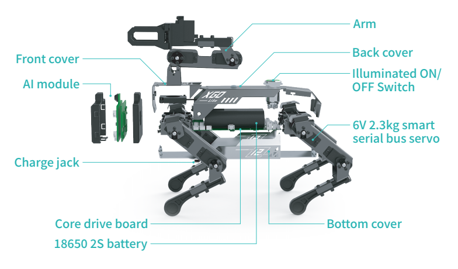

# XGO-lite2 产品参数

## 整机参数

- 型号：XGO-lite2

- 尺寸：默认站姿250-145-170mm

- 重量：575g

- 材质：身体为1mm航空铝材，腿为ABS工程塑料。

- 屏幕：2.0寸 320*240像素全彩IPS

- 摄像头：500万像素OV5647

- 麦克风：双MEMS数字麦克风

- 喇叭：8欧3瓦腔体

- 存储:Micro SD卡32G

## AI 模组参数

- Broadcom BCM2711 4核Cortex A72 1.5GHz (ARM v8) 64-bit CPU

- 支持H.265 (HEVC) (最高支持4Kp60解码), H.264 (最高支持1080p60解码, 1080p30编码)

- OpenGL ES 3.0 graphics

- 4个可编程按键

- Micro Hdmi视频输出接口

- Type-C USB接口

- PH2.0 4PIN串口通信及电源接口

## 舵机参数

- 型号：总线串口舵机

- 输出扭矩：2.3KG•CM；

- 转速（S/60°）：0.1 S/60°；

- 工作电压范围：4.8V～7.4V

- 工作温度：-20℃～ +60℃；

- 角度范围：0-300°；

- 重量：13±1g。

- 马达类型：铁芯

## 电池参数

- 充电器输入电压：100-240V AC 50/60Hz；

- 充电器输出电压：8.4V；

- 充电器输出电流：1A，具有过流保护特性，防止过充爆炸。

- 电池：18650标准2500毫安3C放电
