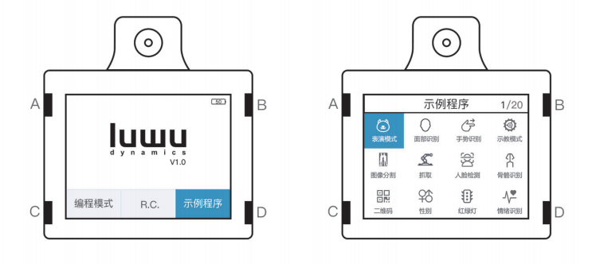
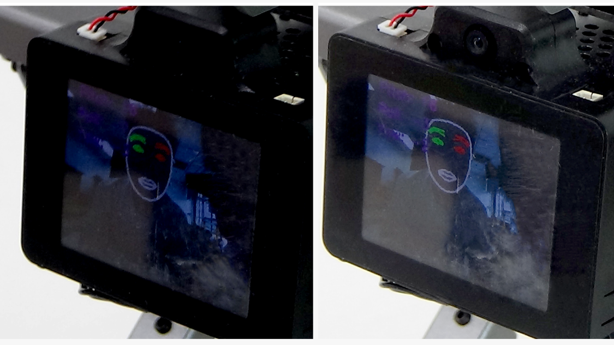
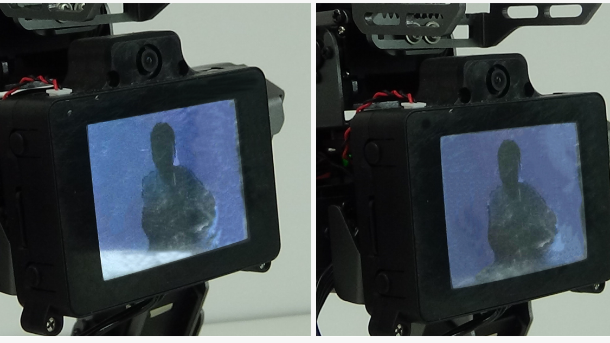
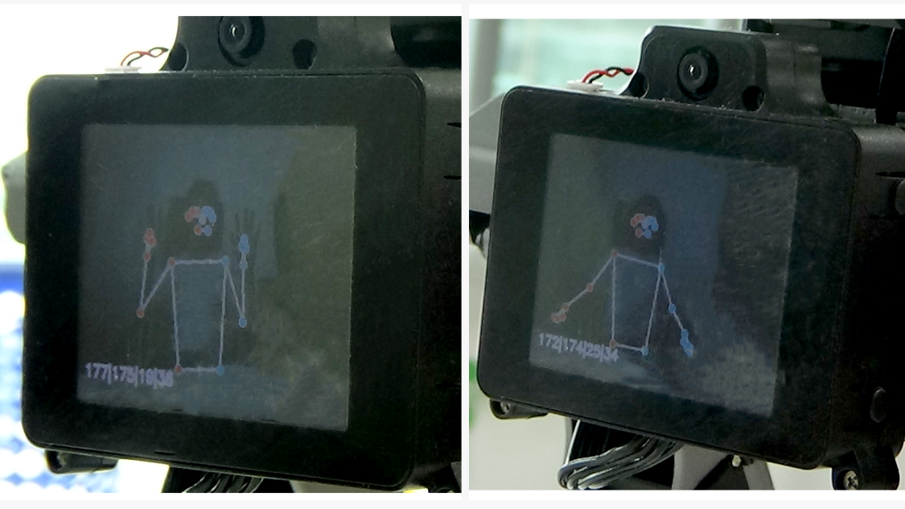
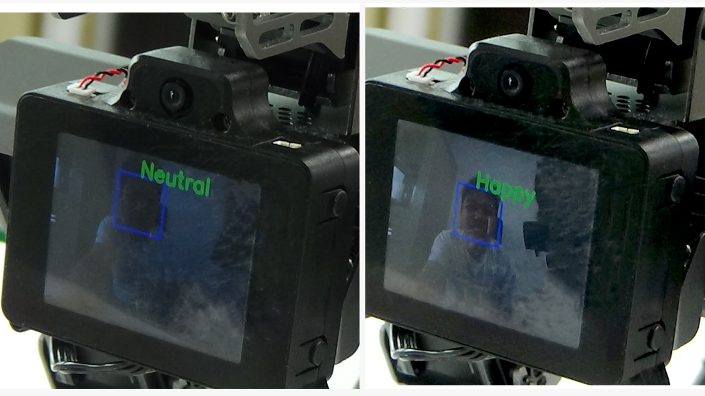
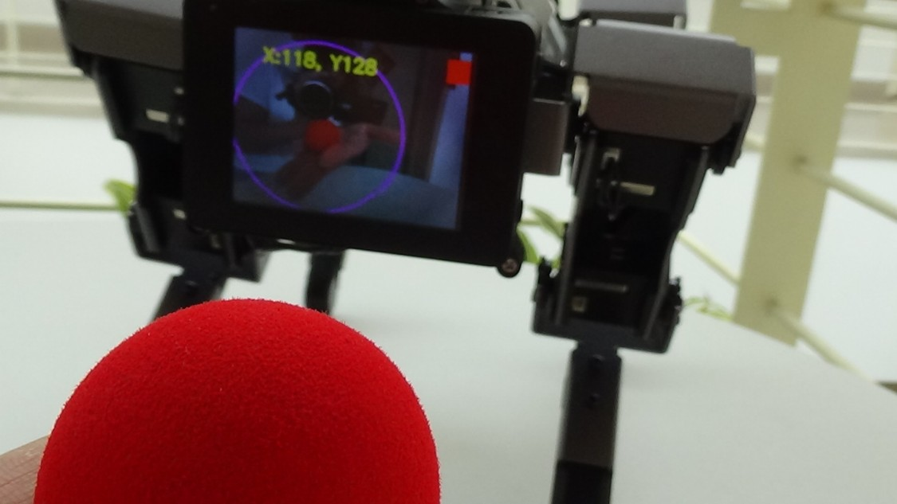
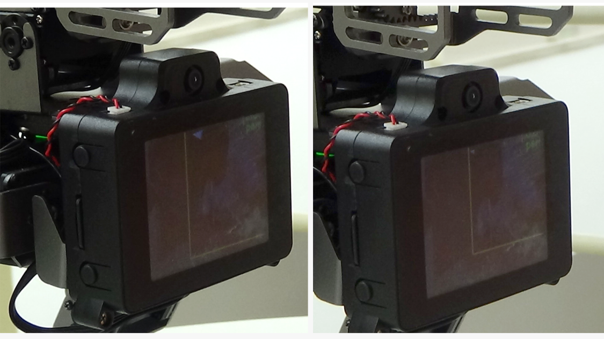
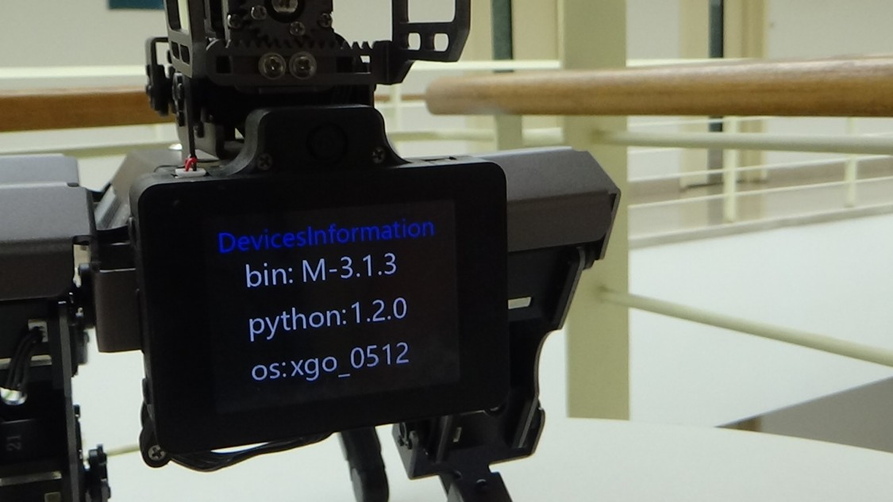

# 示例模式

示例模式指的是，机器狗脱离手机或者电脑，通过 AI 模组上的按键操作即可操作体验机器狗。**A** 键和 **B** 键为选择键，**C** 键为退出键，**D** 健为确认键。

1. 表演模式：机器狗循环执行所有内置动作组并唱歌。

   

2. 人脸面具：给人脸带上面具，机器狗会根据脑袋的不同角度做运动反馈。

   

3. 群控模式：机器狗开启群控服务后，通过 XGOBOT APP 可以群控机器狗。

4. 手势识别：识别1，2，3，4，5，6，good ,石头等手势动作，注意需要等机器狗执行完上一个动作后再次进行识别。

   

5. 示教模式：根据屏幕中的提升记录机器狗各个关节的位置并执行。

   

6. 背景分割：将人的形状从背景中分割出来

   

7. 人脸跟踪：机器狗检测出人脸并实时跟踪

   

8. 姿势检测：检测人体关键点

   

9. 二维码检测：检测二维码信息

10. 性别识别：识别男女和年龄,识别到男性，机器狗会汪汪叫，识别到女性，机器狗会呜呜叫。备注：树莓派加载模型后反应会比较慢。

11. 交通识别：识别交通信号，注意此功能为框架，用户可以根据需要自行添加模型和图片。

12. 情绪识别：可以识别开心，悲伤，愤怒等情绪，机器狗也会做相应的反馈。备注：此模型比较大，树莓派加载后速度会比较慢。

    

13. 语音识别：此功能需要联网，接入科大讯飞的语音识别云平台，根据语音框内的短词语，识别后狗做相应的动作，注意此功能识别效果不同场景下不同，用户可以根据开源代码自行优化。

14. 巡线：机器狗巡线，此功能目前只提供框架，用户需要根据自己的巡线图纸自行调整代码。

15. 色块跟踪：颜色跟踪

    

16. 音频检测：机器狗播放音乐，屏幕中有声音频率显示柱状图不断变化。

17. 高度控制：通过手势来控制机器狗的身高，使用此功能需要光线明亮，背景干净。

18. Yolo：目标检测

    

19. Wifiset：用于不同国家的 WiFi 频率 5G 信道设置，中国地区用户无需设置。

    

20. WPAset：用于不同机器狗连接不同 WIFI 热点，可以自动生成不同的 SSID 和密码。

    

21. Burn: 通过树莓派 CM4 可以对机器狗下位机进行烧录固件，一般情况下勿操作，如需升级请联系厂家。

22. 相机标定：用于竞赛的相机标定，一般情况下勿操作，如需了解可以参考 Github 开源库代码。

23. 网络设置：打开这个程序后，让机器狗扫描 XGOBOT APP 上生成的包含 WIFI 的 SSID 和密码的二维码，即可让机器狗连接到指定的WIFI上。

24. 关于设备：显示下位机固件版本，运动库版本和树莓派镜像日期。

    

备注：树莓派 CM4 上的 demo 代码为开源，在不同的使用场景下面效果不尽相同，开发者可以自己的需求自行修改。

Github 仓库地址：https://github.com/Xgorobot/RaspberryPi-CM4
