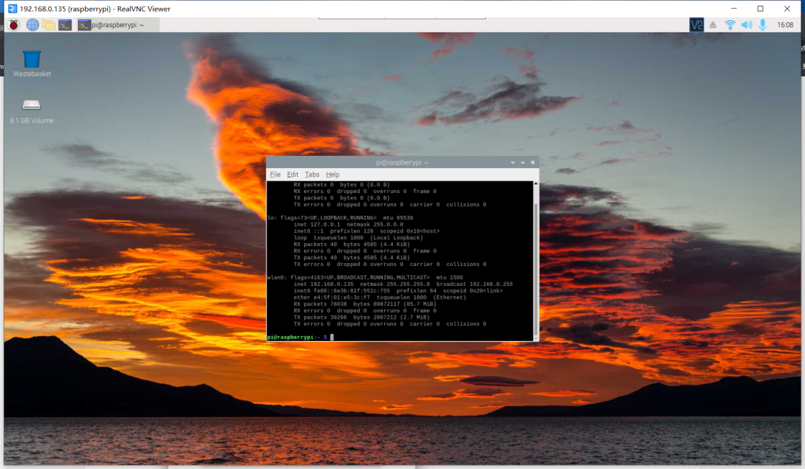

# 树莓派环境开发

## 显示树莓派桌面

使用随机配送的 Micro HDMI 线，一端插在机器狗屏幕左下方端口，另外一端连接在显示器上，同时用随机配送的 Type-C USB Hub 插在机器狗屏幕右下方端口，把鼠标和键盘插在 Hub 上即可操作树莓派桌面。

## 远程登录

使用任意终端 SSH 登录树莓派，用户名和密码均为树莓派系统默认的 pi。

下载VNC工具，下载链接如下：https://www.realvnc.com/en/connect/download/viewer/

打开工具并输入机器狗IP

