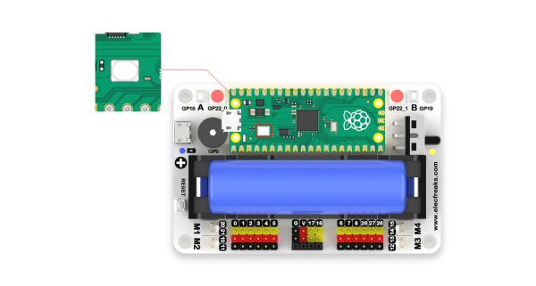
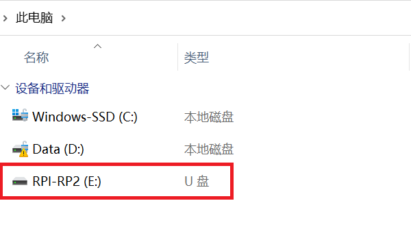
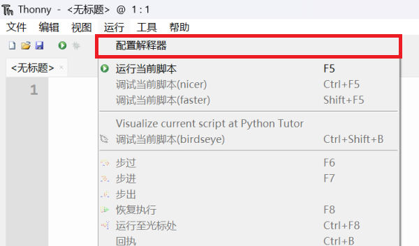
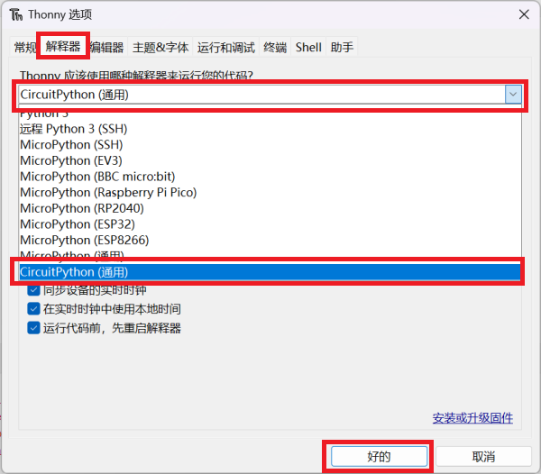
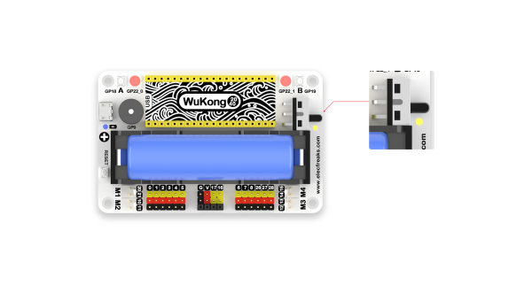
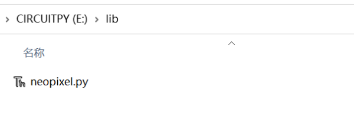

# 悟空2040-PicoW

## 介绍


**悟空2040** 是一款为 Raspberry Pi Pico 设计的多功能扩展板。

在功能上，它板载蜂鸣器、A\B按键、彩虹灯、电机接口、复位按钮等，满足创客们的IO编程以及扩展外设所需。 

在续航上，它支持大容量的18650电池，板载智能电源管理芯片与贴心的电量指示，正常使用时长可达120分钟以上。 

在结构上，它采用标准 7 × 11 方形积木框作为底座，可以为悟空2040扩展出各种生动的造型。 

更为贴心的是，恩孚科技为初学者提供了丰富的学习案例，可以帮助您快速入门创客世界，并应用到实际生活中。

> Raspberry Pi Pico 是一款树莓派官方设计的高性能、体积小的微控制器开发板。采用树莓派官方自研的 RP2040 微控制器芯片，搭载了ARM Cortex M0 + 双核处理器，高达 133MHz 的运行频率，内置了 264KB 的 SRAM 和 2MB 的内存，还板载有多达 26 个多功能的 GPIO 引脚。

## 特性

* 板载蜂鸣器、A\B按键、彩虹灯、复位按钮等元器件，集成度高、功能强大。
* 支持大容量的18650电池，板载智能电源管理芯片与电量指示，让学习者摆脱电源烦恼，随时随地享受创造乐趣。
* 扩展出多达14路通用 IO 引脚，并且单独引出 I2C 接口，极大方便学习者连接各种外设。
* 标准的积木框底座，方便结构搭建。 
* 支持多种编程方式：MicroPython、CircuitPython、C、C++。
* 丰富的学习案例。

## 尺寸参数


## 模块介绍


## 详细参数

| 参数     | 详情                    | 备注                                  |
| :------- | ----------------------- | ------------------------------------- |
| 产品编号 | EF02054                 | SKU                                   |
| 尺寸     | 87.80 × 55.80 × 36.33mm | 以实物为准                            |
| 重量     | 97g                     | 包含底座、包含锂电池                  |
| 电源系统 | 拨动开关                | -                                     |
| 供电电池 | 18650锂电池             | 快充60分钟，满载工作40分钟以上        |
| 工作电压 | 2.8v~4.2v               | 充电温度0°C~40°C                      |
| 工作温度 | -20°C~60°C              | -                                     |
| 电机驱动 | 4路（M1、M2、M3、M4）   | 电池电压                              |
| GPIO接口 | 12路                    | 0，1，2，3，4，5，6，7，8，26，27，28 |
| IIC接口  | 3路                     | 引脚为16、17                          |
| 全彩灯珠 | 2颗                     | 灯珠型号是ws2812b                     |
| 蜂鸣器   | 无源蜂鸣器              | 型号：SEN-OASS2P0905-DIP              |
| 积木底座 | 标准11×7方形积木框      | -                                     |
| 复位按键 | RESET按钮               | -                                     |

## 编程环境配置

### 前言

Raspberry Pi Pico 支持C、C++、MicroPython、CircuitPython等编程方式，点击下方链接下载相应的驱动文件。

>本文所有的案例基于 CircuitPython，如果您是初次接触 Raspberry Pi Pico 建议先下载 CircuitPython 驱动程序，参考案例进行学习。
>
>CircuitPython 是一种编程语言，旨在简化在低成本微控制器板上进行编码的实验和学习。CircuitPython 是对微控制器进行编程的最简单方法。
>
>您可以通过 CircuitPython 官网和论坛了解更多详细内容。
>
>[CircuitPython 官网](https://circuitpython.org/)
>
>[CircuitPython 论坛](https://forums.adafruit.com/viewforum.php?f=60)

| 固件          | 链接                                               |
| ------------- | -------------------------------------------------- |
| CircuitPython | https://circuitpython.org/board/raspberry_pi_pico/ |

点击固件下载页面后，点击下图位置的链接：


### 固件安装


完整固件烧录演示如下图所示：

第一步：按下 Raspberry Pi Pico 板载 BOOSEL 按钮不松开。



第二步：使用良好的 USB 数据线将 Raspberry Pi Pico 连接计算机，当电脑磁盘目录显示“RPI-RP2”驱动器时，可以松开 Raspberry Pi Pico 板载 BOOSEL 按钮。



第三步：拖动之前下载好的 UF2 文件到"RPI-RP2"磁盘中，等复制完成后，“RPI-RP2”盘符会消失，新出现“CIRCUITPY”驱动器。恭喜您，已经成功安装 CircuitPython。


### 编程平台设置

本文档所有案例编程文件均在 Thonny 中编写完成，如果您是初次接触 Raspberry Pi Pico，建议您编写程序从 Thonny 入手。点击下方链接选择适配您电脑操作系统平台的 Thonny 并下载。

>Thonny 是一款面向初学者的入门级 Python IDE，专为学习和教学编程而设计的。Thonny 由爱沙尼亚的 Tartu 大学开发，对硬件编程用户非常友好，可以根据不同的开源硬件选择不同的解释器。

| 名称   | 链接                |
| ------ | ------------------- |
| Thonny | https://thonny.org/ |


### 选择 Thonny 解释器

将安装在电脑上的 Thonny 打开，点击“**运行**”选项中的“**配置解释器**”菜单，在“**解释器**”选项下，点击选择解释器下拉菜单选择“**CircuitPython(通用)**”，点击“**好的**”完成解释器配置。

步骤如图所示：





## 开始使用

### 悟空2040 扩展板开机及充电方式

* 如下图（1）所示，上拨电源开关，悟空2040扩展板关机。
* 下拨电源开关，悟空2040扩展板开机，电源指示灯亮起。
* 将USB电源线连接至充电口，如下图（2），电量指示灯亮起。



(图1)


(图2)


电量指示灯状态：

电量低于20%，指示灯颜色为红色；

电量在20%~80%，指示灯颜色为橙色；

电量高于80%，指示灯颜色为绿色。


充电指示灯状态：

未充满状态，指示灯颜色为红色；

充满状态，指示灯颜色为绿色。

### 项目案例

##### 案例一：点亮 Raspberry Pi Pico 板载LED灯

Raspberry Pi Pico 板载一颗 LED 灯，引脚为GP25。编程实现 LED 灯呈现呼吸效果。

代码参考一：

```python
import board  # 导入board库，从过引脚访问硬件
import time  # 导入time库，用于控制代码执行，比如通过不同休眠时间暂停程序执行
import digitalio # 导入digitalio库，允许访问并设置硬件为输入输出

led_onboard = digitalio.DigitalInOut(board.LED)  # 创建board.LED对象
led_onboard.direction = digitalio.Direction.OUTPUT  # 设置为输出模式

while True:
    led_onboard.value = True  # 设置板载 led 灯为高电平(点亮)
    time.sleep(1)
    led_onboard.value = False  # 设置板载 led 灯为低电平(熄灭)
    time.sleep(1)
```

代码参考二：

```python
import time
import board
import pwmio  # 导入pwmio，该模块包含对基本脉冲访问的类

led_onboard = pwmio.PWMOut(board.LED, frequency=5000, duty_cycle=0)  # 从引脚创建pwm对象输出

while True:
    for i in range(100):
        if i < 50:
            led_onboard.duty_cycle = int(i * 2 * 65535 / 100)  # 设置占空比值
        else:
            led_onboard.duty_cycle = 65535 - int((i - 50) * 2 * 65535 / 100)
        time.sleep(0.01)
```

##### 案例二：可编程按钮A\B

悟空2040板载两颗可编程按钮A\B，编程实现按下悟空2040板载A按键，Raspberry Pi Pico 板载LED灯会点亮，按下B按键，LED灯会熄灭。

代码参考：

```python
import board
import digitalio

led_onboard = digitalio.DigitalInOut(board.LED)

led_onboard.direction = digitalio.Direction.OUTPUT

button_a = digitalio.DigitalInOut(board.GP18)  # 从引脚创建wukong2040按键A的对象
button_b = digitalio.DigitalInOut(board.GP19)

button_a.direction = digitalio.Direction.INPUT  # 设置button_a为输出模式
button_b.direction = digitalio.Direction.INPUT
button_a.pull = digitalio.Pull.UP  # 设置上拉
button_b.pull = digitalio.Pull.UP

while True:
    if button_a.value == False:  # button_a.value的值为A按键的状态值，按下为0，松开为1
        led_onboard.value = True
    elif button_b.value == False:  # button_b.value的值为B按键的状态值，按下为0，松开为1
        led_onboard.value = False
```

##### 案例三：点亮全彩灯珠

悟空2040板载两颗全彩 LED 灯珠(ws2812b),引脚编号为GP22_0,GP22_1。编程实现两颗灯珠变换颜色闪烁。

>使用 CircuitPython 对全彩灯珠（ws2812b）进行编程，需要使用到 neopixel 库文件，可以点击下方链接下载 neopixel 库文件并保存到 “CIRCUITPY” 驱动器 “lib” 目录下面。

| neopixel 库文件链接 | https://github.com/adafruit/Adafruit_CircuitPython_NeoPixel |
| ------------------- | ----------------------------------------------------------- |

如图所示：



代码参考：

```python
import time
import board
from rainbowio import colorwheel
import neopixel

NUMPIXELS = 2
SPEED = 0.05
BRIGHTNESS = 0.2  # 数值在(0.0, 1.0),其中0.0为关闭，1.0为最大
PIN = board.GP22  # 彩虹灯珠引脚为GP22

pixels = neopixel.NeoPixel(PIN, NUMPIXELS, brightness=BRIGHTNESS, auto_write=False)


def rainbow_cycle(wait):
    for color in range(255):
        for pixel in range(len(pixels)):
            pixel_index = (pixel * 256 // len(pixels)) + color * 5
            pixels[pixel] = colorwheel(pixel_index & 255)
        pixels.show()
        time.sleep(wait)


while True:
    rainbow_cycle(SPEED)
```

##### 案例四：驱动蜂鸣器

悟空2040板载蜂鸣器，引脚编号为GP9，编程实现按下蜂鸣器播放一段音乐。

代码参考：

```python
import time
import array
import math
import board
import digitalio
from audiocore import RawSample

try:
    from audioio import AudioOut
except ImportError:
    try:
        from audiopwmio import PWMAudioOut as AudioOut
    except ImportError:
        pass

button = digitalio.DigitalInOut(board.GP18)
button.switch_to_input(pull=digitalio.Pull.UP)

tone_volume = 0.9
frequency = 440
length = 8000 // frequency
sine_wave = array.array("H", [0] * length)
for i in range(length):
    sine_wave[i] = int((1 + math.sin(math.pi * 2 * i / length)) * tone_volume * (2 ** 15 - 1))

audio = AudioOut(board.GP9)
sine_wave_sample = RawSample(sine_wave)

while True:
    if not button.value:
        audio.play(sine_wave_sample, loop=True)
        time.sleep(1)
        audio.stop()
```

##### 案例五：驱动电机

悟空2040板载4路电机接口：M1、M2、M3、M4，编程实现电机M2旋转5秒后停止。

代码参考：

```python
import board
import digitalio
import time 

motor = digitalio.DigitalInOut(board.GP10)
motor.direction = digitalio.Direction.OUTPUT

while True:
    motor.value = True
    time.sleep(5)
    motor.value = False
    time.sleep(5)
```

##### 案例五 驱动S90舵机

悟空2040板载12路扩展IO接口（引脚：0，1，2，3，4，5，6，7，8，26，27，28），可以用于驱动[S90舵机](https://shop.elecfreaks.com/products/elecfreaks-micro-servo-360-degrees-digital-servo?_pos=3&_sid=323aff898&_ss=r)。如果使用转接线连接舵机与悟空2040板载引脚接口（引脚：16，17）同样可以驱动S90舵机。

| adafruit_motor 库文件下载链接 | https://github.com/adafruit/Adafruit_CircuitPython_Motor/archive/refs/heads/main.zip |
| ----------------------------- | ------------------------------------------------------------ |

> 使用 CircuitPython 对舵机进行编程
>
> 需要使用到 adafruit_motor 库文件，可以点击上方链接下载 adafruit_motor 库文件并保存到 “CIRCUITPY” 驱动器 “lib” 目录下面。

如图所示：


代码参考：

```python
import time
import board
import pwmio
from adafruit_motor import servo

pwm = pwmio.PWMOut(board.GP0, duty_cycle=2 ** 15, frequency=50)

my_servo = servo.Servo(pwm)

while True:
    for angle in range(0, 180, 5):
        my_servo.angle = angle
        time.sleep(0.05)
    for angle in range(180, 0, -5):
        my_servo.angle = angle
        time.sleep(0.05)
```

##### 案例六：使用GPIO引脚驱动LED灯

悟空2040板载12路扩展IO接口（引脚：0，1，2，3，4，5，6，7，8，26，27，28），可以用于驱动LED灯等数字信号传感器。

>案例演示使用恩孚科技公司[Octopus](https://shop.elecfreaks.com/search?type=product&q=octopus)系列传感器。

代码参考：

```python
# 导入程序所需要的模块
import board
from digitalio import *
from time import *

# 设置LED灯连接的引脚和引脚方向
led_0 = DigitalInOut(board.GP0)
led_1 = DigitalInOut(board.GP1)
led_0.direction = Direction.OUTPUT
led_1.direction = Direction.OUTPUT

# 设置2颗LED灯的状态在亮、灭之间切换
while True:
    led_0.value = True
    led_1.value = False
    sleep(1)
    led_0.value = False
    led_1.value = True
    sleep(1)
```

##### 案例七：读取电位器值

Raspberry Pi Pico 上的GP26、GP27、GP28引脚可以用作GPIO或ADC(模数转换器)输入，可以在编程中进行选择模式。

>案例演示使用恩孚科技公司[Octopus](https://shop.elecfreaks.com/search?type=product&q=octopus)系列传感器。

代码参考：

```python
import time
import board
from analogio import AnalogIn

analog_in = AnalogIn(board.GP26)

while True:
    print(analog_in.value)
    time.sleep(0.1)
```

##### 案例八：驱动OLED屏幕

悟空2040板载IIC引脚（GP16、GP17），可以通过IIC驱动OLED显示屏，需要adafruit_ssd1306.py库文件以及adafru_framebuf.py库文件,点击下方链接进行下载，并将adafruit_ssd1306.py、adafru_framebuf.py保存到 “CIRCUITPY” 驱动器 “lib” 目录下面。

| adafruit_ssd1306.py库文件下载链接 | https://github.com/adafruit/Adafruit_CircuitPython_SSD1306   |
| --------------------------------- | ------------------------------------------------------------ |
| adafru_framebuf.py库文件下载链接  | https://github.com/adafruit/Adafruit_CircuitPython_framebuf/releases/tag/1.4.14 |

如图所示：


> 案例演示使用恩孚科技公司[Octopus](https://shop.elecfreaks.com/search?type=product&q=octopus)系列传感器。OLED显示屏分辨率为：128*64。

代码参考：

```python
import board
import busio
import adafruit_ssd1306
import time

i2c = busio.I2C(board.GP17, board.GP16)
display = adafruit_ssd1306.SSD1306_I2C(128, 64, i2c, addr=0x3C)
bgColor=0

display.fill(bgColor)
for i in range(0,display.height,4):
    for j in range(0,display.width,4):
        display.pixel(j, i, not bgColor)
    display.show()

display.fill(bgColor)
for i in range(0,display.height,4):
    display.hline(0, i,display.width, not bgColor)
    display.show()

display.fill(bgColor)
for i in range(0,display.width,8):
    display.vline(i, 0,display.height, not bgColor)
    display.show()

display.fill(bgColor)
for i in range(0,display.height,4):
    display.line(0, 0, display.width, i, not bgColor)
    display.line(display.width, display.height, 0, display.height-i, not bgColor)
    display.show()

display.fill(bgColor)
for i in range(0,display.width//2,4):
    display.circle(display.width//2, display.height//2, i, not bgColor)
    display.show()

display.fill(bgColor)
for i in range(0,display.height,16):
    for j in range(0,display.width,16):
        display.rect(j, i, 12, 12, not bgColor)
        display.show()

for i in range(0,display.height,16):
    for j in range(0,display.width,16):
        display.fill_rect(j+2, i+2, 8, 8, not bgColor)
        display.show()

display.fill(bgColor)
```

## Wukong2040购买链接

您可以从此链接购买：[Wukong2040](https://shop.elecfreaks.com/products/elecfreaks-wukong2040-expansion-board-adapter-for-raspberry-pi-pico?_pos=1&_sid=148d50ba0&_ss=r)。
