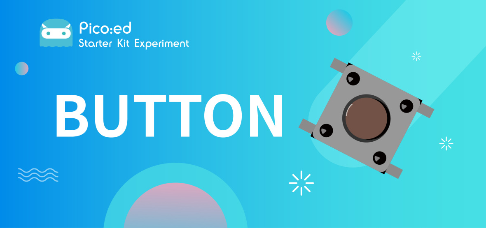
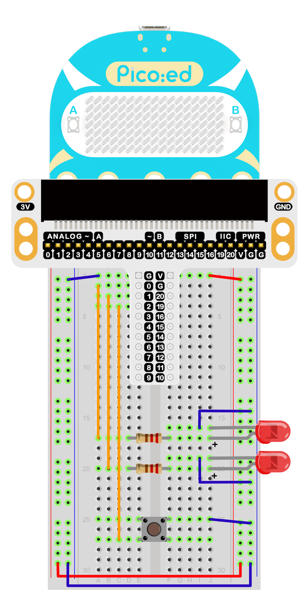

# 按钮



## 简介
瞬时按钮开关是普遍使用的电子元件，在日常生活中使用主要用来连接和切断电路。在上一节课程中，我们已经学习了如何使用 Pico:ed 控制2颗 LED 灯交替闪烁。这节课我们将使用瞬时按钮开关来控制2颗 LED 灯的闪烁。当我们按下按钮，2颗 LED 灯会交替闪烁；松开按钮，LED 灯就会停止闪烁。

## 元件清单

### 硬件：
1 × Pico:ed
1 × USB线
1 × 面包板扩展板
1 × 面包板83×55mm
2 × LED
2 × 100欧姆电阻
1 × 瞬时按钮开关
若干杜邦线


## 主要元件介绍

### 瞬时按钮开关
这是一个用来控制电子设备的普通元件。它大部分用于连接或者切断控制电路，从而实现电机或者其他电子设备的控制。 瞬时按钮开关通常是保持开启的。当它被按下的时候，电路就接通了；当它被弹起的时候，它就会跳回到未连接的状态。


瞬时按钮开关有4个引脚。这4个引脚可以被分为2组：引脚1短接引脚2，引脚3短接引脚4。


## 实验步骤

### 硬件连接
根据下面的图片将你的元件连接起来：
1.将 LED 灯的短引脚与 GND 连接
2.将 LED 灯的长引脚通过电阻，与 P0 口与 P1 口连接
3.将瞬时开关与 P2 口连接



连接完成后如图：


## 程序编写

编程环境准备请参考：[编程环境介绍](https://www.yuque.com/elecfreaks-learn/picoed/er7nuh)

### 代码示例：
```python
# 导入程序所需要的模块
import board
import digitalio
import time

# 设置LED灯的引脚和引脚方向
led_0 = digitalio.DigitalInOut(board.P0_A0)
led_1 = digitalio.DigitalInOut(board.P1_A1)
led_0.direction = digitalio.Direction.OUTPUT
led_1.direction = digitalio.Direction.OUTPUT

# 设置按钮的引脚和上拉模式
button = digitalio.DigitalInOut(board.P2_A2)
button.direction = digitalio.Direction.INPUT
button.pull = digitalio.Pull.UP

# 设置按钮状态改变LED灯的状态
while True:
    if button.value == False:
        led_0.value = True
        led_1.value = False
        time.sleep(1)
        led_0.value = False
        led_1.value = True
        time.sleep(1)
```

### 代码详解：

1. 导入程序所需要的支持模块。`board`模块是引脚名称的通用容器，可以通过`board`模块指定要使用的引脚，`digitalio`模块包含提供对基本数字IO的访问的类。`time`模块包含对时间设置的函数。
```python
import board
import digitalio
import time
```

2. 设置面包板扩展板连接 LED 所使用的引脚以及引脚方向。
```python
led_0 = digitalio.DigitalInOut(board.P0_A0)
led_1 = digitalio.DigitalInOut(board.P1_A1)
led_0.direction = digitalio.Direction.OUTPUT
led_1.direction = digitalio.Direction.OUTPUT
```

3. 设置按钮的引脚和上拉模式。
```python
button = digitalio.DigitalInOut(board.P2_A2)
button.direction = digitalio.Direction.INPUT
button.pull = digitalio.Pull.UP
```
如果你所使用的引脚不是 P0_A0、P1_A1、P2_A2，那么可以在 Thonny 编辑器下方的 shell 窗口中输入以下代码并回车查看其他引脚的编号。
```python
>>> import board
>>> help(board)
object <module 'board'> is of type module
  __name__ -- board
  board_id -- elecfreaks_picoed
  BUZZER_GP0 -- board.BUZZER_GP0
  I2C0_SDA -- board.BUZZER_GP0
  I2C0_SCL -- board.I2C0_SCL
  BUZZER -- board.BUZZER
  BUZZER_GP3 -- board.BUZZER
  P4 -- board.P4
  P5 -- board.P5
  ...
```

4. 设置按钮状态改变 LED 灯的状态
```python
while True:
    if button.value == False:
        led_0.value = True
        led_1.value = False
        time.sleep(1)
        led_0.value = False
        led_1.value = True
        time.sleep(1)
```

## 实验结果
当你按下按钮，你可以看到2颗 LED 灯交替闪烁；松开按钮，这两颗 LED 灯就停止闪烁。如果不是这样的话，请返回之前的步骤，检查你的操作。


## 思考
如果我们想按下按钮点亮红色的 LED 灯，松开按钮点亮绿色的 LED 等，那么我们该如何编程呢？

## 常见问题

## 更多信息，欢迎访问：
[恩孚科技官方文档](https://www.elecfreaks.com/learn-en/)
