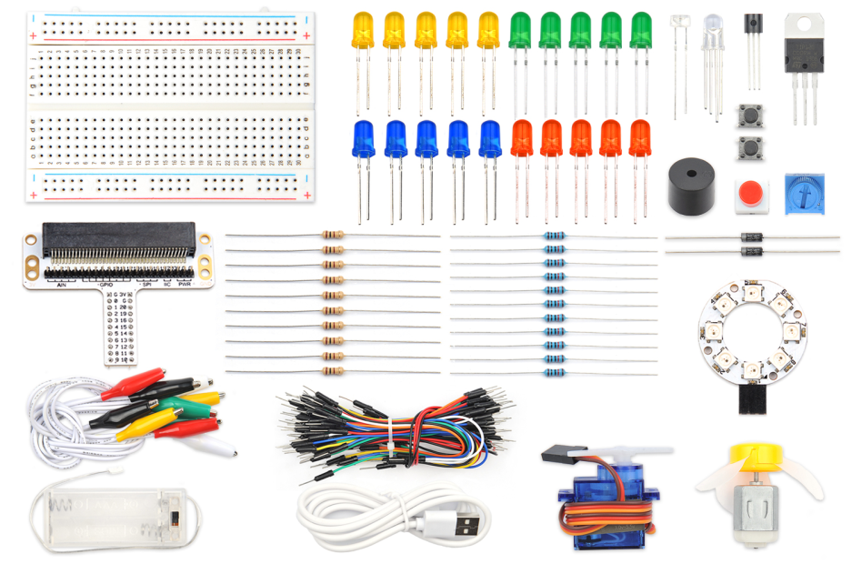
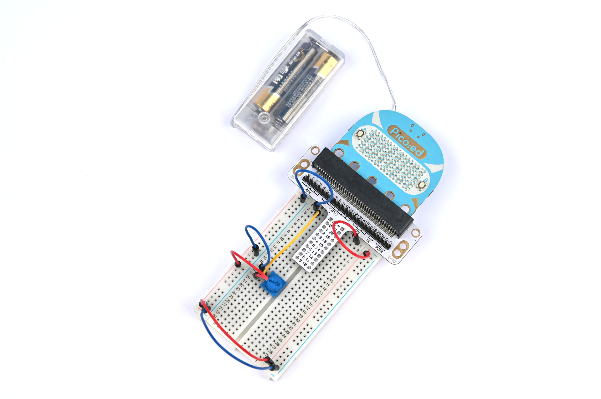

# 电位器


## 简介
电位器是一种可调的电子元件。 它是由一个电阻体和一个转动或滑动系统组成。 当电阻体的两个固定触点之间外加一个电压时，通过转动或滑动系统改变触点在电阻体上的位置，在动触点与固定触点之间便可得到一个与动触点位置成一定关系的电压。 它大多是用作分压器，这时电位器是一个四端元件。在下面的课程中，我们将要读取电位器上的输出电压，并用波浪线的方式将它显示在 Pico:ed 7 * 17 的 LED 屏幕上。

## 元件清单

### 硬件：
1 × Pico:ed
1 × USB线
1 × 面包板扩展板
1 × 面包板83 × 55mm
1 × 10KΩ电位器
若干杜邦线



## 主要元件介绍

### 电位器
电位器是一种压力调节的元件。它包括了一个电阻和一个旋钮或者滑动系统。当添加一个外部的电压到电阻的两个固定接触点，通过使用旋钮或者滑动系统来改变电阻上的接触点的位置，一个和可移动的触点位置有特殊关系的电压就在可移动的触点和两个固定触点之间形成了。大部分时间，它就像一个分压器一样工作。


## 硬件连接
按照下面的图片，将你的元件连接：


这是连接完成后的样子：



旋转电位器的按钮，然后输出电压会随着按钮的旋转在0V和3V之间变化。

## 程序编程
编程环境准备请参考：[编程环境介绍](https://www.yuque.com/elecfreaks-learn/picoed/er7nuh)

### 代码示例：
```python
# 导入程序所需要的模块
import board
import picoed
import analogio
import time

# 设置电位器所使用的引脚
poten = analogio.AnalogIn(board.P0_A0)

# 初始化data列表，存储电位器的值，以便根据取出data列表的值设置Pico:ed屏幕LED的亮度
data = [0, 0, 0, 0, 0, 0, 0, 0, 0, 0, 0, 0, 0, 0, 0, 0, 0]
for i in range(picoed.display.width):
    data[i] = int(poten.value / 9363)


# 循环根据电位器的值转换为Pico:ed LED屏幕第17列LED的Y坐标，依次往左滚动
while True:

    # 引脚模拟值（0-65535）映射到点阵的高度（0-7）
    data[16] = int(poten.value / 9363)
    for i in range(len(data)):
        picoed.display.pixel(i, data[i] - 1, 0)
        if i != 16:
            data[i] = data[i+1]
        picoed.display.pixel(i, data[i] - 1, 30)
        picoed.display.pixel(16, data[16] - 1, 0)
        time.sleep(0.01)
```

### 代码详解

1. 导入程序所需要的支持模块。`board`模块是板基引脚名称的通用容器，可以通过`board`库指定要使用的引脚，`picoed`模块可以设置Pico:ed的LED灯的效果， `analogio` 模块包含提供对模拟 IO 的访问的类。`time`模块包含对时间设置的函数。
```python
import board
import picoed
import analogio
import time
```

2. 设置电位器所使用的引脚，我们使用的是 P0_A0。
```python
poten = analogio.AnalogIn(board.P0_A0)
```
如果你所使用的引脚不是 P0_A0 和 P1_A1，那么可以在 Thonny 编辑器下方的 shell 窗口中输入以下代码并回车查看其他引脚的编号。
```python
>>> import board
>>> help(board)
object <module 'board'> is of type module
  __name__ -- board
  board_id -- elecfreaks_picoed
  BUZZER_GP0 -- board.BUZZER_GP0
  I2C0_SDA -- board.BUZZER_GP0
  I2C0_SCL -- board.I2C0_SCL
  BUZZER -- board.BUZZER
  BUZZER_GP3 -- board.BUZZER
  P4 -- board.P4
  P5 -- board.P5
  ...
```

3. 初始化 data 列表，存储电位器的值，以便根据取出 data 列表的值设置 Pico:ed 屏幕 LED 的亮度。
```python
data = [0, 0, 0, 0, 0, 0, 0, 0, 0, 0, 0, 0, 0, 0, 0, 0, 0]
for i in range(picoed.display.width):
    data[i] = int(poten.value / 7000)

```

4. 循环根据电位器的值转换为 Pico:ed 上 LED屏幕第17列 LED 的Y坐标，依次往左滚动。
```python
while True:
    data[16] = int(poten.value / 7000)
    for i in range(len(data)):
        picoed.display.pixel(i, data[i] - 1, 0)
        if i != 16:
            data[i] = data[i+1]
        picoed.display.pixel(i, data[i] - 1, 30)
        picoed.display.pixel(16, data[16] - 1, 0)
        time.sleep(0.01)
```

## 实验结果
旋转电位器，电压的数值将会以波浪线的形式显示在 Pico:ed 的7 * 17 的 LED 屏幕上。


## 思考
如果我们想用电位器来调节 LED 灯的亮度，那么我们该如何设计电路和编程呢？欢迎和我们进行进一步讨论或给我们评论。

## 常见问题

## 更多信息，欢迎访问：
[恩孚科技官方文档](https://www.elecfreaks.com/learn-en/)
