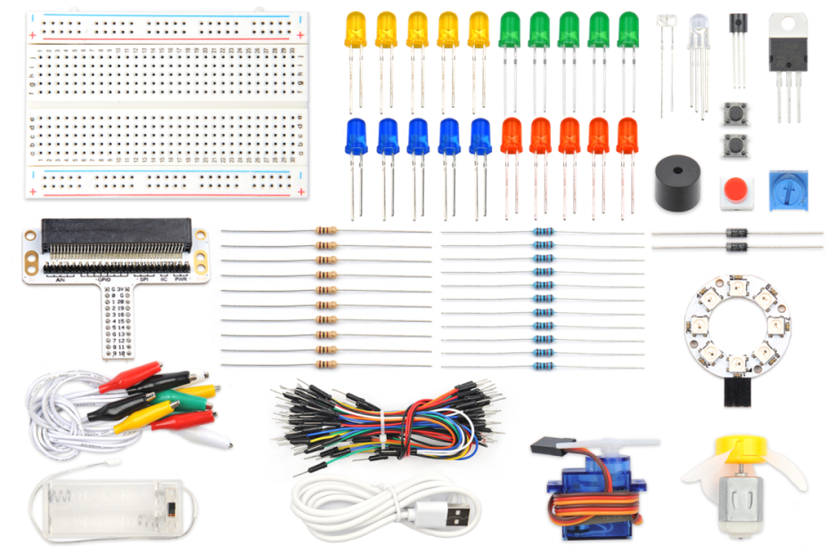

# 温度传感器


## 简介
温度传感器是指能感受温度并转换成可用输出信号的传感器。温度传感器是温度测量仪表的核心部分，品种繁多。在这节课程中，我们将学习模拟温度传感器 TMP36，并将它的数值读出显示在 Pico:ed 的 LED 屏幕上。

## 元件清单

### 硬件：
1 × Pico:ed
1 × USB线
1 × 面包板扩展板
1 × 面包板83×55mm
1 × TMP36温度传感器
若干杜邦线




## 主要元件介绍

### TMP36
TMP36是一种模拟温度传感器，它的输出电压与温度成线性关系，温度越高，输出电压越大。


**注意：**当我们正视TMP36芯片有文字的一面时，芯片最左边的引脚为 VCC，中间引脚为 Vout，最右边的引脚为GND。千万不要把芯片接反了，否则也能引起器件损坏。


TMP36输出电压随温度变化的曲线是这样的：


由上图可知温度的计算公式为：温度（℃）=（输出电压(mV) - 500 ) / 10

## 实验步骤

### 硬件连接
根据下面的图片将你的元件连接起来：

1. 温度传感器与扩展板P0口连接


## 程序编程
编程环境准备请参考：[编程环境介绍](https://www.yuque.com/elecfreaks-learn/picoed/er7nuh)

### 代码示例
```python
# 导入程序所需要的模块
import board
import digitalio
import analogio
import picoed

# 设置Pico:ed的温度传感器的引脚
temperature = analogio.AnalogIn(board.P0_A0)

# 显示温度传感器检测到的温度数值
while True:
   # 将模拟值(0-65535)转换为电压(0-3.3v)
   voltage = temperature.value * (3.3 / 65535)
   temperature_value = (voltage - 500) / 10
   picoed.display.scroll(temperature_value)
```

### 代码详解

1. 导入程序所需要的支持模块。`board`模块是引脚名称的通用容器，可以通过`board`模块指定要使用的引脚，`digitalio`模块包含提供对基本数字IO的访问的类。`picoed`模块可以设置Pico:ed的LED灯的效果， `analogio` 模块包含提供对模拟 IO 的访问的类。
```python
import board
import digitalio
import analogio
import picoed
```

2. 设置 Pico:ed 温度传感器的引脚。
```python
temperature = analogio.AnalogIn(board.P0_A0)
```
如果你所使用的引脚不是 P0_A0，那么可以在 Thonny 编辑器下方的 shell 窗口中输入以下代码并回车查看其他引脚的编号。
```python
>>> import board
>>> help(board)
object <module 'board'> is of type module
  __name__ -- board
  board_id -- elecfreaks_picoed
  BUZZER_GP0 -- board.BUZZER_GP0
  I2C0_SDA -- board.BUZZER_GP0
  I2C0_SCL -- board.I2C0_SCL
  BUZZER -- board.BUZZER
  BUZZER_GP3 -- board.BUZZER
  P4 -- board.P4
  P5 -- board.P5
  ...
```

3. 使用无限循环将温度传感器检测到的数值显示到 Pico:ed 的 LED 屏幕上。
```python
while True:
   voltage = temperature.value * (3300 / 65535)
   temperature_value = (voltage - 500) / 10
   picoed.display.scroll(temperature_value)
```

## 实验结果
Pico:ed 屏幕上显示当前温度值。


## 思考

## 常见问题
如果我们想将华氏度温度显示在 Pico:ed 屏幕上，该如何编程呢？

## 更多信息，欢迎访问：
[恩孚科技官方文档](https://www.elecfreaks.com/learn-en/)
