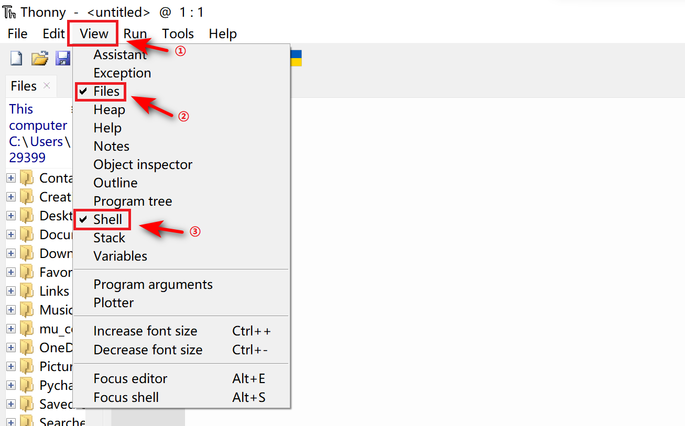

当你开始写 Pico:ed 的程序代码时，我们推荐使用集成开发环境 [Thonny](https://thonny.org),根据你的电脑系统选择合适的版本进行安装即可。

安装完成后打开 [Thonny](https://github.com/thonny/thonny/releases/download/v3.3.13/thonny-3.3.13.exe)，选择菜单栏中的 Tools，选择 Options。

在弹出窗口的菜单栏选择 Interpreter，点击下拉箭头，选择 CircuitPython，点击 OK。

添加成功后即可开始编程，建议点击 View，勾选打开 shell 和 Files 视图。

