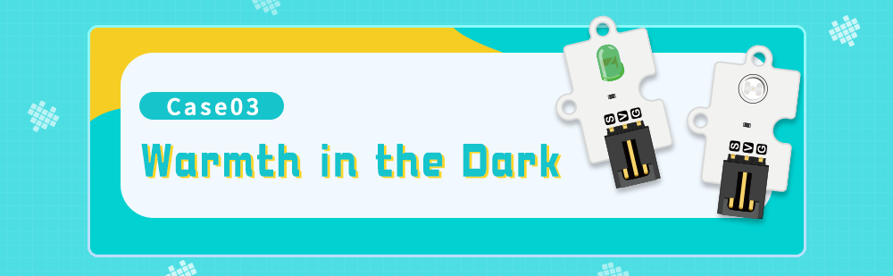

# 案例03 黑夜下的温暖



## 简介

如果单独在一个漆黑的房间中，不仅会感到害怕，而且还给人无助的感觉，如果这个时候能有一盏点亮的灯，可以带来温暖的感觉。如果这盏灯更加智能一些，比如天空慢慢变黑，这盏灯慢慢变亮不是更美好吗？接下来我们使用光线传感器与绿色 LED 灯完成这个项目。

## 组件清单

1 × Raspberry Pi Pico

1 × Wukong2040 扩展板

1 × USB 数据线

1 × 绿色 LED 灯

1 × 光线传感器

2 × 3P带扣杜邦线

## 主要组件介绍

### 光线传感器


光线传感器是利用光敏元件将光信号转换为电信号的传感器，它的敏感波长在可见光波长附近，包括红外线波长和紫外线波长。光传感器不只局限于对光的探测，它还可以作为探测元件组成其他传感器，对许多非电量进行检测，只要将这些非电量转换为光信号的变化即可。

光线传感器是用 CdS 或 CdSe 等半导体材料制成的特殊电阻器，其工作原理是基于内光电效应。光照愈强，阻值就愈低，随着光照强度的升高，电阻值迅速降低，亮电阻值可小至1KΩ以下。光敏传感器对光线十分敏感，其在无光照时，呈高阻状态，暗电阻一般可达1.5MΩ。

光敏传感器主要应用于太阳能草坪灯、光控小夜灯、照相机、监控器、光控玩具、声光控开关、摄像头、防盗钱包、光控音乐盒、生日音乐蜡烛、音乐杯、人体感应灯、人体感应开关等电子产品光自动控制领域。

### 硬件连接

按照下面连接示意图，将您的元器件连接起来：


### MicroBlocks 图形化编程


### CircuitPython 代码编程

```python
from Light import *  # 导入光线传感器库
from LED import *  # 导入LED灯库
import time  # 导入时间库

light = Light(board.GP26)  # 创建光线传感器对象并传入引脚号
led = LED(board.GP0)  # 创建LED灯对象并传入引脚号

while True:
    lightness = int(light.get_lightlevel() / 655.35)  # 获取光线传感器返回值并做映射到（0~100），返回值范围（0~65535）
    led.set_led_bright(100 - lightness)  # 设置LED灯的亮度，范围（0~100）
    time.sleep(0.5)  # 设置程序运行暂停时间
```

### 案例演示


### 思考

请问您能否将效果改为当黎明到来时，LED 灯就熄灭？这样可以节约电力。

### 常见问题


### 更多信息，欢迎访问：

[micro:bit Accessories Store | ELECFREAKS](https://www.elecfreaks.com/)
