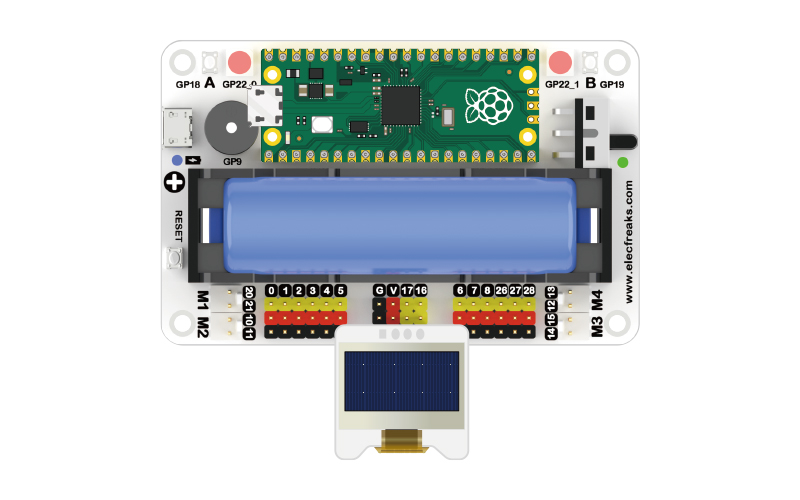

# 案例05 简易动画


## 简介

我们小时候非常喜欢动画片，在看动画片的时候会不由自主的将自己代入到那个世界观中，好像那里是真实存在的。现在我们知道动画片是由一帧一帧的图片在极短的时间内闪过而形成的动态效果。本案例，我们也来制作一个非常简单的动画效果，那我们开始吧。

## 组件清单

1 × Raspberry Pi Pico

1 × Wukong2040 扩展板

1 × USB 数据线

1 × OLED 显示屏幕

## 相关知识介绍

### 动画的原理


动画的原理是通过快速连续播放一系列静止的图像，来营造出一种运动的错觉。这种错觉是因为人眼的视觉暂留效应所造成的，也就是说，当一个图像从视野中消失后，人眼仍然会保持该图像的影像一段时间，直到下一个图像出现。通过快速地播放一系列静止的图像，每个图像之间都略微不同，人眼就会将这些图像合成为连续的运动。

动画的实现可以采用传统的手绘动画、数字动画或者混合动画等技术。传统的手绘动画是将每一帧画面手工绘制在透明的塑料纸上，然后逐帧拍摄，再将这些帧放在胶片上制成电影。数字动画则是通过计算机绘制和处理图像来制作动画，具有制作成本低、制作效率高等优势。混合动画则是将传统和数字动画技术结合起来，通过手工绘制的图像，再用计算机进行后期制作，达到更高的画面质量和效果。

## 硬件连接

按照下面连接示意图，将您的元器件连接起来：



## MicroBlocks 图形化编程


## CircuitPython 代码编程

```python
# 导入OLED库和时间库
from OLED import *
import time

# 创建OLED对象并传入SDA\SCL引脚号
oled = OLED(board.GP17, board.GP16)

while True:
    # 从左到右显示竖线
    for i in range(0, 128, 5):
        oled.draw_line(i, 0, i, 64)
        time.sleep(0.01)
        oled.set_clear()
    # 从上到下显示横线
    for j in range(0, 64, 3):
        oled.draw_line(0, j, 128, j)
        time.sleep(0.01)
        oled.set_clear()
```

## 案例演示


## 思考

请问您能否制作每隔一段时间显示一张照片，并使用电位传感器控制间隔时间的作品吗？


## 常见问题


## 更多信息，欢迎访问：

[micro:bit Accessories Store | ELECFREAKS](https://www.elecfreaks.com/)
