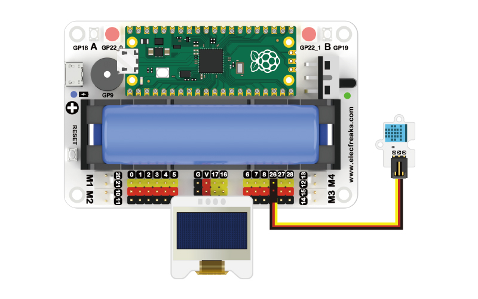

# 案例06 显示温湿度


## 简介

我们都希望生活在温度、湿度适宜的环境中，我们从天气预报中得到的数据与周围环境的温湿度总有些差别，如果我们能实时知道周围环境的温湿度数据，这样我们也可以安排接下来的活动。我们使用温湿度传感器与OLED显示屏来制作这个监视器。

## 组件清单

1 × Raspberry Pi Pico

1 × Wukong2040 扩展板

1 × USB 数据线

1 × 温湿度传感器

1 × OLED 显示屏幕

1 × 3P带扣杜邦线

## 主要组件介绍

### 温湿度传感器


温湿度传感器是一种装有湿敏和热敏元件，能够用来测量温度和湿度的传感器装置，有的带有现场显示，有的不带有现场显示。温湿度传感器由于体积小，性能稳定等特点，被广泛应用在生产生活的各个领域。


## 硬件连接

按照下面连接示意图，将您的元器件连接起来：



## MicroBlocks 图形化编程


## CircuitPython 代码编程

```python
# 导入相应的库
from OLED import *
from DHT11 import *
import time

# 创建使用对象
oled = OLED(board.GP17, board.GP16)
dht = DHT11(board.GP26)

while True:
    # 显示温度数据
    oled.set_show(0, 0, "Temperature:")
    oled.set_show(75, 0, dht.get_temperature())

    # 显示湿度数据
    oled.set_show(0, 15, "Humidity:")
    oled.set_show(55, 15, dht.get_humidity())
    time.sleep(5)

    # 清除显示
    oled.set_clear()
```

## 案例演示


## 思考

请问您能否设置温湿度的临界值，当达到这个值时蜂鸣器发出警报？


## 常见问题


## 更多信息，欢迎访问：

[micro:bit Accessories Store | ELECFREAKS](https://www.elecfreaks.com/)
