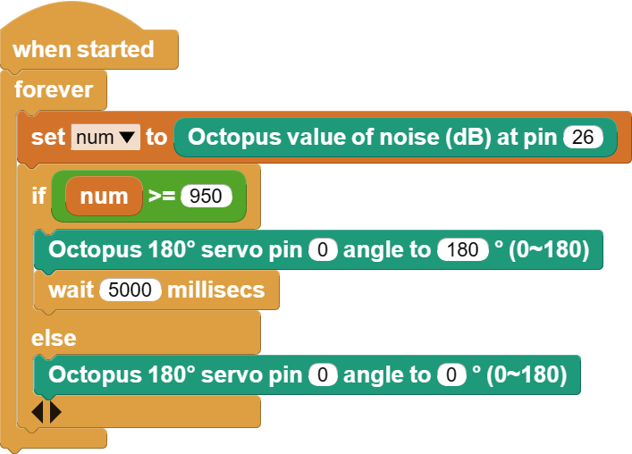

# 案例08 芝麻开门


## 简介

“芝麻开门”这个典故应该是家喻户晓了，通过这个咒语可以打开四十大盗的藏宝山洞门，虽然这只是一个故事，但是我们可以使用噪音传感器以及舵机实现这样的效果。

## 组件清单

1 × Raspberry Pi Pico

1 × Wukong2040 扩展板

1 × USB 数据线

1 × 噪音传感器

1 × 180°舵机

1 × 3P带扣杜邦线

## 主要组件介绍

### 噪音传感器


噪声传感器正是由于传感器内置一个对声音敏感的电容式驻极体话筒,驻极体面与背电极相对，中间有一个极小的空气隙，形成一个以空气隙和驻极体作绝缘介质，以背电极和驻极体上的金属层作为两个电极构成一个平板电容器。电容的两极之间有输出电极。由于驻极体薄膜上分布有自由电荷。当声波引起驻极体薄膜振动而产生位移时；改变了电容两极版之间的距离，从而引起电容的容量发生变化，由于驻极体上的电荷数始终保持恒定，根据公式：Q =CU 所以当 C 变化时必然引起电容器两端电压 U 的变化，从而输出电信号，实现声音信号到电信号的变换。

### 舵机

伺服电机通常被称为舵机，它是一种带有输出轴的小装置。当我们向伺服器发送一个控制信号时，输出轴就可以转到特定的位置。只要控制信号持续不变，伺服机构就会保持轴的角度位置不改变。如果控制信号发生变化，输出轴的位置也会相应发生变化。日常生活中，舵机常被用于遥控飞机、遥控汽车、机器人等领域。

控制线用于传输角度控制信号。这个角度是由控制信号脉冲的持续时间决定的，这叫做脉冲编码调制（PCM）。舵机的控制一般需要一个20ms左右的时基脉冲，该脉冲的高电平部分一般为0.5ms-2.5ms范围，总间隔为2ms。脉冲的宽度将决定马达转动的距离。例如：1.5毫秒的脉冲，电机将转向90度的位置（通常称为中立位置，对于180°舵机来说，就是90°位置）。如果脉冲宽度小于1.5毫秒，那么电机轴向朝向0度方向。如果脉冲宽度大于1.5毫秒，轴向就朝向180度方向。以180度舵机为例，对应的控制关系是这样的：

> 0.5ms————-0度；
>
> 1.0ms————45度；
>
> 1.5ms————90度；
>
> 2.0ms———–135度；
>
> 2.5ms———–180度；


## 硬件连接

按照下面连接示意图，将您的元器件连接起来：


## MicroBlocks 图形化编程



## CircuitPython 代码编程

```python
from Noise import *  # 导入噪音传感器库
from Servo import *  # 导入180°舵机库
import time  # 导入时间库

noise = Noise(board.GP26)  # 创建噪音传感器对象并传入引脚号
servo = Servo(board.GP0)  # 创建舵机对象并传入引脚号

while True:
    num = noise.get_noise()  # 将噪音传感器获取到的值赋值给变量num
    if num > 60000:
        servo.set_servo(180)  # 设置舵机的角度为180°
        time.sleep(5)
    else:
        servo.set_servo(0)
```

## 案例演示


## 思考

我们发现无论是谁都可以通过大声说话让舵机旋转，请问您能否再加入其他验证程序，只有你知道如何让舵机旋转？


## 常见问题


## 更多信息，欢迎访问：

[micro:bit Accessories Store | ELECFREAKS](https://www.elecfreaks.com/)
