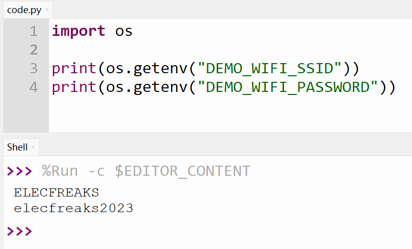
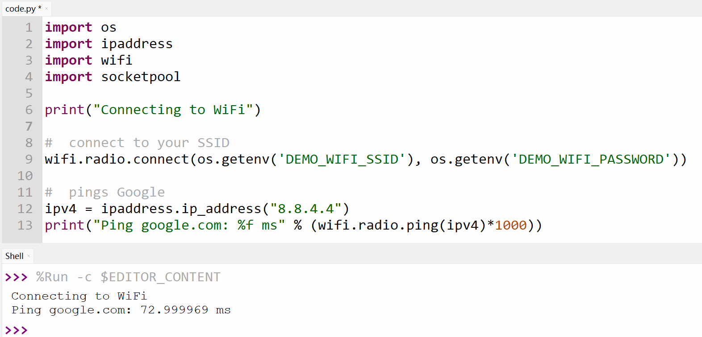

# 案例10 Pico W 连接互联网


## 简介

Raspberry Pi Pico W 是一款非常适合初学者和专业开发者的开发板，适用于各种物联网和嵌入式应用，包括智能家居、传感器网络、机器人和自动化控制等。

Raspberry Pi Pico W 是一款基于 Raspberry Pi Pico 的微控制器板，它集成了无线连接功能，包括 WiFi 和蓝牙。它采用了双核 ARM Cortex-M0+ 处理器，时钟频率高达133MHz，内置264KB RAM和2MB闪存，支持各种接口，如 SPI、I2C、UART 和 PWM 等。此外，它还支持 CircuitPython 和 MicroBlocks 编程，使得开发者可以轻松地进行开发和编程。

## 组件清单

1 × Raspberry Pi Pico W

1 × Wukong2040 扩展板

1 × USB 数据线

1 × OLED 显示屏幕

## 相关知识介绍

### Pico W 产品特性

- 采用了 Raspberry Pi 官方自主设计的 RP2040 微控制器芯片
- 搭载了双核 ARM Cortex M0 + 处理器，运行频率高达 133MHz 灵活时钟
- 内置了 264KB 的 SRAM 和 2MB 的片上 Flash
- 板载2.4GHz无线接口芯片(802.11n或Wifi4)。
- 邮票孔设计，可直接焊接集成到用户自主设计的底板上
- USB1.1 主机和设备支持
- 支持低功耗睡眠和休眠模式
- 可通过 USB 识别为大容量存储器进行拖放式下载程序
- 多达 26 个多功能的 GPIO 引脚
- 2 个 SPI，2 个 I2C，2 个 UART，3 个 12 位 ADC，16 个可控 PWM 通道
- 精确的片上时钟和定时器
- 温度传感器
- 片上加速浮点库
- 8 个可编程 I/O (PIO) 状态机，用于自定义外设支持

## 编程准备

### Pico W 固件烧录

首先需要了解的是 Raspberry Pi Pico W 与 Raspberry Pi Pico 的 CircuitPython UF2 文件是不同的。您需要在CircuitPython 官网下载最新的 Pico W UF2 文件，如下图所示：


按住 Rasberry Pi Pico W 的 BOOTSEL 按钮不松开，并使用 USB 数据线连接到电脑。电脑文件资源管理器中会出现 RPI-RP2 磁盘，将您下载的 UF2 文件拖入到该磁盘即可，该磁盘会变成名为 CIRCUITPY 磁盘。


### settings.toml 文件设置

接下来的案例中将使用 Pico  W 的 WiFi 的功能，所以，您需要根据您使用的 WiFi 名称和密码保存到 settings.toml 中，并将该文件保存到 CIRCUITPY 磁盘中。

settings.toml 文件示例：

```python
DEMO_WIFI_SSID = "ELECFREAKS"  # WIFI 名称
DEMO_WIFI_PASSWORD = "elecfreaks2023"  # WiFi 密码
```

CIRCUITPY 磁盘：


### 在 code.py 中访问 settings.toml 信息

在 **code.py** 文件中，您需要访问库才能访问 **settings.toml** 文件。您的设置可通过该功能访问。您需要将设置条目传递给函数以将其导入 **code.py** 文件。

```
import os

print(os.getenv("DEMO_WIFI_SSID"))
print(os.getenv("DEMO_WIFI_PASSWORD"))
```



### 基本 WiFi 测试验证

您可以复制下方代码到 code.py 中，验证网络是否畅通：

```python
import os
import ipaddress
import wifi
import socketpool

print("Connecting to WiFi")

#  connect to your SSID
wifi.radio.connect(os.getenv('DEMO_WIFI_SSID'), os.getenv('DEMO_WIFI_PASSWORD'))

#  pings Google
ipv4 = ipaddress.ip_address("8.8.4.4")
print("Ping google.com: %f ms" % (wifi.radio.ping(ipv4) * 1000))
```



## 思考


## 常见问题


## 更多信息，欢迎访问：

[micro:bit Accessories Store | ELECFREAKS](https://www.elecfreaks.com/)
