# 编程环境准备

Wukong2040发明家套装可以采用 **MicroBlocks 图形化编程**或者 **CircuitPython 代码编程**，您可以任选一种编程方式并完成编程环境准备。

## 编程方式一：MicroBlocks 平台编程准备

### MicroBlocks 介绍

MicroBlocks 是一种开放的图形化编程平台，可以通过与微控制器进行交互的同时学习编程知识。虽然 MicroBlocks 只是众多图形化编程平台中的一种，但真正让 MicroBlocks 脱颖而出的是它结合了实时编译和自主操作。

它的优秀特性主要有：

* MicroBlocks是一个实时编程环境，无需等待程序编译和下载，单击代码块，即刻看到运行结果。
* MicroBlocks可以为每个元器件编写单独脚本并同时运行。
* MicroBlocks可以在众多微控制器主板上运行，并且它将不同机器上面相同功能的元器件进行归类并用相同的编程方式控制，您编写的代码具有很强的可移植性。
* MicroBlocks 可以读取微控制器主板中的程序，方便您查阅和分享。

更多关于 MicroBlocks编程平台的信息，您可以在其官网进行浏览：[MicroBlocks](http://microblocks.fun/) 官网。

### MicroBlocks 平台编程准备步骤

1、打开 [MicroBlocks](http://microblocks.fun/) 官方网站:https://microblocks.fun/，点击 “**Run**”.(建议使用Google Chrome和 Edge 浏览器)

2、在菜单栏中点击“**齿轮**”图标后，选择 “**update firmware on board**”。

3、在出现的固件选择窗口中，选择 “**ELECFREAKS Wukong2040**”,在出现的窗口中，提示我们如下操作：

电脑连接 USB 数据线，按住 Raspberry pi pico 的 **BOOTSEL** 按钮**不放开**，并使用USB数据线的USB接口插入Raspberry pi pico 的 USB 接口后会出现 “RPI-RP2” 磁盘的提示，这时可以放开 Raspberry pi pico 的 **BOOTSEL** 按钮。返回 MicroBlocks 平台，点击 microblocks 平台 “OK”，将文件保存到 RPI-RP2 磁盘中。

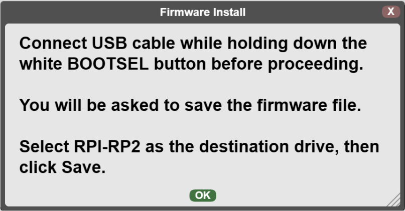

4、在 microblocks 平台的菜单栏，点击“**Connect**”（USB 图标），选择端口并连接，等待连接完成后会出现如下图标代表连接成功。

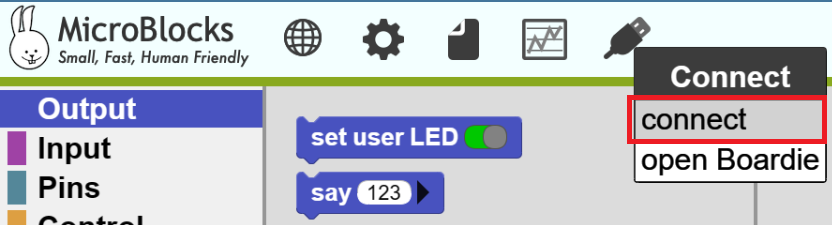

5、点击 microblocks 平台左侧的 “Libraries” 右边的“+”添加库按钮，在 “ELECFREAKS” 目录下，添加 "Octopus" 库文件，至此，在 microblocks 平台的编程环境准备完成。

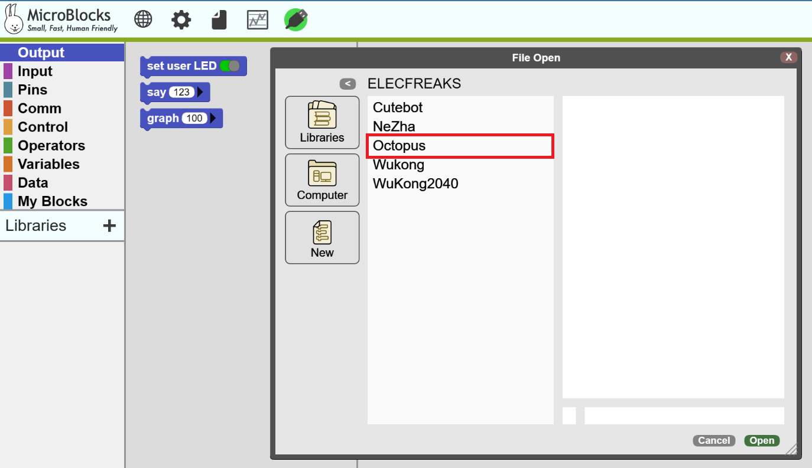

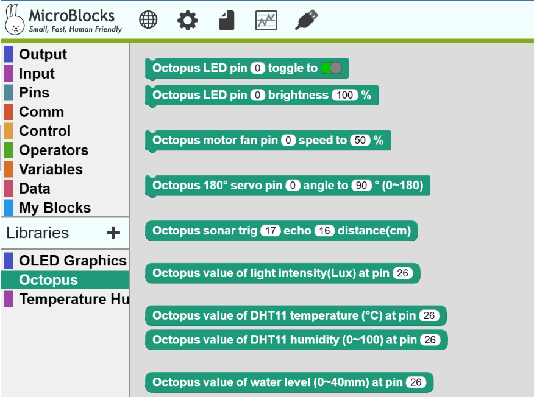

6、当您开始使用编程并验证项目时，打开wukong2040扩展板的电源开关按钮（在不使用时，请关闭电源，节约用电）：

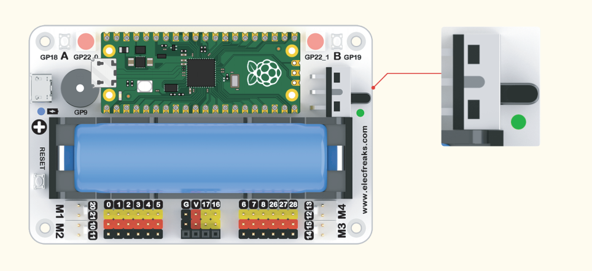

### 编程方式二：Thonny平台编程环境准备

1、打开 Thonny 官网:https://thonny.org 并根据您电脑系统下载相匹配的软件版本并下载完成后安装该软件：

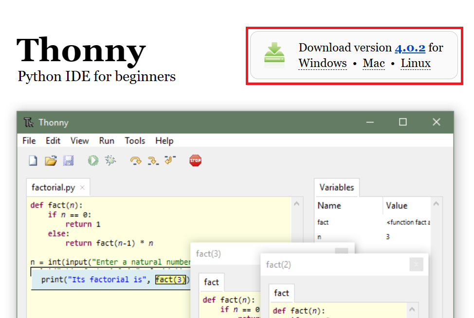

2、打开 Thonny，在菜单栏选择 “Tool”,在选项中选择 “Options”，在出现的页面中，在 "Interpreter" 选项下,解释器选择 “CircuitPython(generic)”，端口选择“ < Try to detect port automatically > ”最后点击 “OK”。

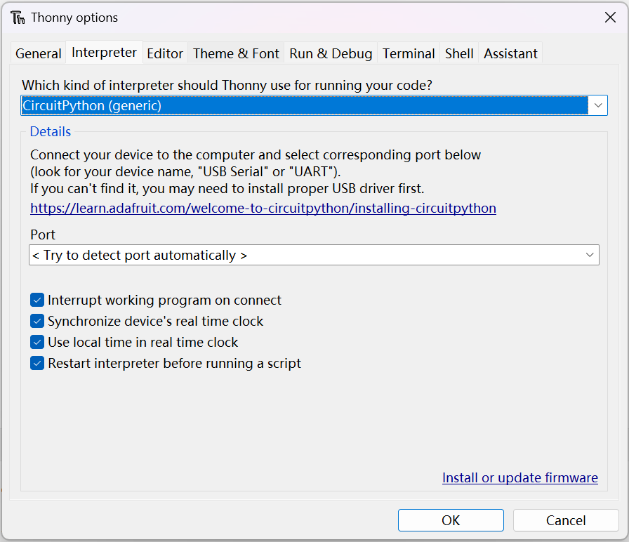

3、在 CircuitPython 官网下载 Raspberry pi pico 的固件:https://circuitpython.org/board/raspberry_pi_pico/。

4、电脑连接USB数据线，按住 Raspberry pi pico 的 **BOOTSEL** 按钮**不放开**，并将 USB 数据线的 USB 接口插入 Raspberry pi pico 的 USB 接口后会出现 “RPI-RP2” 磁盘的提示，这时可以放开 Raspberry pi pico 的 **BOOTSEL** 按钮。将下载好的 Raspberry pi pico 固件复制到 “RPI-RP2” 磁盘中，会出现 “CIRCUITPY”，在该磁盘下会看到如下文件：

5、在 Github:中下载:
Wukong2040库文件：https://github.com/elecfreaks/EF_Product_CircuitPython

Octopus_CircuitPython库文件：https://github.com/elecfreaks/Octopus_CircuitPython

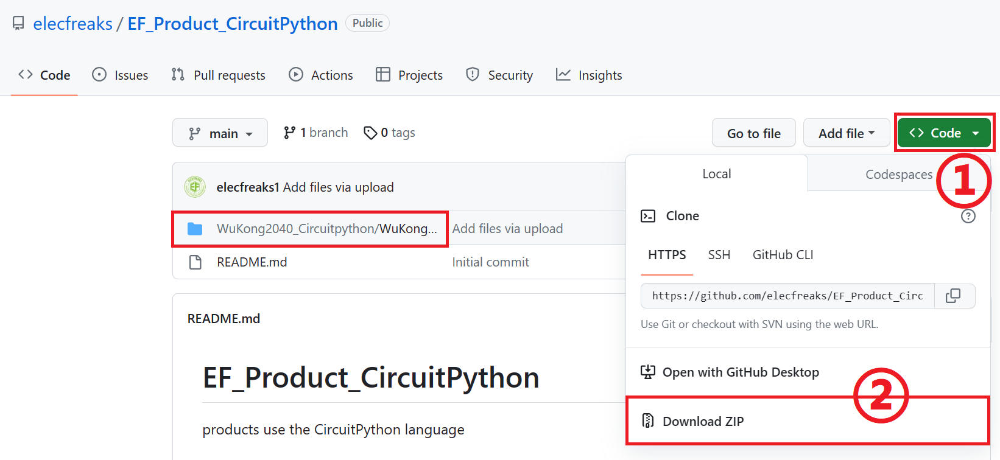

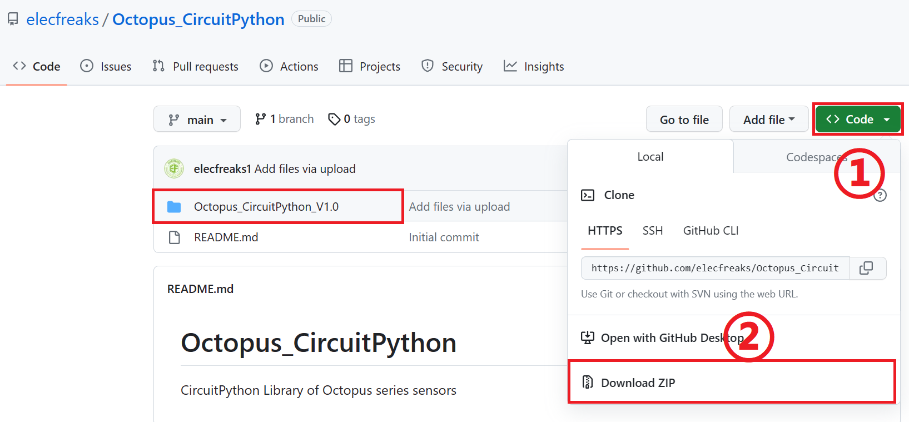

6、将下载好的文件解压，打开解压好的文件，将在 Fan 文件夹中的 lib 目录中的文件（所有）复制到 "CIRCUITPY(F:)" 下的 **lib** 目录中。

7、同样的，在解压完成的文件夹中找到下图所示的文件并放入到"CIRCUITPY(F:)"下的 **lib** 目录下。并且将OLED库目录下的font5x8.bin文件放置在主目录下，如下图所示：
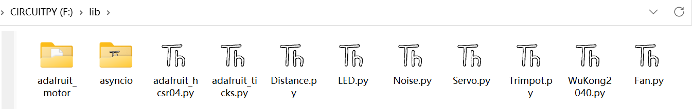

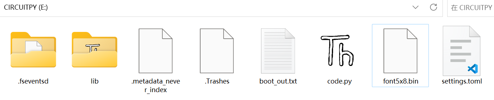

8、CircuitPython 解释器默认加载 code.py 文件并运行，所以，我们需要使用 Thonny 打开"CIRCUITPY(F:)"中的code.py 文件并将您要编写的项目代码放入这个文件中运行。

9、当您开始使用编程并验证项目时，打开wukong2040扩展板的电源开关按钮（在不使用时，请关闭电源，节约用电）：

