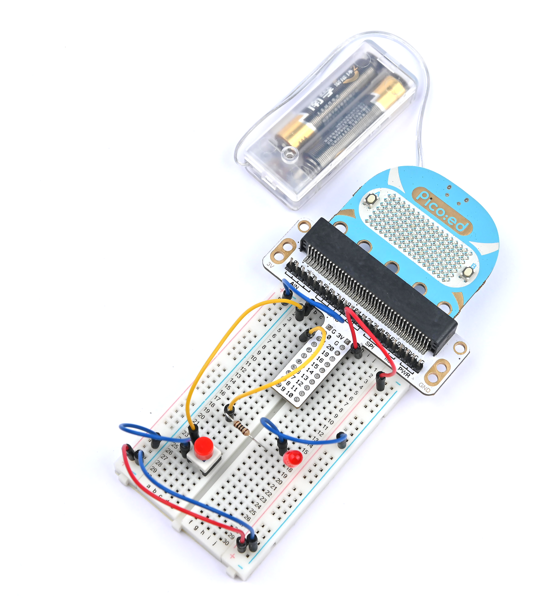

# 自锁开关


## 简介清单
自锁开关，是一种常见的按钮开关。当我们初次按下开关按钮时，开关电路连接并保持这种状态，即自锁。再次按下开关按钮时，开关断开，同时开关按钮弹出来。在这节课程中，我们将使用自锁开关来控制 LED 的点亮与熄灭。

## 元件清单

### 硬件：
1 × Pico:ed
1 × USB线
1 × 面包板扩展板
1 × 面包板83 × 55mm
1 × 自锁开关
1 × LED
1 × 100欧姆电阻
若干杜邦线


## 主要元件介绍

### 自锁开关
自锁开关一般是指开关自带机械锁定功能，按下去，松手后按钮是不会完全跳起来的，处于锁定状态，需要再按一次，才解锁完全跳起来。它就叫自锁开关。早期的直接完全断电的电视机、显示器就是使用的这种类型的开关。


**注意：**这种自锁开关包含两组刀双掷开关，本次试验只用到了其中一组，故剪去了其中一组的公共引脚。

## 实验步骤

### 硬件连接
根据下面的图片将你的元件连接起来：

1.将自锁开关连接到扩展板的P0口

2.将led灯通过100Ω电阻连接扩展板的P2口


连接完成如图：




## 程序编程
编程环境准备请参考：[编程环境介绍](https://www.yuque.com/elecfreaks-learn/picoed/er7nuh)

### 代码示例：
```python
# 导入程序所需要的模块
import board
from digitalio import *

# 设置LED灯的引脚和引脚方向
led = DigitalInOut(board.P2_A2)
led.direction = Direction.OUTPUT

# 设置自锁开关的引脚和引脚方向
locking = DigitalInOut(board.P0_A0)
locking.direction = Direction.INPUT
locking.switch_to_input(pull=Pull.UP)

# 判断自锁开关的状态改变LED灯的状态
while True:
    led.value = locking.value
```

### 代码详解

1. 导入程序所需要的支持模块。`board`模块是引脚名称的通用容器，可以通过`board`库指定要使用的引脚，`digitalio`模块包含提供对基本数字 IO 的访问的类。
```python
import board
from digitalio import *
```

2. 设置面包板扩展板连接 LED 所使用的引脚以及引脚方向。
```python
led = DigitalInOut(board.P2_A2)
led.direction = Direction.OUTPUT
```

3. 设置面包板扩展板连接自锁开关所使用的引脚以及引脚方向。
```python
locking = DigitalInOut(board.P0_A0)
locking.direction = Direction.INPUT
```
如果你所使用的引脚不是 P0_A0 和 P2_A2，那么可以在 Thonny 编辑器下方的 shell 窗口中输入以下代码并回车查看其他引脚的编号。
```python
>>> import board
>>> help(board)
object <module 'board'> is of type module
  __name__ -- board
  board_id -- elecfreaks_picoed
  BUZZER_GP0 -- board.BUZZER_GP0
  I2C0_SDA -- board.BUZZER_GP0
  I2C0_SCL -- board.I2C0_SCL
  BUZZER -- board.BUZZER
  BUZZER_GP3 -- board.BUZZER
  P4 -- board.P4
  P5 -- board.P5
  ...
```

4. 使用无限循环设置 LED 灯的状态为自锁开关的状态。自锁开关按下和再次按下会改变状态，同时 LED 灯的状态也会改变。
```python
while True:
    led.value = locking.value
```

## 实验结果
按下自锁开关，LED 灯点亮；再按一下，LED 熄灭。


## 思考
楼梯灯通常就是用单刀双掷开关来实现的，可以在楼上开灯楼下关灯，也可以在楼下开灯，去楼上关灯，如果我想用两只自锁按钮实现楼梯灯的功能，该如何设计电路与编程？

## 常见问题

## 更多信息，欢迎访问：
[恩孚科技官方文档](https://www.elecfreaks.com/learn-en/)
