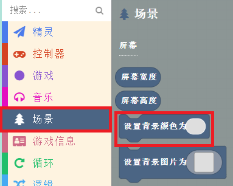
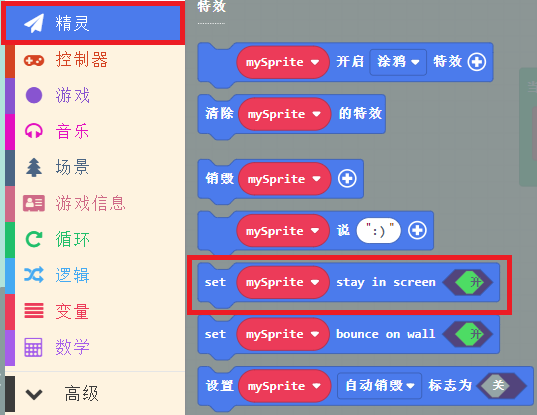

# 精灵制造者

## 目的
新建一个精灵并进行控制精灵在屏幕画面中移动。

## 使用材料
1 x [饼干游戏编程学习机](https://item.taobao.com/item.htm?spm=a1z10.5-c-s.w4002-18602834185.82.51a95ccfE1IJt1&id=644090757603)

## 软件
[微软makecode](https://arcade.makecode.com/)

## 编程
点击新建项目。

输入项目名称新建项目。

进入编程界面后，可以看到模拟器、模块选择区、积木编程区，在编程过程中，可以使用模拟器查看效果。

`创建精灵`，并点击积木块中的灰色矩形打开图片编辑器。

自定义精灵形象或者从图库中选择预设精灵即可。
通过`使用按键移动精灵`积木块控制精灵移动。

设置画面`背景颜色`。

为了防止精灵移动时走出屏幕画面外，`设置精灵处于屏幕范围内`。

### 程序
请参考程序连接：[https://makecode.com/_aVgfaq603iJd](https://makecode.com/_aVgfaq603iJd)
你也可以通过以下网页直接下载程序。

## 程序下载
请查看程序下载的相关文档：[程序下载方式](https://www.yuque.com/elecfreaks-learn/retro/wxo25w)
## 结论
可以通过按键控制精灵在屏幕画面中移动。
