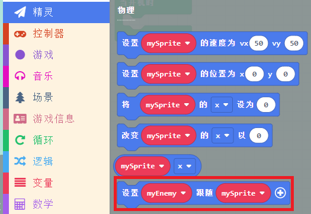
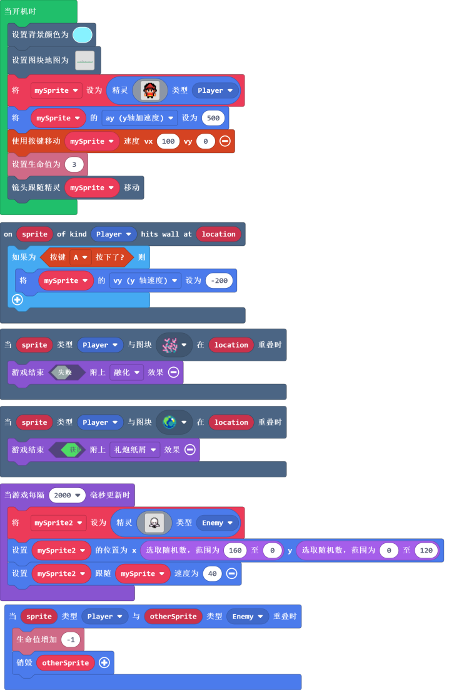

# 小小英雄（躲避怪物）

## 目的
设置以玩家为目标的敌人。

## 使用材料
1 x [饼干游戏编程学习机](https://item.taobao.com/item.htm?spm=a1z10.5-c-s.w4002-18602834185.82.51a95ccfE1IJt1&id=644090757603)

## 软件
[微软makecode](https://arcade.makecode.com/)

## 编程
设置当精灵碰到路途上的植物时则游戏失败，当精灵到达终点宝石处，则游戏胜利，游戏中会每两秒随机刷新一个怪物来攻击小小英雄，初始生命值为3，当被怪物攻击到时生命值-1，当生命值归零时，游戏失败。

### 程序
请参考程序连接：[https://makecode.com/_RbghbYJTtde1](https://makecode.com/_RbghbYJTtde1)
你也可以通过以下网页直接下载程序。

## 程序下载
请查看程序下载的相关文档：[程序下载方式](https://www.yuque.com/elecfreaks-learn/retro/wxo25w)

## 结论
可以通过按键控制精灵在自定义场景中横向移动，并跳跃，当碰到陷阱则游戏结束，当精灵到达终点宝石处，则游戏胜利，游戏中会每两秒随机刷新一个怪物来攻击小小英雄，初始生命值为3，当被怪物攻击到时生命值-1，当生命值归零时，游戏失败。
