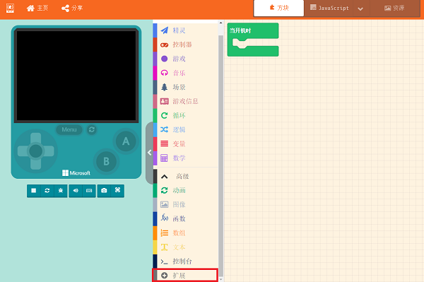
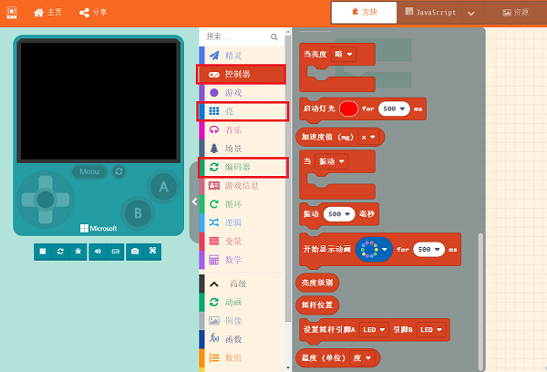
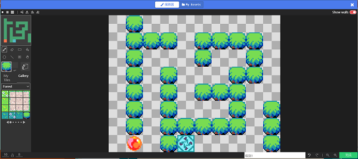
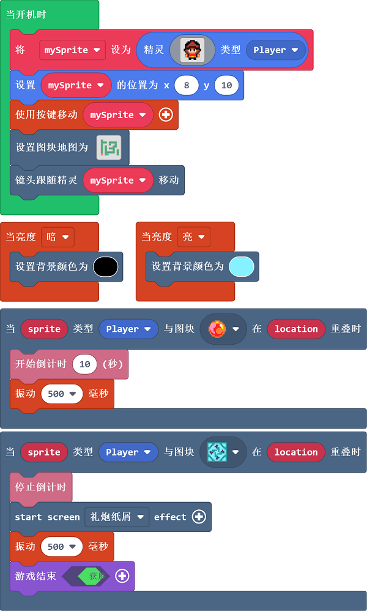

# 走迷宫

## 目的

制作一个背景随着光线变化而变化的迷宫。

## 使用材料

1 x [饼干游戏编程学习机](https://item.taobao.com/item.htm?spm=a1z10.5-c-s.w4002-18602834185.82.51a95ccfE1IJt1&id=644090757603)

## 软件

[微软makecode](https://arcade.makecode.com/)

## 编程

由于在这个案例中使用了光线传感器，所以需要按照以下步骤添加对应扩展库。
打开`高级`，选择`扩展`。

在弹出窗口搜索`controller`，并选择`controller扩展库`。

添加完成后，模块选择区出现三个积木选择模块。

目前硬件上使用光线传感器、加速度计、振动马达的相关积木块，可以在控制器的扩展插件一栏中找到。

`新建精灵`，`设置精灵初始位置`，`通过按键移动精灵`，`设置地图图块`，`设置镜头跟随精灵移动`。

先画出迷宫入口，出口，以及墙体。

再根据墙体设置体积碰撞。

`当亮度较暗时`，`设置背景颜色为黑色`，`当亮度较亮时`，`设置背景颜色为浅蓝色`。

`当精灵碰到入口位置的图块时`，`开始倒计时十秒`，`并振动500m`。

`当精灵碰到终点位置的图块时`，`停止倒计时`，`设置礼炮纸屑特效`，`振动500ms`，`设置游戏结束`。

完整程序：

### 程序

请参考程序连接：[https://makecode.com/_XmF9Vi8VK665](https://makecode.com/_XmF9Vi8VK665)

## 程序下载

请查看程序下载的相关文档：[程序下载方式](https://www.yuque.com/elecfreaks-learn/retro/wxo25w)

## 结论

精灵从入口处进入地图则开始倒计时，当倒计时结束还未到达终点则游戏结束，在倒计时结束前到达终点则游戏胜利，背景颜色会根据环境光线亮度自动变化，当亮度较暗时，背景颜色为黑色，当亮度较亮时，背景颜色为浅蓝色。
