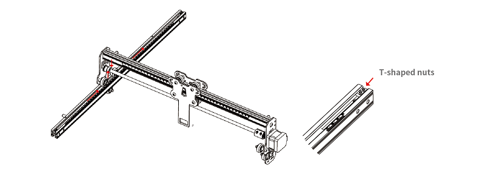
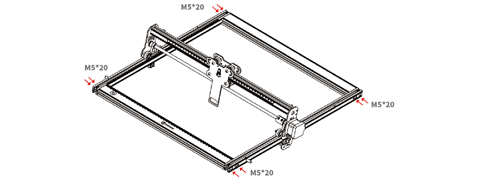

# Assembly Tutorials

1. Install the left Y-axis assembly: Pass the left Y-axis assembly (with the timing belt upward) through the X-axis assembly, and thread the timing belt in the direction shown in the figure.

2. Install the right Y-axis assembly: the same method as above. Tighten the timing belt, and at the same time insert two T-shaped boat nuts into the left Y-axis assembly, and then use the hexagon socket set screw to lock the timing belt. Be careful not to lock it too tightly to prevent the belt from perforating.

3. Install the front X-axis profile and the rear X-axis profile, using a total of 8 M5*20 hexagon socket head pan head screws to fasten them.

4. Install three tripods and control box components: use a total of 8 M5*20 hexagon socket head pan head screws to fasten them.

5. Install the 5W/10W laser module: please install it in the fixing plate, the fixed focus bar should be in contact with the surface of the engraving material when it is naturally vertically downward, and finally use the right hand screw to lock it, and turn it clockwise to move the focus bar until it is attracted by the magnet. Finally plug in the laser module line.

