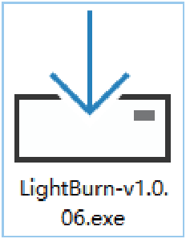

# LightBurn用户使用指南

## 准备工作

雕刻前使用无尘布搭配酒精擦拭激光模组的保护镜片，保证最佳雕刻效果。

在TOOCA L1 Laser Engraver的工作区域放下木板，放下定焦条，拧松激光模组侧面的手拧螺丝，进行调焦。

定焦条自然垂直向下时应与雕刻材料表面互相接触，使用右侧的手拧螺丝将其锁紧 , 并顺时针拨动定焦条直至被磁铁吸住。最后插上激光模组线。

**注意:为了保护桌子或者地板不被烧坏或烟熏，对工作台做好防护（如垫上钢板等激光不易穿透的材料），进行激光切割时，切割处的底面应悬空，以保证切割效果。
**

## LightBurn软件使用教程

双击.exe文件安装LightBurn软件（TF卡内的安装程序仅兼容Windows 64位系统，其它版本请访问官网[https://lightburnsoftware.com/](https://lightburnsoftware.com/)下载。
备注：该软件免费试用期为1个月，购买序列号详情请访问[https://lightburnsoft-ware.com/collections/frontpage/products/lightburn-gcode](https://lightburnsoft-ware.com/collections/frontpage/products/lightburn-gcode)

安装成功后，双击打开LightBurn软件，点击“设备”。

点击“导入”导入TF卡中的.lbdev配置文件，导入后在设备列表中既有对应机器，选中机器，点击OK即配置成功。

配置文件:[TOOCA-Laser-1.7z](https://github.com/elecfreaks/learn-en/raw/master/tooca-laser-1/file/TOOCA%20Laser%201.7z)

点击“编辑-设置”。

选择“毫米/分钟”，点击OK。

点击“文件-导入”导入图片。

设置图片的位置、尺寸以及旋转角度。

右键单击图像，选择Adjust Image。

设置图像效果，然后点击OK.

参考[Recommended parameters](http://www.elecfreaks.com/learn-en/tooca-laser-1/recommended-parameters.html)设置功率、速度以及次数。

备注：功率越大，或速度越慢，雕刻效果越深；功率越小，或速度越快，雕刻效果越浅。功率一般调节Power Max即可。配套的椴木板雕刻推荐参数：最小功率-5.00 最大功率-70.00 速度（mm/m）-6000.

点击保存GCode将雕刻文件保存至TF卡的根目录。

备注：请确保导出来的文件格式为.gcode，其它格式例如.gc/.nc将不能被雕刻机识别。

将TF卡放入TOOCA L1 Laser Engraver的卡槽中。

接通电源并打开开关，等待机器初始化完成，按下微动开关进入预览模式。

再次按下微动开关开始雕刻。

此外，您也可以通过Type-C连接雕刻机，实时雕刻。更多详细的软件使用教程请参考
https://lightburnsoftware.github.io/NewDocs/
