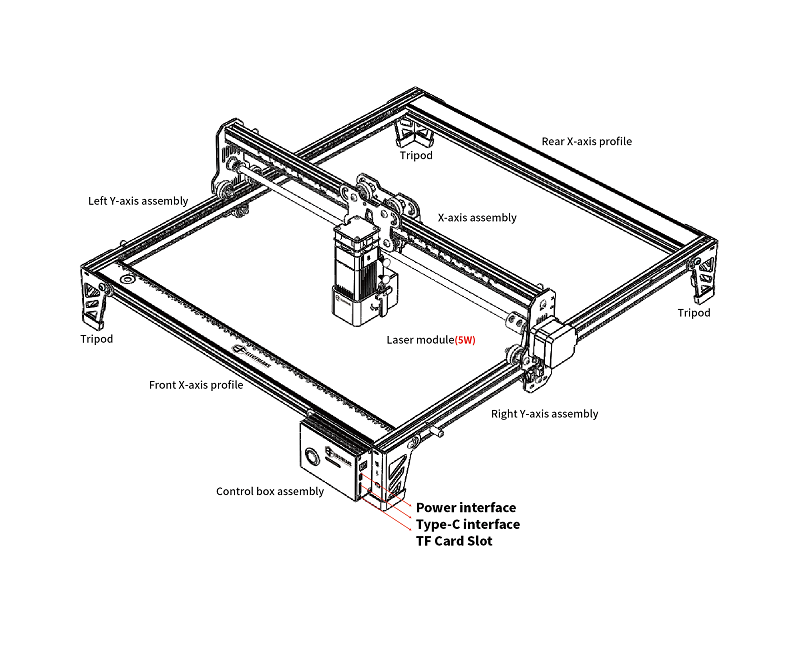

# 认识 TOOCA L1

##  各部件说明

### TOOCA L1 Laser Engraver (5W)

### TOOCA L1 Laser Engraver (10W)

### 激光模组

### 控制盒

## 指示灯状态说明

1. 指示灯灭：机器处于断电状态，或上电异常。
2. 呼吸灯效果：机器处于待机模式，可按下微动开关进入预览模式或雕刻模式。
3. 指示灯闪烁：机器处于升级模式或异常模式，同时蜂鸣器发出急促的响声，等待升级完成或清除异常后自动进入待机模式。
4. 指示灯常亮：机器处于预览模式或雕刻模式，此时激光头处于出光状态，需格外注意安全。
