# Case 17 The Egg Beater

## Introduction

Make an egg-beater.

## Purchase Link

## Quick Start

### Build Steps

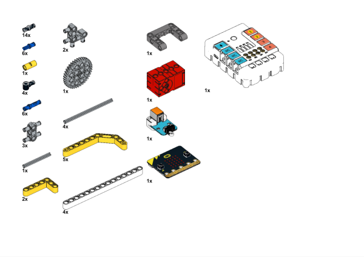

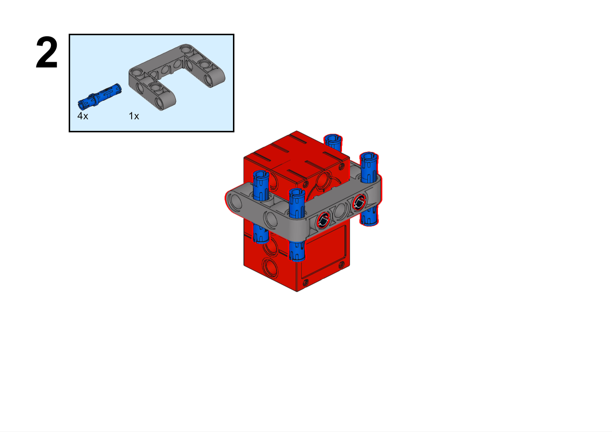

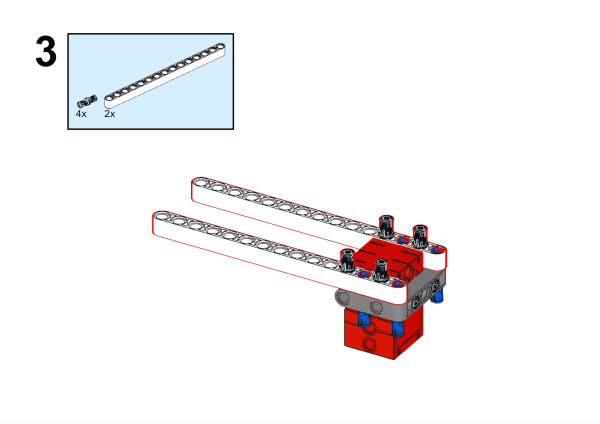

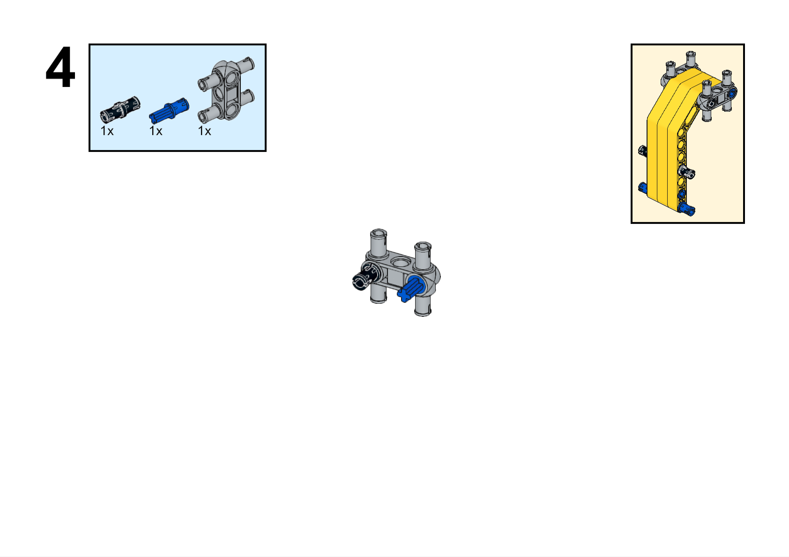

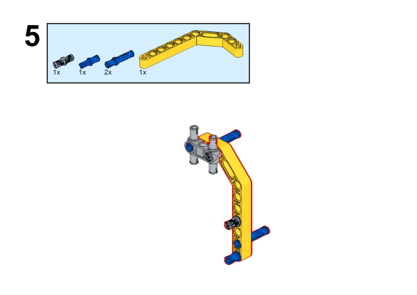

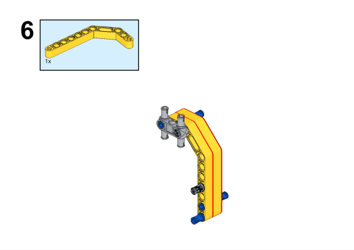

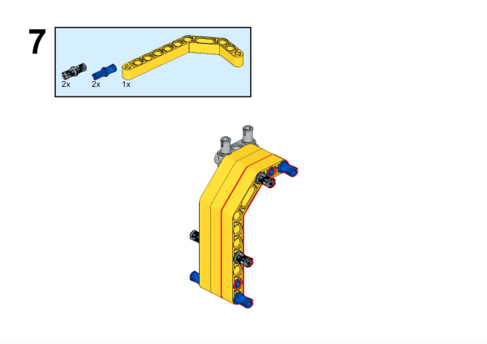

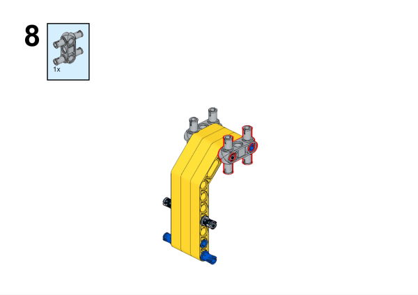

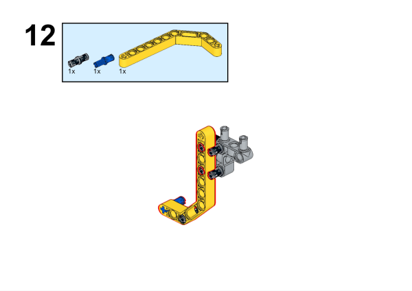

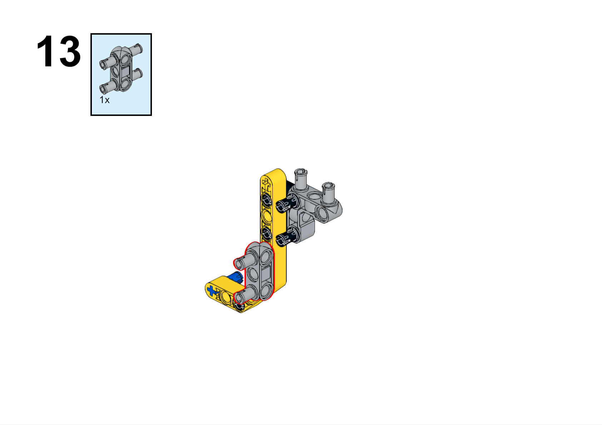

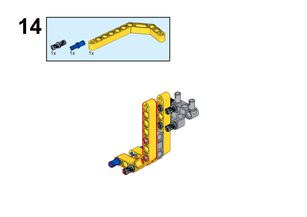

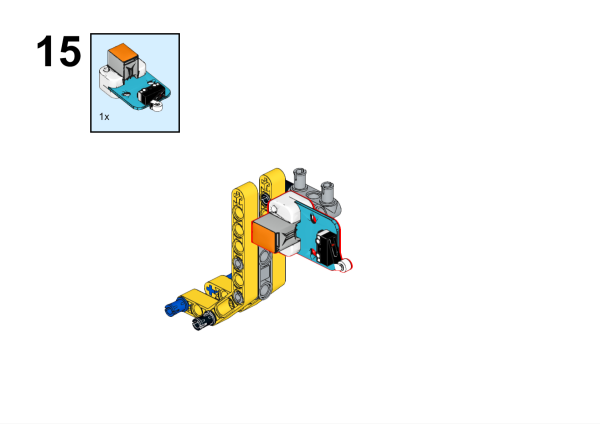

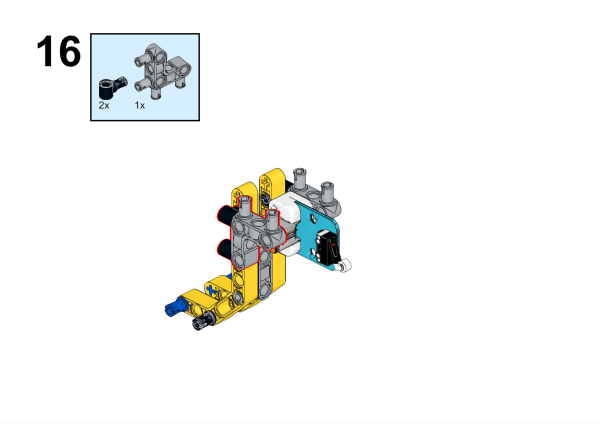

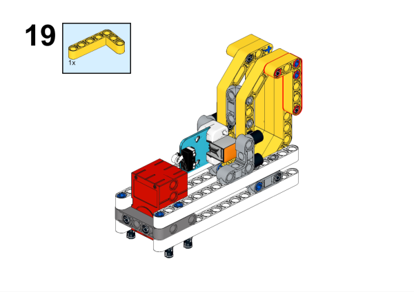

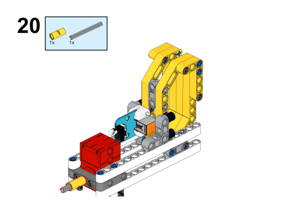

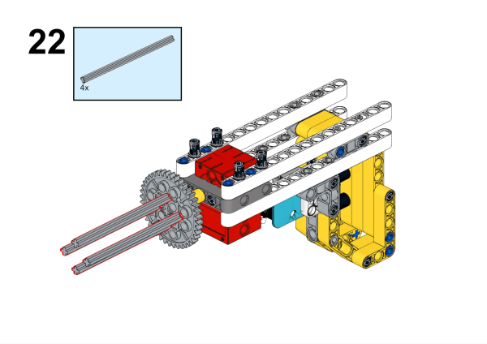

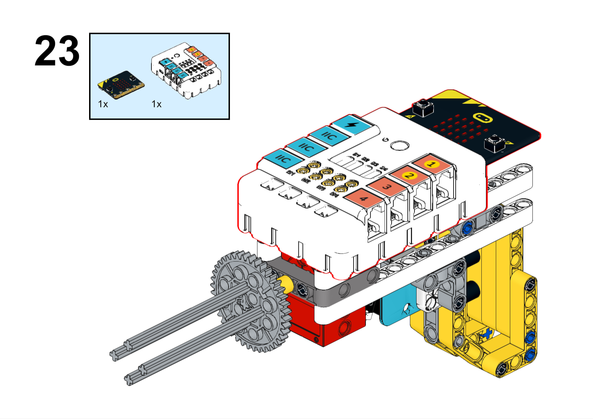

### Hardware Connection

Connect the crash sensor to the J1 and the motor to the M1 connector of the Nezha expansion board.

### Software Programming

Open programming platform: [makecode](https://makecode.microbit.org/#)

New construction projects

Click to expand

Search `PlanetX` in the search bar to add an extended library of PlanetX Series sensors.

Search `nezha` in the search bar to add the expansion library for Nezha expansion boards

Program

Link:[https://makecode.microbit.org/_4pvKroATsiao](https://makecode.microbit.org/_4pvKroATsiao)

You can also download the program directly from the following pages.

    <iframe
        src="https://makecode.microbit.org/_4pvKroATsiao"
        frameborder="0"
        sandbox="allow-popups allow-forms allow-scripts allow-same-origin"
        style={{
            position: 'absolute',
            width: '100%',
            height: '100%',
        }}
    />

### Result

Press and hold the crash sensor to start the egg-beater, release the crash sensor to stop the device.

