# Case 20 The Shooting Device

## Introduction

Make a shooting device that can project objects.

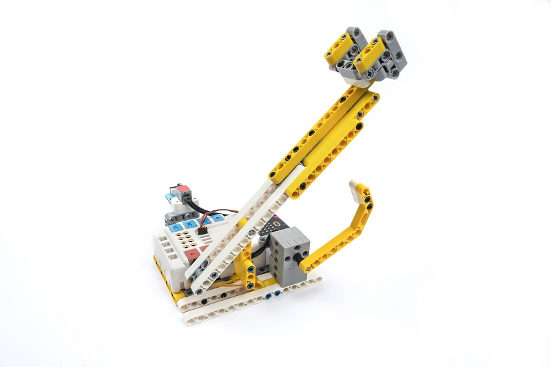

## Purchase Link

## Quick Start

### Build Steps

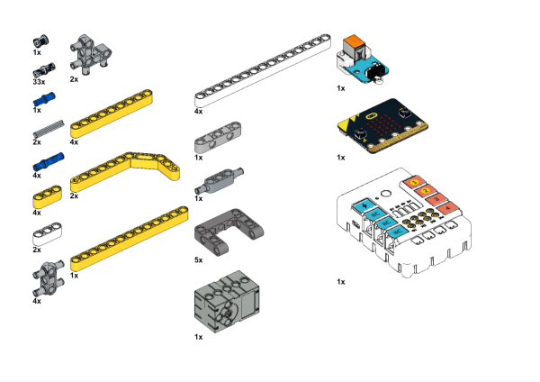

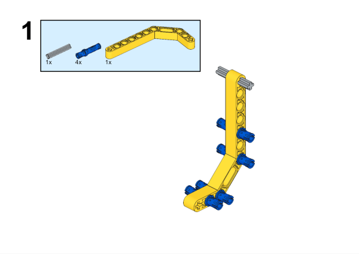

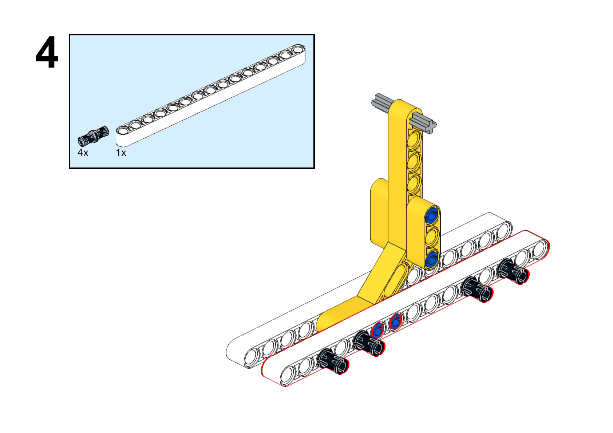

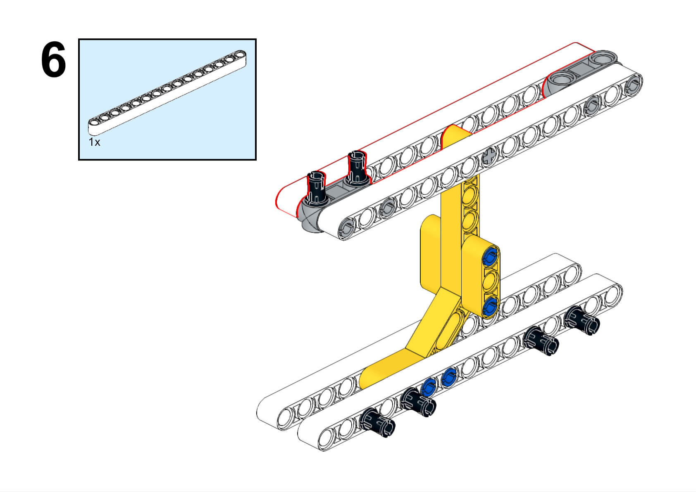

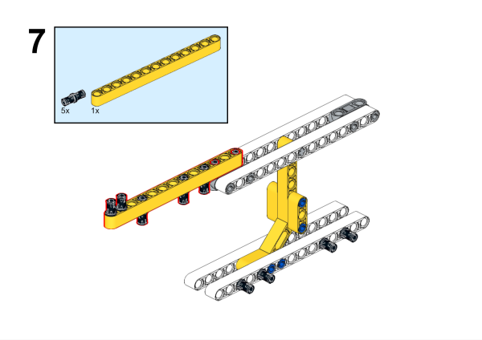

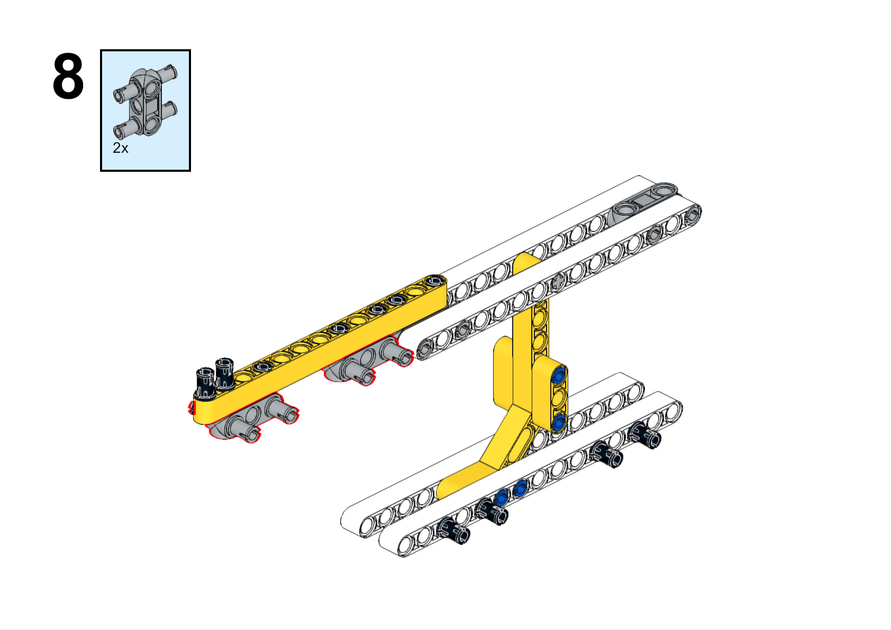

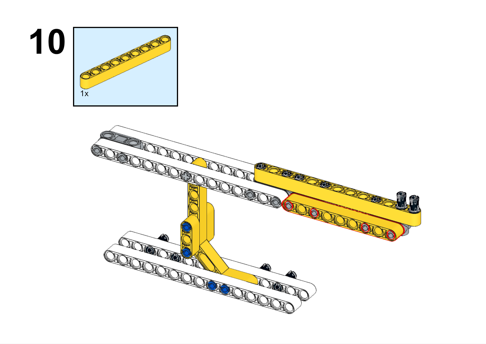

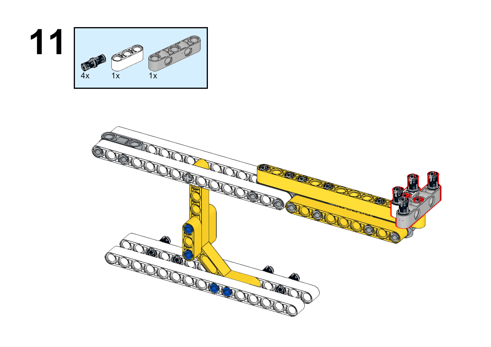

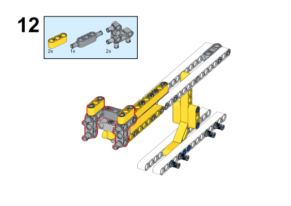

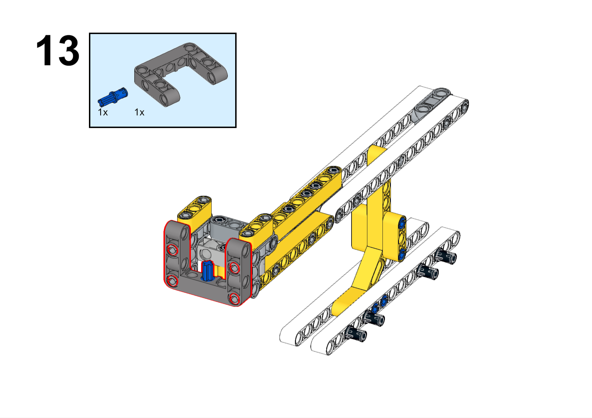

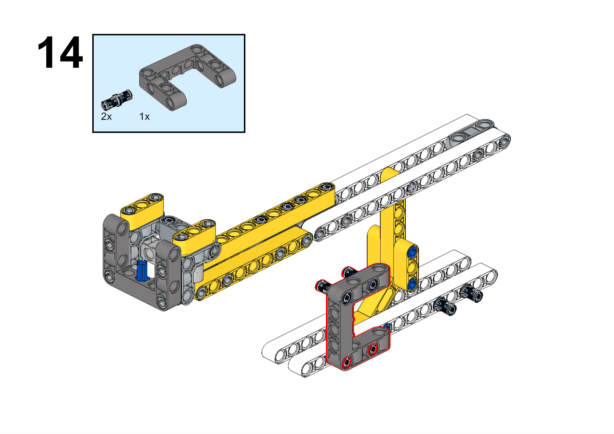

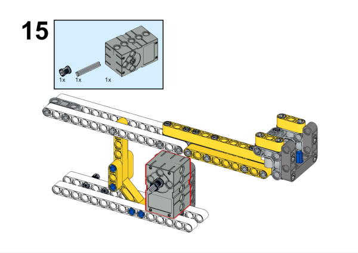

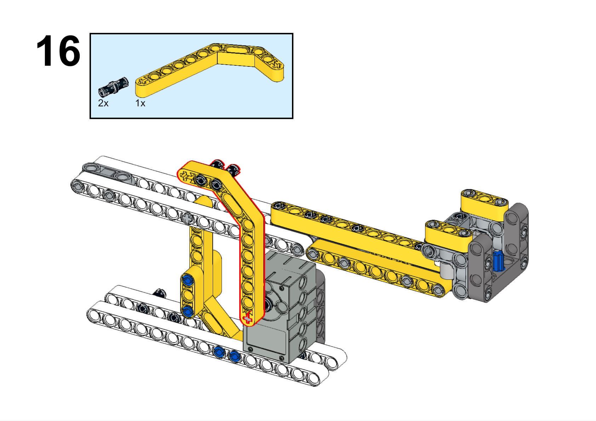

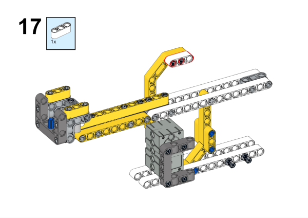

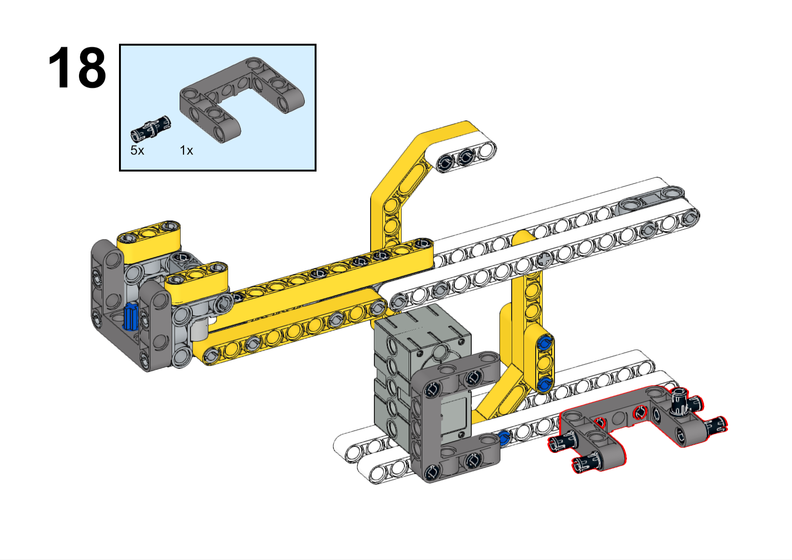

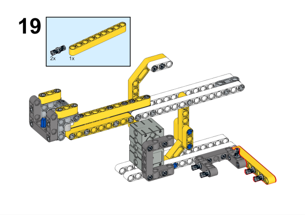

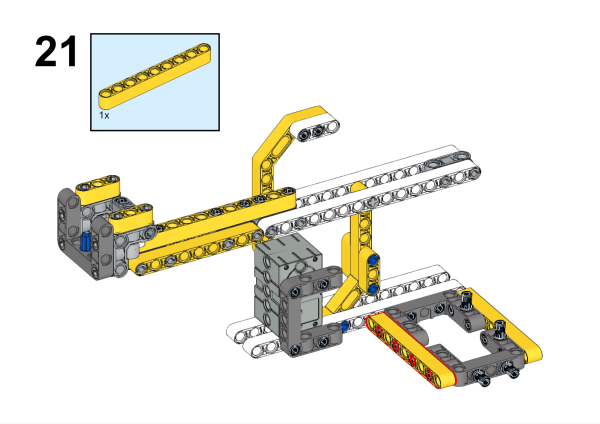

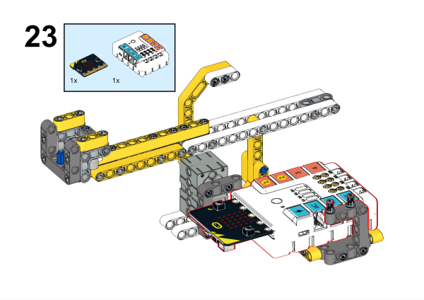

### Hardware Connection

Connect the crash sensor to the J1 and the servo to the S1 port of the Nezha expansion board.

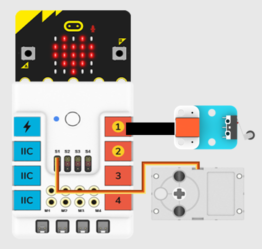

### Software Programming

Open programming platform: [makecode](https://makecode.microbit.org/#)

New Project

Click extensions

Search `PlanetX` in the search bar to add an extended library of PlanetX sensors

Search `nezha` in the search bar to add the expansion library for Nezha expansion boards

Programs

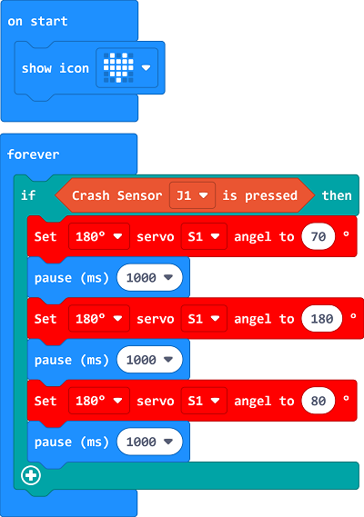

Link:[https://makecode.microbit.org/_cime7i4vk9k1](https://makecode.microbit.org/_cime7i4vk9k1)

You can also download the program directly from the following pages.

    <iframe
        src="https://makecode.microbit.org/_cime7i4vk9k1"
        frameborder="0"
        sandbox="allow-popups allow-forms allow-scripts allow-same-origin"
        style={{
            position: 'absolute',
            width: '100%',
            height: '100%',
        }}
    />

### Result

Press the crash sensor, the seesaw starts running, press the crash sensor again, the seesaw stops running.

