# Case 08 AI Combination Lock

## Introduction

The purpose of this lesson is to guide students to build an AI combination lock using the Nezha Inventor's Kit V2 and AI Accessories Pack, and to introduce them to the real-life applications of Artificial Intelligence through the feature-learning function of the AI lens. Students will learn how to build a combination lock system in which only specific items can be unlocked, thus developing their STEAM (Science, Technology, Engineering, Arts, and Mathematics) skills and improving problem solving and creativity.

## Teaching Objectives

- Understand the basic concepts and applications of Artificial Intelligence.
- Master the basic usage of Nezha Inventor's Kit V2 and AI Accessories Pack.
- Learn to build an AI combination lock system involving feature learning functionality.
- Improve teamwork and creative problem-solving skills.

## Teaching Preparation

[NEZHA Inventor's Kit V2](https://www.elecfreaks.com/nezha-inventor-s-kit-v2-for-micro-bit.html)

[AI Accessories kit](https://www.elecfreaks.com/nezha-inventor-s-kit-v2-for-micro-bit.html)

A Computer

## Teaching Process

### Introduction

>Teachers can guide students to think about the following questions: what is feature learning technology? What are its real-life applications?

Hello everyone, today we are going to enter the world of Artificial Intelligence and learn how to make an exciting AI combination lock using the Nezha Inventor‘s Kit V2 and AI Accessories Pack. Have you ever thought of combining AI with a security system where only specific items can be unlocked? This is not only the future of technology, but also the problem we are trying to solve today. Let's start this adventure together and discover how AI can change our lives.

### Explore

>Discuss in small groups to get students thinking about how to create an AI combination lock with an AI lens, focusing on the concept and use of the feature learning function.

- How can Artificial Intelligence be applied to a combination lock system?
- How to use Nezha Inventor's Kit V2 and AI Accessorries Pack to create an AI Combination Lock?
- How to use the feature learning function to recognize specific items?

### Exploration

>Work in groups to create an AI combination lock from building block materials according to your own design.

Follow your own design plan to create an AI combination lock using building block materials.

#### Example

##### Building Step

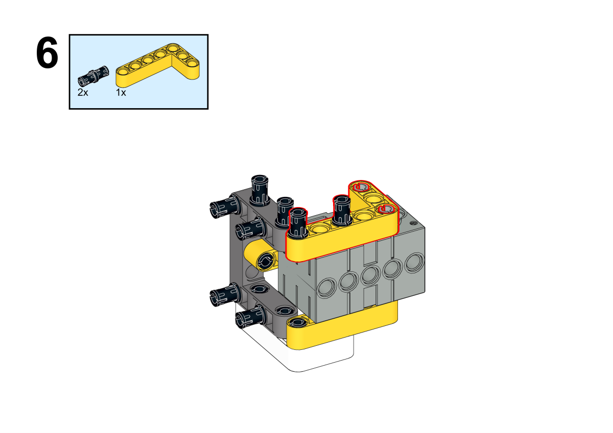

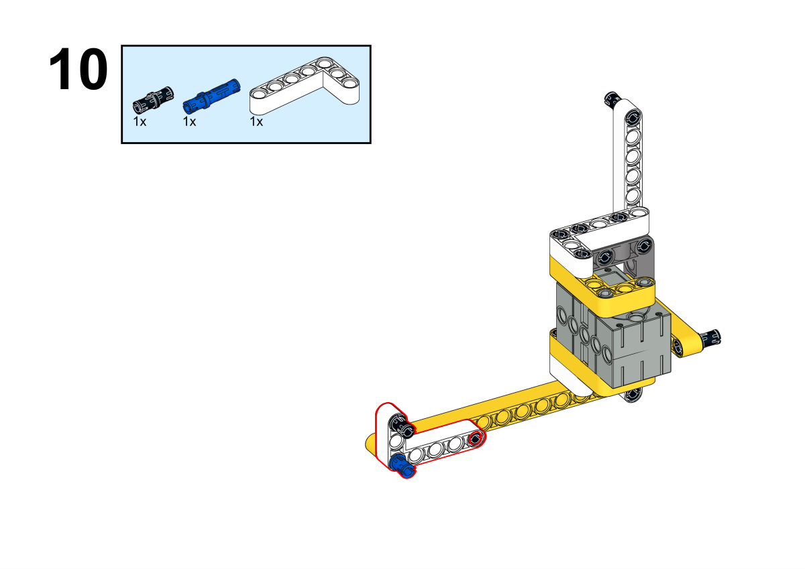

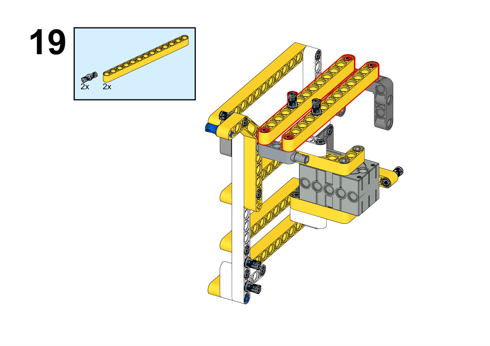

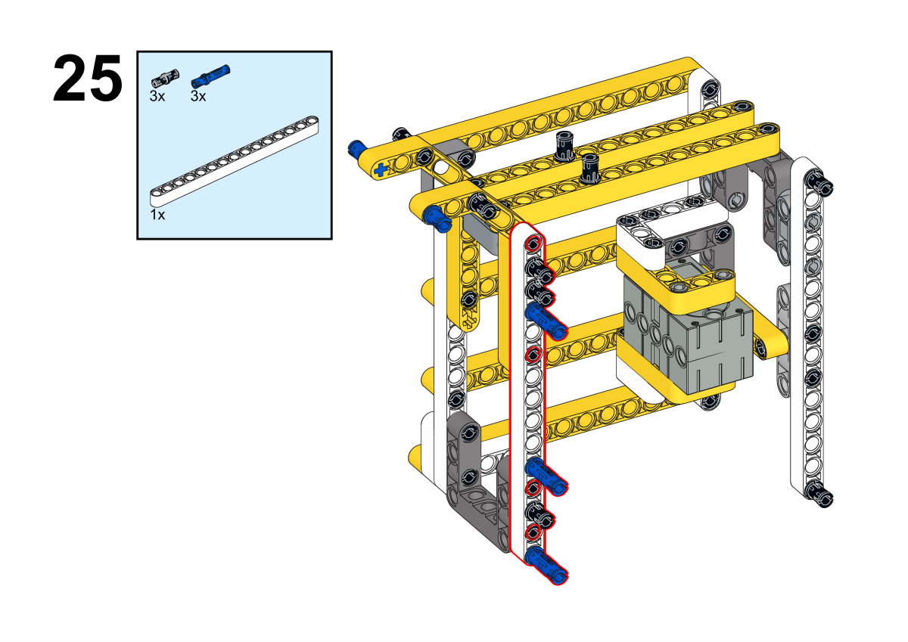

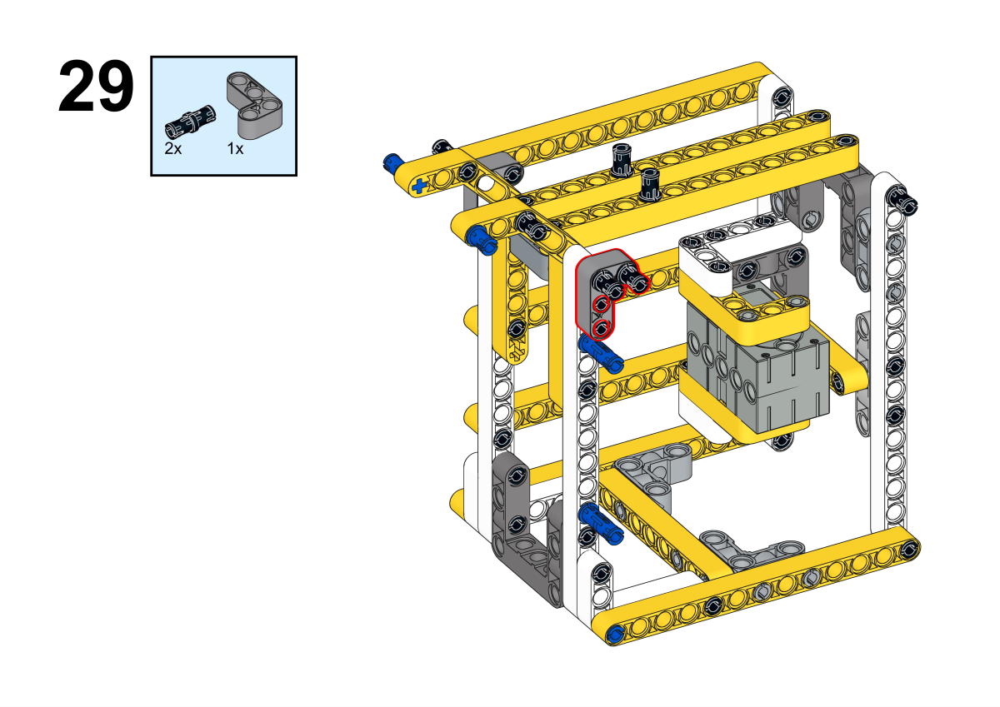

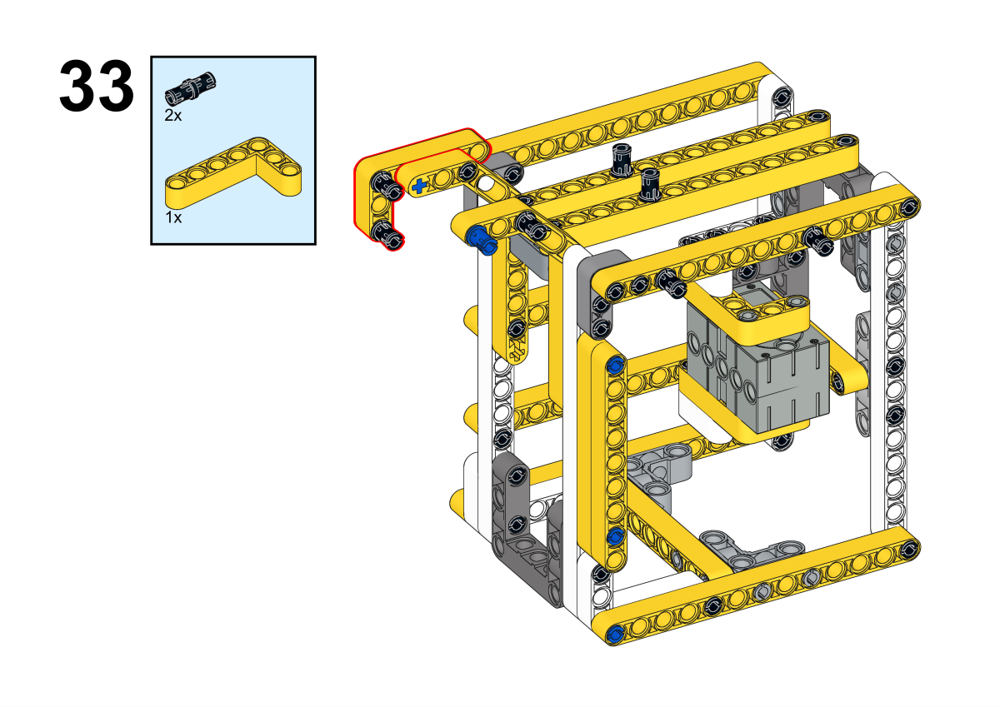

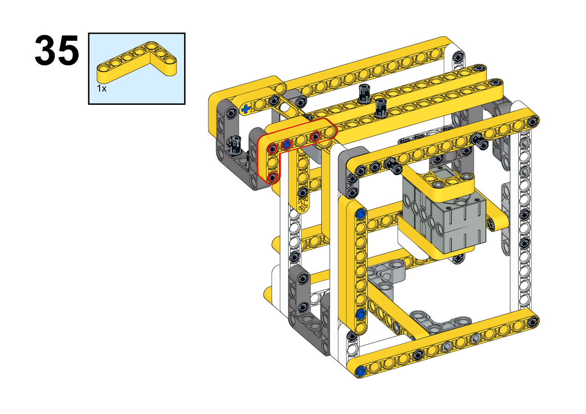

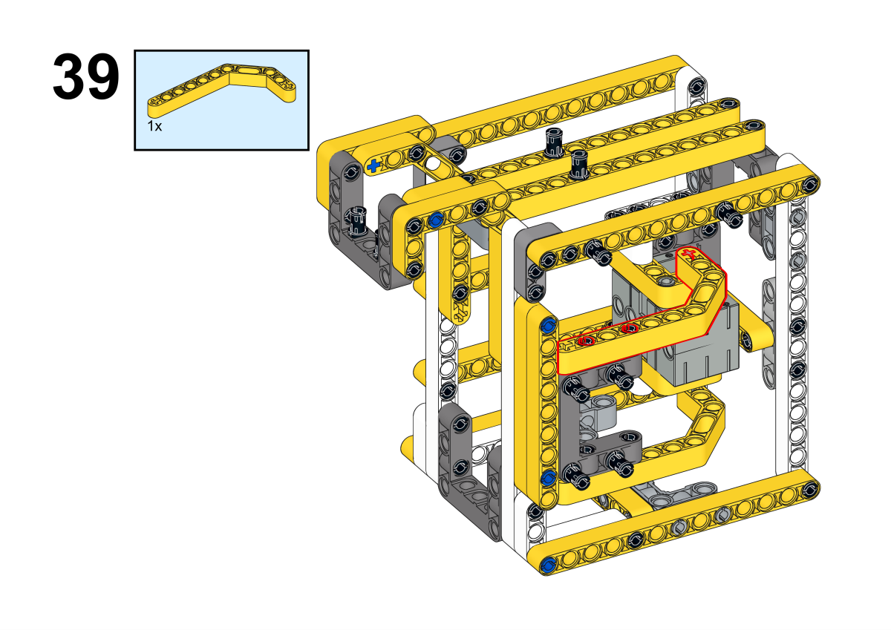

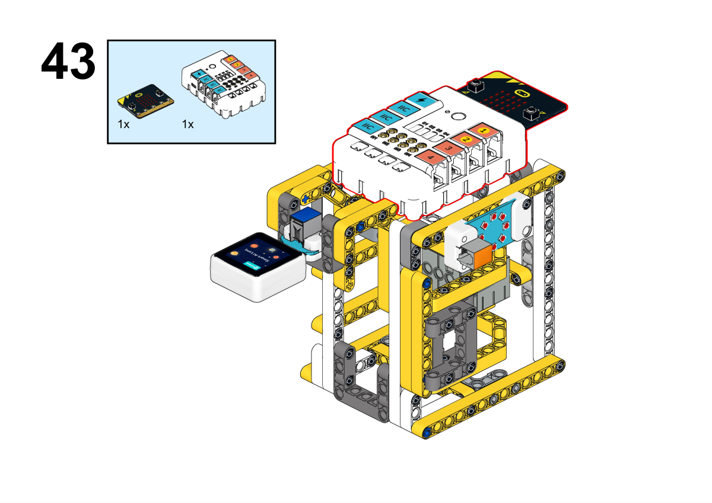

**Completion of construction**

##### Hardware Connections

Connect the rainbow light ring to the J1, the servo to the S1 port, and the AI lens to the IIC port on Nezha expansion board.

 

##### Software Programming

Fo to [makecode](https://makecode.microbit.org/#)

Create a new project

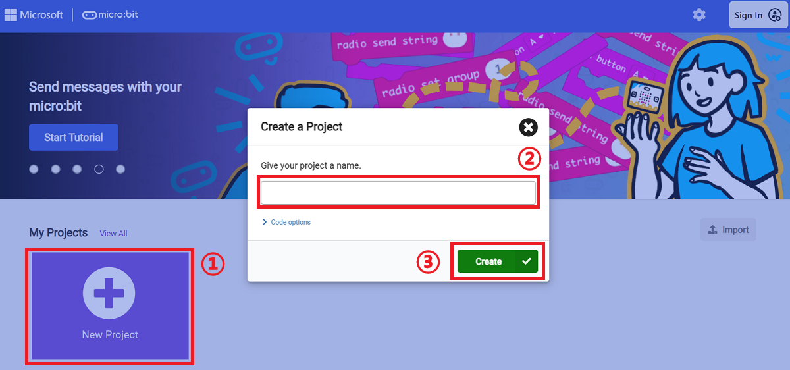

Click extensions

Search for `nezha` in the bar and add it. 

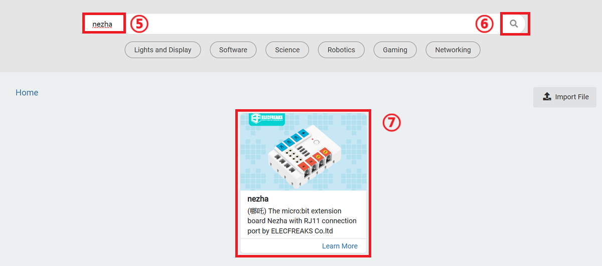

Search for `planetx` in the bar and add it.

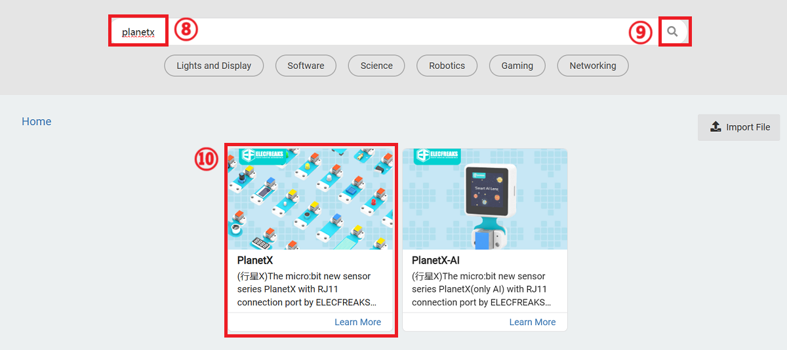

Write the program

Link: [https://makecode.microbit.org/_A4JVUpJw71k7](https://makecode.microbit.org/_A4JVUpJw71k7)

You can also download it in here:

    <iframe
        src="https://makecode.microbit.org/_A4JVUpJw71k7"
        frameborder="0"
        sandbox="allow-popups allow-forms allow-scripts allow-same-origin"
        style={{
            position: 'absolute',
            width: '100%',
            height: '100%',
        }}
    />

### Teamwork and Presentation

Students are divided into small groups and work together to create and program cases.

Students are encouraged to cooperate, communicate and share their experiences with each other.

Each group has the opportunity to present the cases they have produced to the other groups.

#### Sample case effect

Select a specific item as the unlock code. Place it in front of the camera, press button A to learn the characteristics of the item, when you need to unlock it, place the specific item in front of the camera and press button B. If the item is correct, the combination lock opens, otherwise it cannot be opened.

### Reflection

>Sharing in groups allows students in each group to share their production process and insights, summarize the problems and solutions they encountered, and evaluate their strengths and weaknesses.

### Expanding Knowledge

* What is feature learning? *

Feature Learning (FL) is an important concept in the field of Machine Learning and Deep Learning, which refers to automatically learning and extracting useful features or representations from raw data in order to better represent the data so that data analysis, pattern recognition and decision making tasks can be better performed.

The main goal of feature learning is to transform high-dimensional, complex data into more concise and informative representations so that machine learning algorithms can understand and process the data more easily. This helps to improve the performance and generalization of the model, reduces the burden of data dimensionality, and also helps to discover hidden patterns and structures in the data.

Feature learning methods include traditional feature extraction methods (e.g. Principal Component Analysis PCA, Independent Component Analysis ICA) as well as deep learning methods (e.g. Convolutional Neural Network CNN, Autoencoder Autoencoder). Deep learning excels in feature learning because it is able to learn multi-level, abstract feature representations, gradually moving from low-level feature extraction to high-level abstract features, thus adapting to the needs of different tasks.

Feature learning has a wide range of applications, including image recognition, speech recognition, natural language processing, recommender systems, and other fields, where it plays an important role in improving model performance and solving complex problems.
