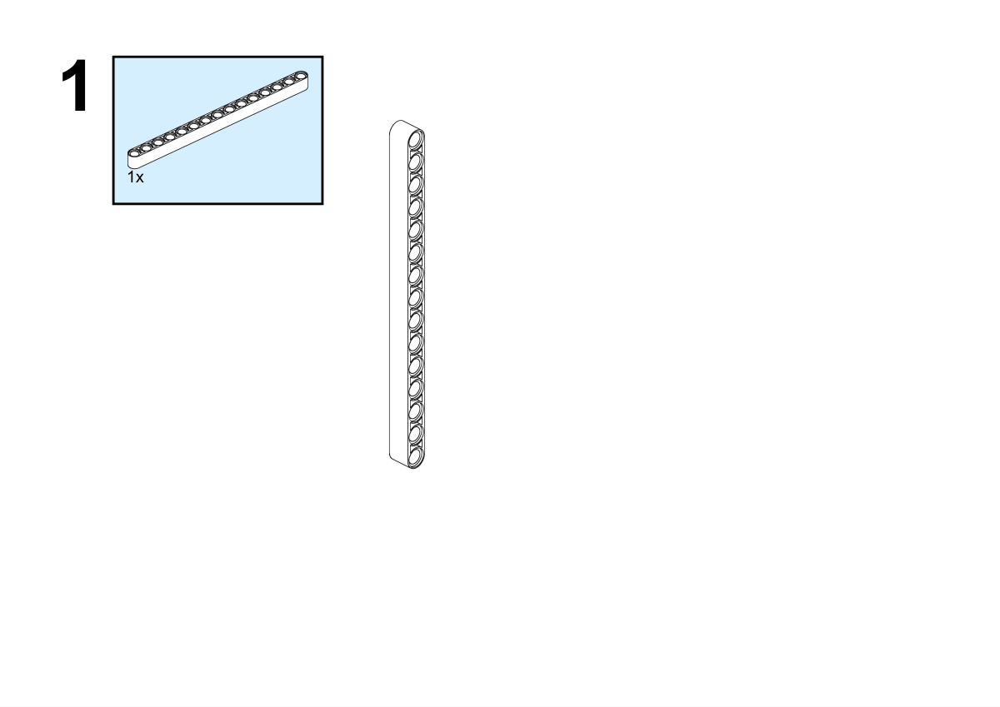
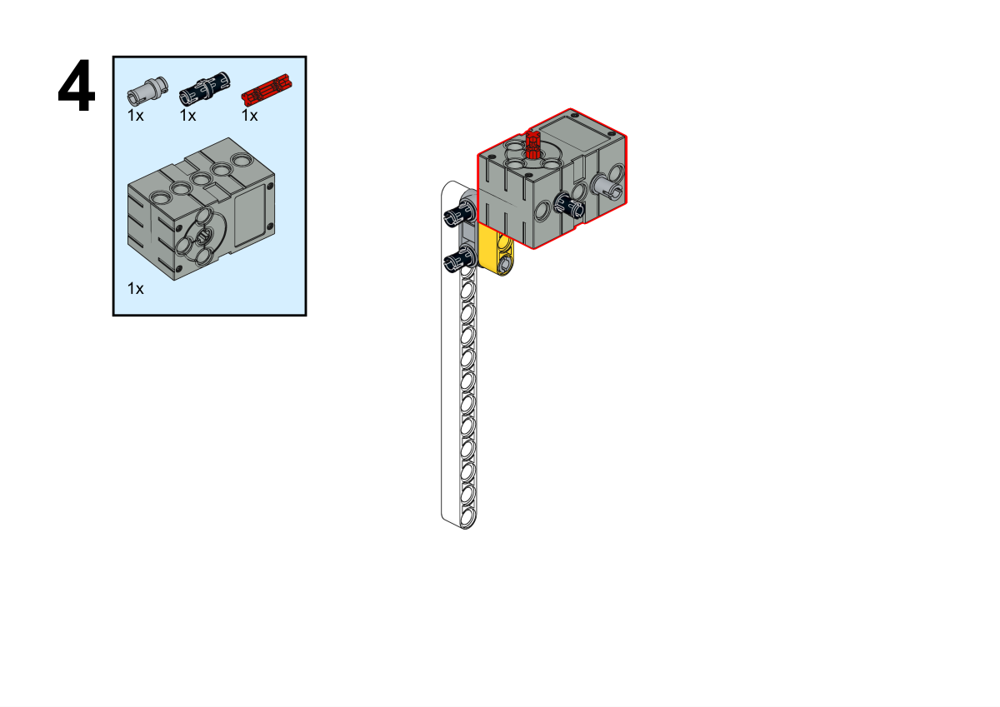
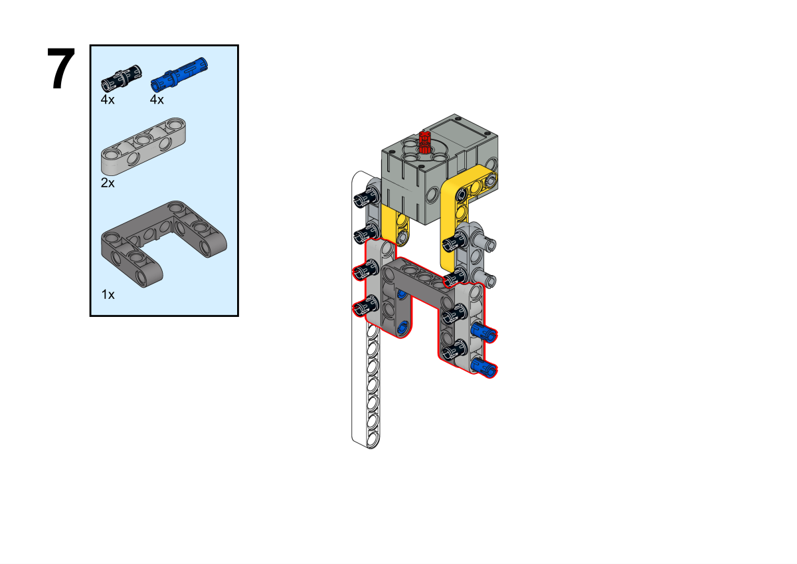
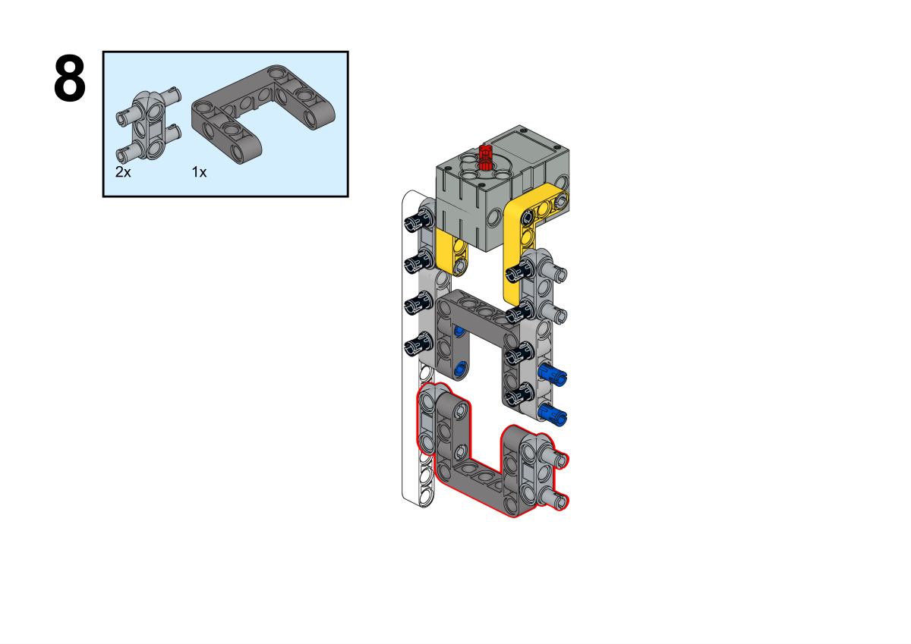
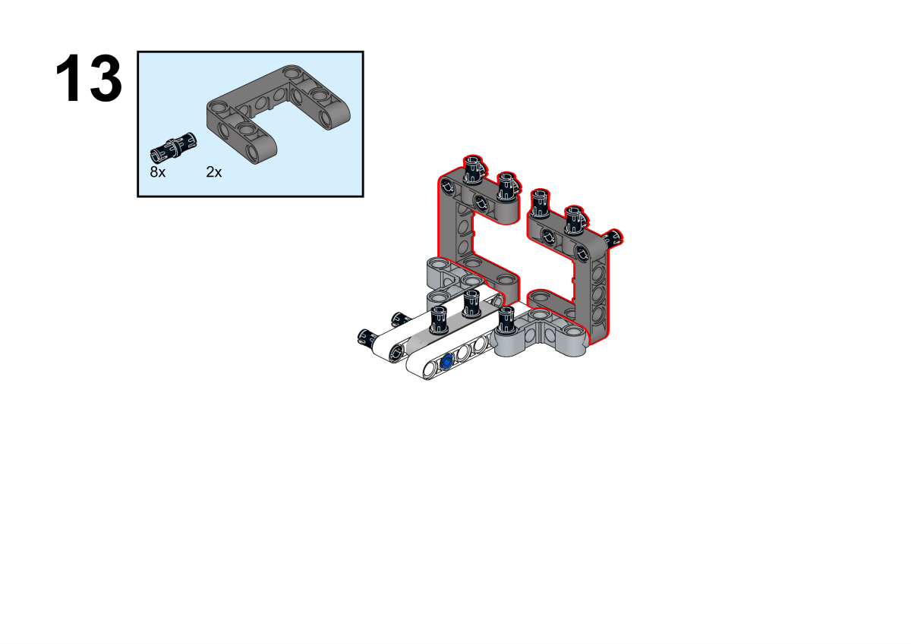
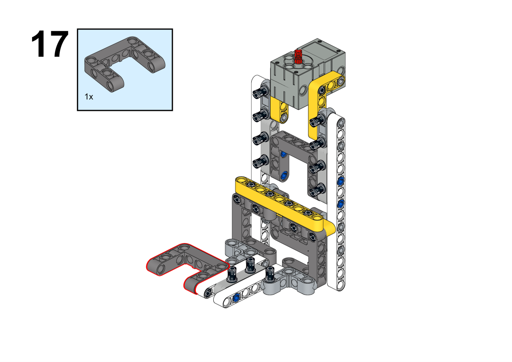
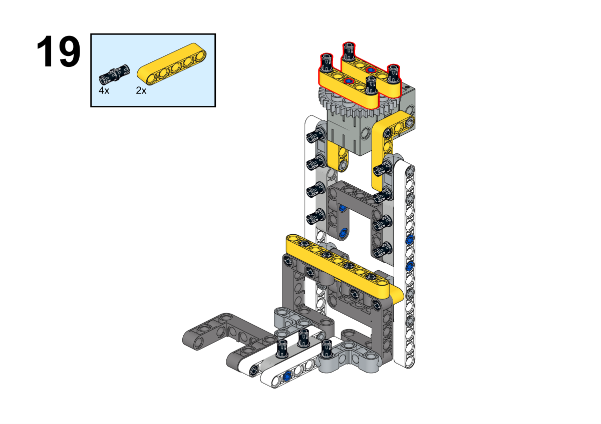
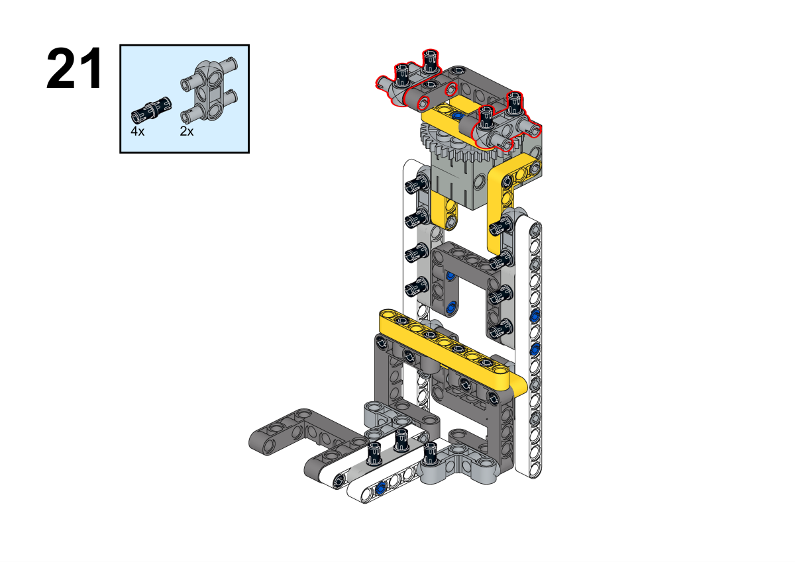
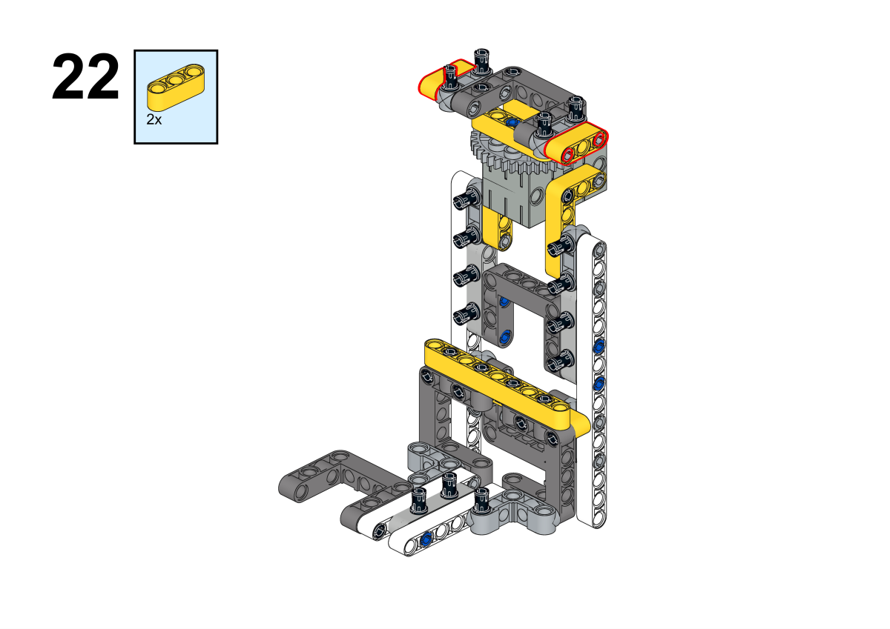
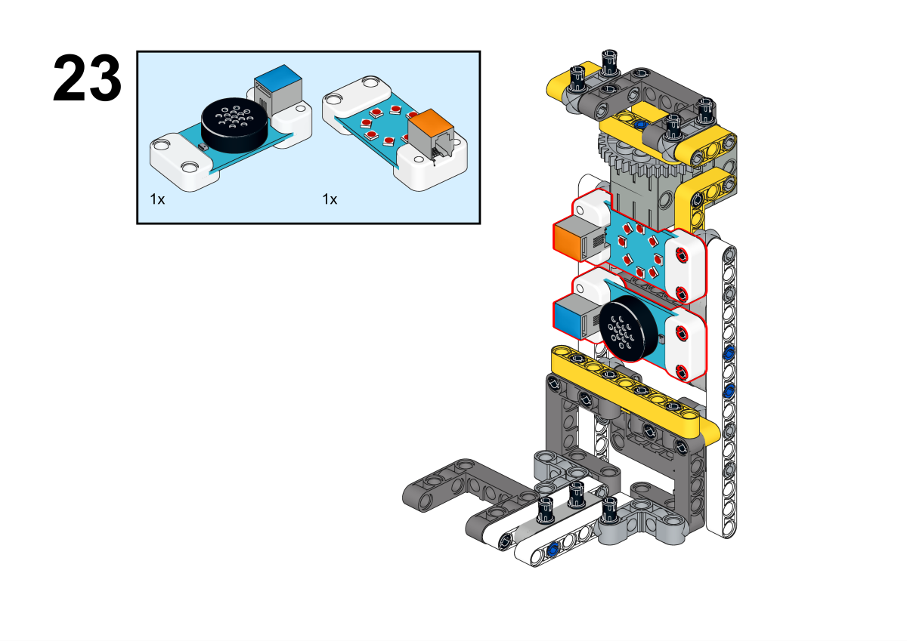

# Case 10 Speech Recognition Fan

## Introduction

The purpose of this lesson is to guide students to create a fan control system with voice recognition using the Nezha Inventor‘s Kit V2 and AI Accessories Pack. Through this project, students will learn how to integrate technology with real-life applications, develop their STEAM (Science, Technology, Engineering, Arts, and Mathematics) skills, and improve problem-solving and creativity.

## Teaching Goal

- Understand the basic principles and applications of speech recognition technology.
- Master the basic usage of Nezha Inventor's Kit V2 and AI Accessories Pack.
- Learn to build a fan control system with speech recognition.
- Improve teamwork and creative problem solving skills.

## Teaching Preparation

[ELECFREAKS NEZHA Inventor's Kit V2](https://www.elecfreaks.com/nezha-inventor-s-kit-v2-for-micro-bit.html)

[AI Accessories Kit](https://www.elecfreaks.com/nezha-inventor-s-kit-v2-for-micro-bit.html)

A Computer

## Teaching Process

### Introduction

>Teachers can guide students to think about the following questions: what is speech recognition technology and what are the application scenarios of speech recognition technology?

Hello everyone, today we are going to enter the world of technology and learn how to make an amazing voice-recognized fan control system using the Nezha Inventor's Kit V2 and AI Accessories Pack. Have you ever wanted to be able to control the fan on, off, adjust the gear or even whether to shake your head just by saying a word? That's what we're going to explore together today, so let's get started on this creative and technically challenging project.

### Exploration

>Break out into small groups and have students think about how they can make a voice-recognizing fan with a voice-recognizing sensor.

- What is voice recognition technology and how does it apply to fan control systems?
- How to design and implement voice commands to control various functions of a fan?

### Exploration

>Work in groups to create a voice recognition fan from building block materials according to your own design.

Follow your own design plan to build a voice-recognition fan using building block materials.

#### Illustrate

##### Building Step

**Completion of construction**

##### Hardware Connection

Connect the rainbow led to the J1, the servo to S1,  the fan to the J2 and the voice recognition sensor to the IIC port on Nezha expansion board.

 

##### Software Programming

Go to [makecode](https://makecode.microbit.org/#)

Create a new project

Click extensions

Search for `nezha` in the bar and add it 

Search for `planetx`in the bar and add it

Write the programs

Link: [https://makecode.microbit.org/_WoURtRcYmHk6](https://makecode.microbit.org/_WoURtRcYmHk6)

You can also download the code in here.

    <iframe
        src="https://makecode.microbit.org/_WoURtRcYmHk6"
        frameborder="0"
        sandbox="allow-popups allow-forms allow-scripts allow-same-origin"
        style={{
            position: 'absolute',
            width: '100%',
            height: '100%',
        }}
    />

### Teamwork and Presentation

Students are divided into small groups and work together to create and program cases.

Students are encouraged to cooperate, communicate, and share their experiences with each other.

Each group has the opportunity to present the cases they have produced to the other groups.

#### Sample case effect

You can control the fan's on, off, gear, and whether or not to oscillate the head by using your voice.

### Rflection

>Sharing in groups allows students in each group to share their production process and insights, summarize the problems and solutions they encountered, and evaluate their strengths and weaknesses.

### Expanded knowledge

*** Fundamentals of speech recognition technology***

Speech recognition technology, also known as Automatic Speech Recognition (ASR), is a technology used to convert human speech into text or commands. Its principle involves multiple steps and complex modeling, following are the basic principles of speech recognition technology:

Audio Input: the speech recognition system first receives a sound signal from a microphone or an audio file. This signal is a continuous analog waveform.

Preprocessing: Preprocessing is usually required before speech can be analyzed. This includes denoising, which reduces the effect of background noise, and framing the speech signal, which splits the continuous sound signal into short time-slots of frames.

Feature extraction: extracting features from each audio frame. Commonly used features include Mel Frequency Cepstrum Coefficient (MFCC) and acoustic features. These features represent the frequency, energy and acoustic properties of the sound.

Acoustic modeling: Acoustic models are used to match the relationship between audio features and speech units (phonemes). Acoustic models are usually based on deep learning techniques such as Recurrent Neural Networks (RNN) or Convolutional Neural Networks (CNN) to learn the mapping relationships between audio features and text.

Language modeling: in speech-to-text, language models consider vocabulary, syntax, and context to determine which words are likely to occur in a given context. This helps to improve the accuracy of recognition, especially in cases of ambiguity.

Decoder: The decoder uses the acoustic and language models, along with a sequence of audio features, to generate the most likely text sequence. This process is called acoustic decoding.

Post-processing: The generated text may contain errors, so post-processing, such as error correction and grammar correction, is often required to improve the quality of the recognition results.

Output results: ultimately, the speech recognition system outputs the recognized text or commands for use by the application or system.

Overall, speech recognition technology is based on the extraction of sound features and the application of deep learning models to convert sound into text through pattern matching and language modeling. This technology has a wide range of applications in the fields of natural language processing, intelligent assistants, voice control systems, and voice translation.
