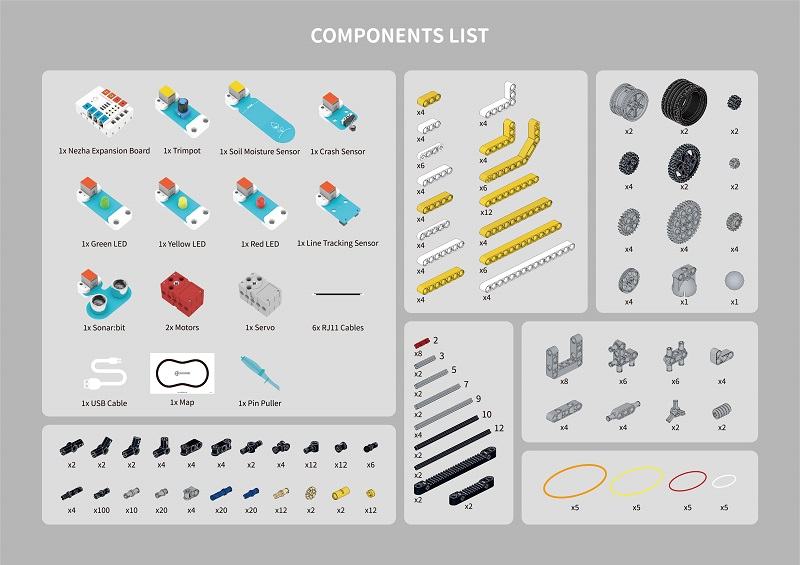

# Products Information

## Introduction

ELECFREAKS micro:bit Nezha Inventor's Kit V2 is a BBC micro:bit kit designed based on Planet X sensors, which contains several sensors and modules such as the LED lights, potentiometers, soil moisture sensors, ultrasonic sound sensors, crash sensors, line-following sensors, and etc. It comes with more than 400 blocks that are suitable for building various cases and it can improve children's hands-on skills and logical thinking. It has 32 thematic cases and more extensions designed to nurture and stimulate children's creativity and imagination. It is a programming education kit for all ages, so that every child can experience the fun of invention.

## Parameter

| Item | Parameter |
|---|---|
|Weight|1311.1g|
|Dimensions|L27.8cm×W22cm×H7.6cm|
|Charging Voltage|5V|
|Charging Time|120min|
|Max Workng Voltage|4.2V|
|Rated Working Voltage|3.7V
|Min Working Voltage|3.2V|
|TT Motor Interface Output Voltage\Current|5.6V\2.8A|
|Servo Interface Output Voltage\Current|5.6V\3.0A|
|Fischertechnik Motor Interface Output Voltage \Current|5.6V\2.8A|
|RJ11 Sensor Interface Output Voltage\Current|3.4V\1.6A|
|Duration of Operation|2 hours (due to the test environment, different load states and other factors, the actual use of time may vary)|
|Servo Interface|4 PCS|
|TT Motor Interface|4 PCS|
|Fischertechnik Motor Interface|4 PCS|
|SensorZ Interface|7 PCS|

## Packing List

| Item | QTY |
|---|---|
| micro:bit Multifunctional Expansion Box (Nezha) (Self-developed) | 1 |
| PLANETX_Soil_Moisture | 1 |
| PLANETX_Ultrasonic | 1 |
| PLANETX_Crash | 1 |
| PLANETX_RED_LED | 1 |
| PLANETX_GREEN_LED | 1 |
| PLANETX_YELLOW_LED | 1 |
| PLANETX_Trimpot | 1 |
| PLANETX_Tracking | 1 |
| Nezha Building Blocks Package V2 | 1 |
| Pin Puller (Blue)  | 1 |
| USB MIRCO Cable 1m 1A White | 1 |
| Geekservo Gray 360 Degrees Servo | 1 |
| Geekservo Red | 2 |
| RJ11 Cables 200mm | 3 |
| RJ11 Cables 400mm | 3 |
| Rubber Band | 1 |
| TPBot Map V1.3 | 1 |
