# Case 11 The Crab Robot

## Introduction 

Crabs are creatures that live in the sea and fresh water and have hard shells and powerful pincers. Crabs move mainly by walking laterally and they crawl through the coordinated movement of their legs. In this lesson we will learn about the characteristics and behaviour of crabs and try to make a mechanical crab that mimics the crab's crawl.

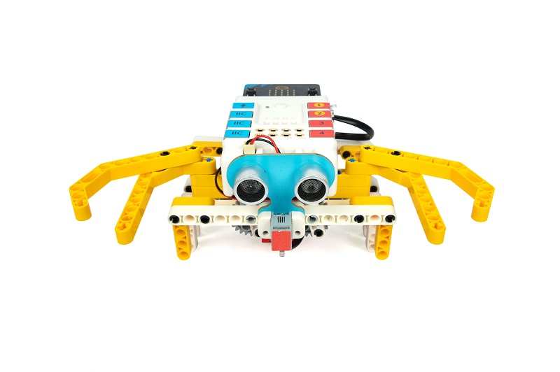

## Teaching Objectives

- Understand the working principles and applications of ultrasonic sound sensors.
- Learn the basic principles of gearing and how to implement it.
- Learn how to use ultrasonic sensors and gearing to create a mechanical crab that mimics the crawling of a crab.
- Develop creativity, problem-solving skills and teamwork spirit.

## Teaching Preparation

[Nezha Inventor's Kit V2](https://www.elecfreaks.com/nezha-inventor-s-kit-v2-for-micro-bit.html)

## Teaching Process

### Inrtroduce

>Introduce students to the background and objectives of the mechanical crab production to stimulate their interest and curiosity.

Is everyone interested in crabs? Crabs are interesting creatures that crawl freely in the ocean and in fresh water. Today, I have brought along a special project where we will be using Nezha Inventor's Kit V2 to create a mechanical crab that mimics the crab's crawl. This mechanical crab has an intelligent function that will automatically walk sideways when it detects an obstacle in front of it. Through this project, we will learn how to apply ultrasonic sound sensors and gearing to make an interesting mechanical crab.

### Exploration

>In groups, get students thinking about how to make a mechanical crab from block materials, focusing on how the ultrasonic sound sensor works.

- How do crabs perform lateral walking? What are their characteristics and patterns?
- How does an ultrasonic sound sensor work? What can it detect?
- What is the gear transmission? What is its role in the mechanical crab?
- How can the mechanical crab be programmed by Nezha Inventor's Kit V2 to walk sideways according to the signals from the ultrasonic sound sensor?

### Practice

>Work in groups to create a mechanical crab from block materials following your own design.

#### Examples

##### Assembly Steps

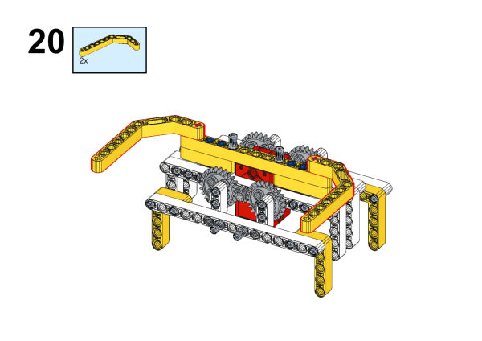

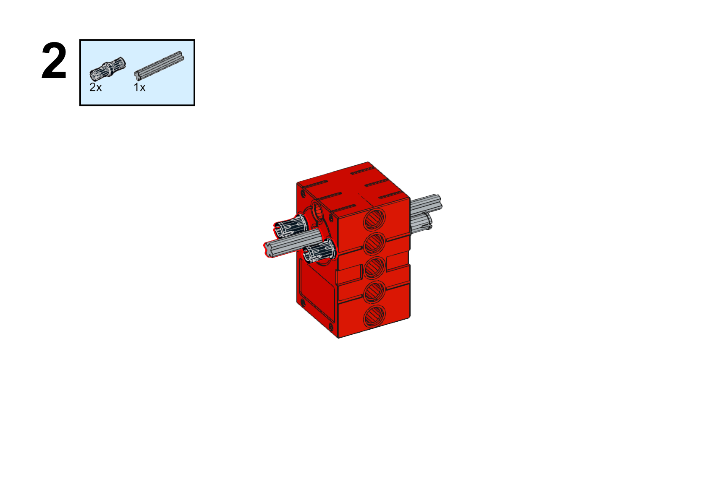

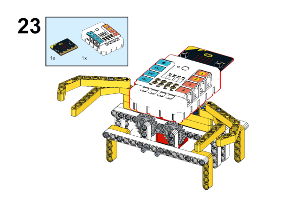

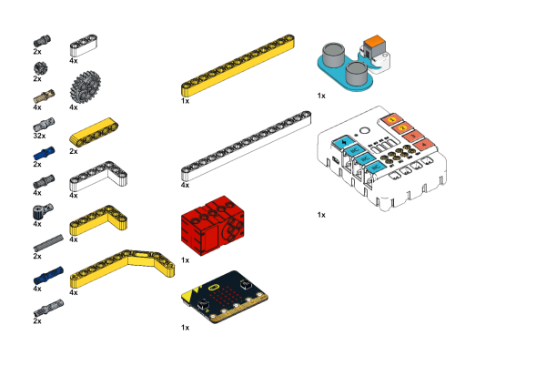

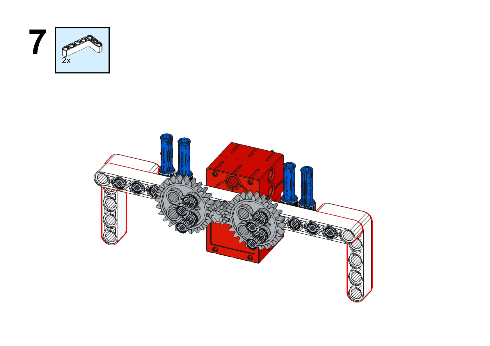

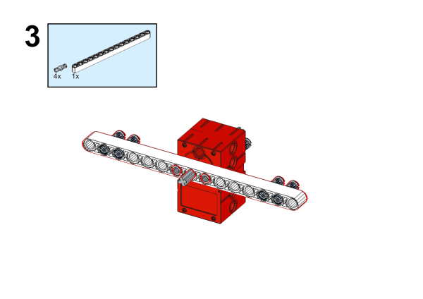

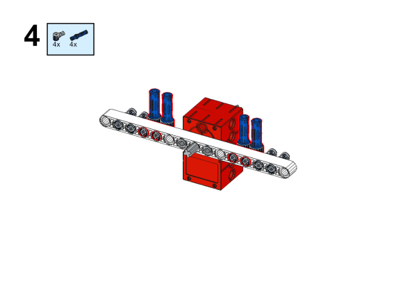

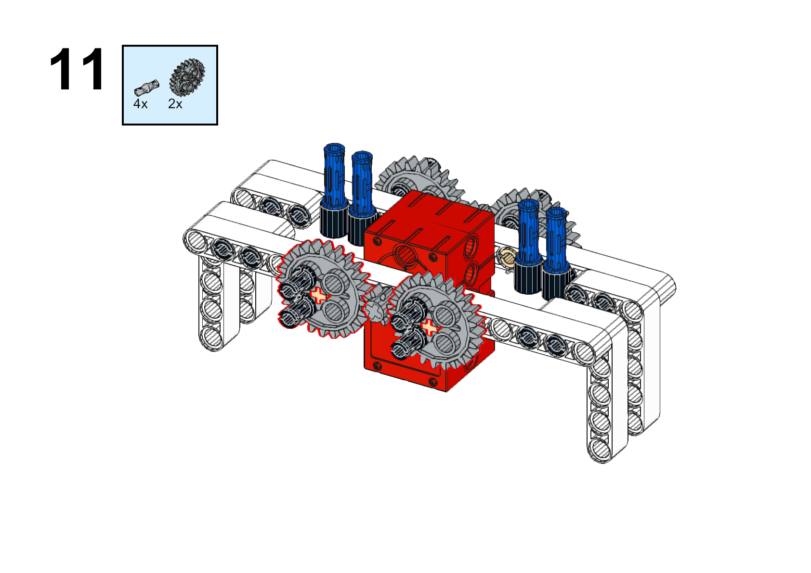

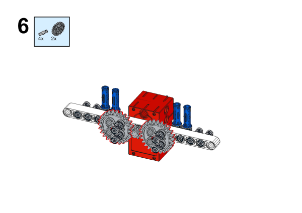

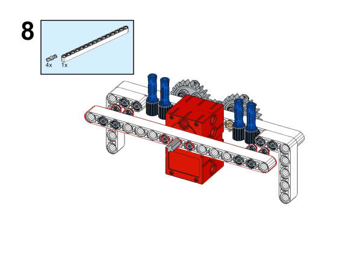

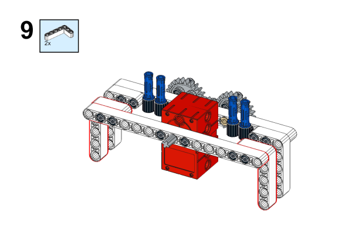

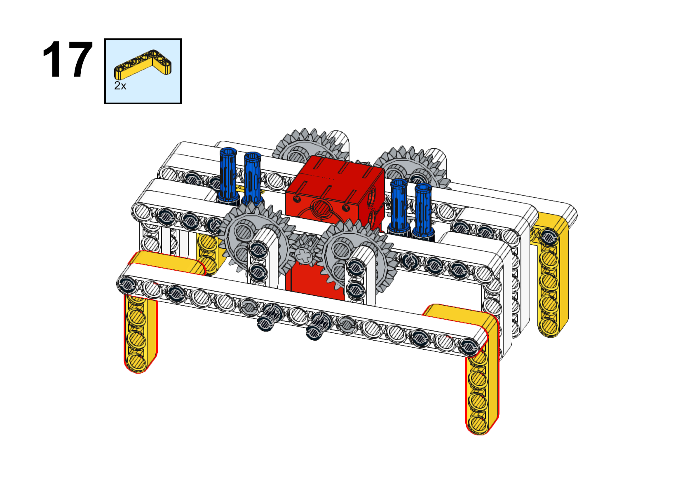

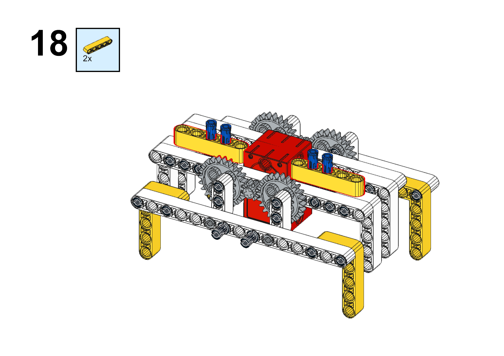

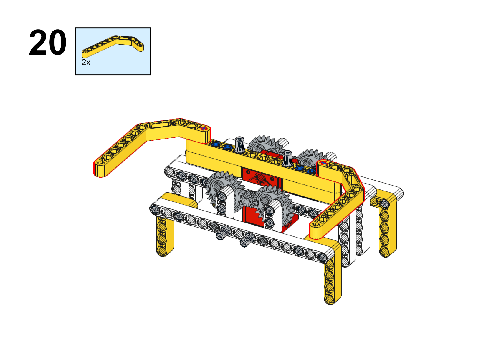

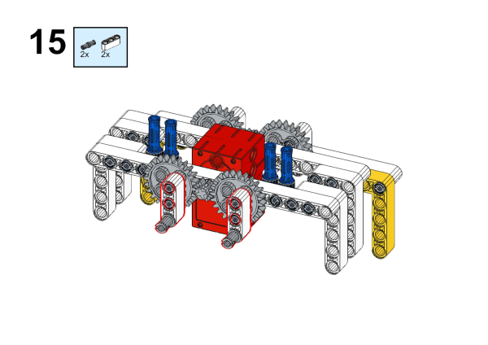

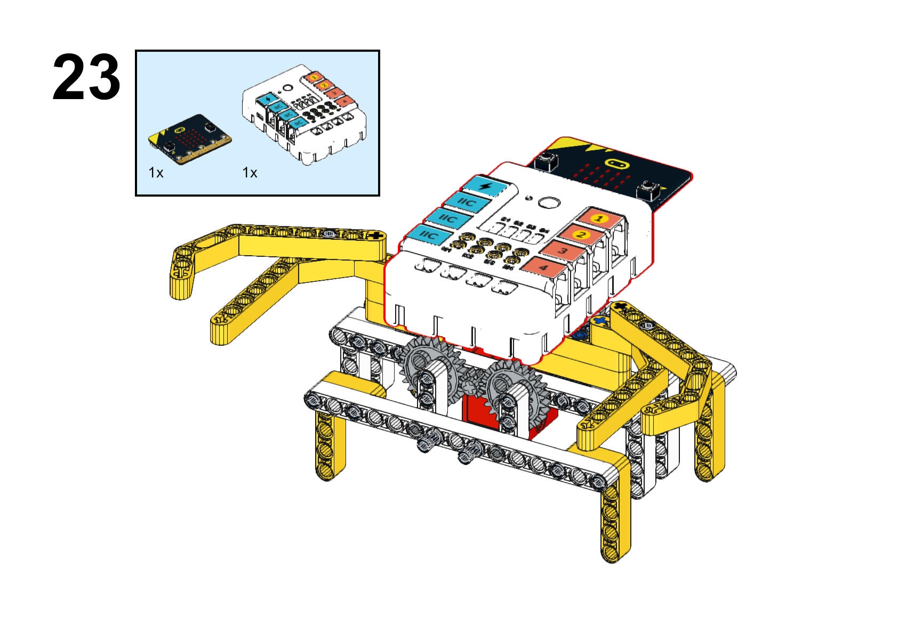

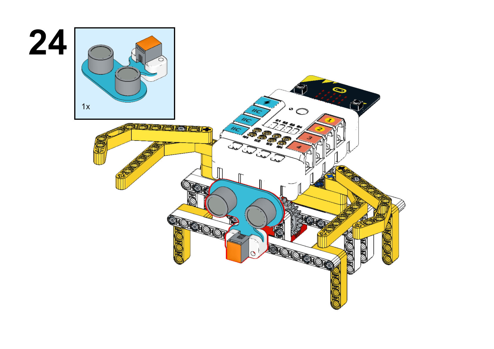

**Completed**

##### Hardware Connections

Connect the ultrasonic sound sensor to the J1 and the motor to the M1 connector of the Nezha expansion board.

##### Programming

Go to [makecode](https://makecode.microbit.org/#)

Create New Project

Click "Extensions"

Search wih `PlanetX` to add the package.

Search with `nezha` to add the package. 

Code

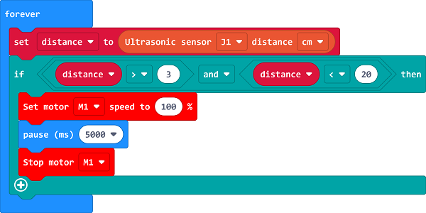

Link: [https://makecode.microbit.org/_7c7WtwVXyTRM](https://makecode.microbit.org/_7c7WtwVXyTRM)

You may download it directly:

    <iframe
        src="https://makecode.microbit.org/_7c7WtwVXyTRM"
        frameborder="0"
        sandbox="allow-popups allow-forms allow-scripts allow-same-origin"
        style={{
            position: 'absolute',
            width: '100%',
            height: '100%',
        }}
    />

### Demonstration

>Present in groups and compare the results and effectiveness of each group.

#### Result

When an obstacle stands in the way of the crab, the crab will walk to the side way. 

### Reflection

>Share in groups so that students in each group can share their production process and insights, summarise the problems and solutions they encountered, and evaluate their strengths and weaknesses.
