# Case 06 The Dance Robot

## Introduction

Dancing is an expressive and artistic body language. Through graceful movements and a sense of rhythm, dancers are able to convey emotions, stories and ideas. There are many different forms of dance, including contemporary, ballet, jazz and street dance. Whether it is a professional performance on stage or a free dance at a large family gathering, dancing can evoke passion and joy within people. It is not only a form of physical expression, but also a form of cultural transmission and communication. Dancing is a way to build physical fitness and improve co-ordination, and it also gives people the opportunity to relax and release stress. Whether you are a dancer or an audience member, dancing is a wonderful artistic feast that allows people to enjoy the beauty and joy that dance brings.

This course aims to introduce students to the principles of motor control, the use of gearing and the effect of the centre of gravity on balance through the creation of a dancing robot with the Nezha Inventor's Kit V2. Students will have hands-on experience building a dancing robot and learn how to use gearing and control motors to achieve the robot's dancing movements. Through this project, students will develop creativity, problem-solving skills and teamwork ability.

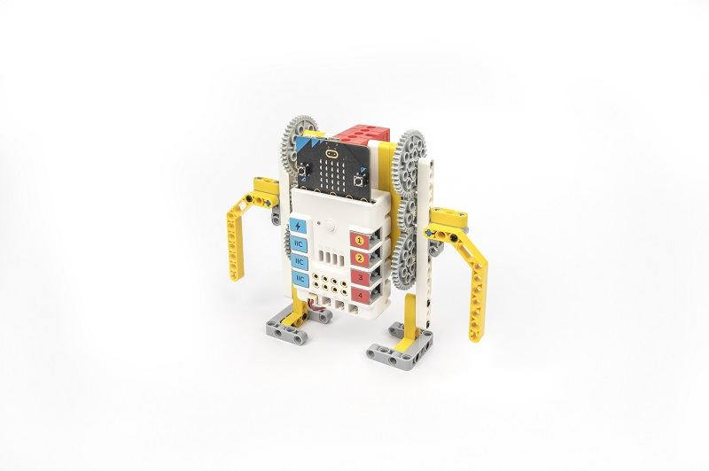

## Teaching Objectives

- Understand the working principles and control methods of electric motors.
- Understand the basic principles and applications of gearing.
- Learn to build the basic structure of a dancing robot using building blocks.
- Understand the importance of the centre of gravity to balance and apply it to robot design.
- Develop creativity, problem solving skills and teamwork ability.

## Teaching Preparations

[Nezha Inventor's Kit V2](https://www.elecfreaks.com/nezha-inventor-s-kit-v2-for-micro-bit.html)

## Teaching Process

### Introduce

>Introduce students to the background and objectives of making a dancing robot to stimulate their interest and curiosity.

In this class we will explore an exciting project - a dancing robot. Dancing is an artistic and creative form of expression and we will learn how to make a robot that can dance, programmed and controlled by motors to show beautiful dance moves.

The Dancing Robot is a project that combines science, engineering and art. We will use blocks and motors to build the basic structure of the robot and control its movement through gearing. We will also learn how to adjust the robot's centre of gravity to maintain balance and achieve graceful dance movements.

This project will give you an insight into how motors work, the application of gearing and the importance of the centre of gravity for balance. Through hands-on building and practice, you will develop creativity, problem-solving skills and teamwork. You will also have the opportunity to apply your knowledge of programming to make the robot dance different dance moves by controlling the speed and force of the motors.

By participating in this project, you will not just be an observer, but a creator and designer. You will be building the robot yourself and using your imagination and creativity to make the robot into an amazing dancer.

Let's get stuck into this fun and challenging project and explore the wonderful combination of science, engineering and art to create your very own dancing robot!

### Exploration

>In small groups, students will be asked to think about how to build a dancing robot using block materials, focusing on the basic principles of gearing.

- Think about how to adjust the configuration of motors and gears and the position of the centre of gravity in order to achieve balance and dance movements in the robot.
- Discuss the features and advantages of gearing.
- Adjust the gearing and the structure of the robot to achieve balance and dance movements.

### Practices

>Work in groups to create a dancing robot out of building blocks according to your own design.

Create a dancing robot out of blocks according to your own design.

#### Examples

##### Assembly Steps

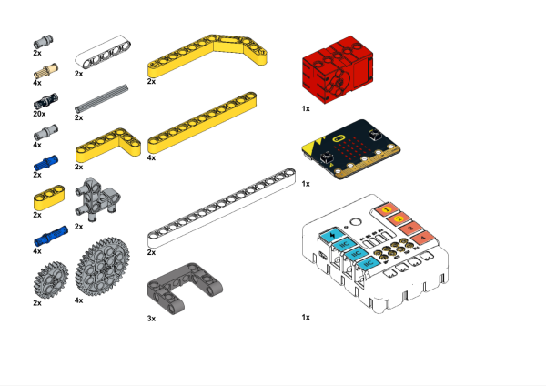

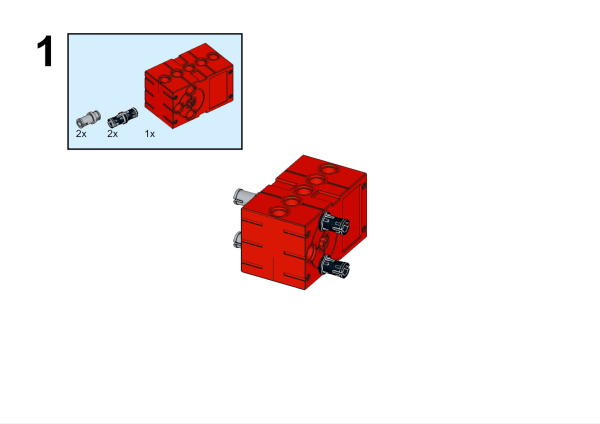

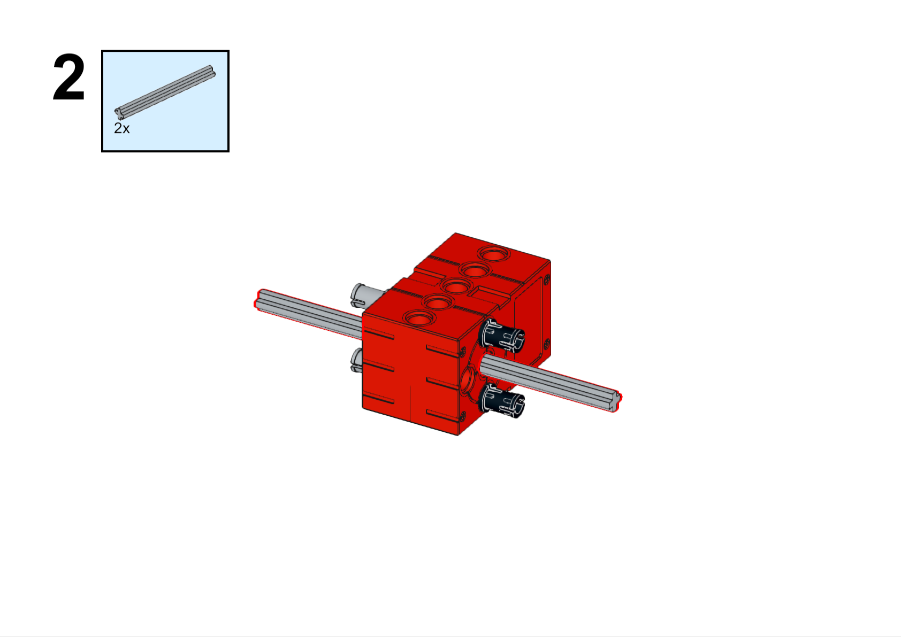

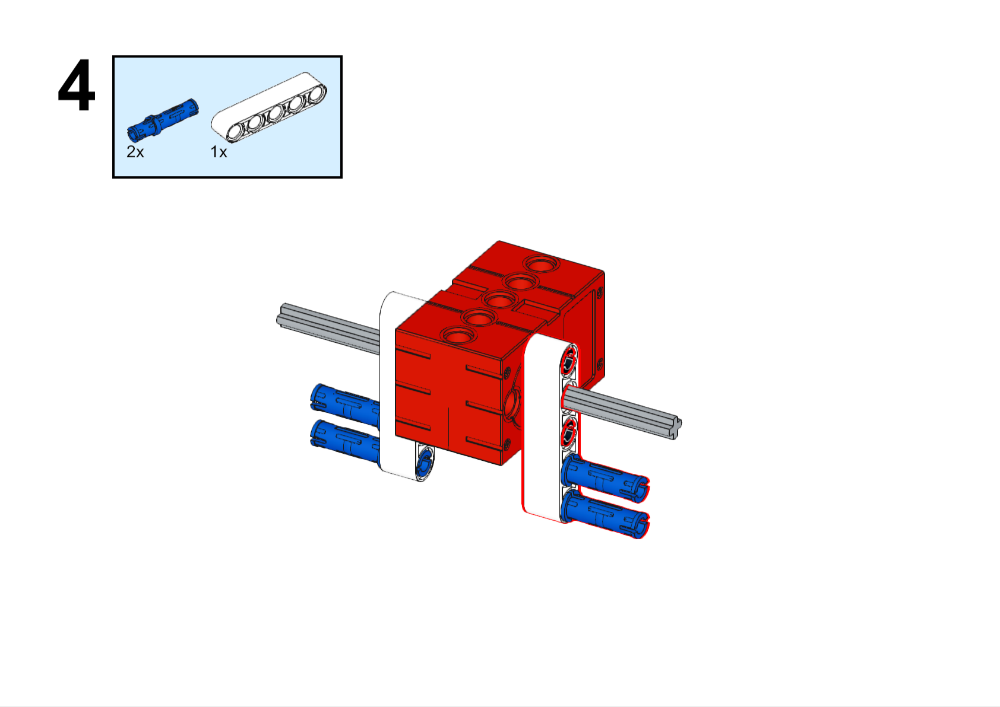

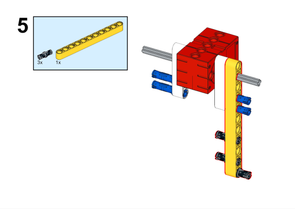

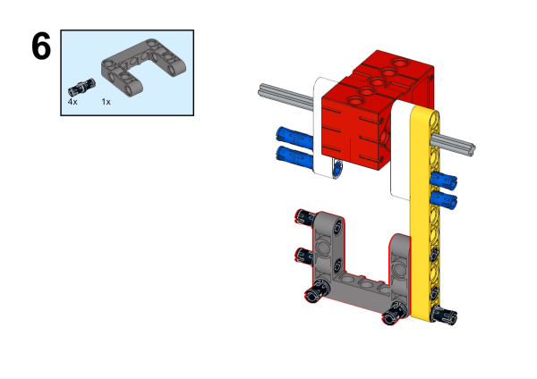

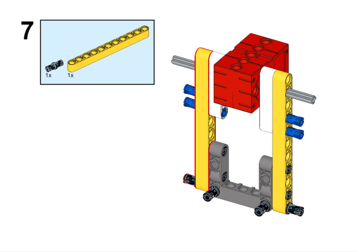

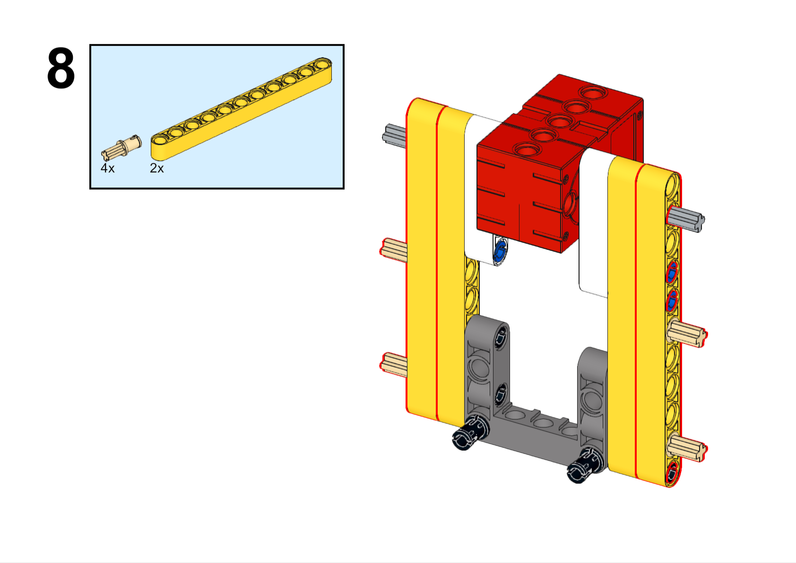

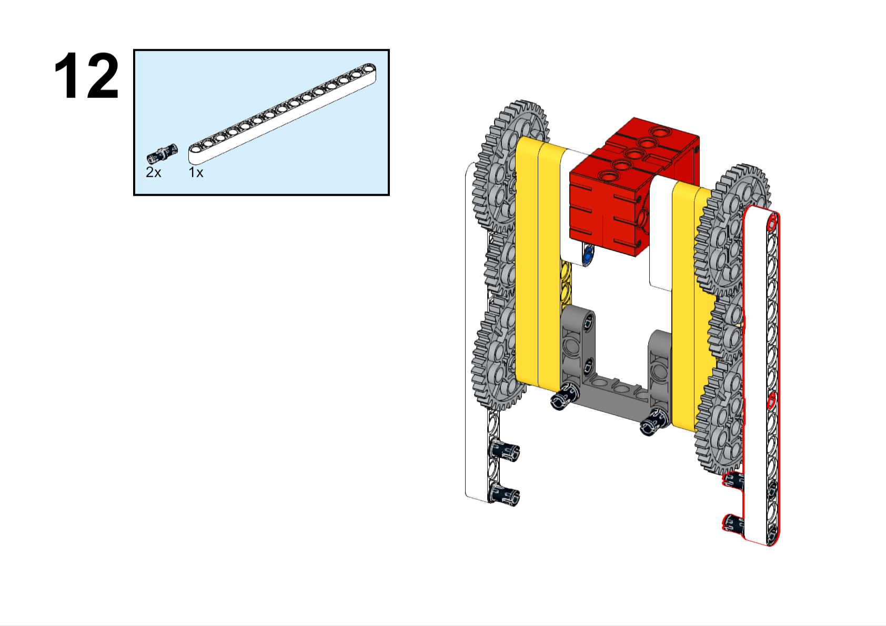

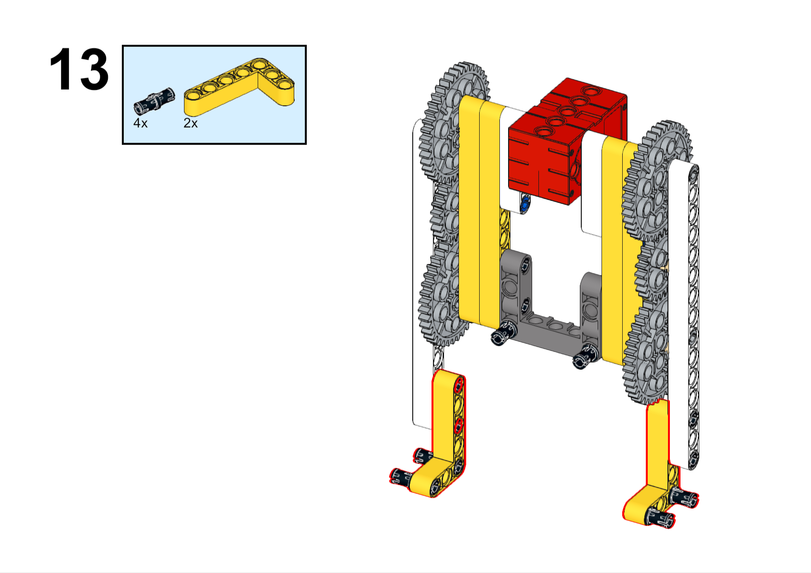

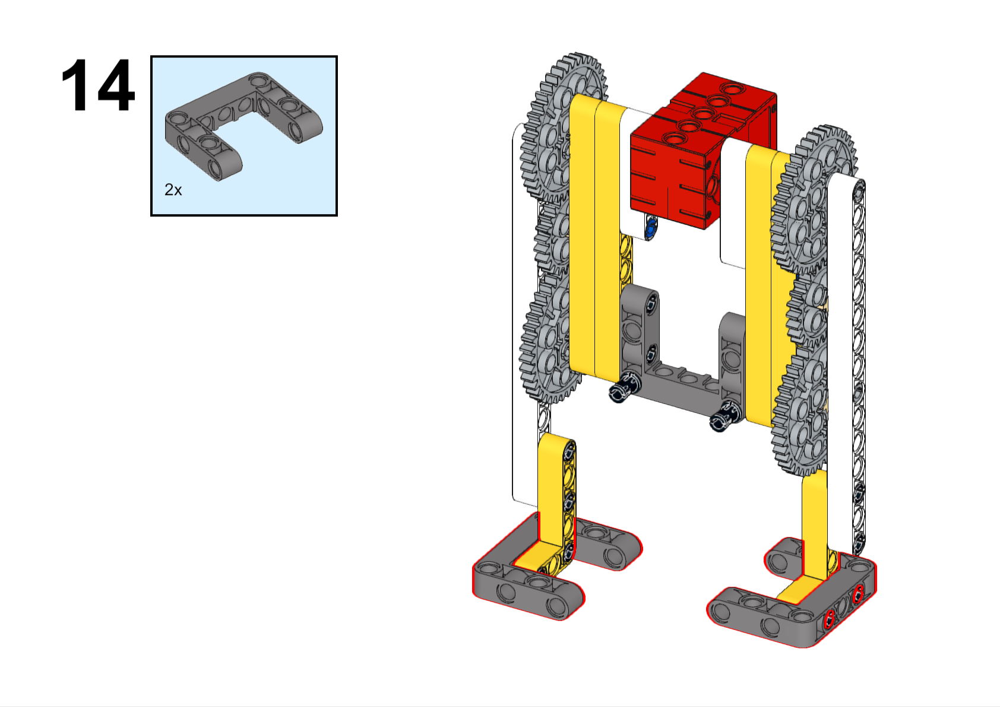

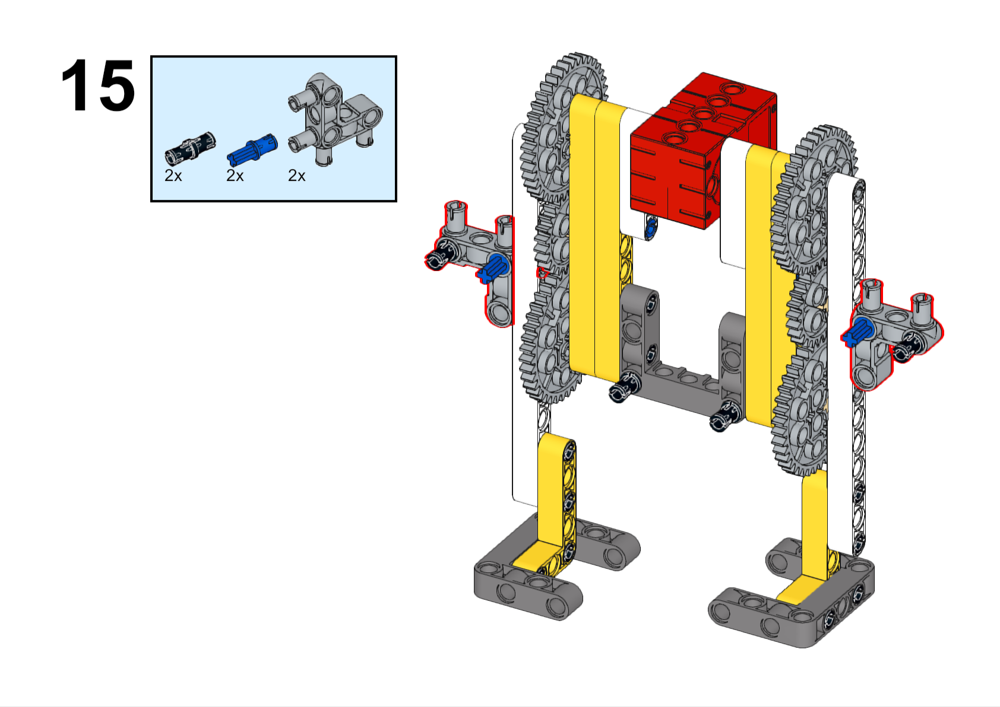

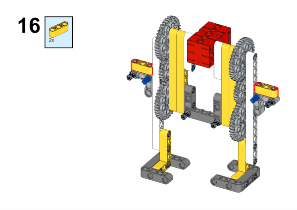

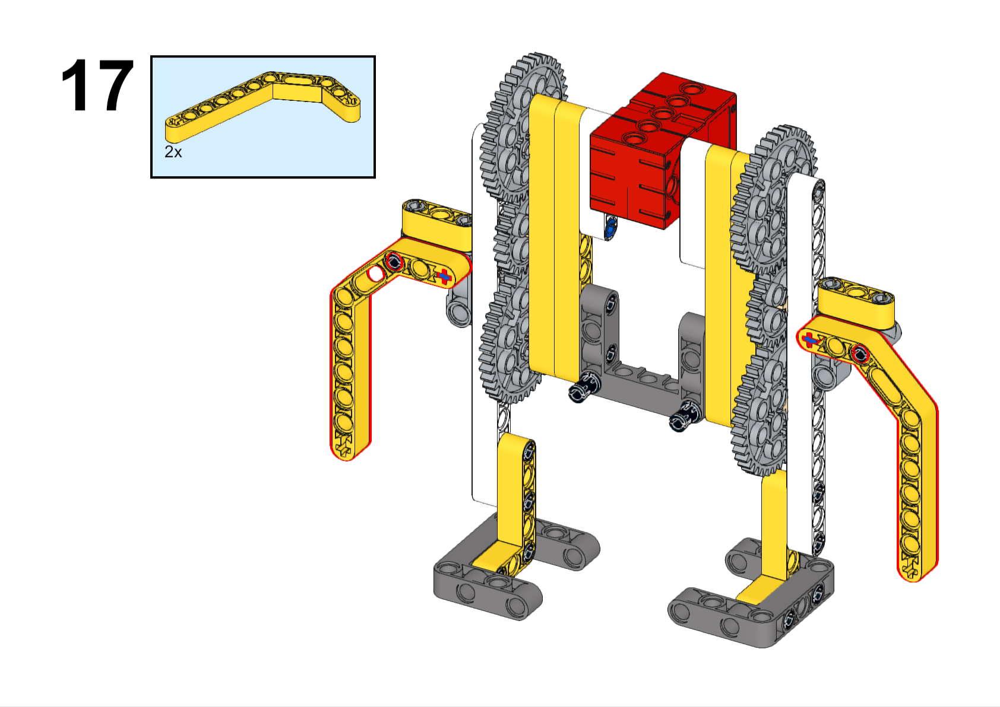

**Conmpleted**

##### Hardware Connections

Connect the motor to M1 port on Nezha expansion board. 

##### Programming

Go to [makecode](https://makecode.microbit.org/#)

Create new projects

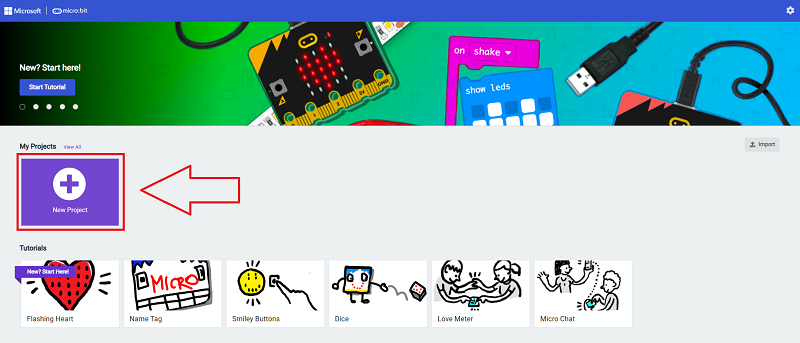

Click extensions

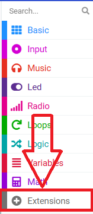

 Search with `nezha` and add the packages. 

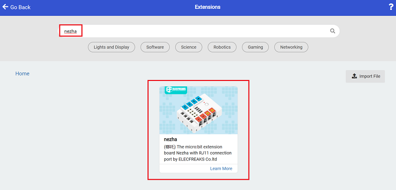

Code

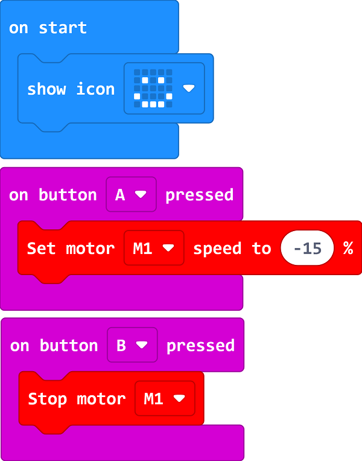

Link: [https://makecode.microbit.org/_UC0i2UieXEaW](https://makecode.microbit.org/_UC0i2UieXEaW)

You may download it directly below: 

    <iframe
        src="https://makecode.microbit.org/_UC0i2UieXEaW"
        frameborder="0"
        sandbox="allow-popups allow-forms allow-scripts allow-same-origin"
        style={{
            position: 'absolute',
            width: '100%',
            height: '100%',
        }}
    />

### Demonstration

>Present in groups and have the robots in each group start dancing together and compare the results and effectiveness of each group.

#### Result

Press the button A on the micro:bit to start the device and press button B to stop it. 

### Reflection

>Share in groups and request students in each group to share their production process and insights, summarise the problems and solutions they encountered, and evaluate their strengths and weaknesses.
