# Case 13 Dog Robot

## Introduction

Make a dog robot.

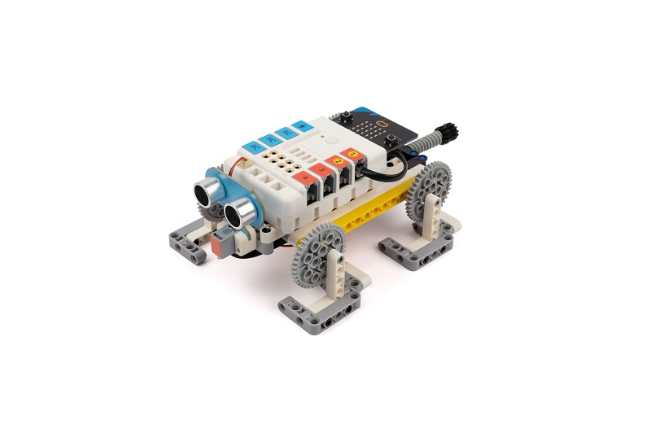

## Purchase Link

## Quick Start

### Build Step

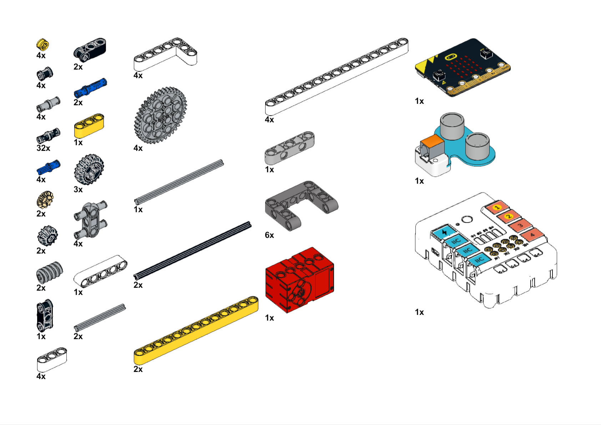

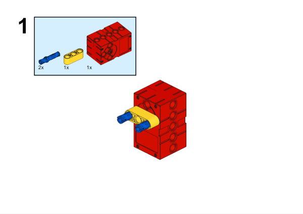

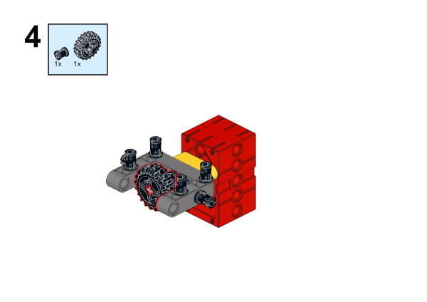

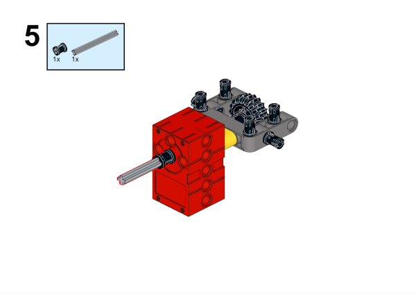

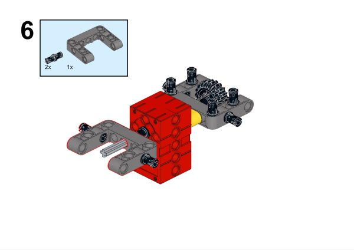

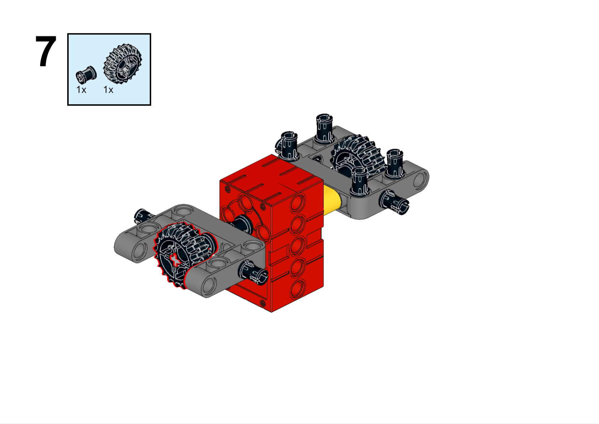

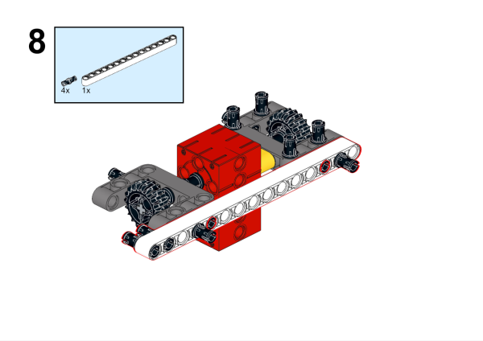

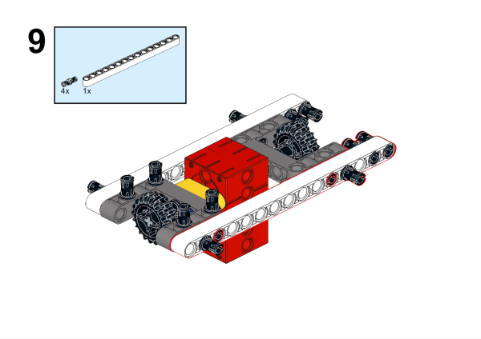

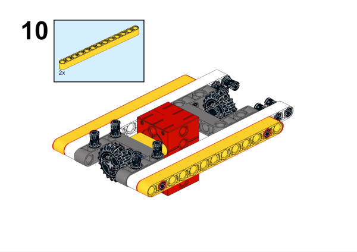

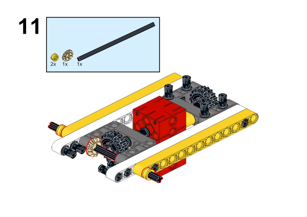

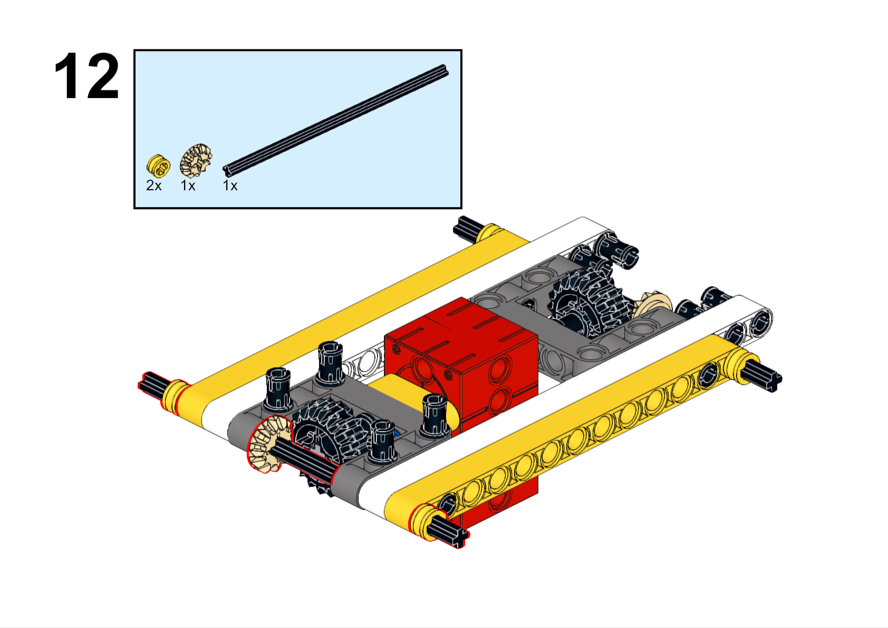

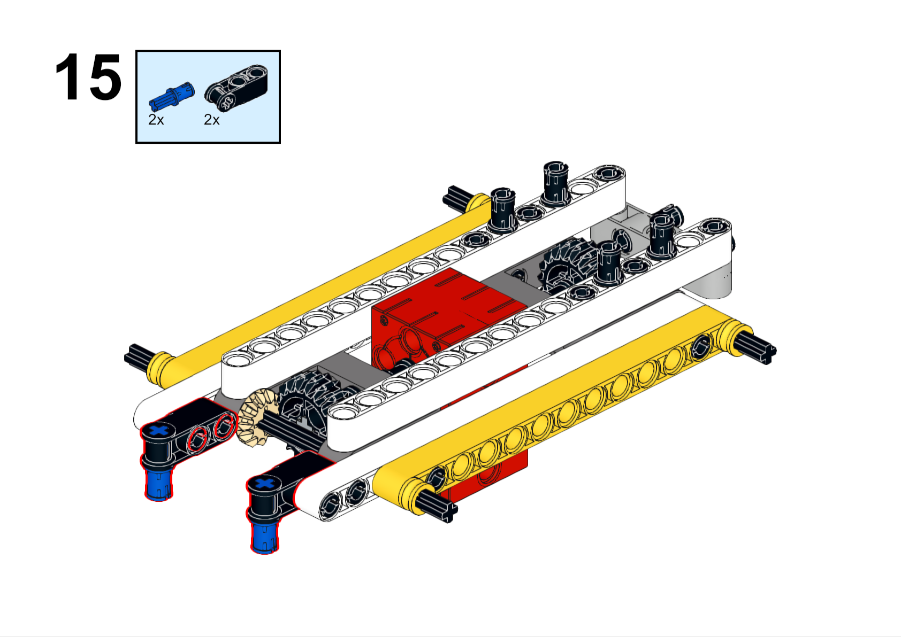

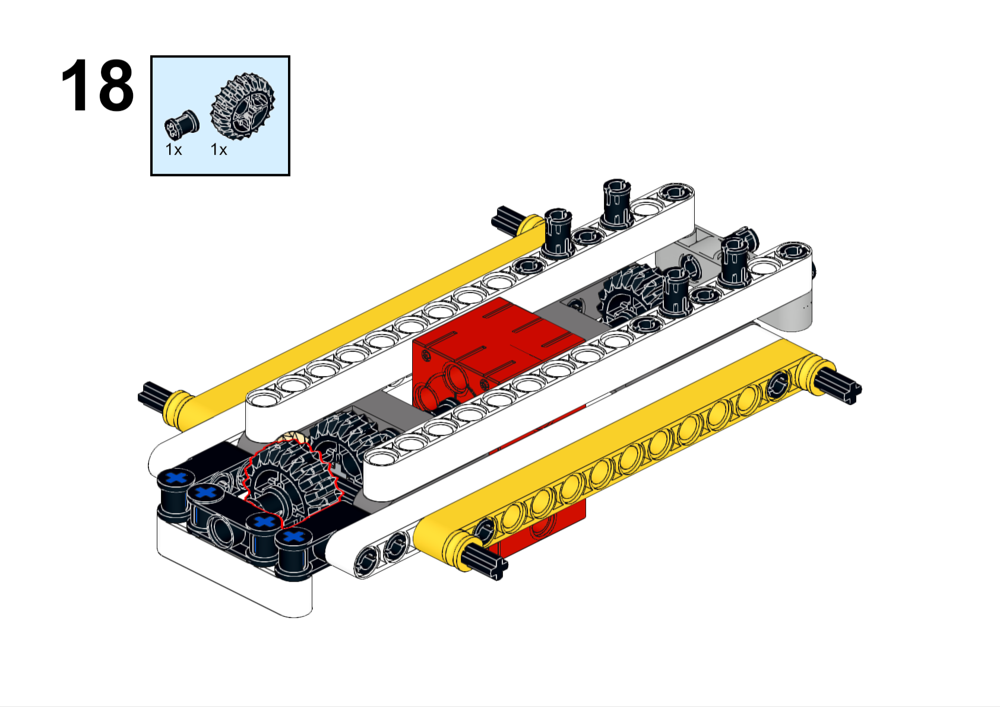

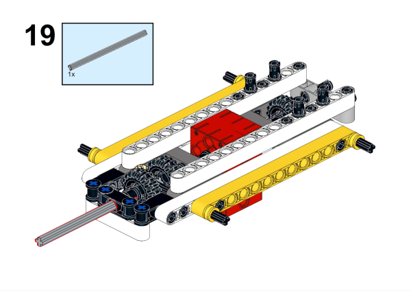

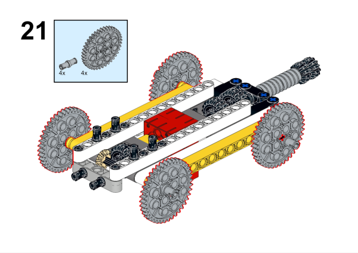

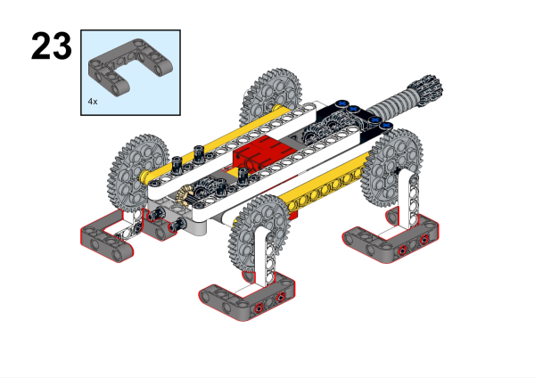

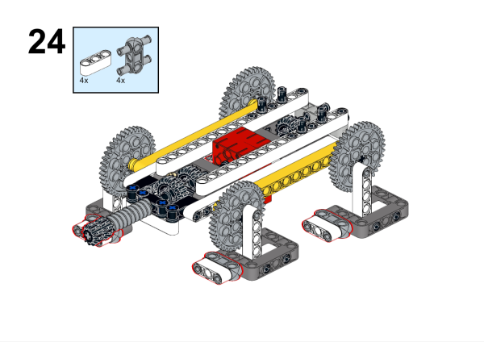

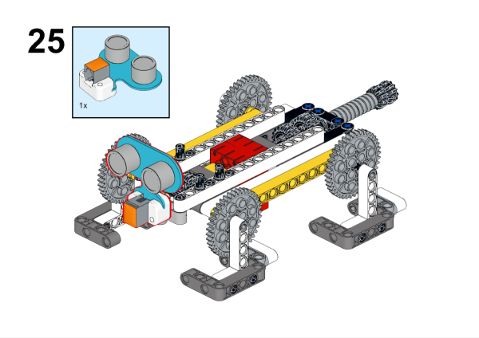

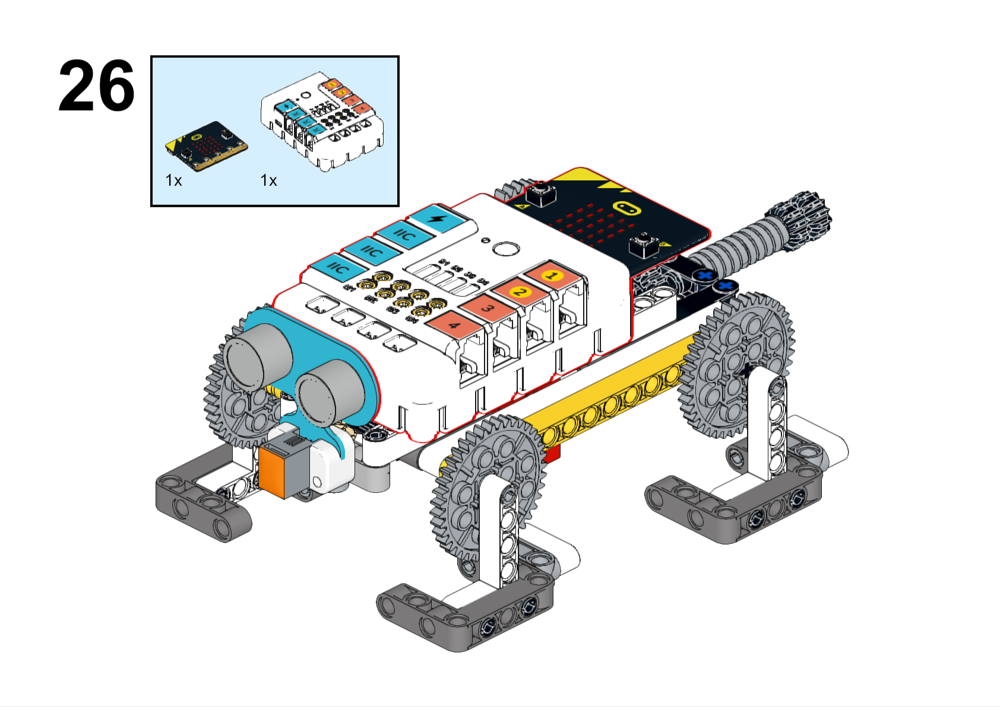

### Hardware Connection

The ultrasonic sound sensor is connected to the J1 interface, and the motor is connected to the M1 interface of the Nezha expansion board.

### Software Programming

Open programming platform:[makecode](https://makecode.microbit.org/#)

New Project

Click Extensions

Search `nezha` in the search bar to add the extension library of the Nezha expansion board.

Program

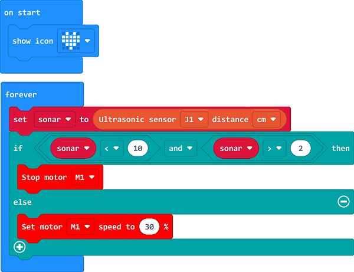

Link:[https://makecode.microbit.org/_YLpbA6EebiM9](https://makecode.microbit.org/_YLpbA6EebiM9)

You can also download the program directly from the page below.

    <iframe
        src="https://makecode.microbit.org/_YLpbA6EebiM9"
        frameborder="0"
        sandbox="allow-popups allow-forms allow-scripts allow-same-origin"
        style={{
            position: 'absolute',
            width: '100%',
            height: '100%',
        }}
    />

### Result

The mechanical puppy walks forward and stops automatically when encountering obstacles.

