# Case 24 The Excavator

## Introduction

An excavator is a powerful construction vehicle that enables a great deal of excavation and handling work. In this course, we will learn about worm gears and build a simple model of an excavation vehicle by using the Nezha Inventor's Kit V2. We will explore the principles and applications of the worm gear drive and learn how it works in an excavation vehicle.

##  Teaching Objectives

- Learn about the basic principles and applications of worm gear drives.
- Learn how to build a simple model of an excavator using the Nezha Inventor's Kit V2.
- Design and build a suitable worm gear transmission to implement the mechanical jaws of the excavator for gripping function.
- Develop teamwork, problem solving and creative thinking skills.

## Teaching Preparation

[Nezha Inventor's Kit V2](https://www.elecfreaks.com/nezha-inventor-s-kit-v2-for-micro-bit.html)

## Teaching Process

### Introduce

>Introduce students to the background and objectives of the excavation vehicle production to stimulate their interest and curiosity.

Is everyone interested in excavation vehicles? An excavator is a powerful and versatile construction vehicle. In this lesson, we will learn together how to make a fun excavation vehicle using the Nezha Inventor's Kit V2 and we will cover an important point - the worm gear drive.

A worm gear drive is a very common form of mechanical transmission that converts rotary motion into linear motion. Would you like to know how it works?

### Exploration

> Discuss in groups and ask students to think about how to build a digging truck using building block materials.

- How can the mechanical jaws of an excavator be made to grip using a worm gear drive?
- Why would you use a worm gear drive to make the mechanical jaws and what are the benefits of doing so?

### Practices

> Work in groups to create a digging truck from building blocks according to your own design.

Build a digging truck from building blocks according to your own design.

#### Examples

##### Assembly Steps

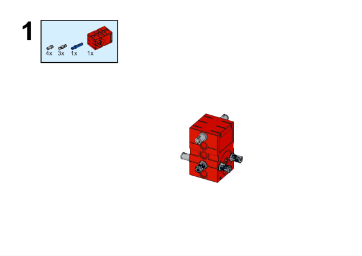

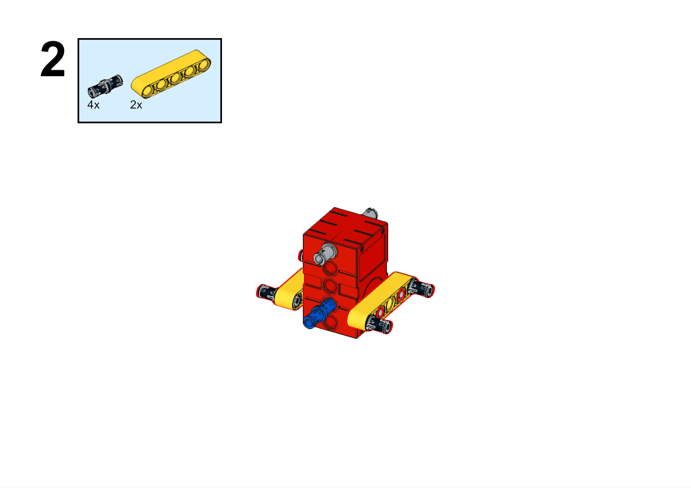

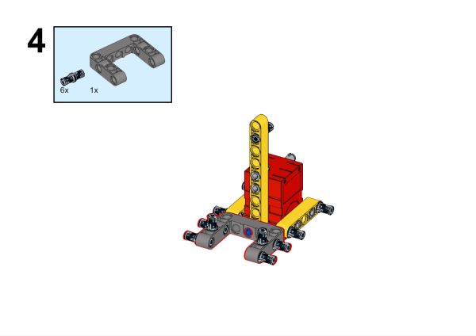

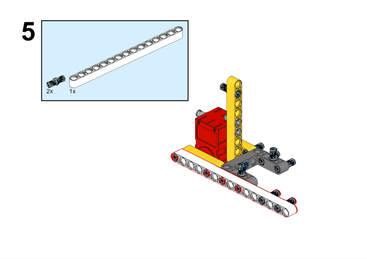

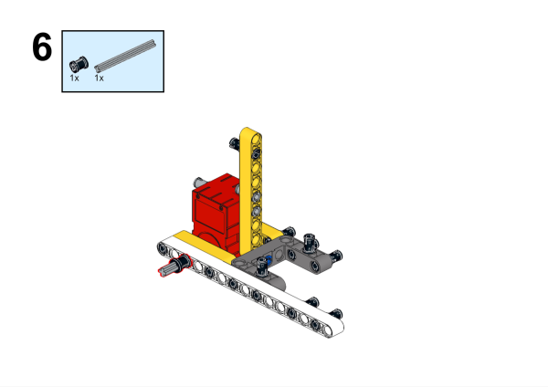

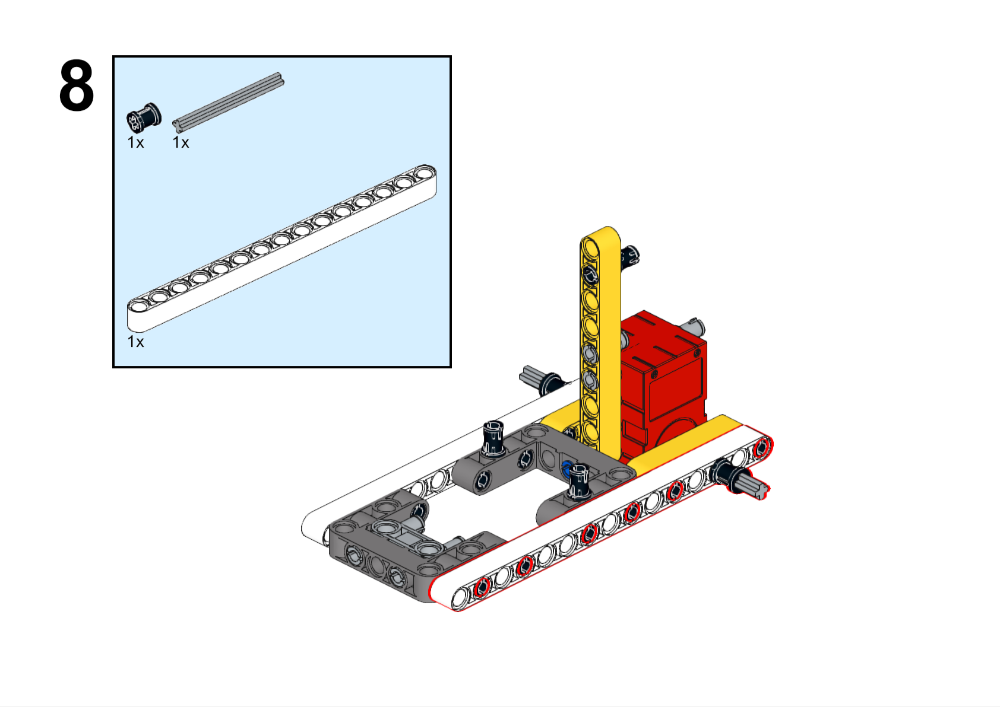

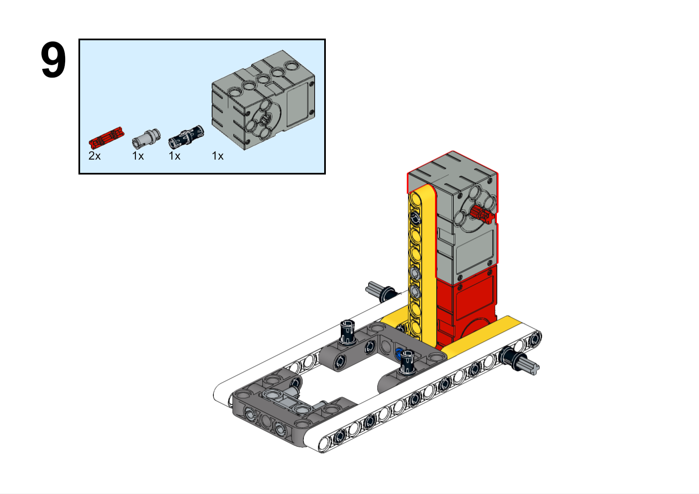

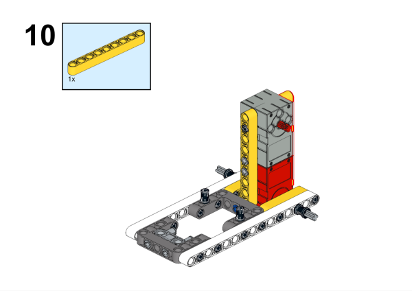

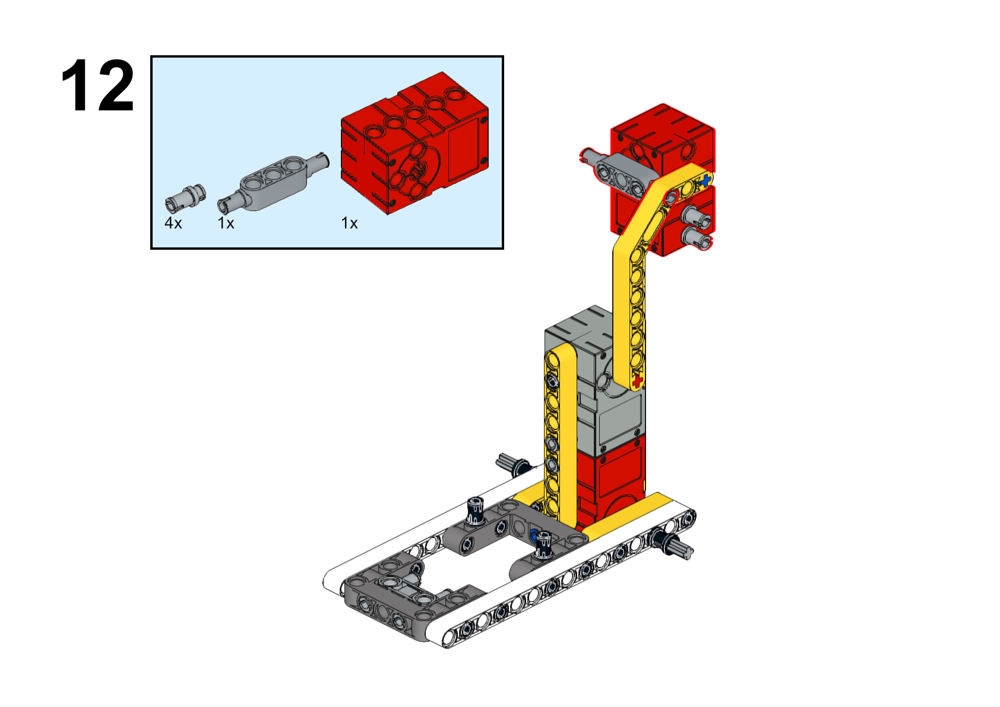

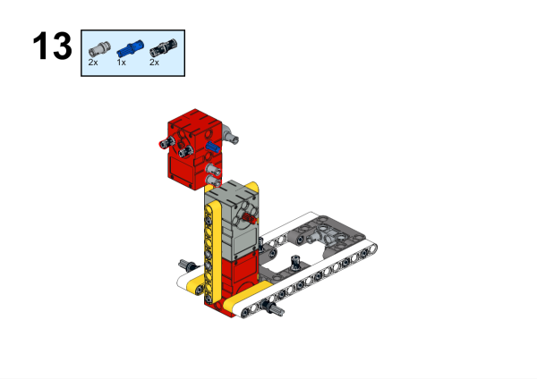

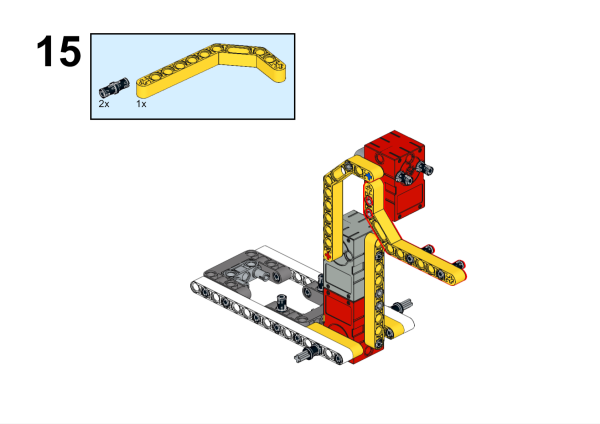

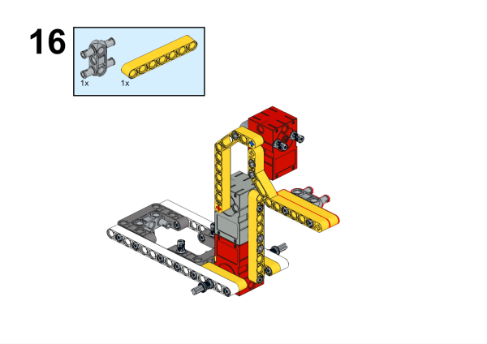

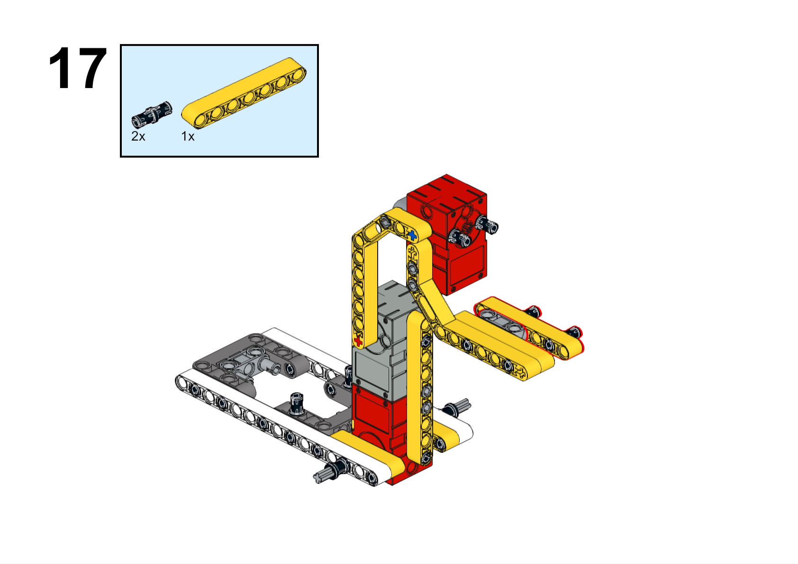

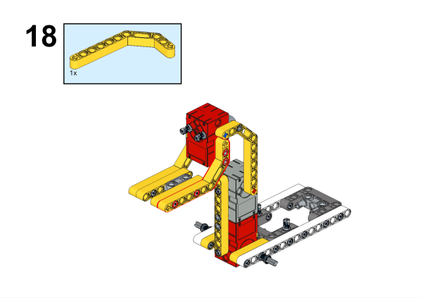

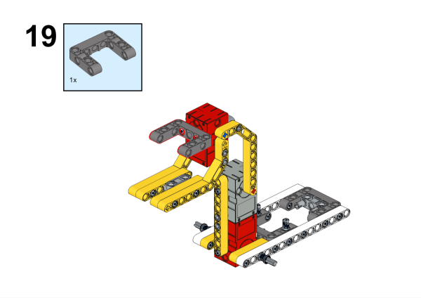

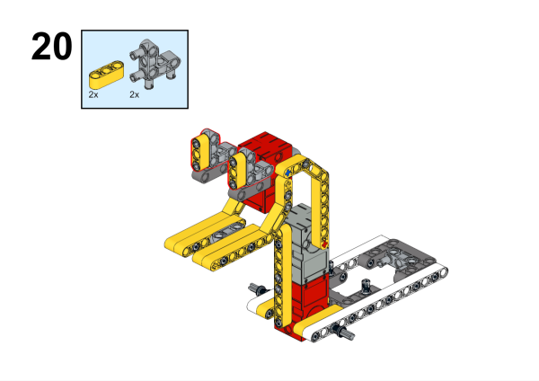

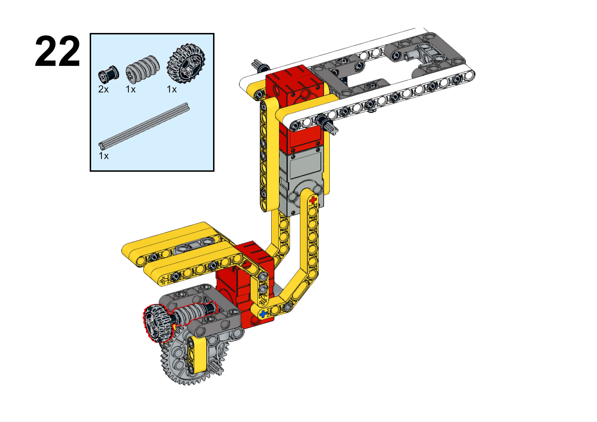

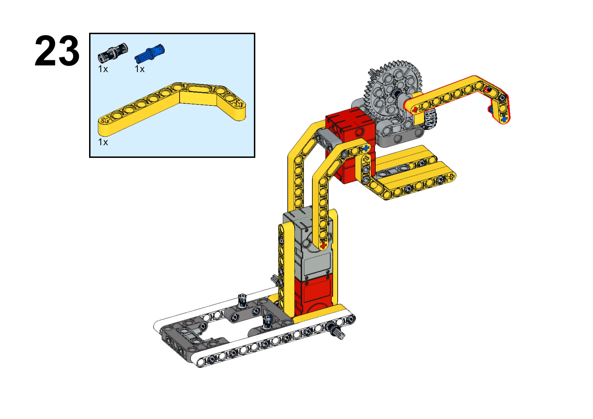

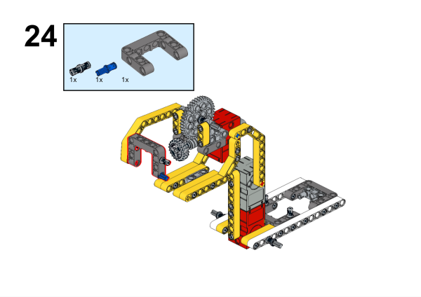

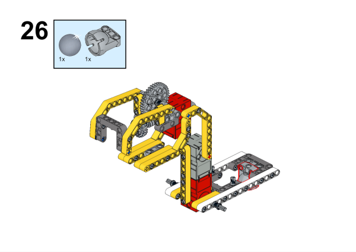

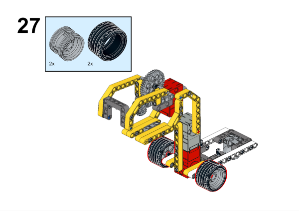

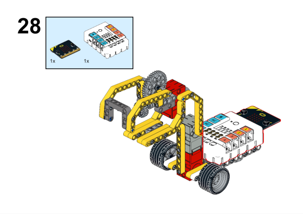

**Completed**

##### Hardware Connections

Connect the motors to M1, M2 and the servo to S1 on Nezha expansion board. 

##### Programming

Go to [makecode](https://makecode.microbit.org/#)

Create new projects

Click extensions

Search with `nezha` to download the package. 

Code

Link: [https://makecode.microbit.org/_K3bixaLt5fWw](https://makecode.microbit.org/_K3bixaLt5fWw)

You may download it directly below:

    <iframe
        src="https://makecode.microbit.org/_K3bixaLt5fWw"
        frameborder="0"
        sandbox="allow-popups allow-forms allow-scripts allow-same-origin"
        style={{
            position: 'absolute',
            width: '100%',
            height: '100%',
        }}
    />

### Demonstration

>Present in groups and compare the results and effectiveness of each group.

#### Result

Press the A button on the micro:bit to move the excavator forward and grab the object.

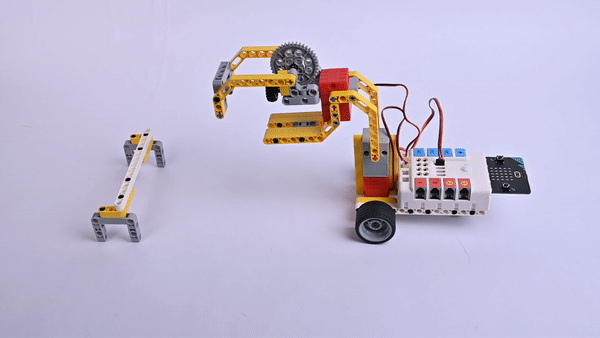

### Reflection

>Share in groups so that students in each group can share their production process and insights, summarise the problems and solutions they encountered, and evaluate their strengths and weaknesses.
