# Case 29 The Flying Car

## Introduction

Make a small car with wings.

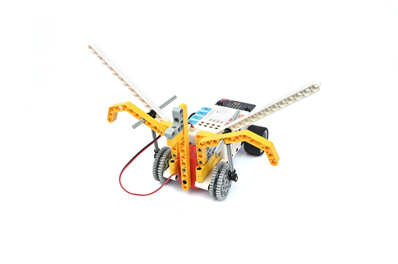

## Purchase Link

Quick Start

### Build Steps

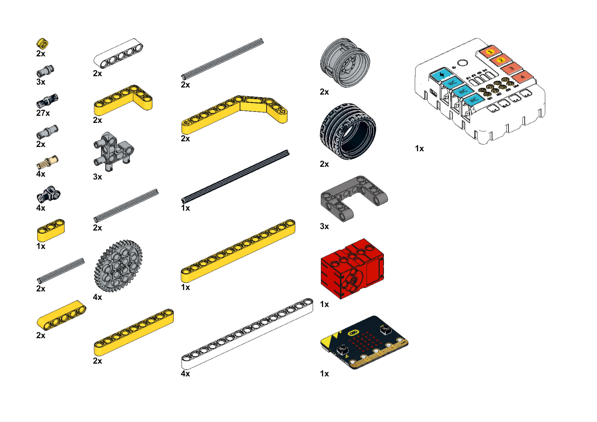

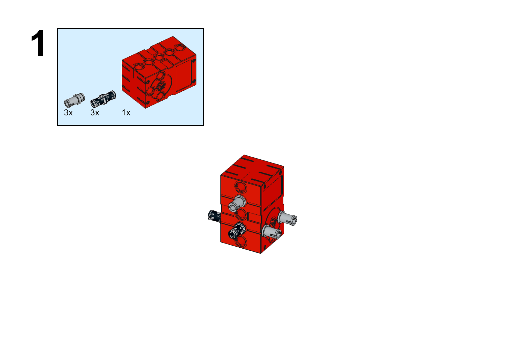

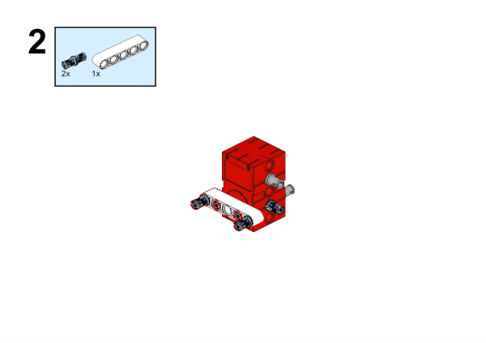

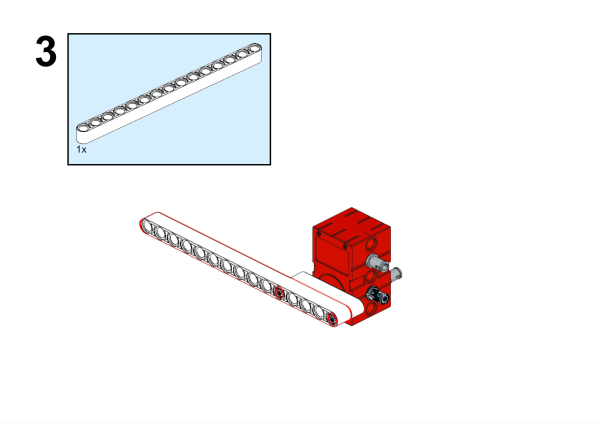

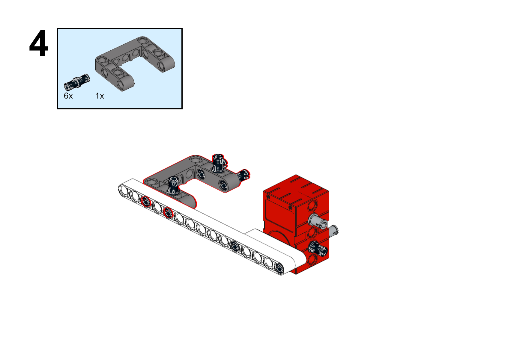

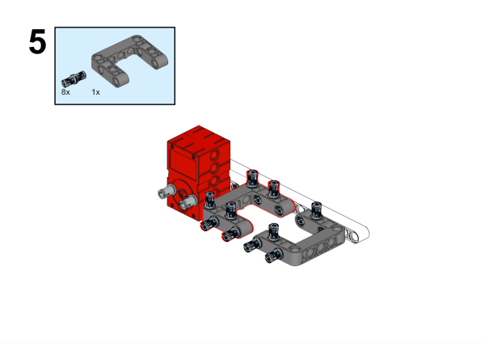

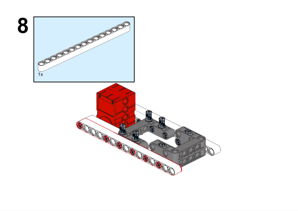

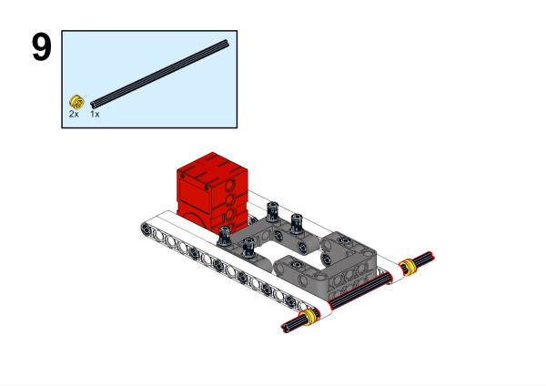

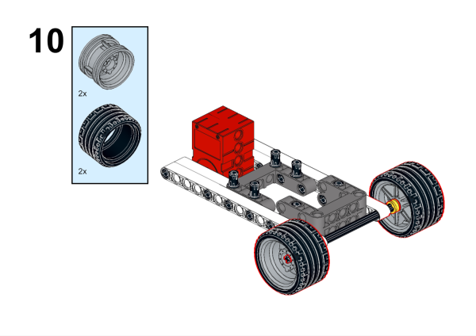

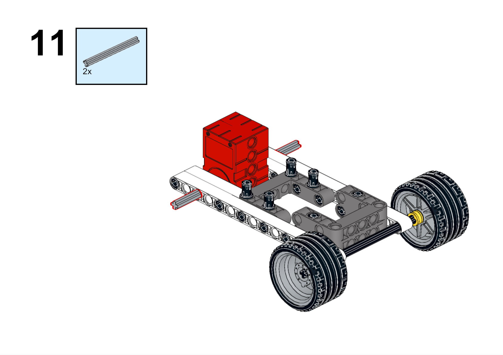

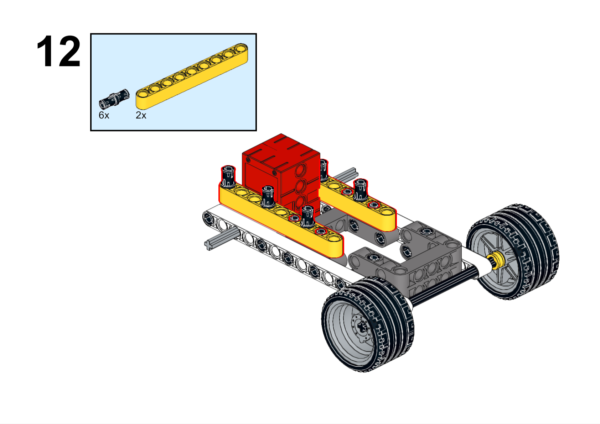

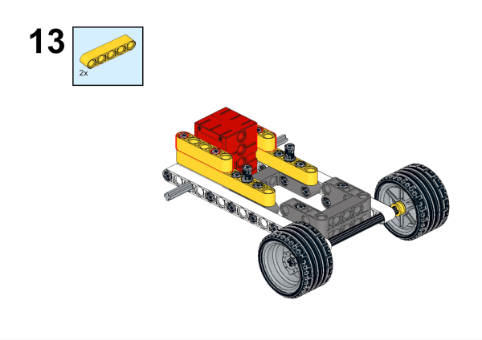

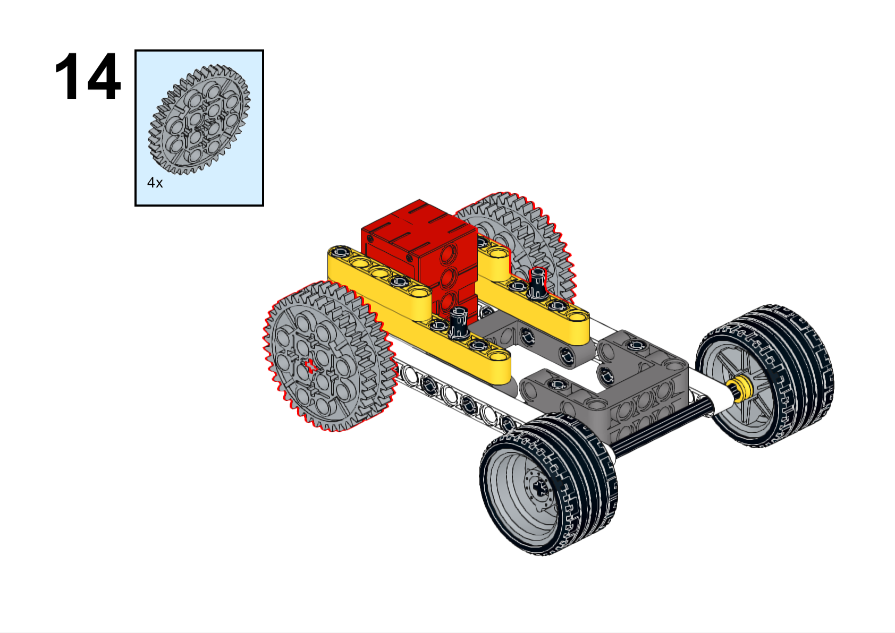

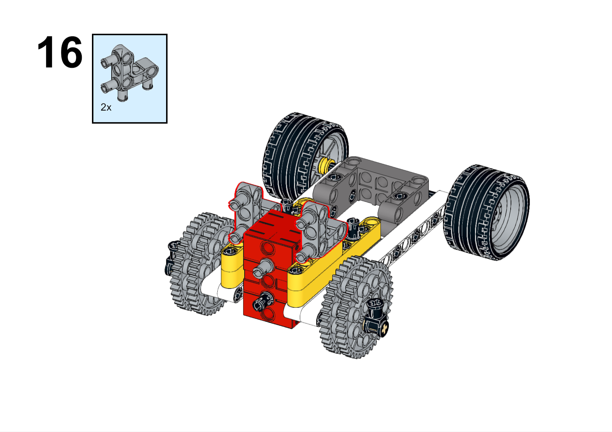

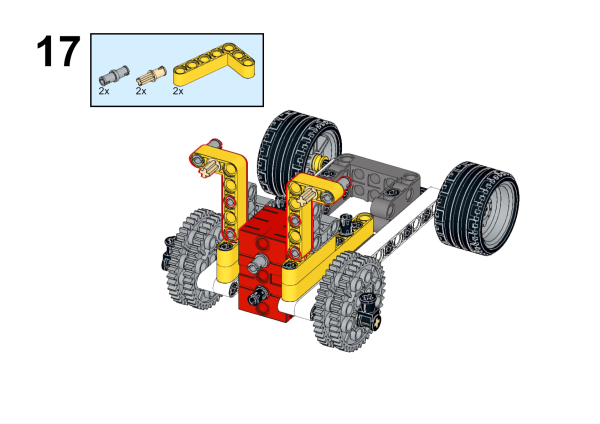

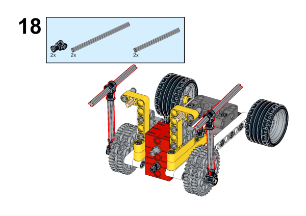

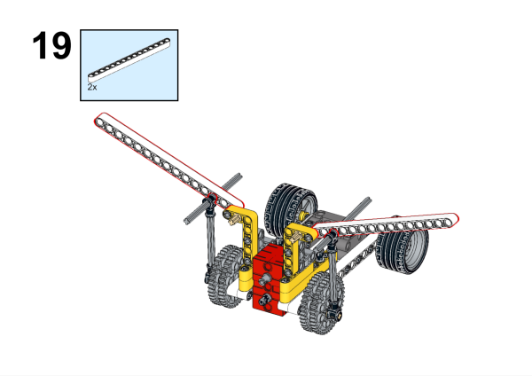

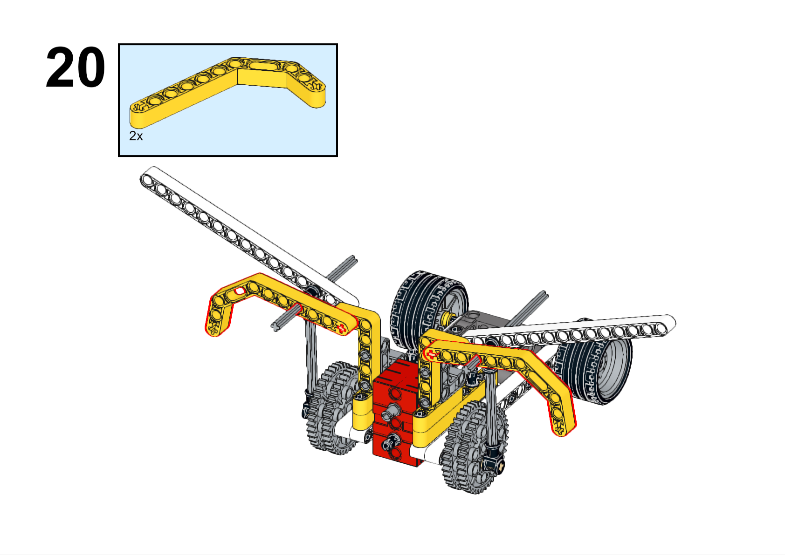

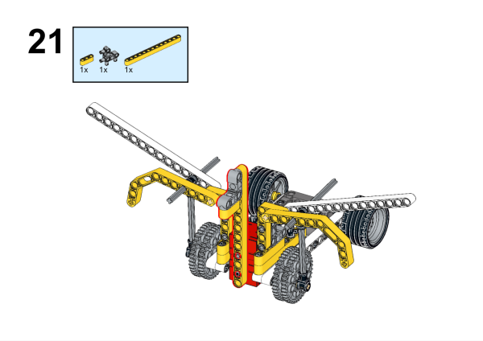

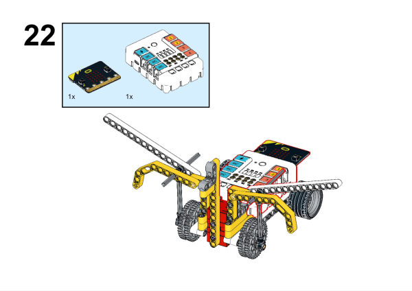

### Hardware Connection

Connect the motor to the M1 interface of the Nezha expansion board.

### Software Connection

Open the programming platform: [makecode](https://makecode.microbit.org/#)

New Project

Click Extensions

Search `nezha` in the search bar to add the expansion library for Nezha expansion boards

Program

Link:[https://makecode.microbit.org/_Fh5DJ67LjEKA](https://makecode.microbit.org/_Fh5DJ67LjEKA)

You can also download the program directly from the pages below.

    <iframe
        src="https://makecode.microbit.org/_Fh5DJ67LjEKA"
        frameborder="0"
        sandbox="allow-popups allow-forms allow-scripts allow-same-origin"
        style={{
            position: 'absolute',
            width: '100%',
            height: '100%',
        }}
    />

### Result

Press the A button on the micro:bit, the cart moves forward while stirring its wings, press the B button on the micro:bit, the cart stops moving.

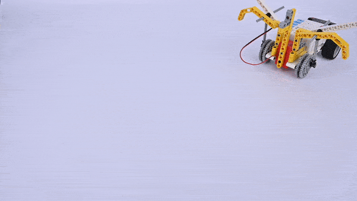
