# Case 05 The Kaleidoscope Robot

## Introduction

Make a kaleidoscope robot that can draw.

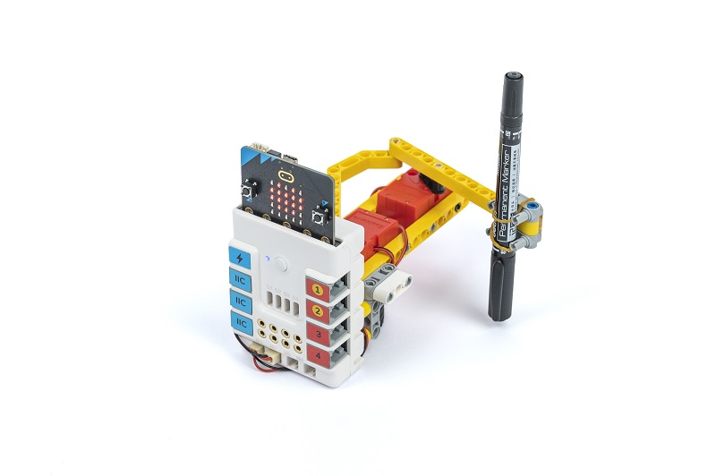

## Purchase Link

## Quick Start

### Build Steps

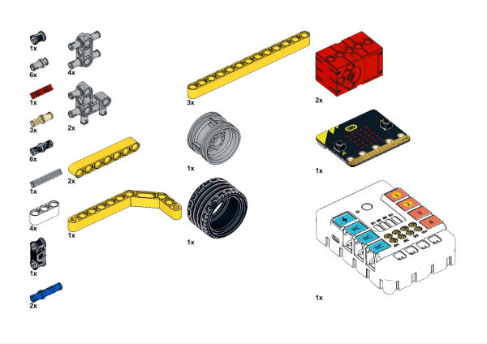

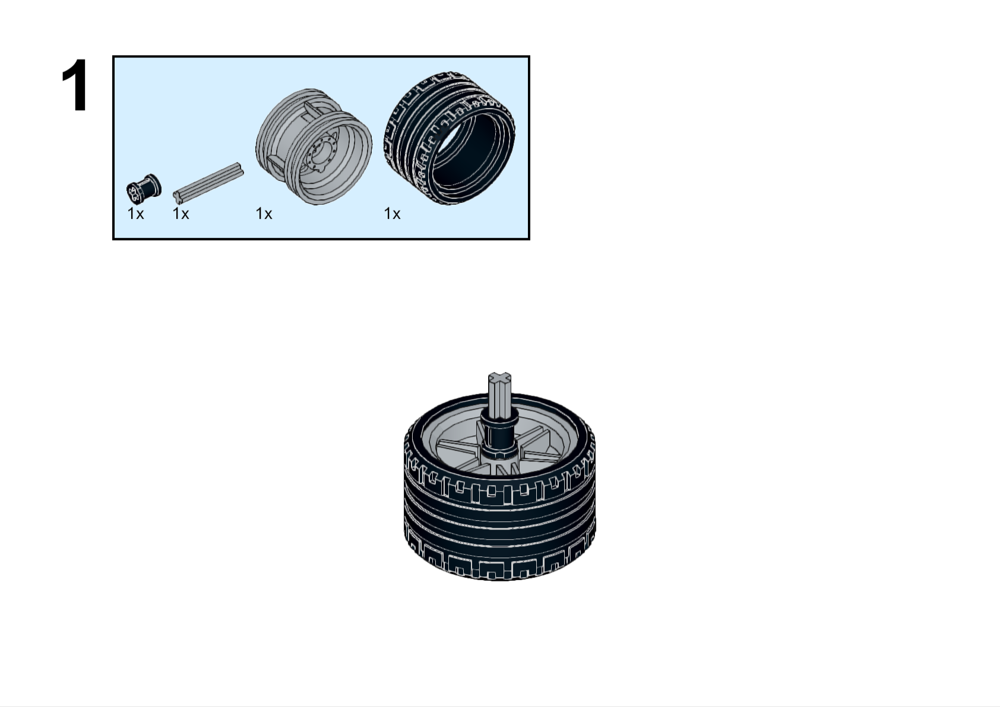

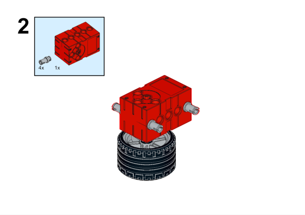

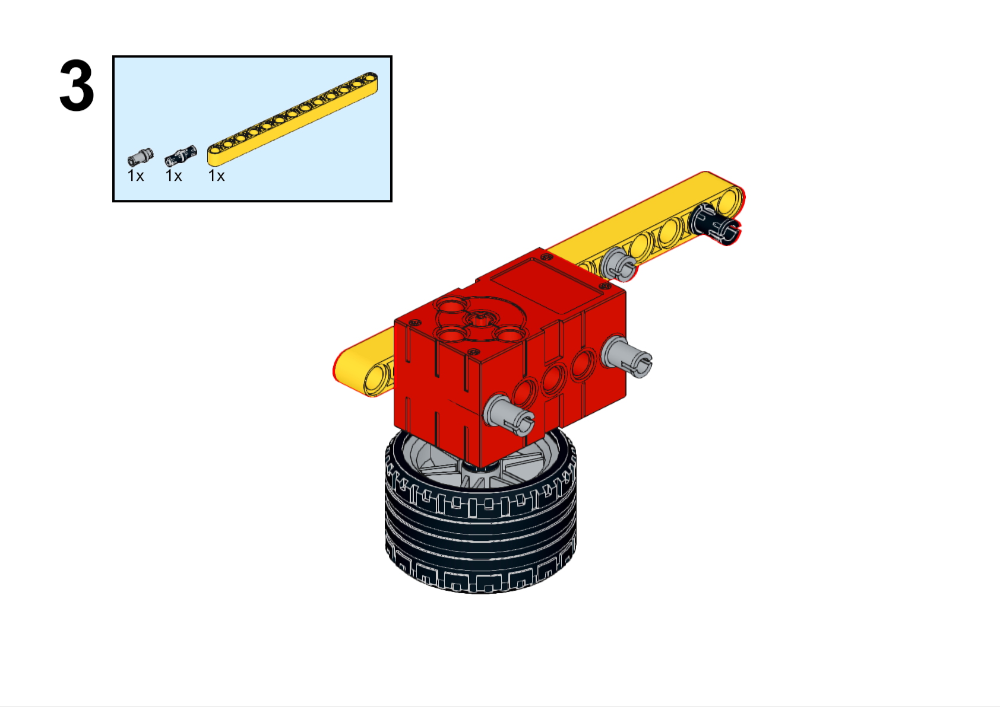

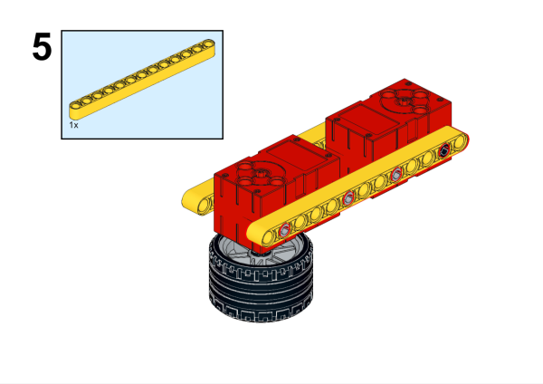

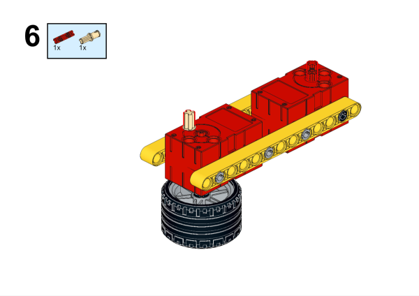

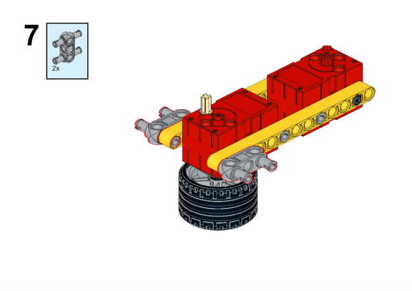

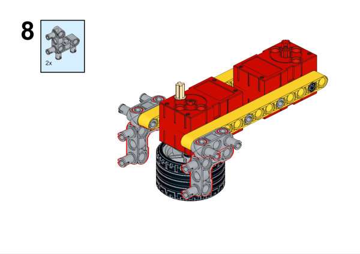

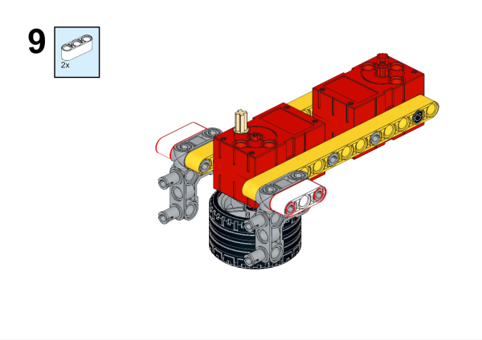

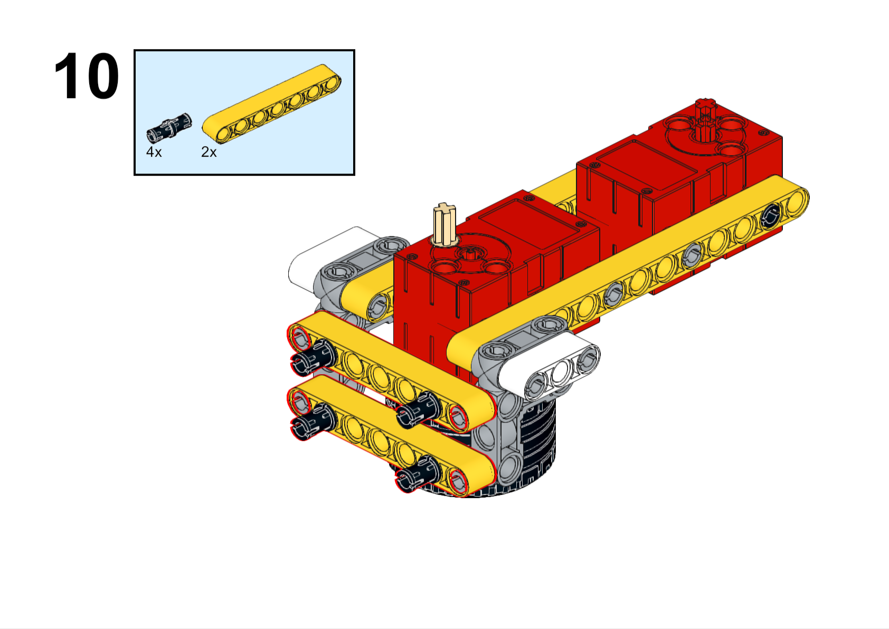

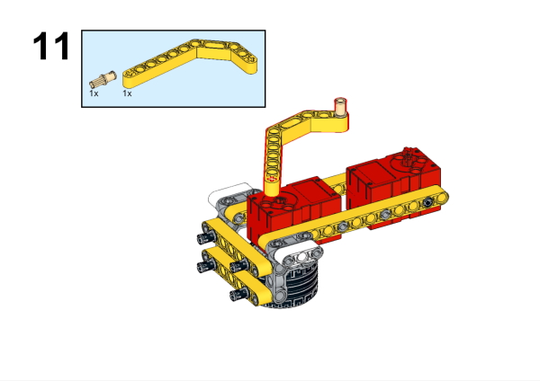

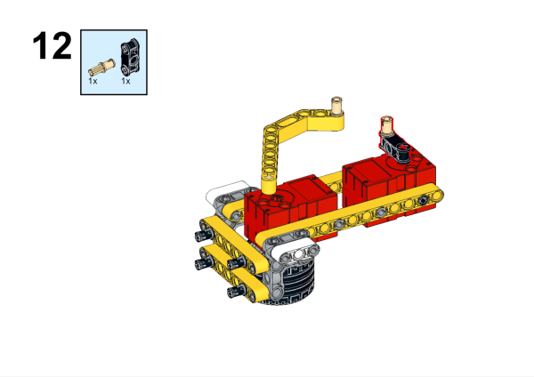

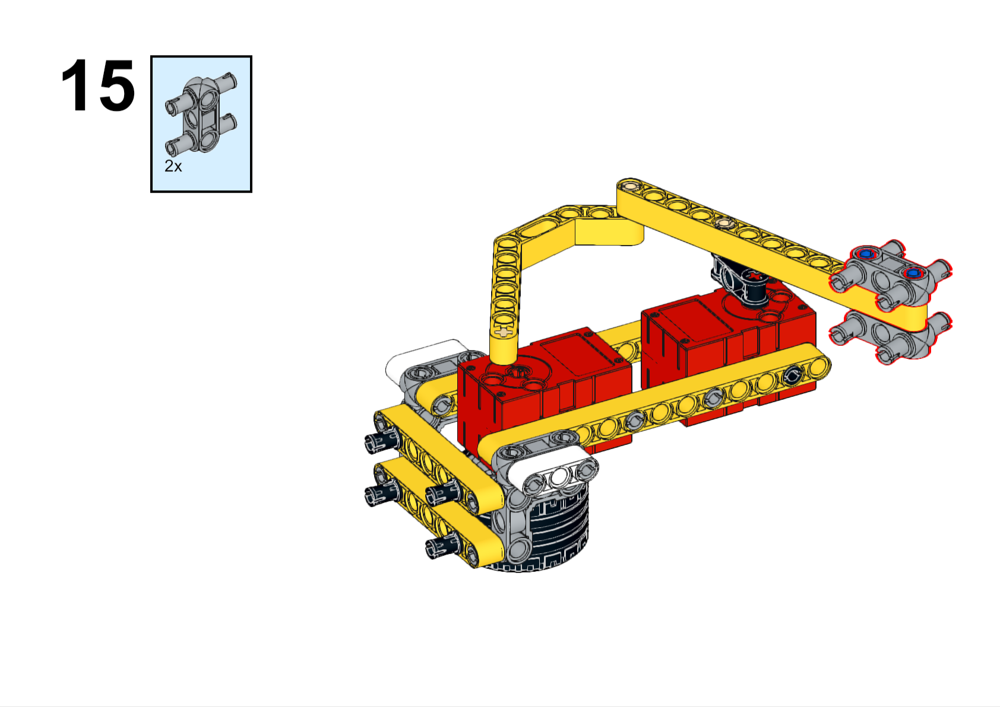

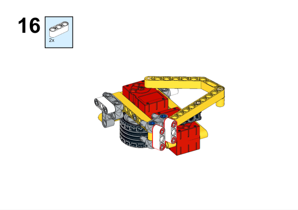

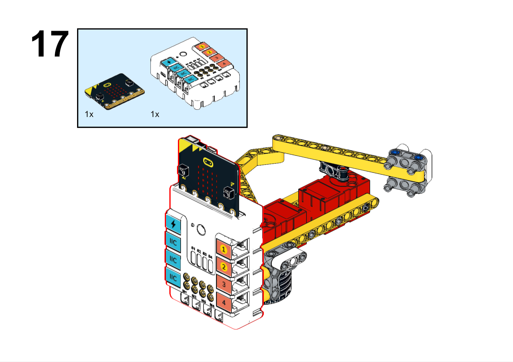

### Hardware Connection

Connect the motors to the M1 and M2 interface of the Nezha expansion board.

### Software Programming

Open programming platform: [makecode](https://makecode.microbit.org/#)

New Project

Click Extension

Search `nezha` in the search bar to add the expansion library for Nezha expansion boards

Program

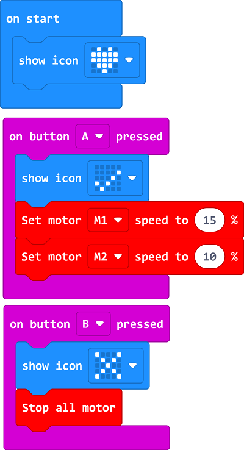

Link:[https://makecode.microbit.org/_6XtEUqLd3UFL](https://makecode.microbit.org/_6XtEUqLd3UFL)

You can also download the program directly from the following pages.

    <iframe
        src="https://makecode.microbit.org/_6XtEUqLd3UFL"
        frameborder="0"
        sandbox="allow-popups allow-forms allow-scripts allow-same-origin"
        style={{
            position: 'absolute',
            width: '100%',
            height: '100%',
        }}
    />

### Result

Press A on the micro:bit to start the robot drawing, and press B on the micro:bit to stop the robot drawing.

