# Case 10 The Mechanical Crawler

## Introduction

Caterpillars are small insect larvae which usually have soft and hairy bodies. Caterpillars are the larval stage of insects such as butterflies and moths, in which they prepare to become adults by feeding and growing. The caterpillar's body consists of a number of segments, each with a pair of legs through which they crawl.

Caterpillars crawl by wriggling through their bodies. Their legs move alternately, thus propelling the body forward. This way of crawling allows the caterpillar to crawl freely on a variety of surfaces such as leaves, branches and the ground.

We will use the Nezha Inventor's Kit V2 to create a mechanical crawler that mimics the way a caterpillar moves.

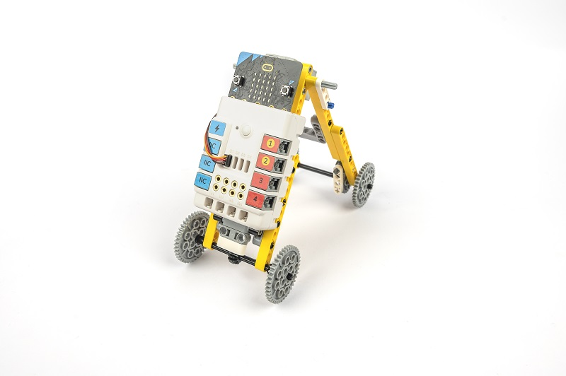

## Teaching Objectives

- Learn about the basic components and functions of the Nezha Inventor's kit V2.
- Learn how to use the tiller to control the movement of the mechanical crawler.
- Explore the characteristics and movement of caterpillar crawling.
- Develop creativity, problem-solving skills and teamwork ability.

## Teaching Objectives

[Nezha Inventor's kit V2](https://www.elecfreaks.com/nezha-inventor-s-kit-v2-for-micro-bit.html)

## Teaching Process

### Introduce

>Introduce students to the background and objectives of mechanical crawler making to stimulate their interest and curiosity.

We will enter a world of excitement and fun exploration as we learn together how to make a mechanical crawler that mimics the crawling of a caterpillar using the Nezha Inventor's Kit V2. In this project, we will learn how to use our knowledge of science and engineering to control the movement of the mechanical crawler using a tiller. Let's explore the process of making this exciting robot!

### Exploration

>Discuss in small groups and get students thinking about how they can make a mechanical crawler out of block materials.

- How is the crawling movement of the caterpillar achieved? What are their characteristics and patterns?
- How can the tiller be used to control the movement of the mechanical crawler so that it mimics the crawling movements of a caterpillar?
- How can the angle and speed of the rudder be adjusted to make the crawling movements of the mechanical crawlers more realistic?
- How can the balance and stability of the mechanical crawlers be achieved through rational design and adjustment?

### Practice

>Work in groups to create a mechanical reptile out of building blocks according to your own design.

Create a mechanical reptile out of blocks according to your own design.

#### Examples

##### Assembly Steps
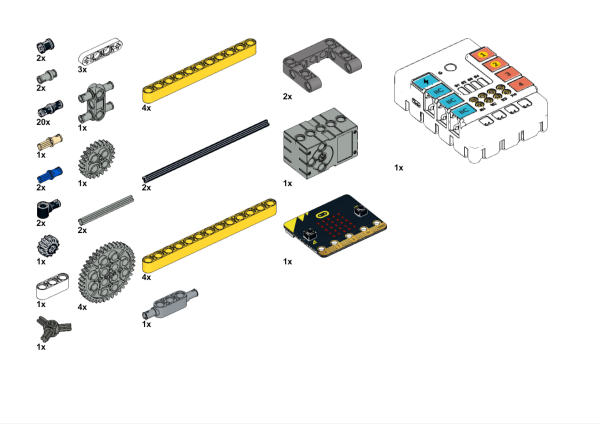

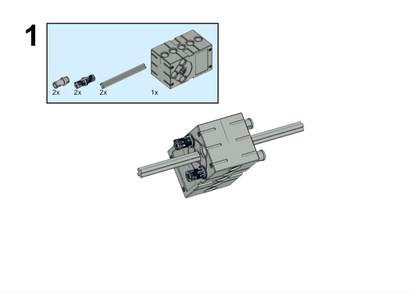

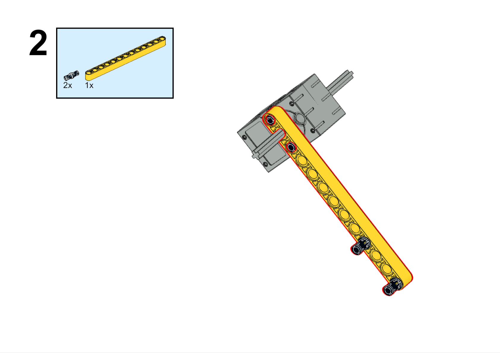

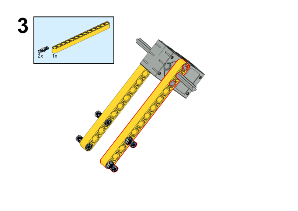

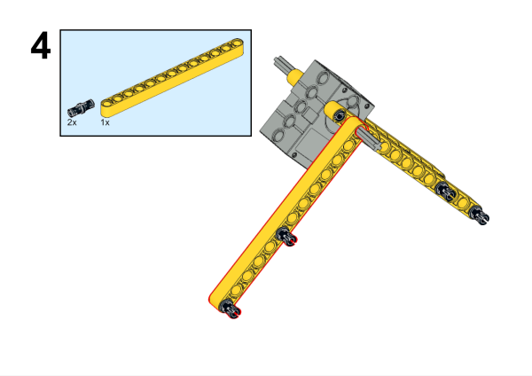

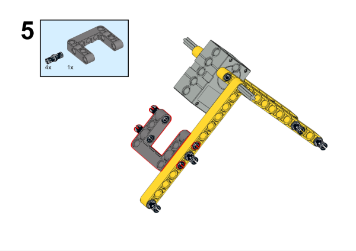

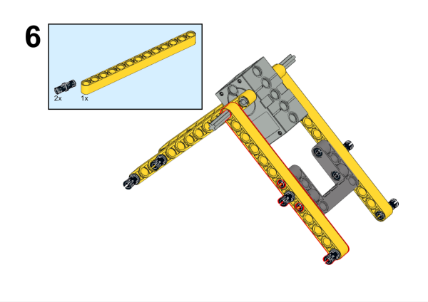

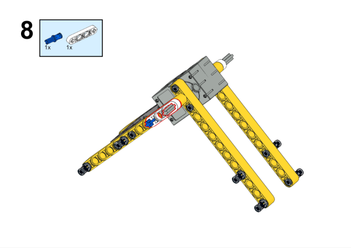

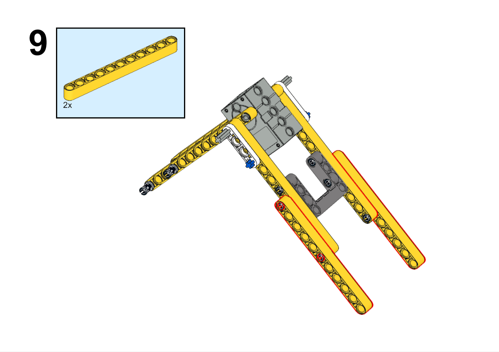

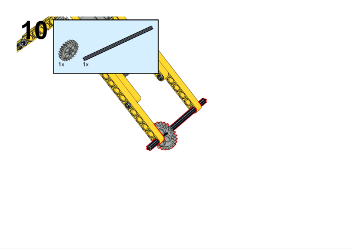

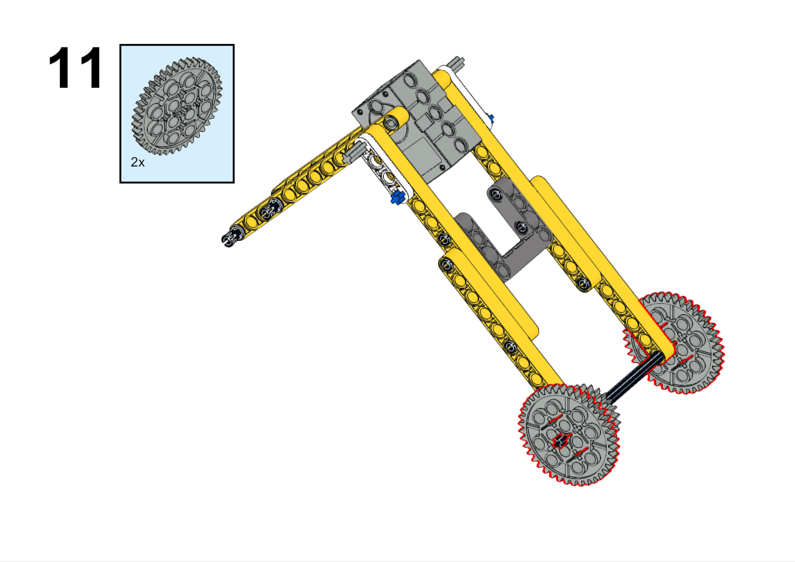

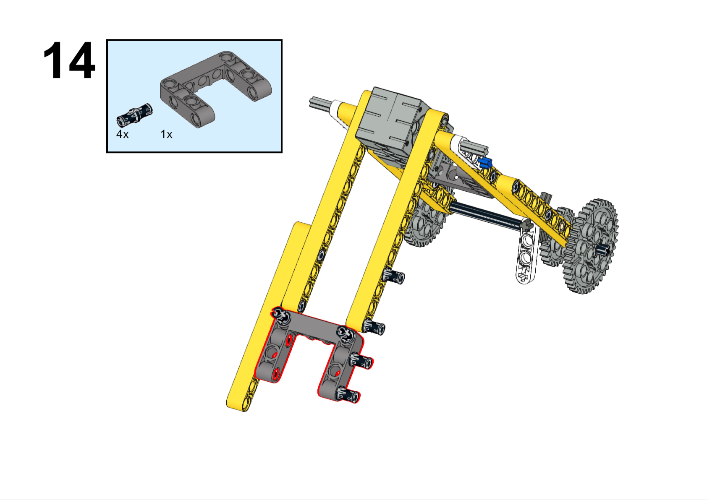

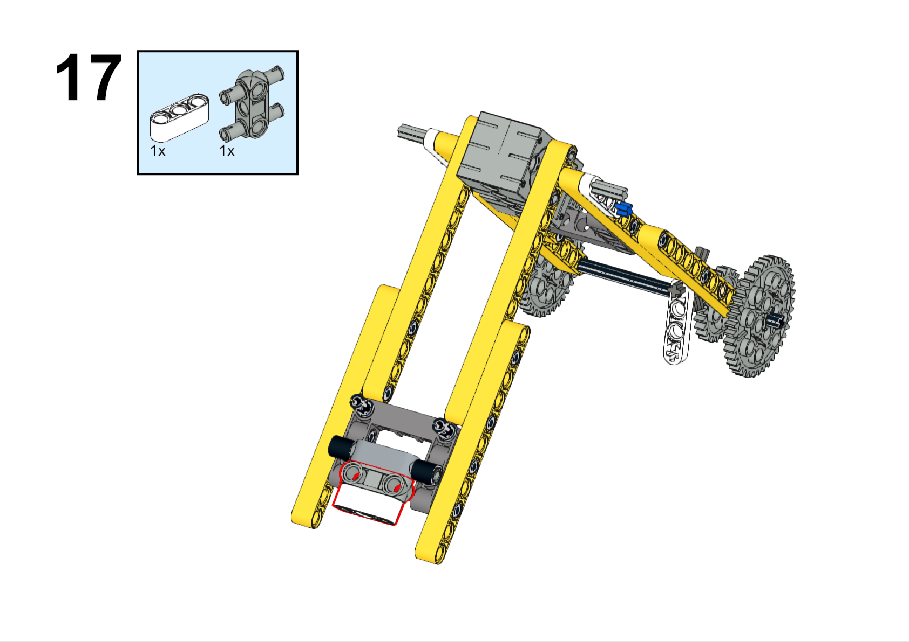

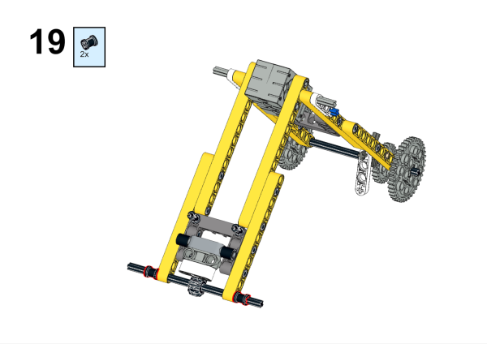

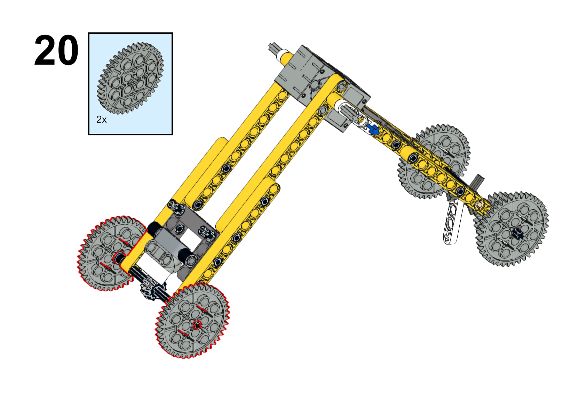

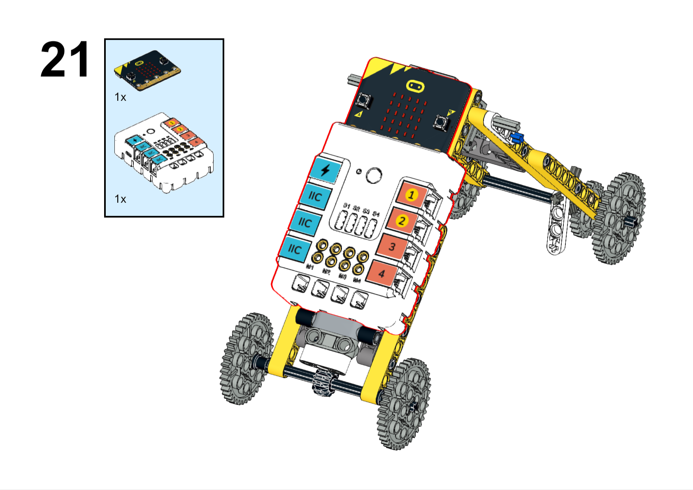

**Completed**

##### Hardware Connections

Connect the servo to S1 port on Nezha expansion board. 

##### Programming

Go to [makecode](https://makecode.microbit.org/#)

Create new project

Click extensions

Search with `nezha` to download the package. 

Code

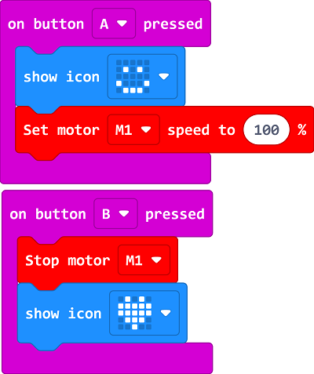

Link:[https://makecode.microbit.org/_i3CacvKkc40L](https://makecode.microbit.org/_i3CacvKkc40L)

You may download it directly below: 

    <iframe
        src="https://makecode.microbit.org/_i3CacvKkc40L"
        frameborder="0"
        sandbox="allow-popups allow-forms allow-scripts allow-same-origin"
        style={{
            position: 'absolute',
            width: '100%',
            height: '100%',
        }}
    />

### Demonstration

>Present in groups and compare the results and effectiveness of each group.

#### Examples

Press the A button on the micro:bit to start the robot crawling, press the B button on the micro:bit to stop.

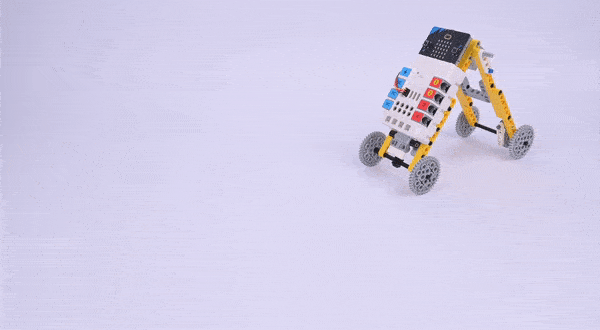

### Reflection

>Share in groups so that students in each group can share their production process and insights, summarise the problems and solutions they encountered, and evaluate their strengths and weaknesses.
