# Case 28 The Obstacle Avoidance Line-following Car

## Introduction

Make a car that runs along a black line and automatically stops when it encounters an obstacle.

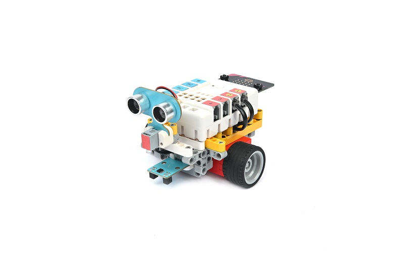

## Purchase Link

## Quick Start

### Build Steps

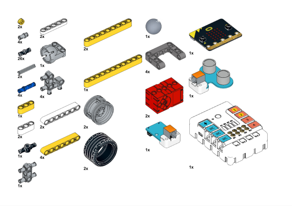

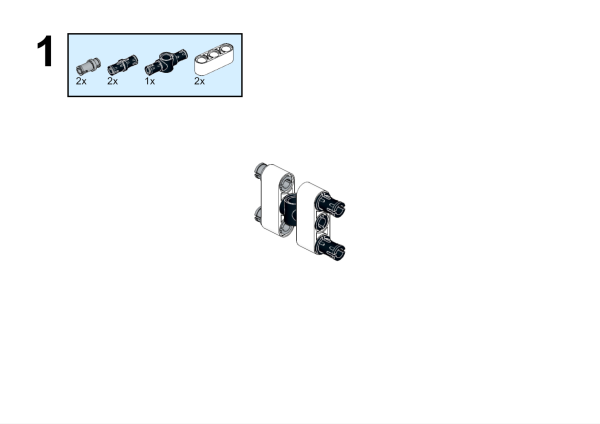

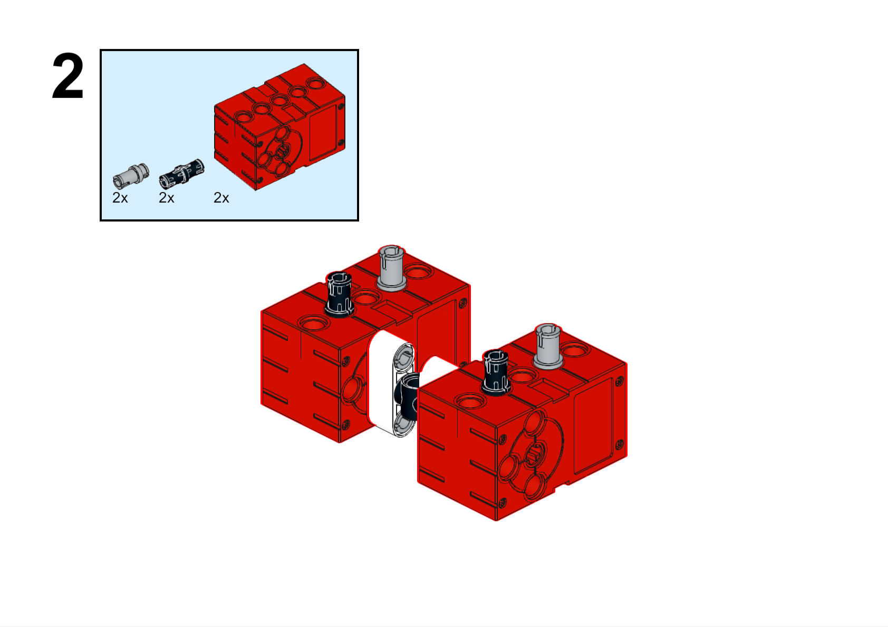

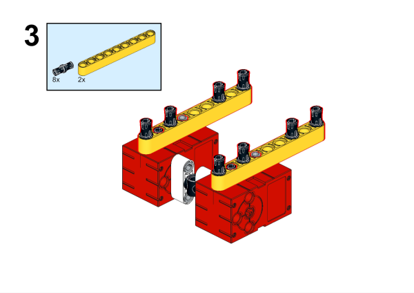

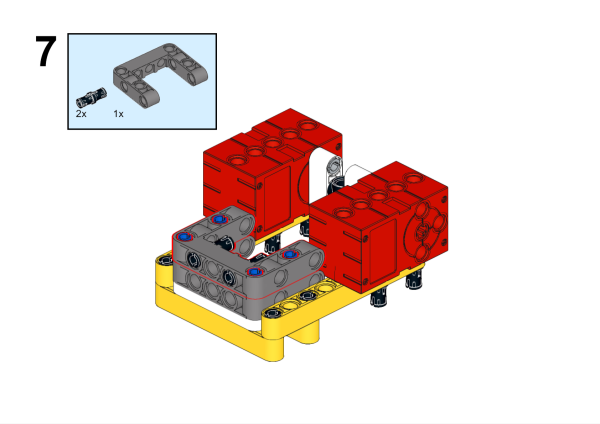

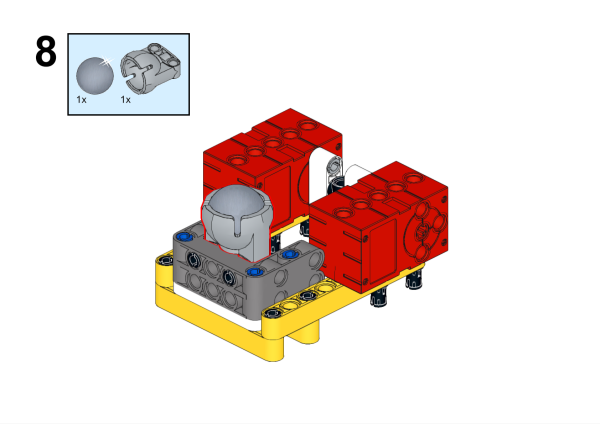

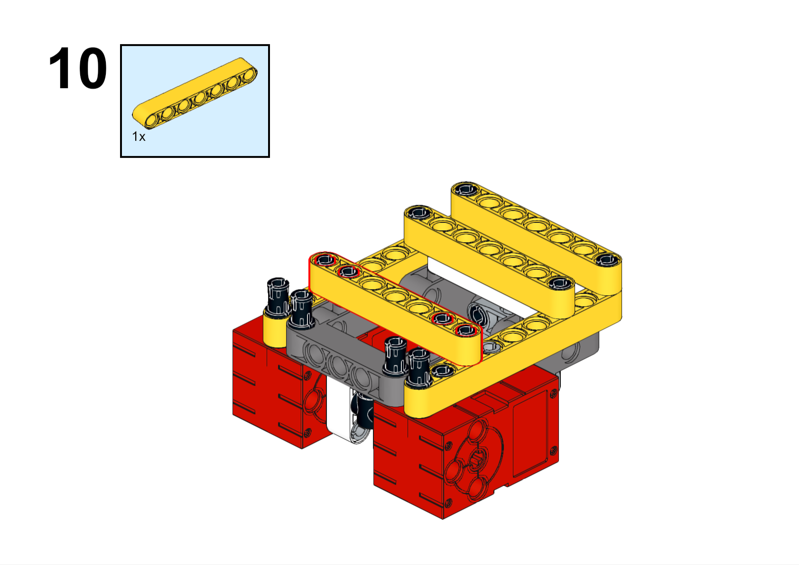

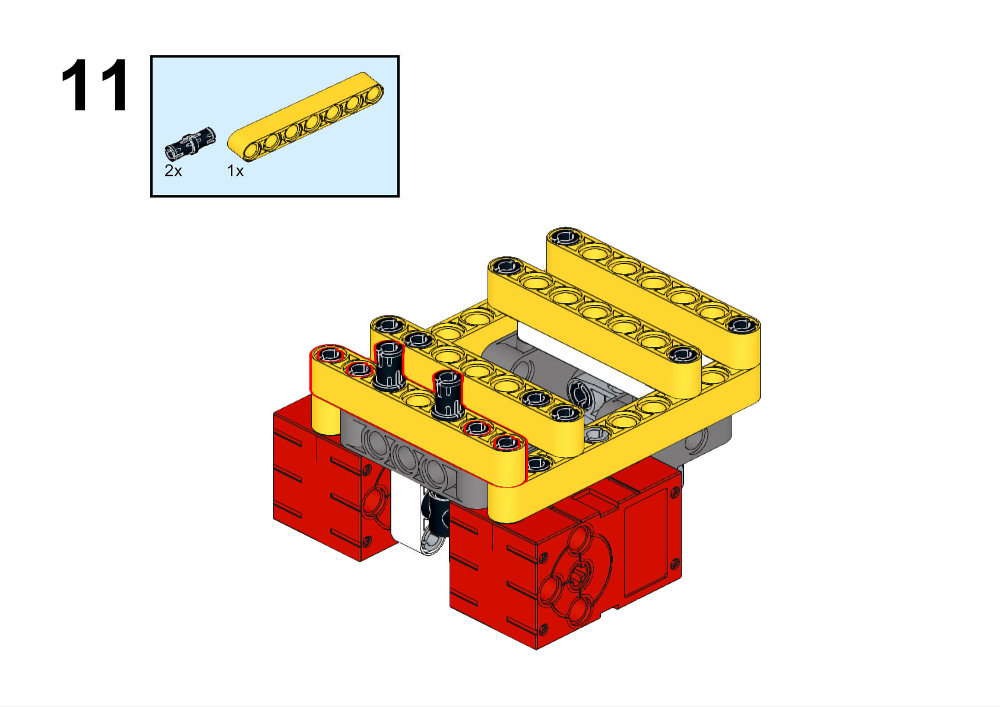

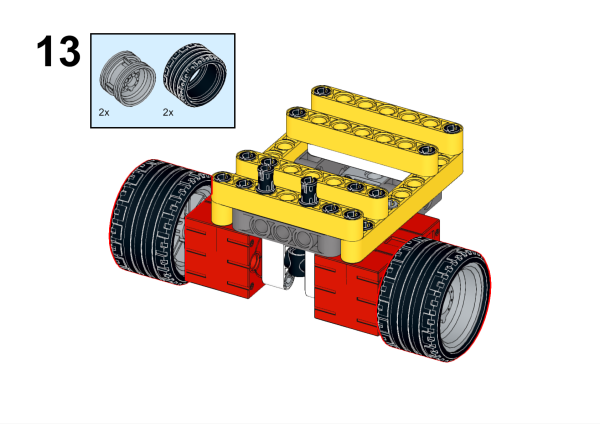

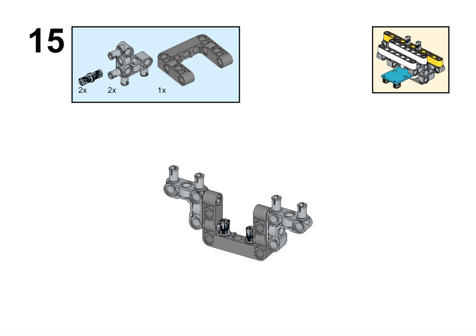

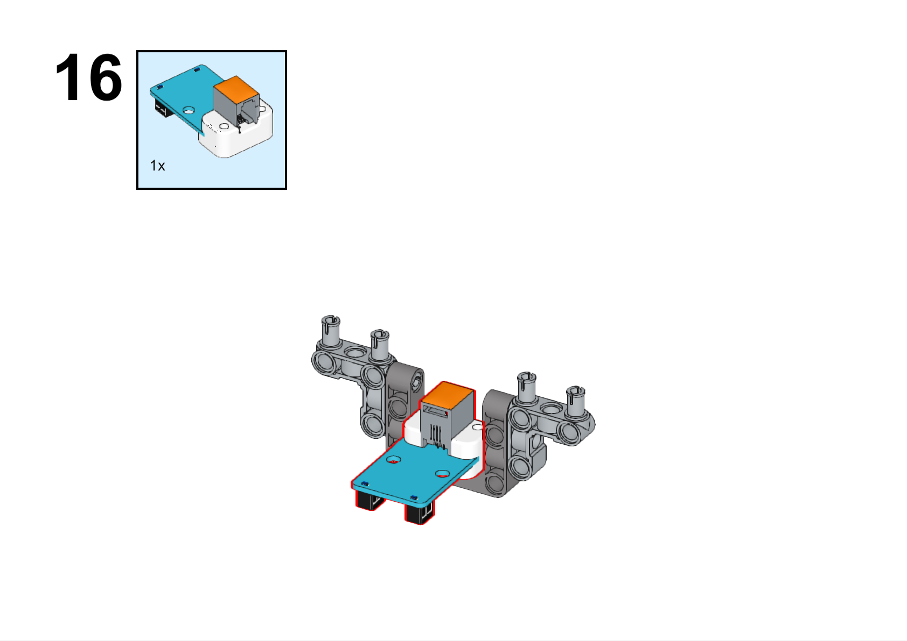

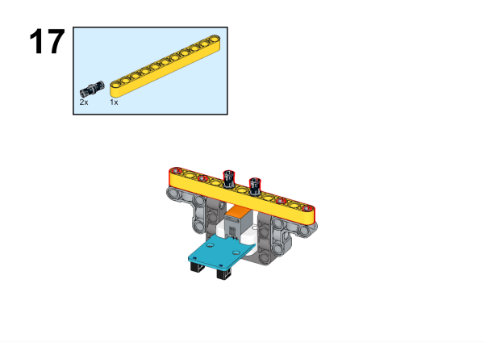

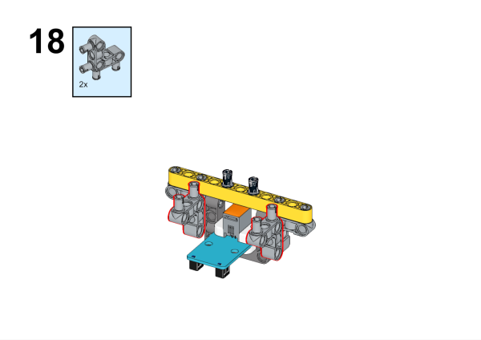

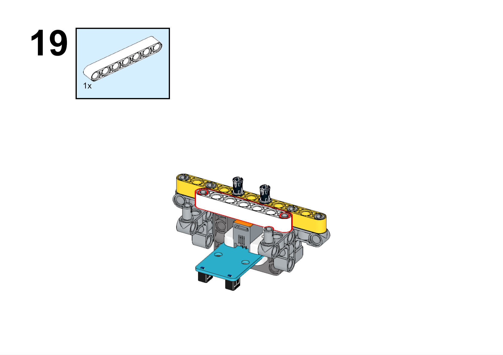

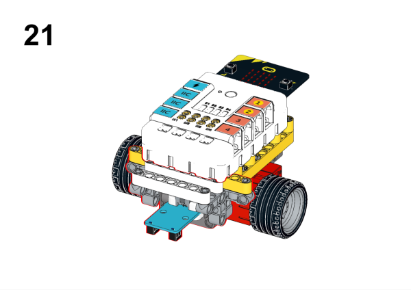

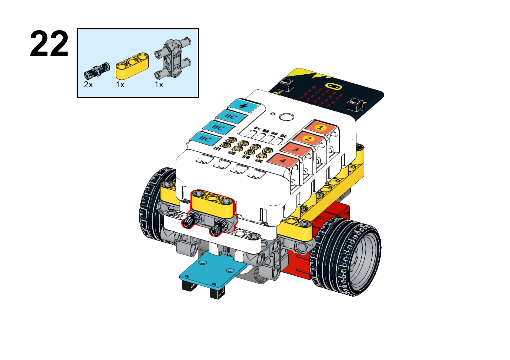

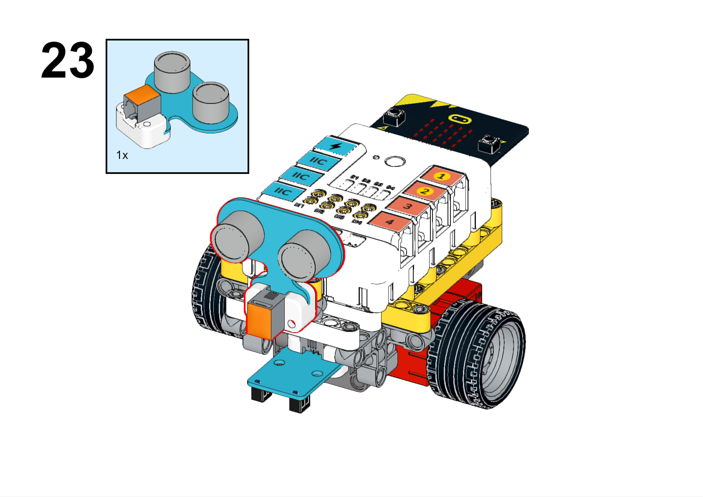

### Hardware Connection

Connect the line following sensor to the J1 port, the ultrasonic sound sensor to the J2 port, and the motors to the M1 and M2 interfaces of the Nezha expansion board.

### Software Programming

Open programming platform: [makecode](https://makecode.microbit.org/#)

New Project

Click Extension

Search `PlanetX` in the search bar to add an extended library of PlanetX Series sensors

Search `nezha` in the search bar to add the expansion library for Nezha expansion boards

Program

Link:[https://makecode.microbit.org/_V4mTg3PiwPjy](https://makecode.microbit.org/_V4mTg3PiwPjy)

You can also download the program directly from the following pages.

    <iframe
        src="https://makecode.microbit.org/_V4mTg3PiwPjy"
        frameborder="0"
        sandbox="allow-popups allow-forms allow-scripts allow-same-origin"
        style={{
            position: 'absolute',
            width: '100%',
            height: '100%',
        }}
    />

### Result

The car runs along the black line and stops automatically when it encounters an obstacle.

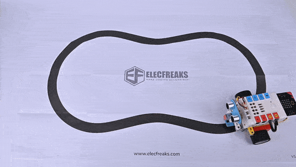
