# Case 01 The Pull-up Robot

## Introduction

Make a robot that can do pull-ups.

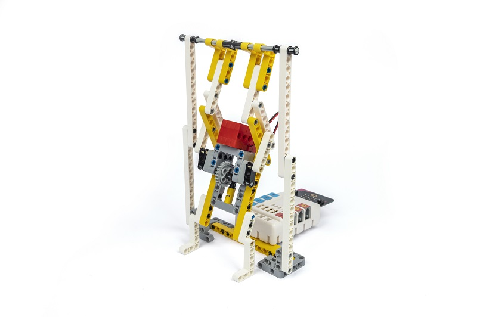

## Purchase Link

## Quick Start

### Build Steps

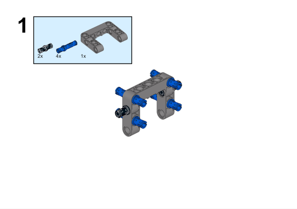

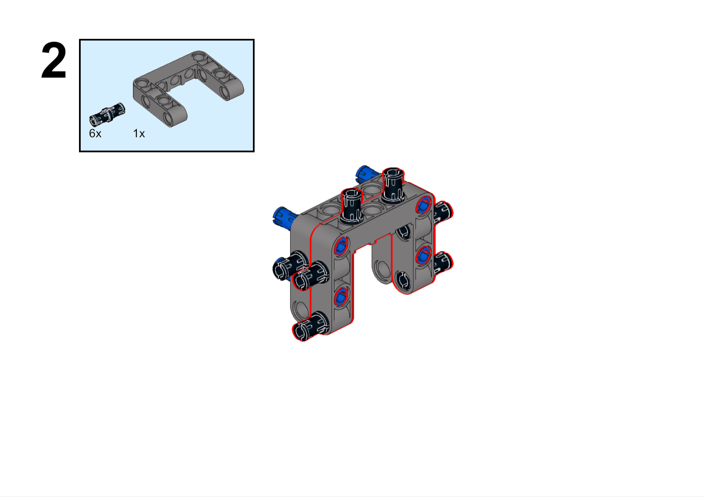

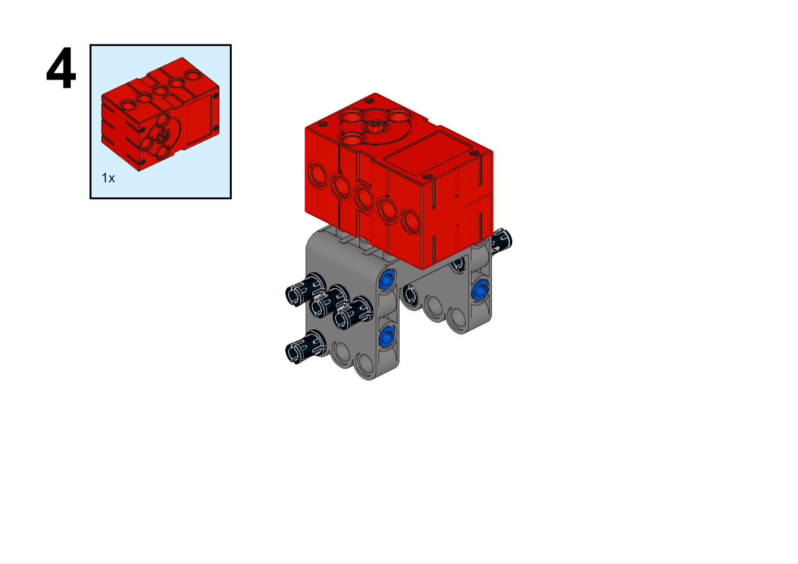

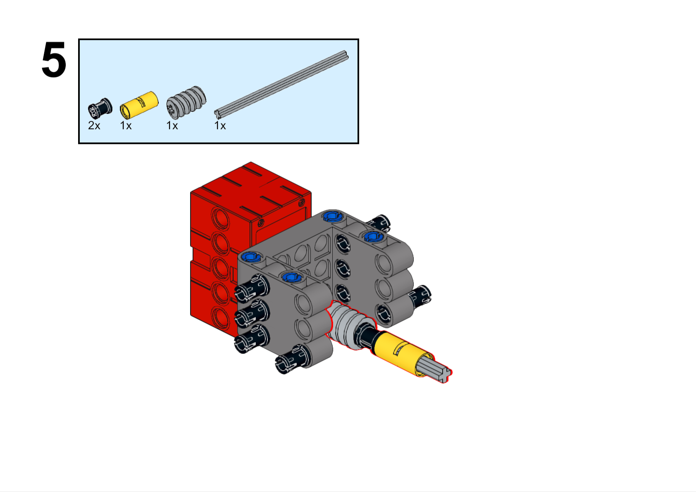

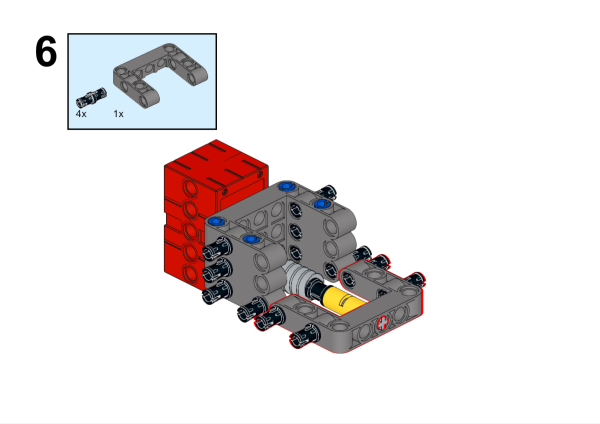

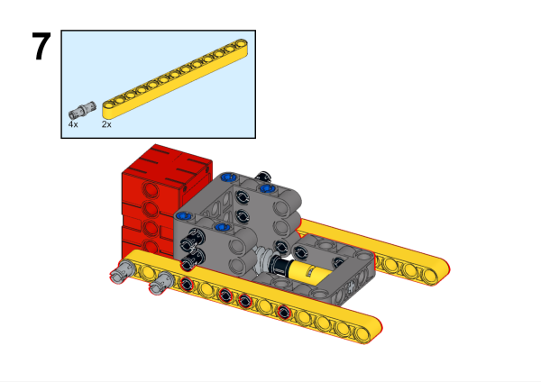

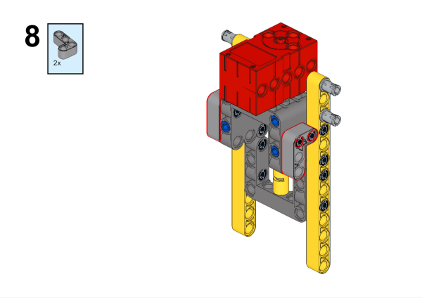

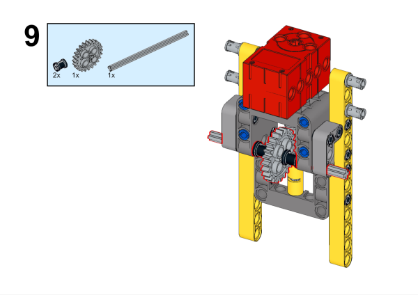

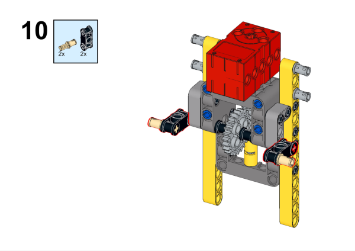

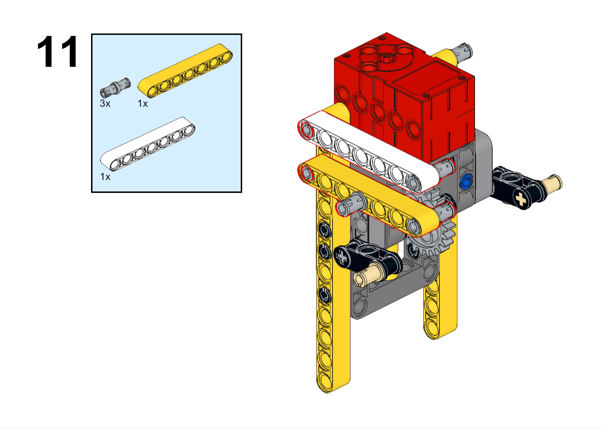

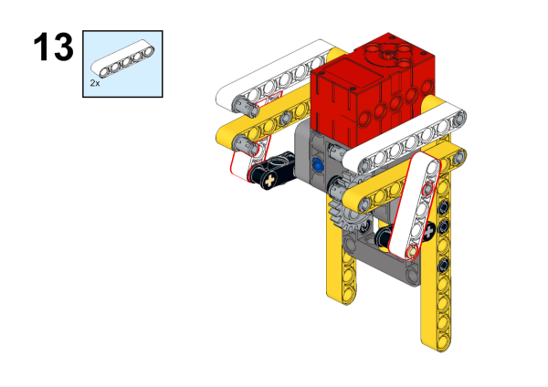

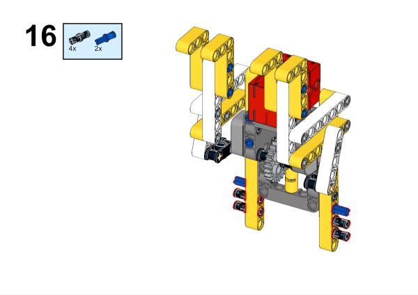

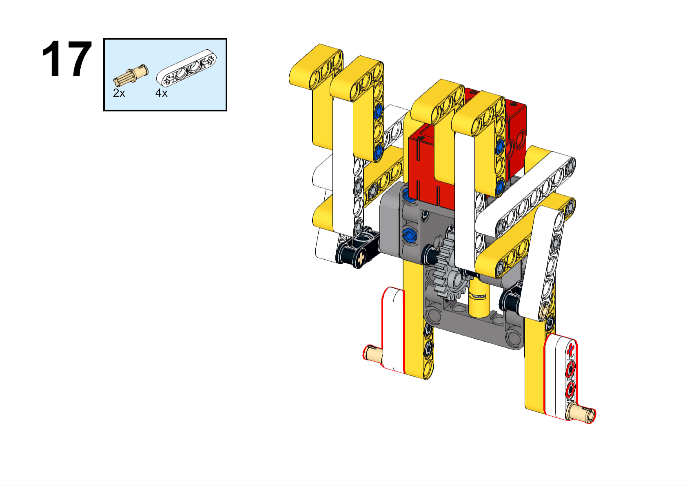

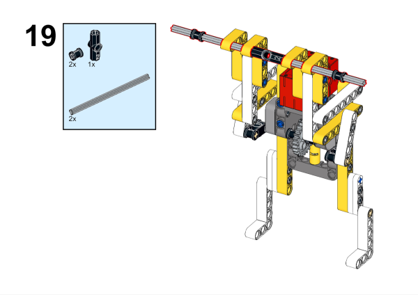

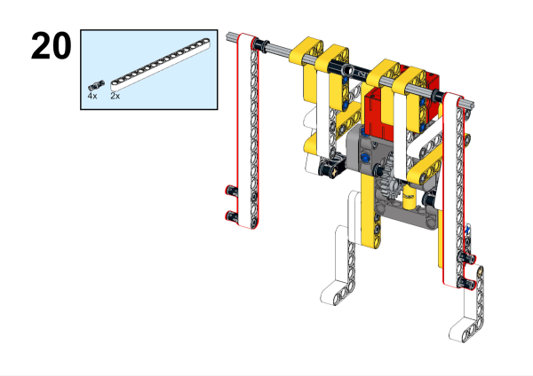

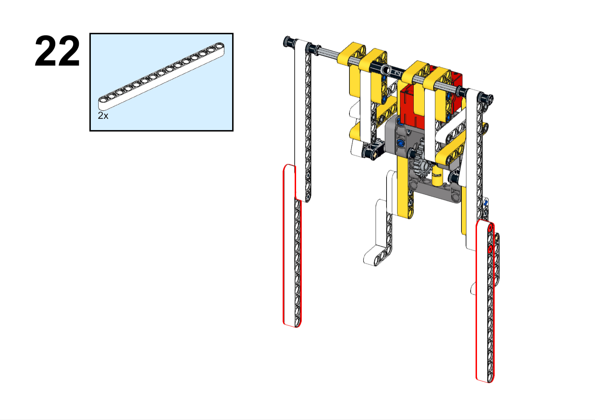

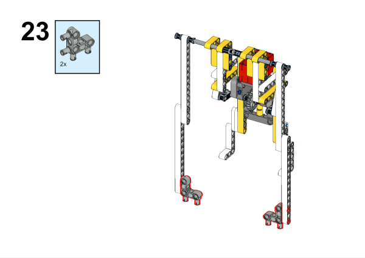

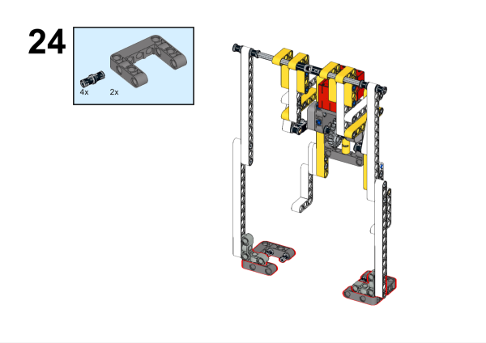

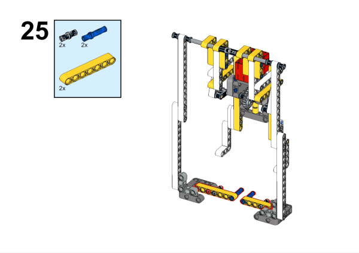

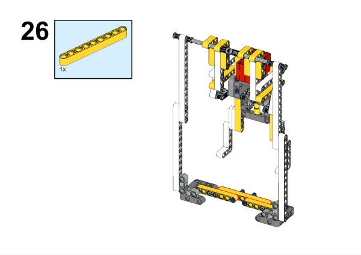

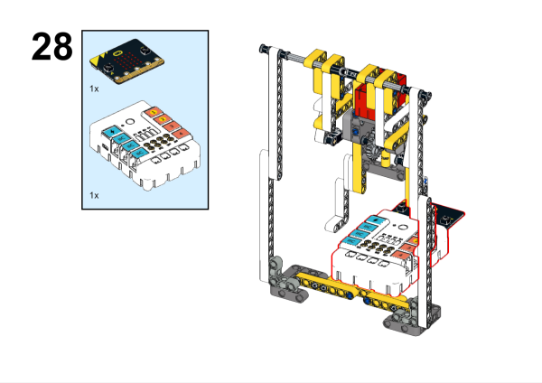

### Hardware Connection

Connect the motor to the M1 interface of the NeZha expansion board.

### Soft Programming

Open programming platform: [makecode](https://makecode.microbit.org/#)

New Project

Click Extension

Search `nezha` in the search bar to add the expansion library for Nezha expansion boards

Program

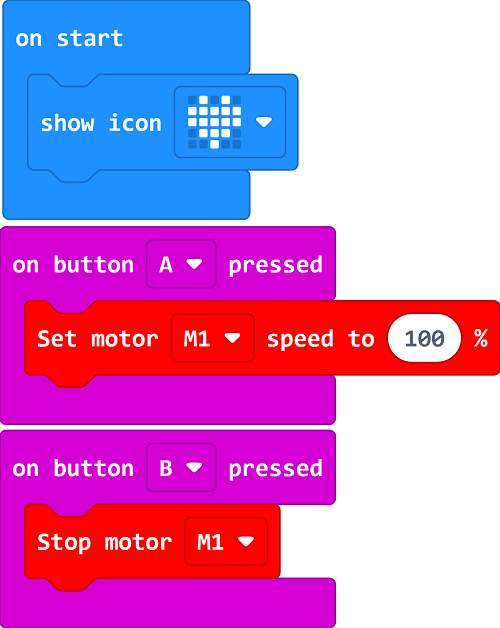

Link: [https://makecode.microbit.org/_8bYg1C9v1WJA](https://makecode.microbit.org/_8bYg1C9v1WJA)

You can also download the program directly from the following pages.

    <iframe
        src="https://makecode.microbit.org/_8bYg1C9v1WJA"
        frameborder="0"
        sandbox="allow-popups allow-forms allow-scripts allow-same-origin"
        style={{
            position: 'absolute',
            width: '100%',
            height: '100%',
        }}
    />

### Result

Press A on the micro:bit to start the robot doing pull-ups, and press B on the micro:bit to stop the robot doing pull-ups.

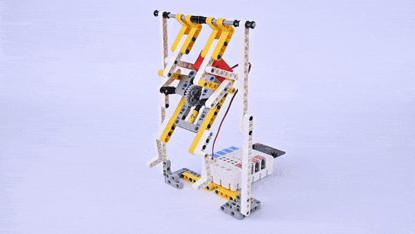
