# Case 32 Smart drying rack

## Introduction

Make a smart drying rack, when it rains, the soil moisture sensor above the device detects rain, then the drying rack automatically shrinks, when the soil moisture sensor above the device does not detect rain, then the drying rack automatically extends.

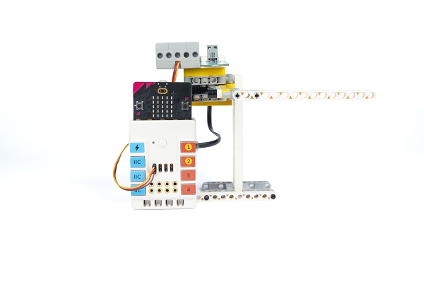

## Purchase Link

## Quick Start

### Build Steps

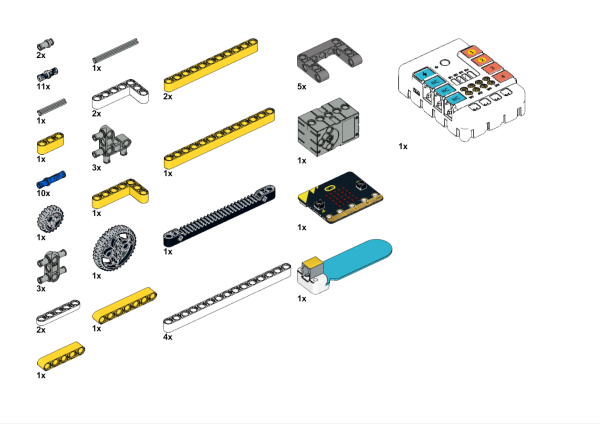

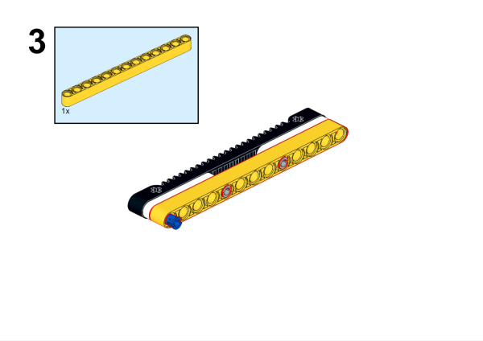

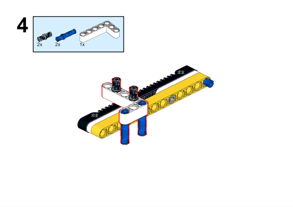

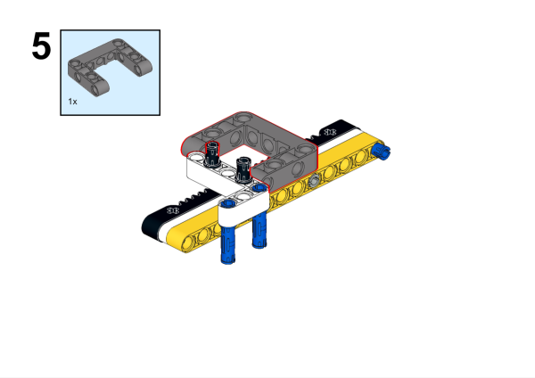

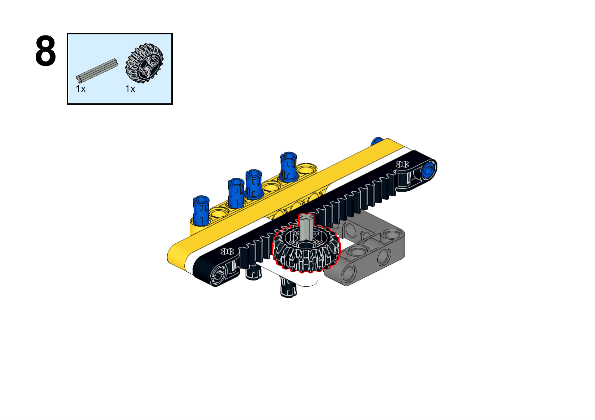

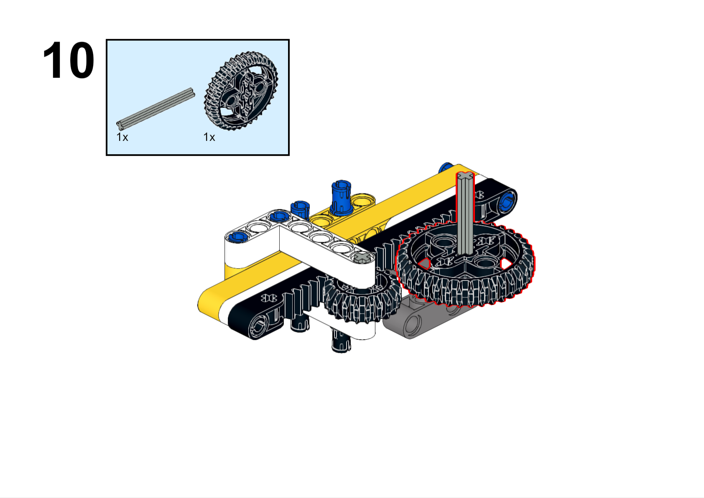

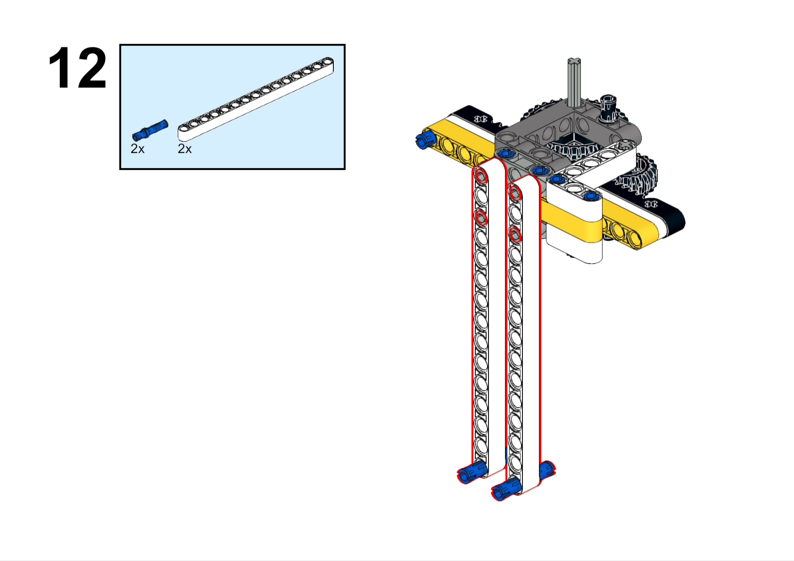

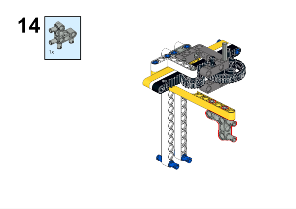

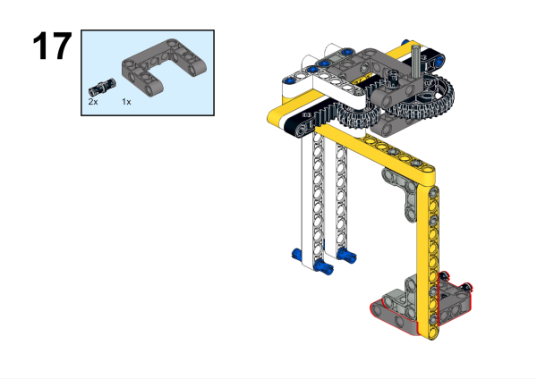

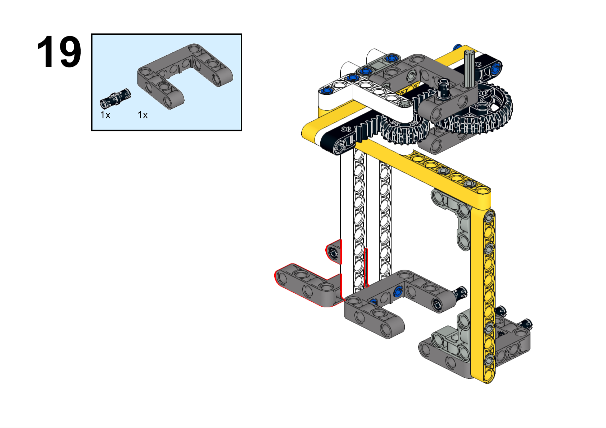

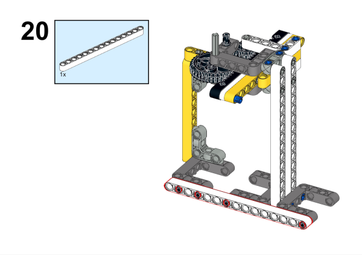

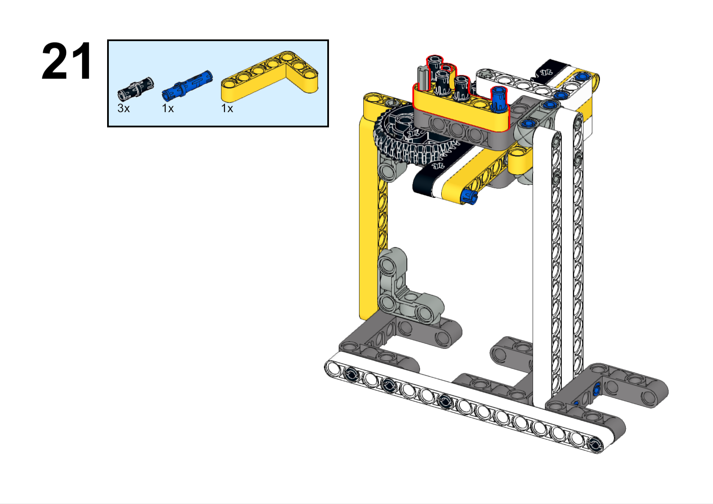

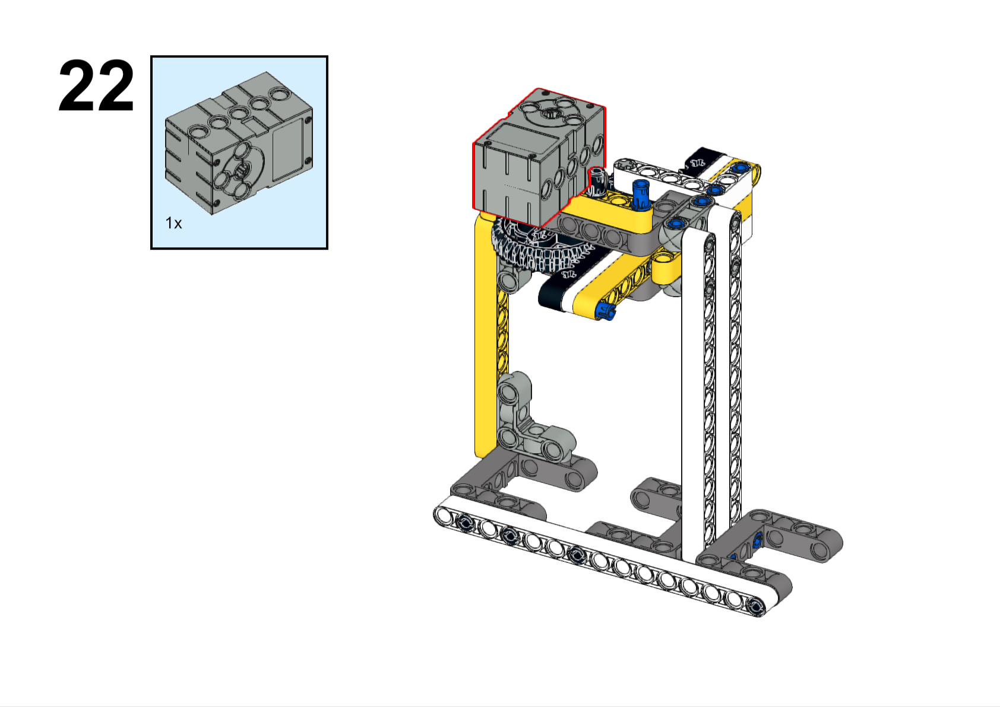

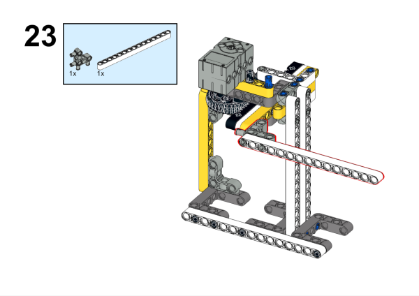

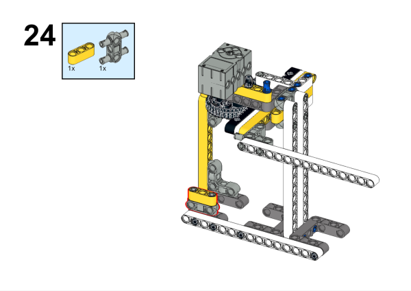

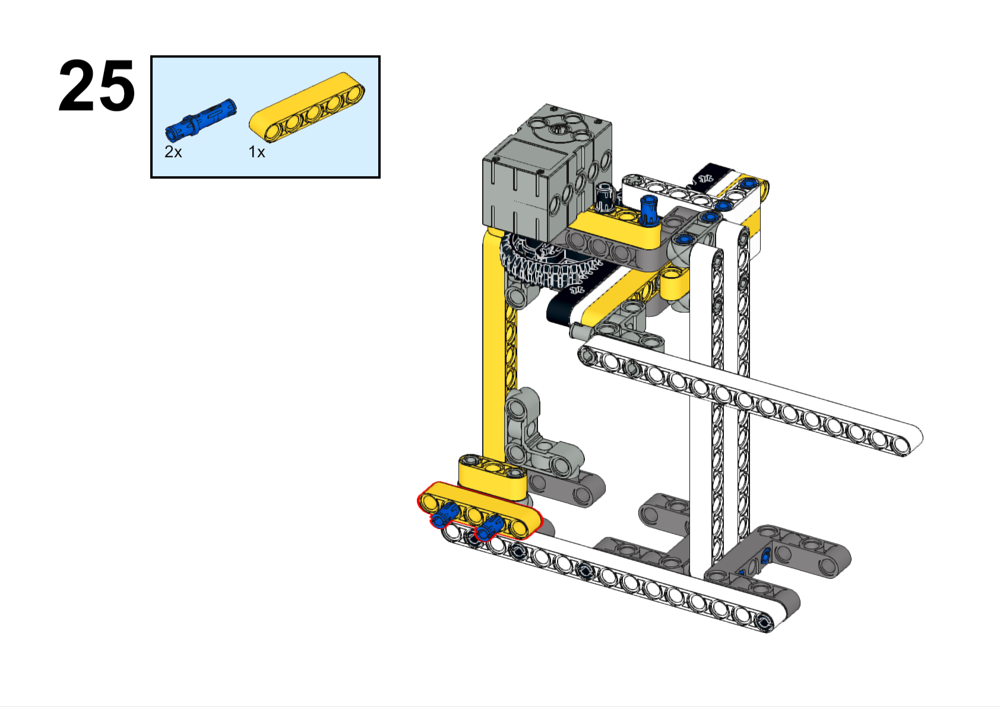

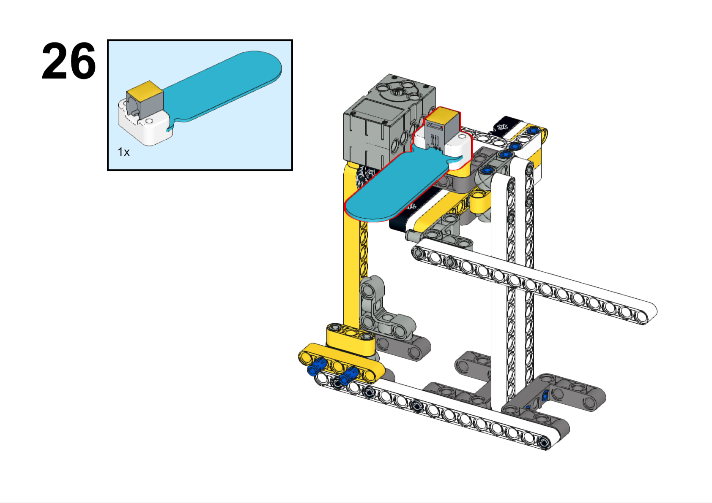

### Hardware Connection

Connect the crash sensor to the J1 and the servo to the S1 port of the Nezha expansion board.

### Software Programming

Open programming platform: [makecode](https://makecode.microbit.org/#)

New project

Click extension

Search `PlanetX` in the search bar to add an extended library of PlanetX sensors

Search `nezha` in the search bar to add the expansion library for Nezha expansion boards

Program

Link:[https://makecode.microbit.org/_bXf6baUgiDgX](https://makecode.microbit.org/_bXf6baUgiDgX)

You can also download the program directly from the following pages.

    <iframe
        src="https://makecode.microbit.org/_bXf6baUgiDgX"
        frameborder="0"
        sandbox="allow-popups allow-forms allow-scripts allow-same-origin"
        style={{
            position: 'absolute',
            width: '100%',
            height: '100%',
        }}
    />

### Result

When it rains, the soil moisture sensor above the device detects rain, at which time the drying rack automatically contracts, and when the soil moisture sensor above the device does not detect rain, the drying rack automatically extends.

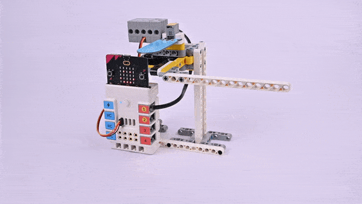
