# Case 27 The Smart Line-following Car

## Introduction

Make a cart that travels along the black line.

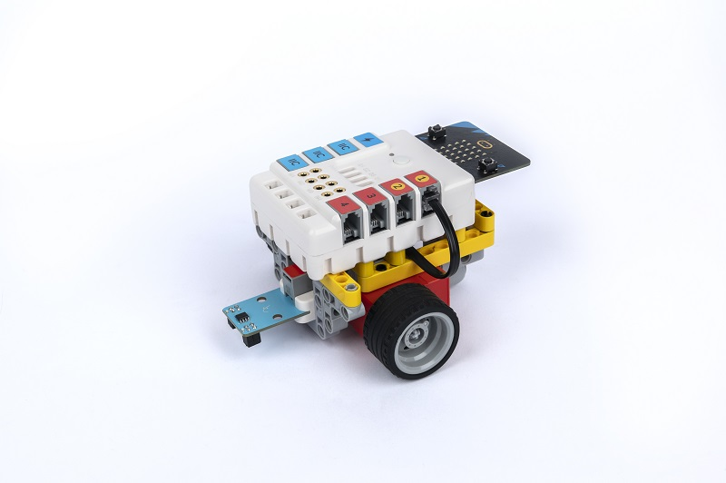

## Purchase Link

## Quick Start

### Build Step

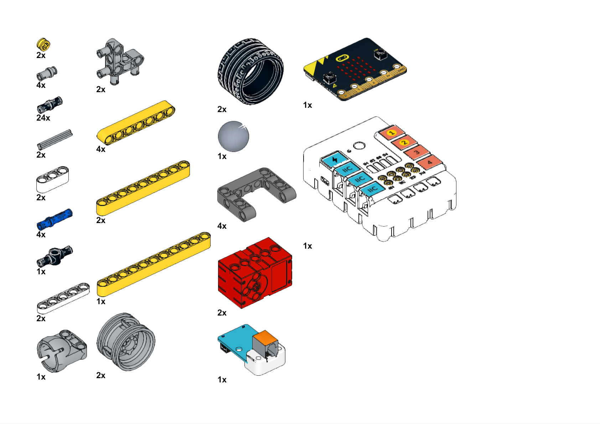

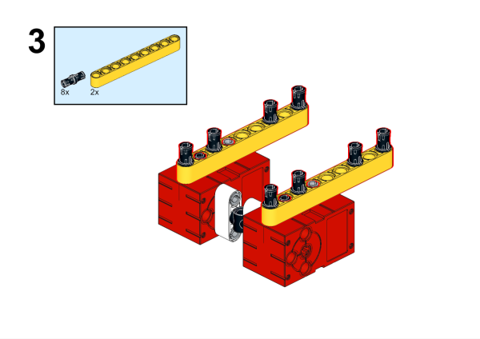

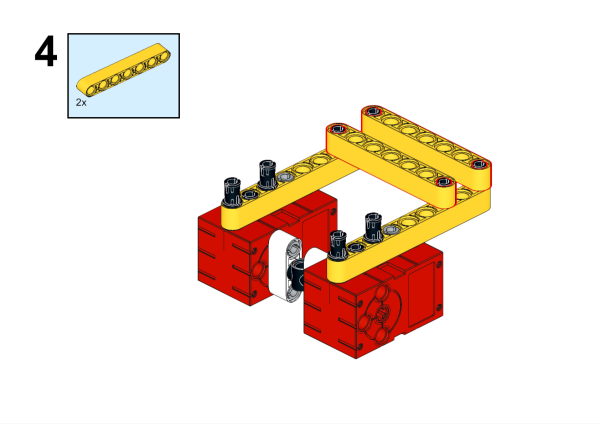

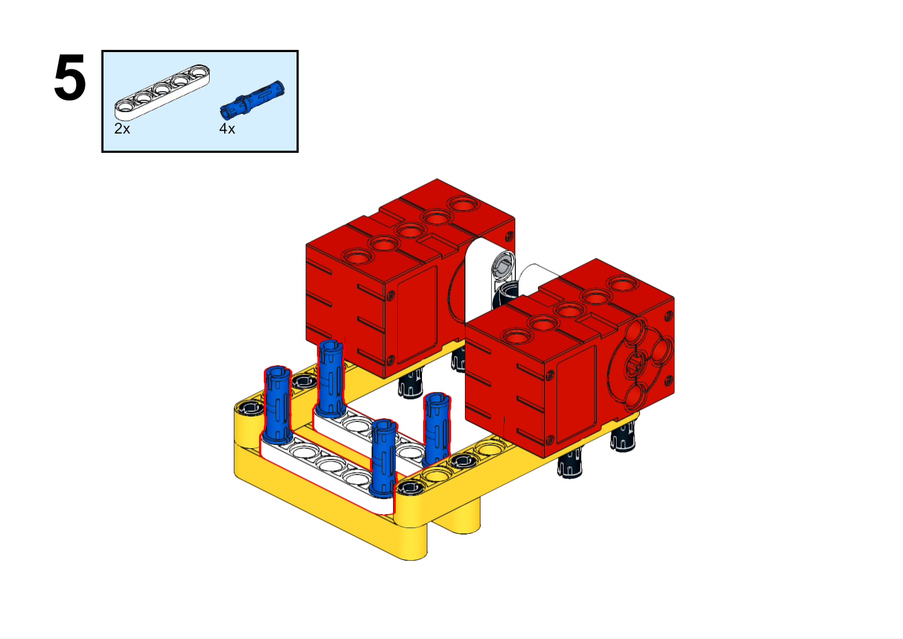

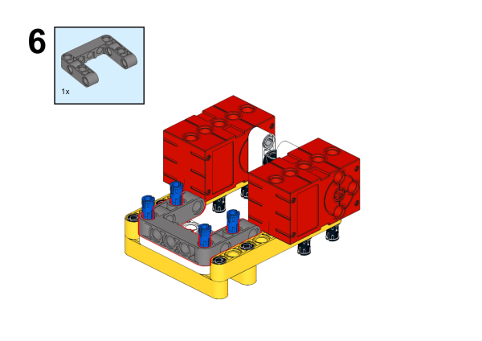

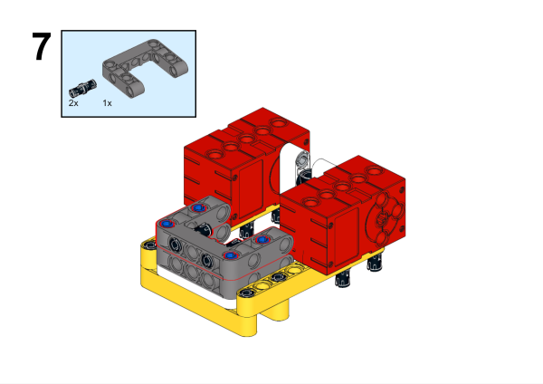

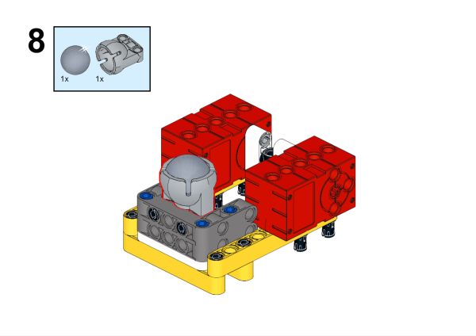

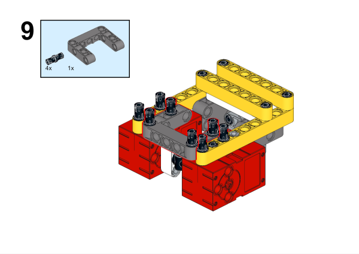

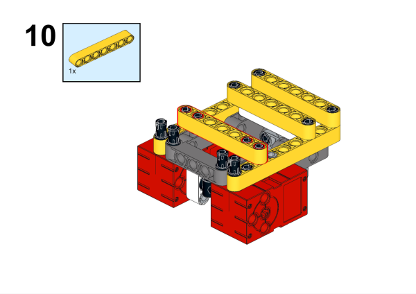

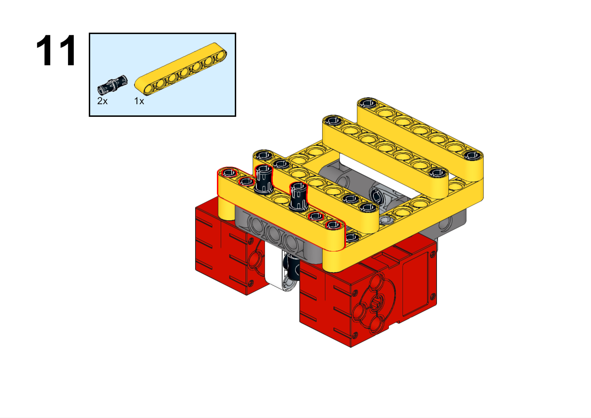

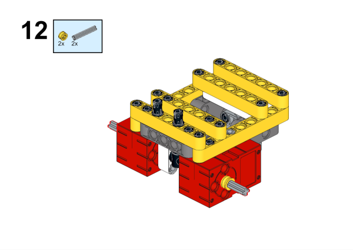

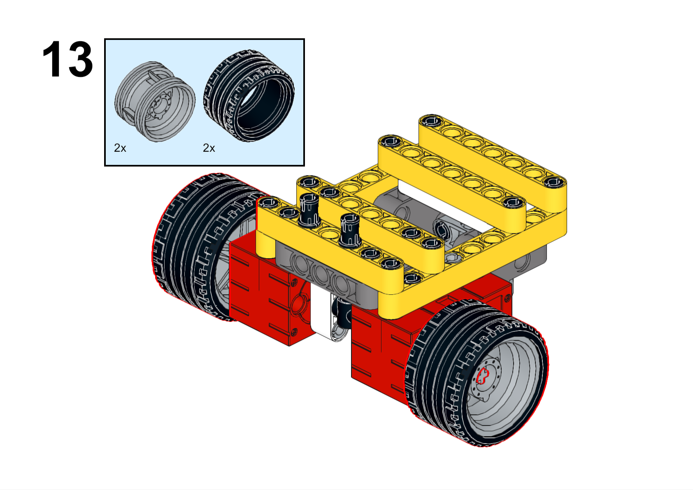

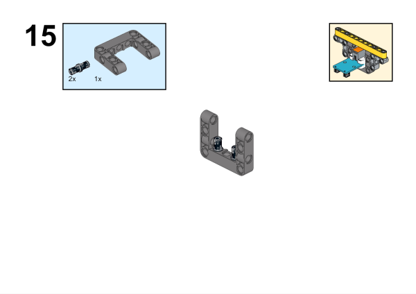

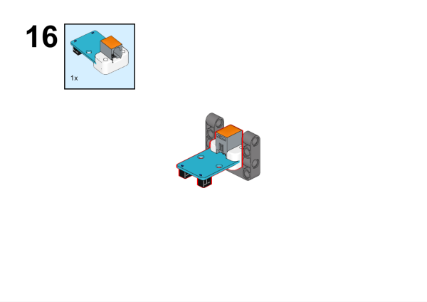

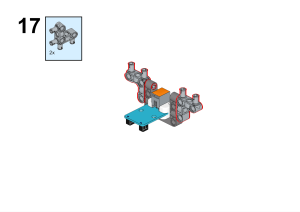

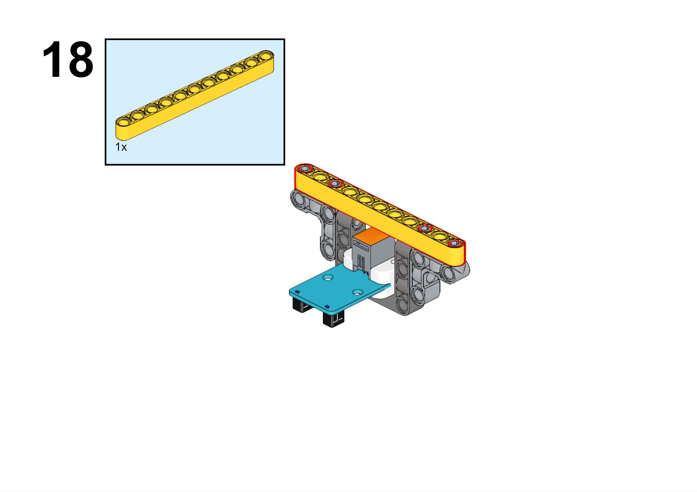

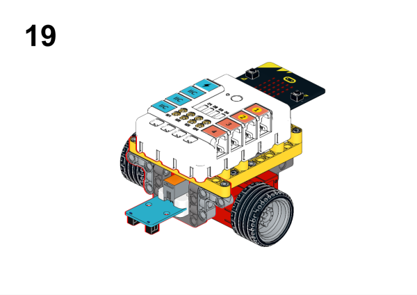

### Hardware Connection

Connect the line following sensor to the J1 interface and the motors to the M1 and M4 interfaces of the Nezha expansion board.

### Software programming

Open the programming platform: [makecode](https://makecode.microbit.org/#)

New Project

Click Extension

Search `PlanetX` in the search bar to add an extended library of PlanetX sensors

Search `nezha` in the search bar to add the expansion library for Nezha expansion boards

Program

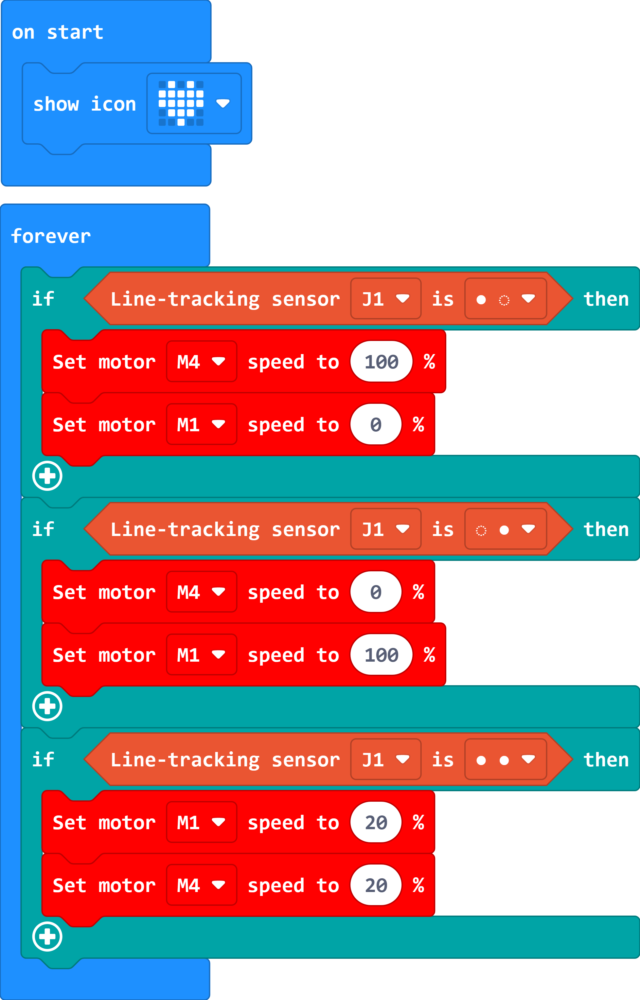

Link:[https://makecode.microbit.org/_3EV1ULio68sq](https://makecode.microbit.org/_3EV1ULio68sq)

You can also download the program directly from the following pages.

    <iframe
        src="https://makecode.microbit.org/_3EV1ULio68sq"
        frameborder="0"
        sandbox="allow-popups allow-forms allow-scripts allow-same-origin"
        style={{
            position: 'absolute',
            width: '100%',
            height: '100%',
        }}
    />

### Result

The car travels along the black line.

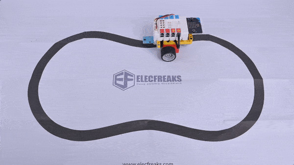
