# Case 25 The Obstacle Avoidance Car 1

## Introduction

In this course, we will work together to build a smart obstacle avoidance vehicle, using the Nezha Inventor's Kit V2 and ultrasonic sound sensors to enable the vehicle to automatically detect and avoid obstacles in front of it. Through this project, we will learn how ultrasonic sound sensors work and apply them to the design and construction of real robots.

## Teaching Objectives

- Learn how ultrasonic sound sensors work and their applications
- Learn to build robots using Nezha Inventor's Kit V2
- Develop problem solving and creative thinking skills
- Master basic programming concepts and graphical programming tools

## Teaching Preparation

[Nezha Inventor's Kit V2](https://www.elecfreaks.com/nezha-inventor-s-kit-v2-for-micro-bit.html)

## Teaching Process

### Introduce

>Introduce students to the background and objectives of making a smart obstacle avoidance vehicle to stimulate their interest and curiosity.

In real life, there are many robots that use ultrasonic sensors to sense their surroundings and make appropriate movements based on the detected obstacles. Are you curious about how an ultrasonic sensor works? How can it be used to create an intelligent obstacle avoidance vehicle?

In this course, we will take an in-depth look at how ultrasonic sensors work and apply them to robot design. We will use Nezha Inventor's Kit V2 to build a robot prototype of a smart obstacle avoidance vehicle and connect the ultrasonic sensor. Through learning and practice, we will explore how to write programs that enable the robot to make intelligent obstacle avoidance movements based on the data from the ultrasonic sensors.

Now, let's kick off this fun and challenging STEAM project by exploring how ultrasonic sensors work, getting creative and developing problem-solving and creative thinking skills! Are you ready? Let's get started!

### Exploration

>Discuss in small groups and get students thinking about how they can make a smart obstacle avoidance car using block materials.

- How does an ultrasonic sensor work? How does it measure distance?
- How can the ultrasonic sensor be combined with the Nezha Inventor Kit V2 to enable the robot to detect obstacles ahead?
- How can the robot be programmed to make appropriate movements to avoid obstacles based on the data from the ultrasonic sensor?

### Practice

>Work in groups to create a smart obstacle-avoidance car from block materials according to your own design.

Follow your own design to create a smart obstacle-avoidance car out of building blocks.

#### Examples

##### Assembly Steps

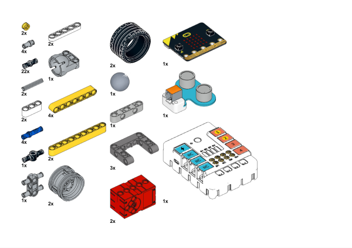

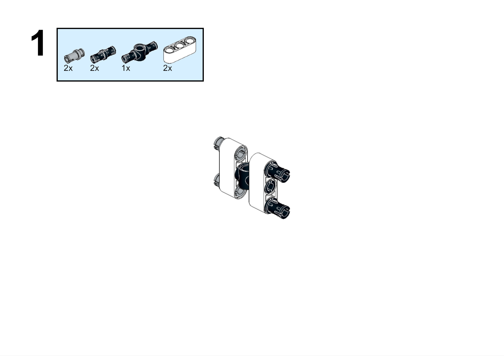

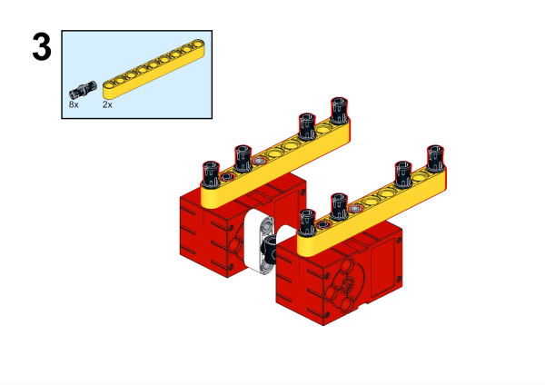

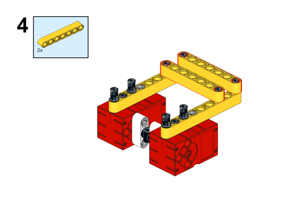

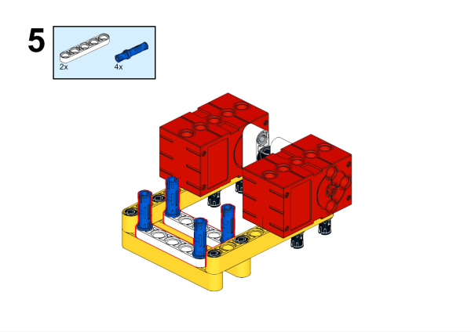

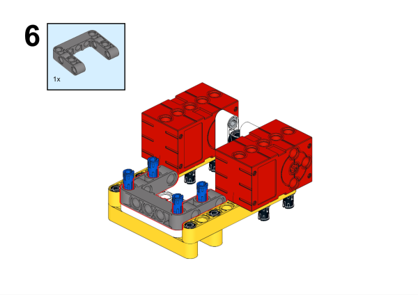

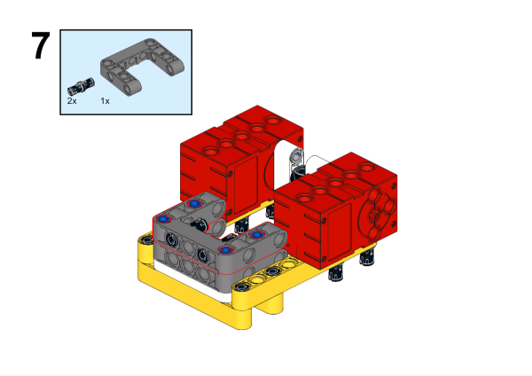

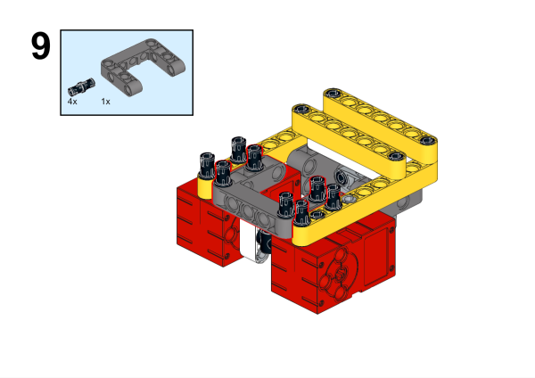

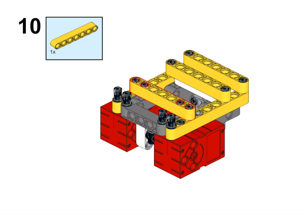

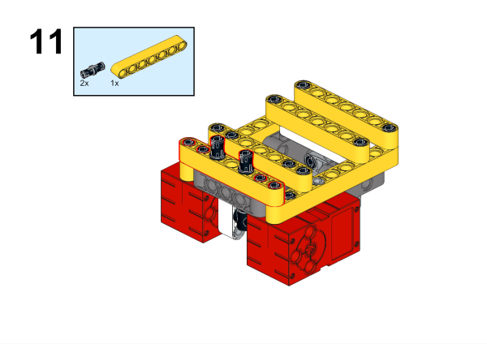

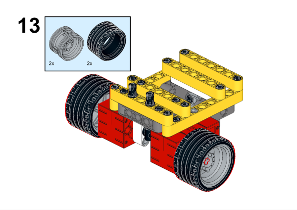

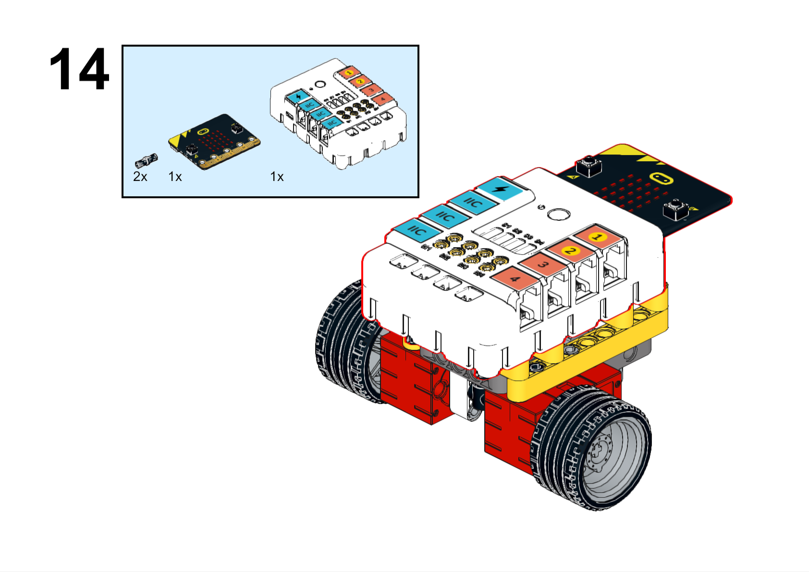

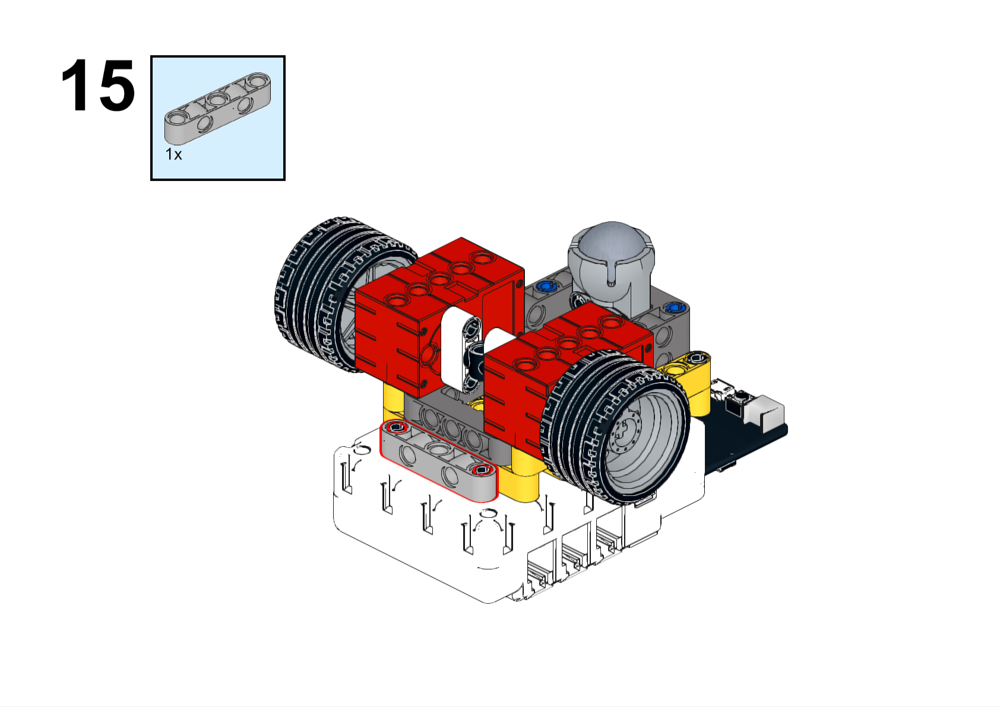

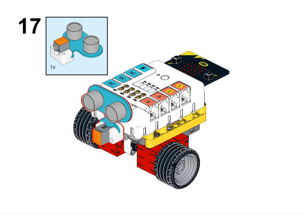

**Completed**

##### Hardware Connection

Connect the ultrasonic sound sensor to the J1 and the motors to the M1 and M4 connectors of the Nezha expansion board.

##### Programming

Go to [makecode](https://makecode.microbit.org/#)

Create new projects

Click extensions

Search with `PlanetX` to download the package.

Search with `nezha` to download the package.

Code

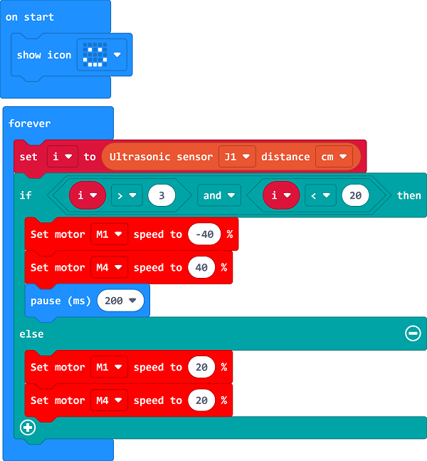

Link: [https://makecode.microbit.org/_Ab3EyVLy7Cit](https://makecode.microbit.org/_Ab3EyVLy7Cit)

You may download it directly:

    <iframe
        src="https://makecode.microbit.org/_Ab3EyVLy7Cit"
        frameborder="0"
        sandbox="allow-popups allow-forms allow-scripts allow-same-origin"
        style={{
            position: 'absolute',
            width: '100%',
            height: '100%',
        }}
    />

### Demonstration

>Presented in groups, students test, tune and optimise their robots to improve the accuracy and stability of obstacle avoidance and compare the results and effectiveness of each group.

#### Result

When there is an obstacle in the way of the trolley, the trolley will turn to travel.

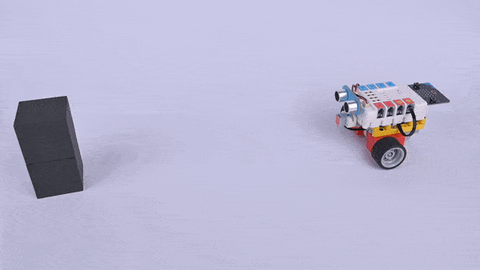

### Reflection

>Share in groups so that students in each group can share their production process and insights, summarise the problems and solutions they encountered, and evaluate their strengths and weaknesses.
