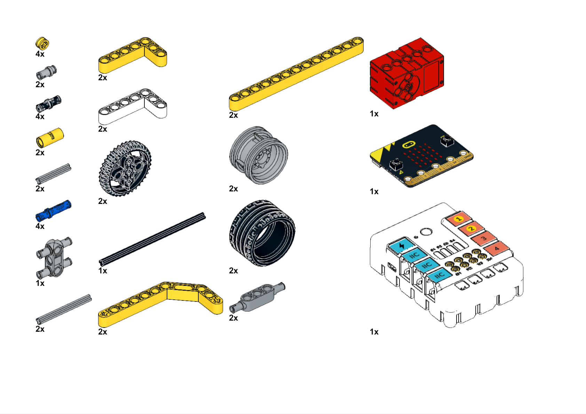
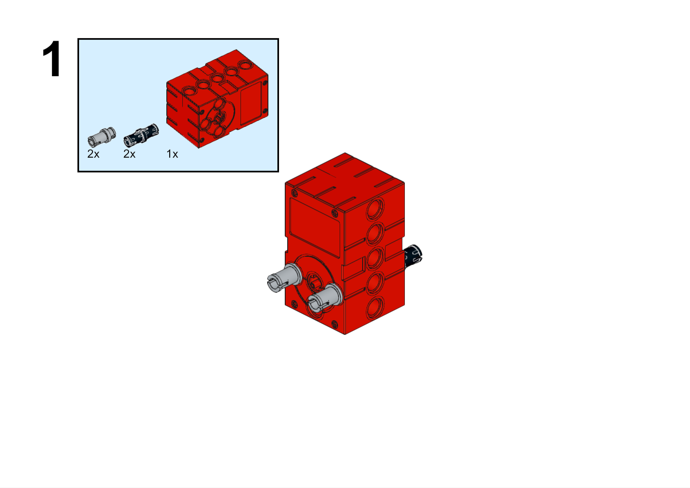
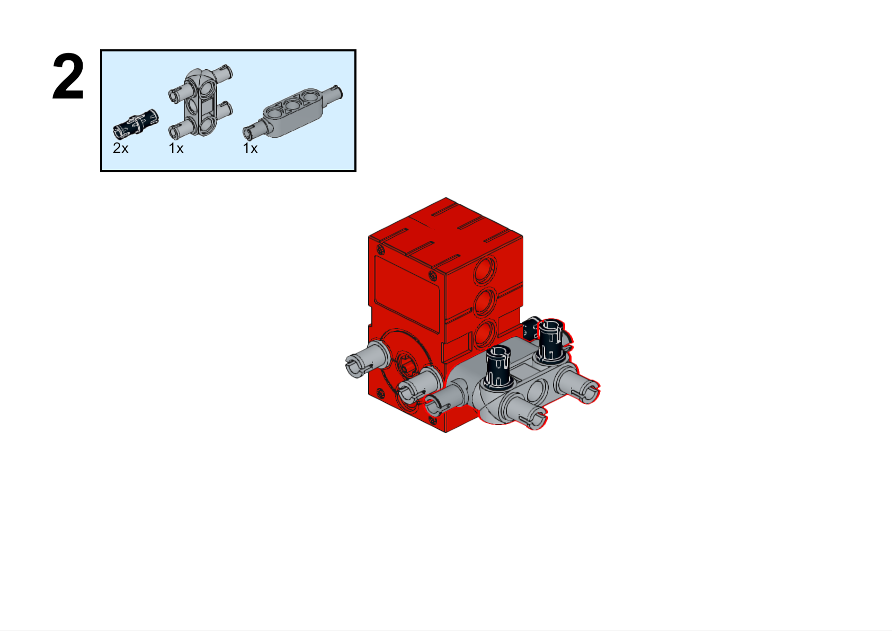
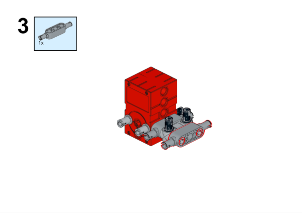
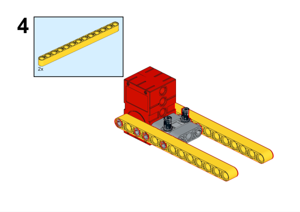
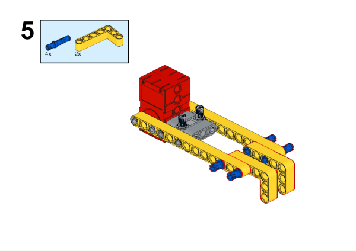
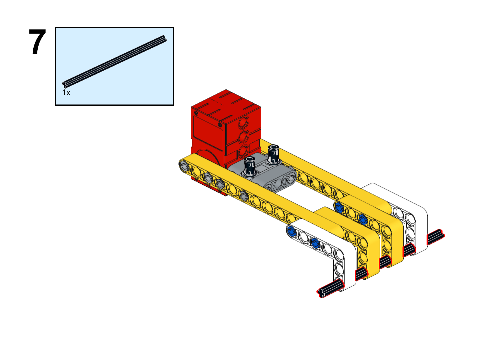
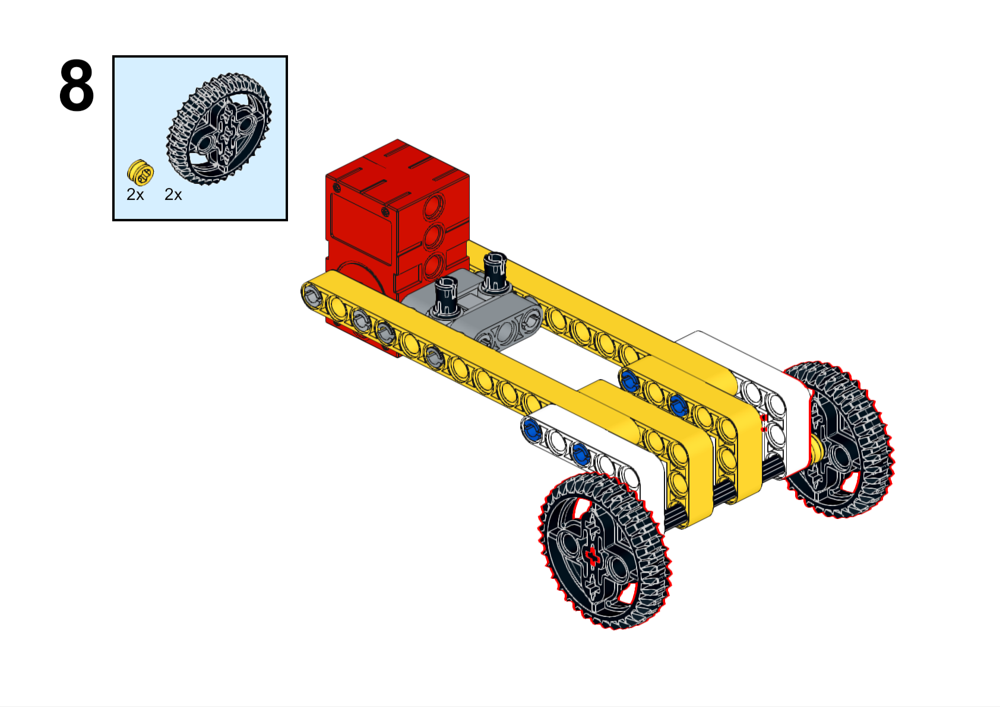
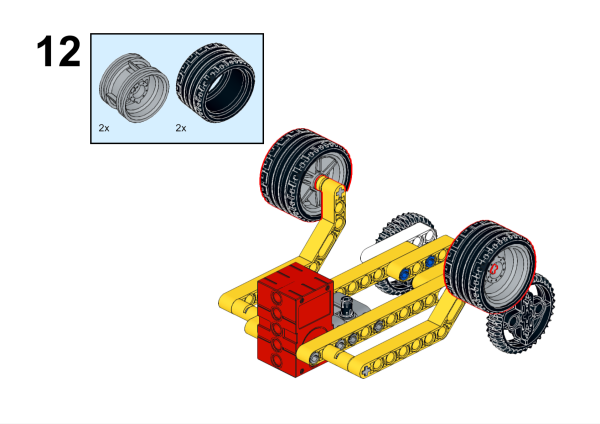

# Case 02 The Swimming Robot

## Introduction

Make a swimming robot.

## Purchase Link

## Quick Start

### Build Steps

### Hardware Connections

Connect the motor to M1 port on Nezha breakout board

### Software Programming

Open programming platform: [makecode](https://makecode.microbit.org/#)

New Project

Click Extension

Search `nezha` in the search bar to add the expansion library for Nezha expansion boards

program

Link:[https://makecode.microbit.org/_i3CacvKkc40L](https://makecode.microbit.org/_i3CacvKkc40L)

You can also download the program directly from the following pages.

    <iframe
        src="https://makecode.microbit.org/_i3CacvKkc40L"
        frameborder="0"
        sandbox="allow-popups allow-forms allow-scripts allow-same-origin"
        style={{
            position: 'absolute',
            width: '100%',
            height: '100%',
        }}
    />

### Result

Press the A button on the micro:bit to move the robot forward, and press the B button on the micro:bit to stop the robot's movement.

