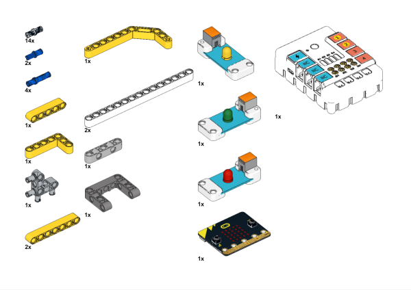
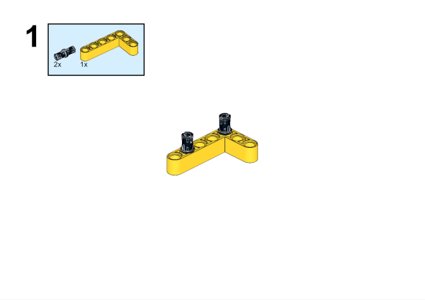
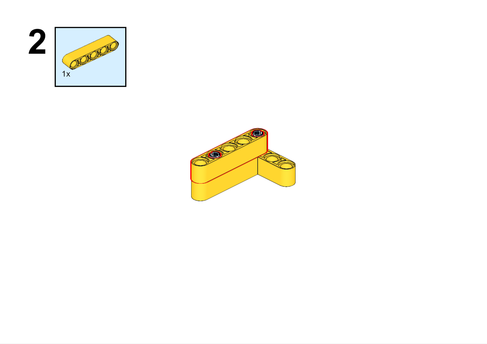
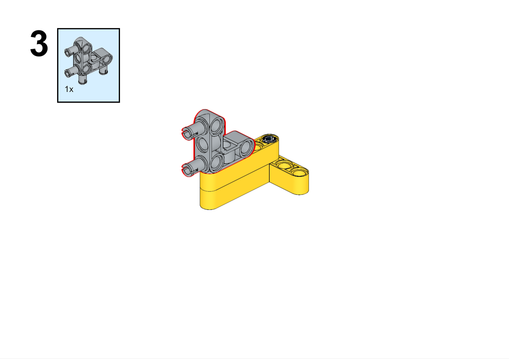
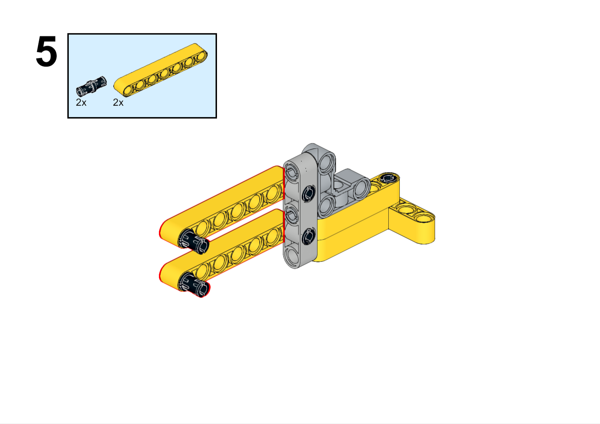
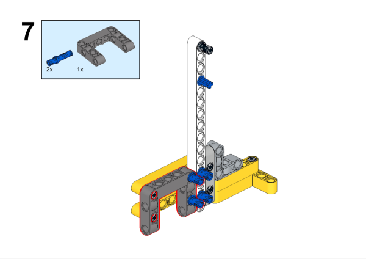
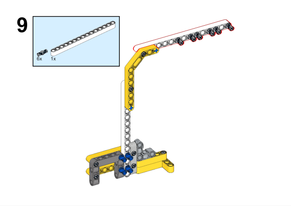
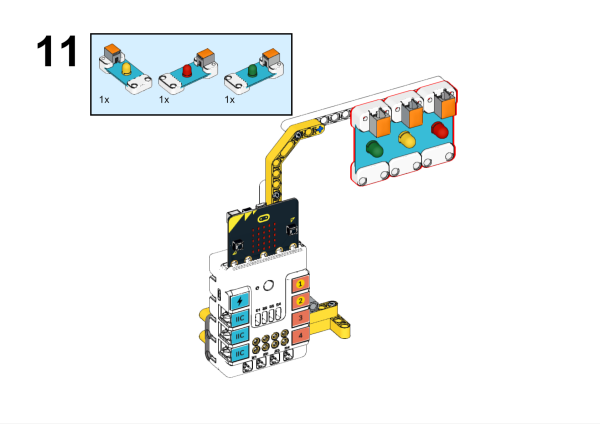
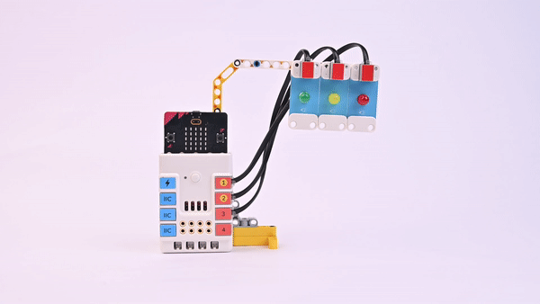

# Case 30 The Traffic Light

## Introduction

Make a traffic light.

## Purchase Link

## Quick Start

### Build Steps

### Hardware Connection

Connect the green LED to the J1 connector, the yellow LED to the J2 connector, and the red LED to the J3 connector of the Nezha expansion board.

### Software Programming

Open programming platform:[makecode](https://makecode.microbit.org/#)

New project

Click Extension

Search `PlanetX` in the search bar to add an extended library of PlanetX sensors

Program

Link:[https://makecode.microbit.org/_Wv0gDTaTUY88](https://makecode.microbit.org/_Wv0gDTaTUY88)

You can also download the program directly from the following pages.

    <iframe
        src="https://makecode.microbit.org/_Wv0gDTaTUY88"
        frameborder="0"
        sandbox="allow-popups allow-forms allow-scripts allow-same-origin"
        style={{
            position: 'absolute',
            width: '100%',
            height: '100%',
        }}
    />

### Result

The green light is on for 5 seconds and the red light is on for 5 seconds, alternately, with the yellow light on for 2 seconds in the middle of each switch.

