# Case 31 The Ultrasonic Sound Gate

## Introduction

In this project we will be making an ultrasonic gate model using the Nezha Inventor's Kit V2. We will learn how ultrasonic sensors work, programming and other knowledge and apply it to the model of the gate.

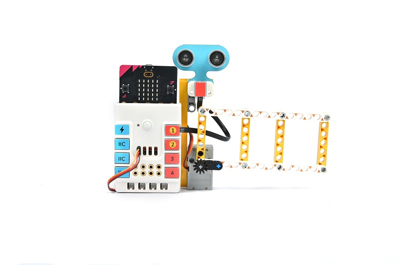

## Teaching Objectives

- Learn how ultrasonic sensors work
- Learn to control the movement of gates using the Nezha Inventor's Kit V2 programming
- Develop creativity and innovative thinking

## Teaching Preparation

[Nezha Inventor's Kit V2](https://www.elecfreaks.com/nezha-inventor-s-kit-v2-for-micro-bit.html)

## Teaching Process

### Introduce

>Students are introduced to the background and objectives of ultrasonic gate making to stimulate their interest and curiosity.

An ultrasonic sensor is a commonly used distance measuring sensor that is able to detect the distance of an object by sending an ultrasonic wave and measuring its return time. Imagine how interesting and practical an invention it would be if we could make a model of a gate using an ultrasonic sensor and automatically control the opening and closing of the gate by the distance detected?

### Exploration

>Discuss in small groups and get students thinking about how to create an ultrasonic gate using building block materials.

- How can the measurements from the ultrasonic sensor be programmed to translate into a motion control signal for the gate?
- How can the range of motion and speed of the gate be adjusted to suit different application scenarios?
- How can you get creative and design unique ways to control the appearance and movement of the gate?

### Practice

>Work in groups to create an ultrasonic gate using block materials according to your own design.

Build an ultrasonic gate from building blocks according to your own design.

#### Examples 

##### Building Steps

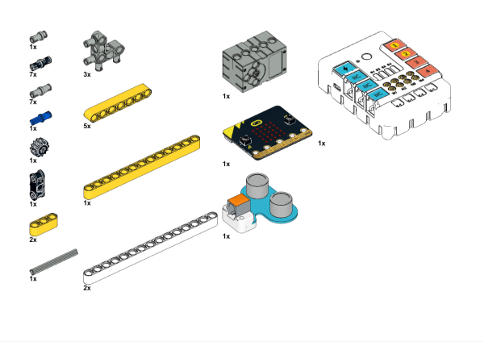

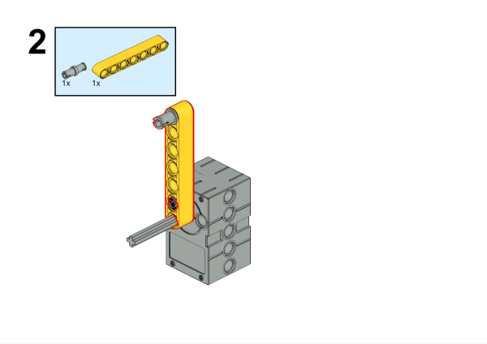

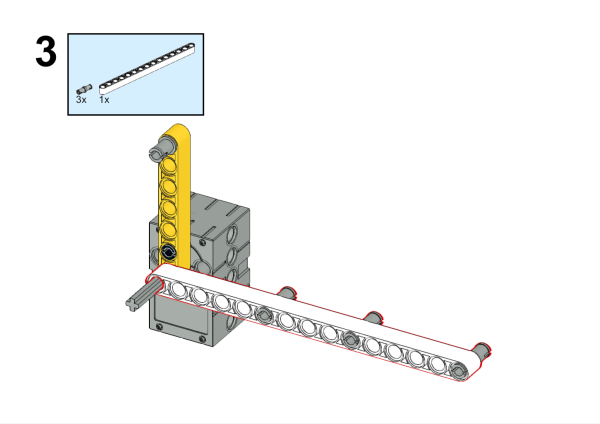

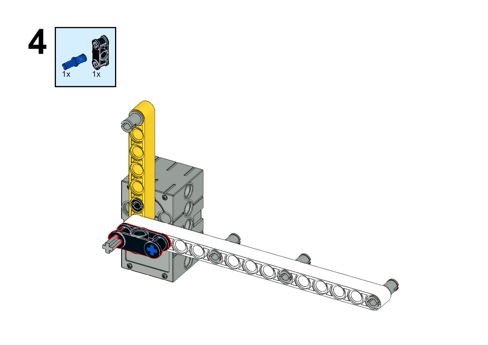

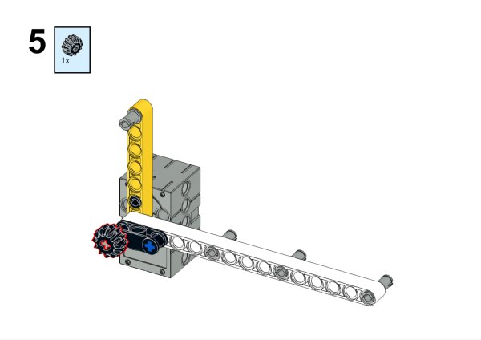

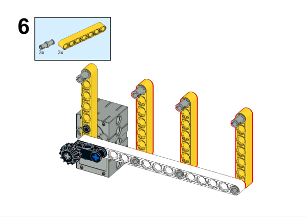

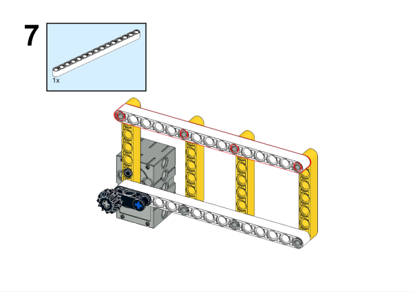

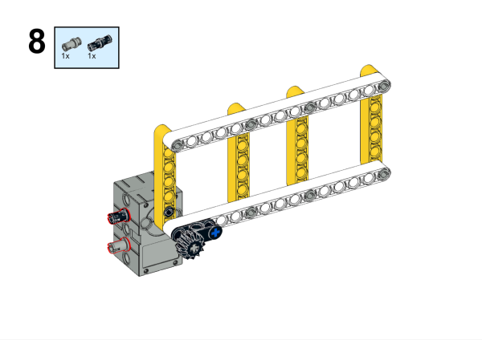

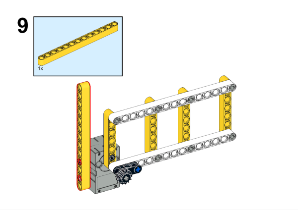

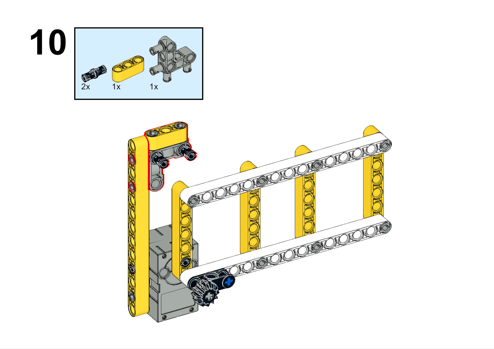

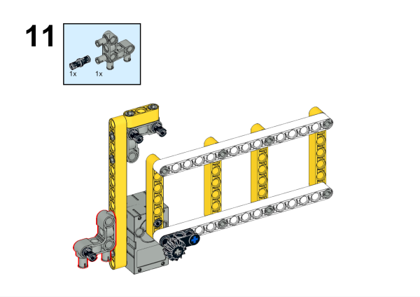

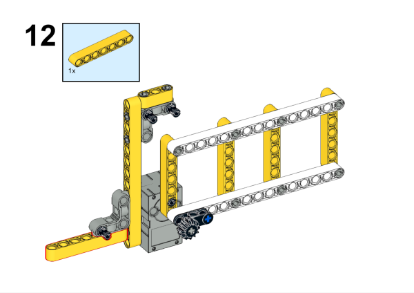

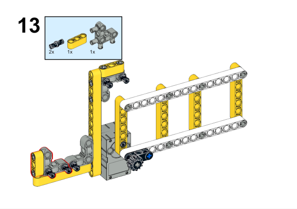

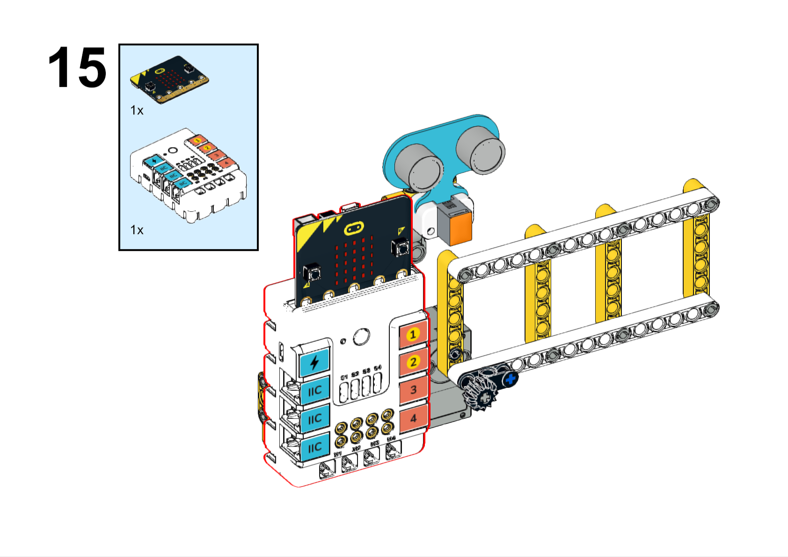

**Completed**

##### Hardware Connection

Connect the ultrasonic sensor to the J1 connector and the servo to the S1 connector of the Nezha expansion board.

##### Programming

Go to [makecode](https://makecode.microbit.org/#)

Create new projects

Click extensions

Search with `planetX` to download the package. 

Search with `nezha` to download the package. 

Code

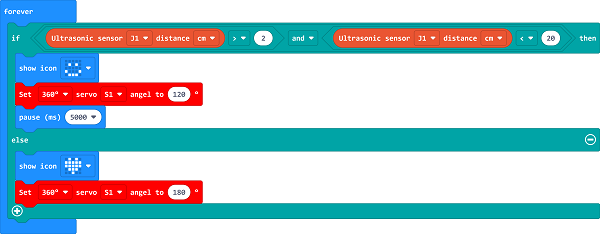

Link: [https://makecode.microbit.org/_71MTtr1dH9go](https://makecode.microbit.org/_71MTtr1dH9go)

You may download it directly:

    <iframe
        src="https://makecode.microbit.org/_71MTtr1dH9go"
        frameborder="0"
        sandbox="allow-popups allow-forms allow-scripts allow-same-origin"
        style={{
            position: 'absolute',
            width: '100%',
            height: '100%',
        }}
    />

### Demonstration

>Present in groups and compare the results and effectiveness of each group.

#### Result

When the ultrasonic sensor detects the proximity of an object, the gate is opened automatically.

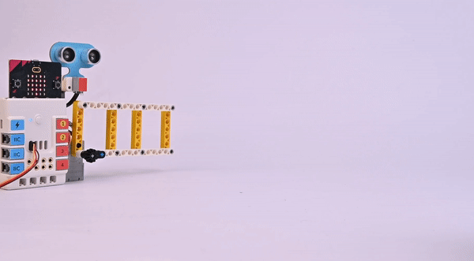

###  Reflection

>Share in groups so that students in each group can share their production process and insights, summarise the problems and solutions they encountered, and evaluate their strengths and weaknesses.
