# Case 03 Weight Lifting Robot

## Introduction

Make a weight lifting robot.

## Purchase Link

## Quick Start

### Build Steps

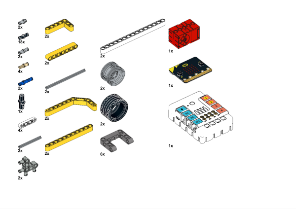

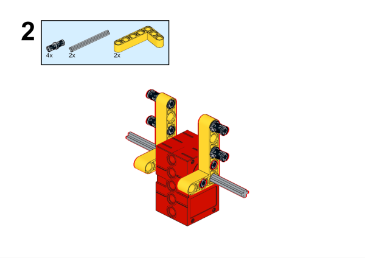

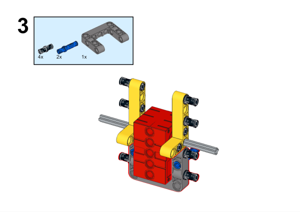

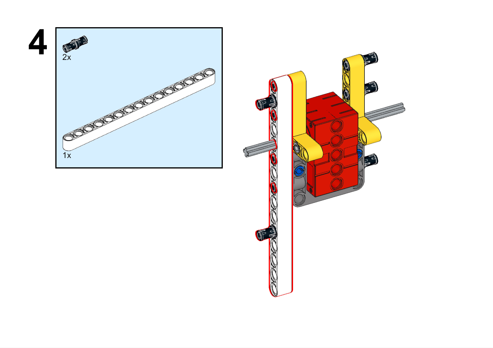

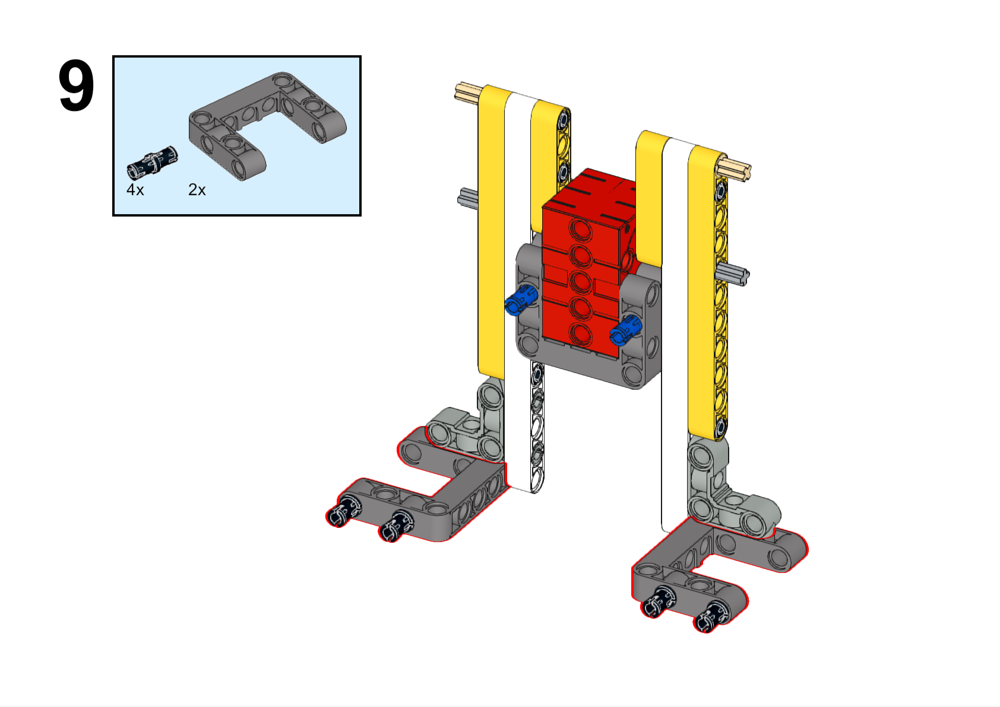

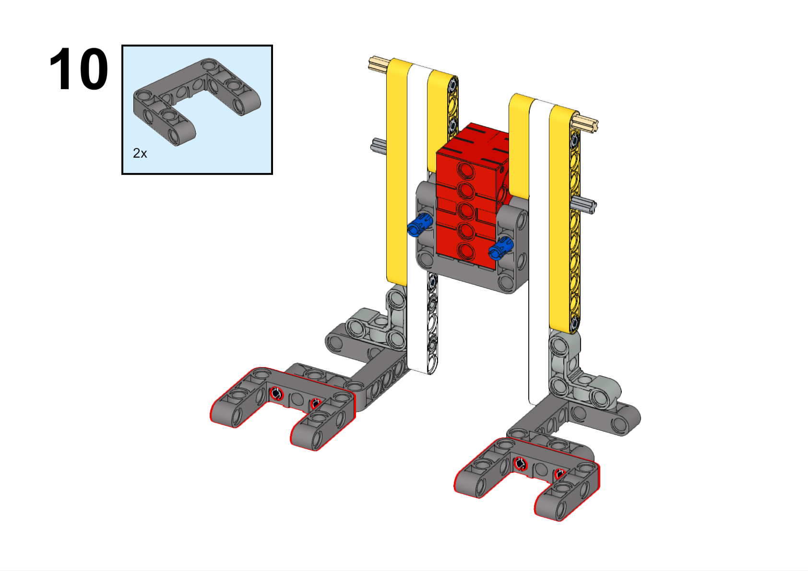

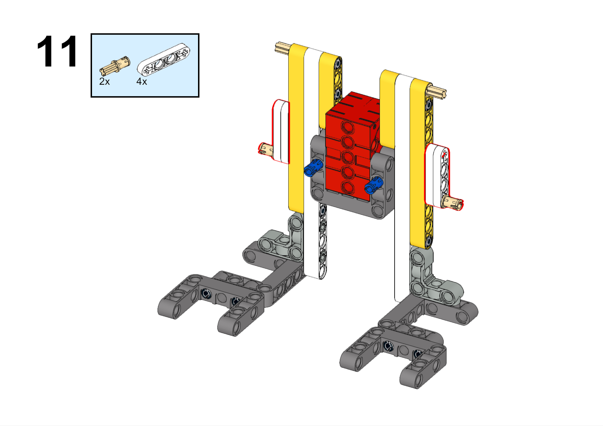

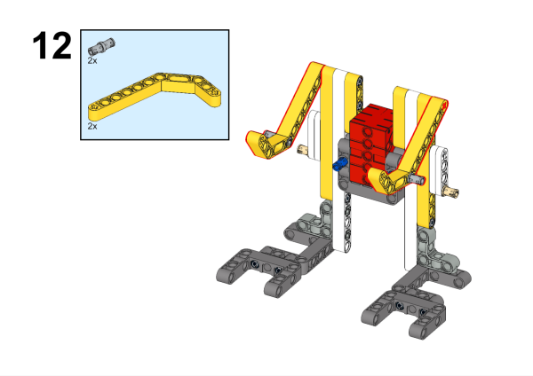

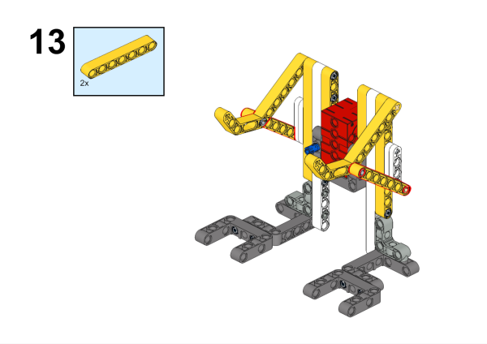

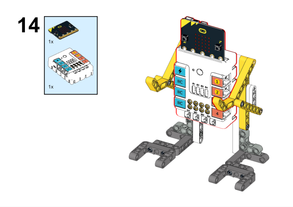

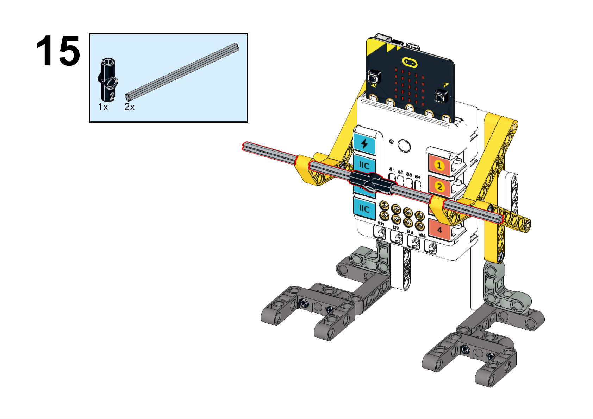

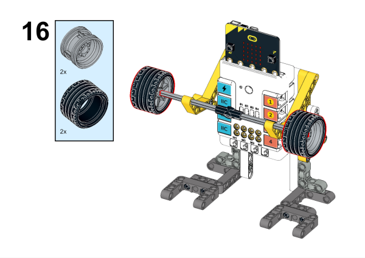

### Hardware Connection

Connect the motor to M1 on Nezha breakout board

### Software Programming

Open programming platform: [makecode](https://makecode.microbit.org/#)

New Project

Click Extension

Search `nezha` in the search bar to add the expansion library for Nezha expansion boards

Write the program

Link:[https://makecode.microbit.org/_LgVU5PgYcJKw](https://makecode.microbit.org/_LgVU5PgYcJKw)

You can also download the program directly from the following pages.

    <iframe
        src="https://makecode.microbit.org/_LgVU5PgYcJKw"
        frameborder="0"
        sandbox="allow-popups allow-forms allow-scripts allow-same-origin"
        style={{
            position: 'absolute',
            width: '100%',
            height: '100%',
        }}
    />

### Result

Press A on the micro:bit to start the robot to lift weights, and press B on the micro:bit to stop the robot from working.

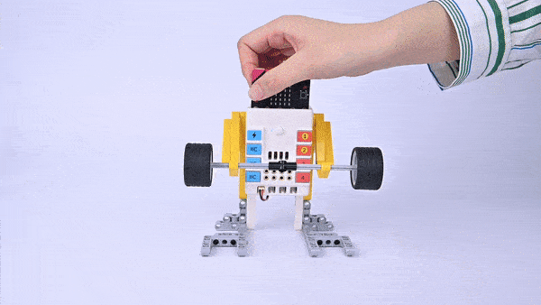
