# Case 34: Mechanical Dog
## Purpose
Make a mechanical dog.

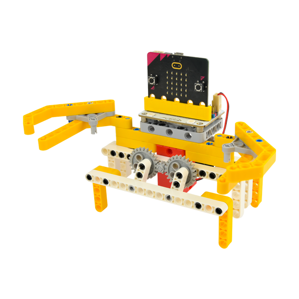

## Purchase Link

[ELECFREAKS micro:bit 32 IN 1 Wonder Building Kit (Without micro:bit Board)](https://item.taobao.com/item.htm?id=649813731275&spm=2015.23436601.0.0)

## Materials required

## Building Step

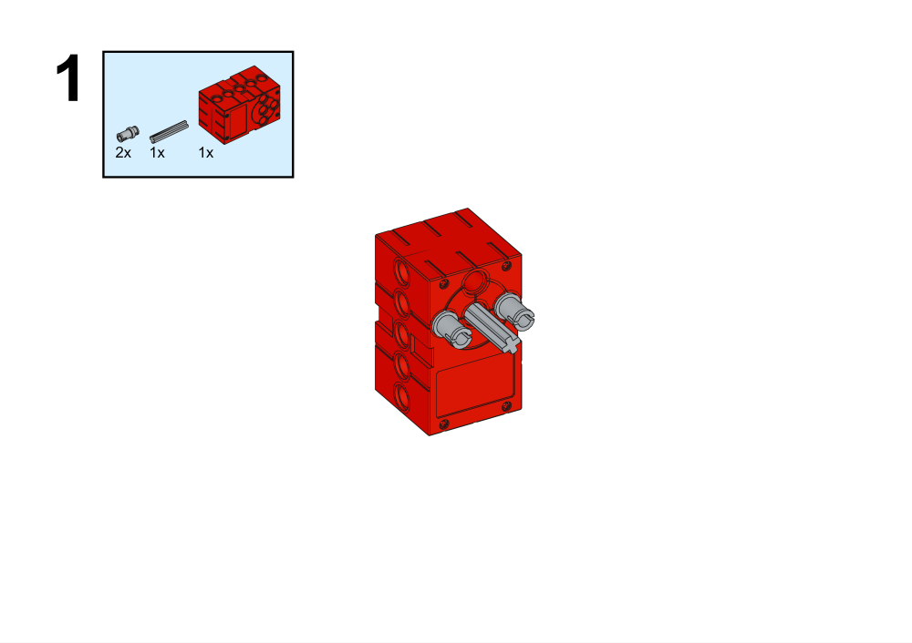

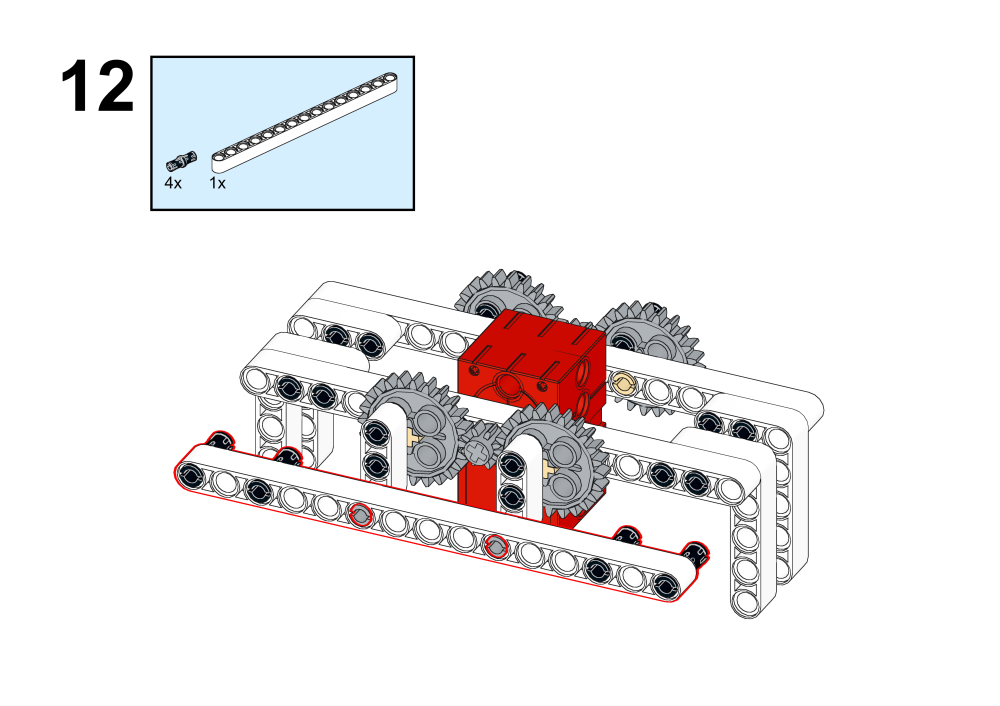

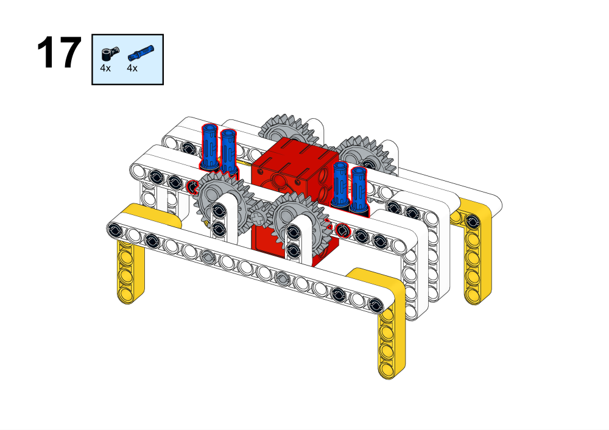

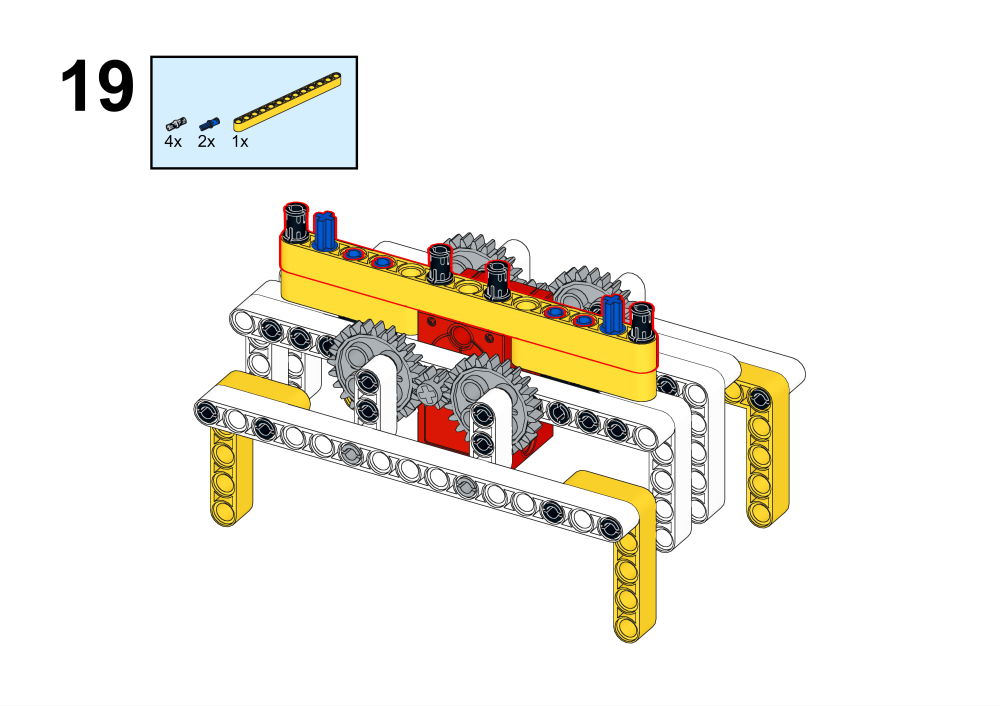

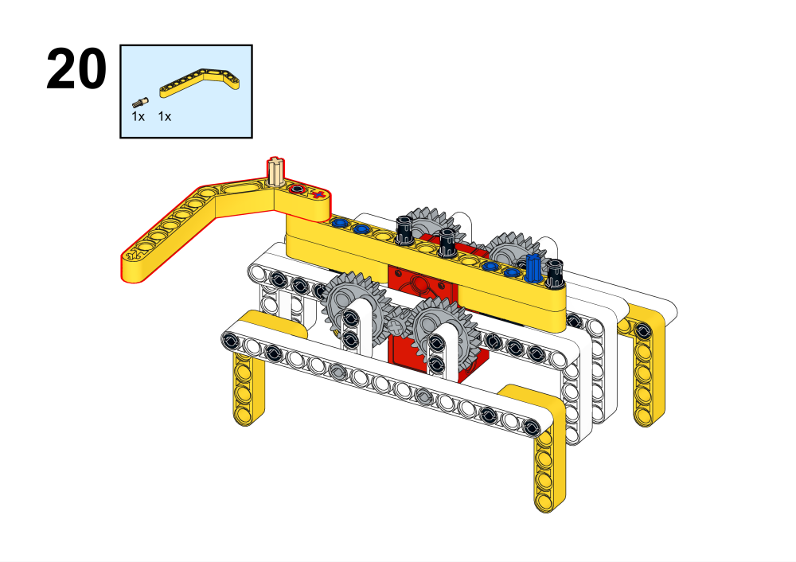

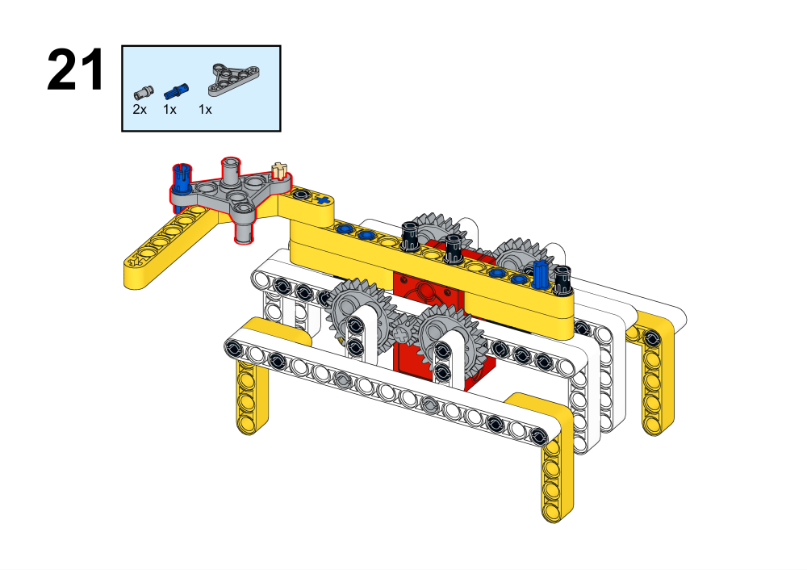

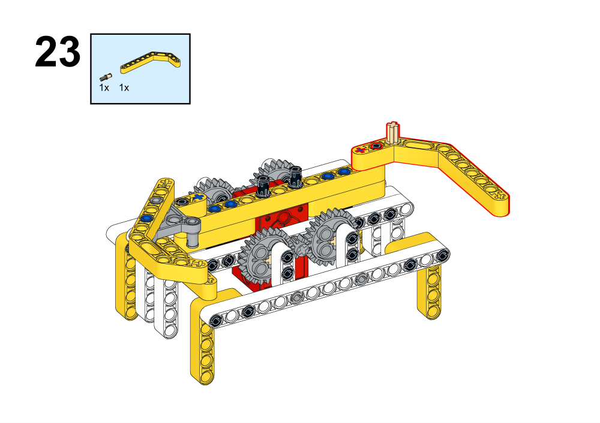

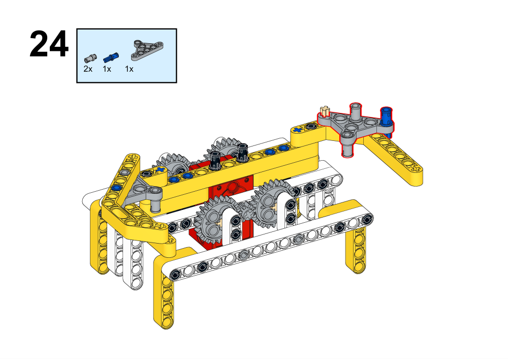

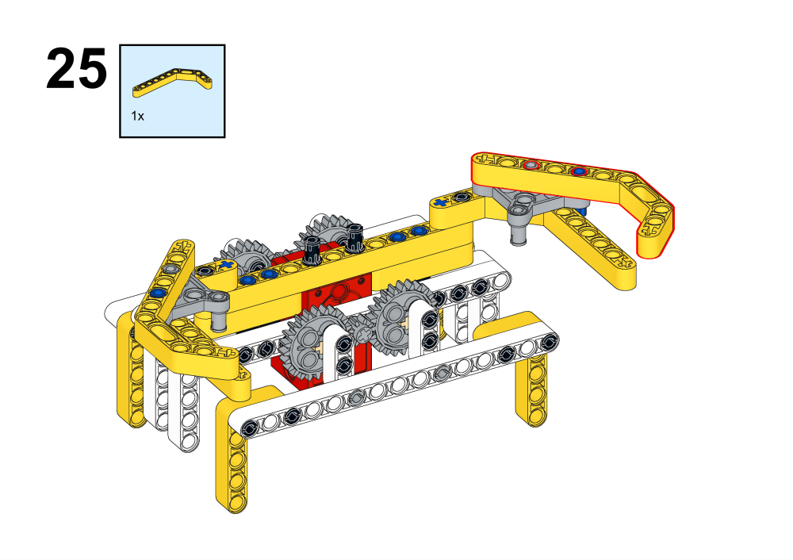

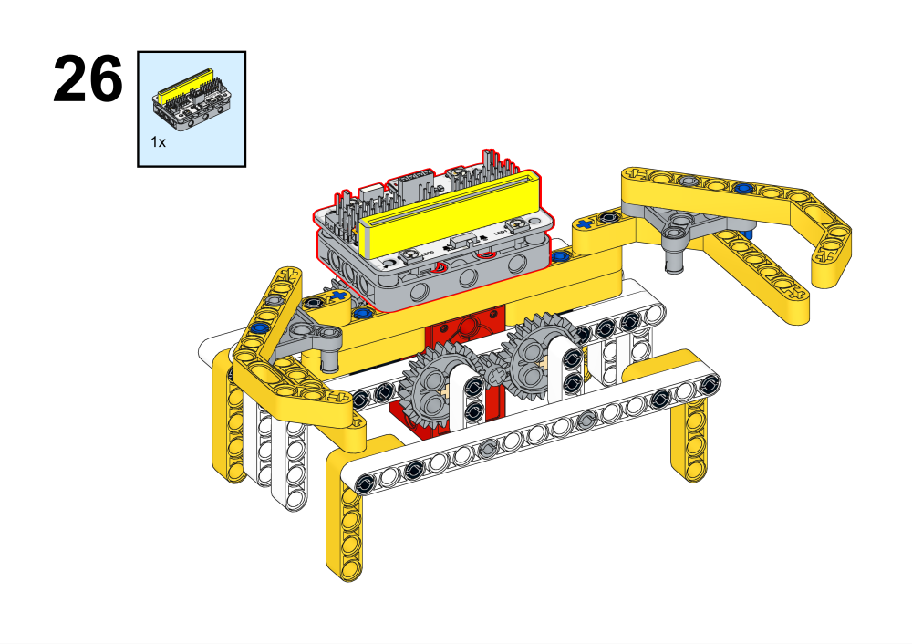

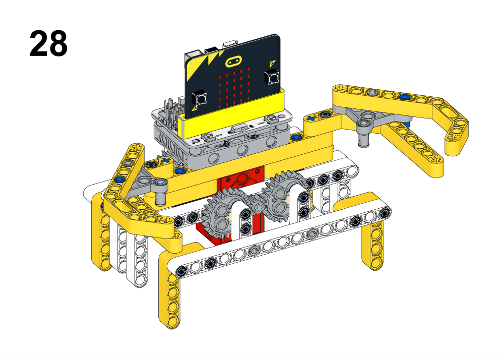

## Programming platform

[MakeCode](https://makecode.microbit.org/)

## Programming
## Add Extension
Click Advanced in MakeCode's code drawer to see more code options and click on Extensions.

Search for wukong in the search box, click on wukong in the image and add the expansion pack.

### Procedures

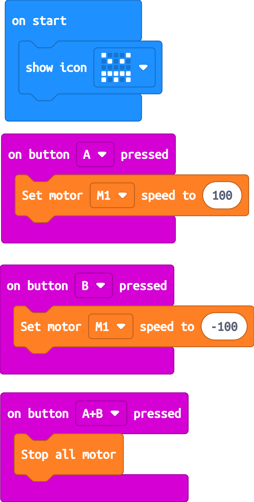

Link: [https://makecode.microbit.org/_C7LCAX8M8EsK](https://makecode.microbit.org/_C7LCAX8M8EsK)
