# Case 35: Swimming Robot
## Purpose
Make a swimming robot.

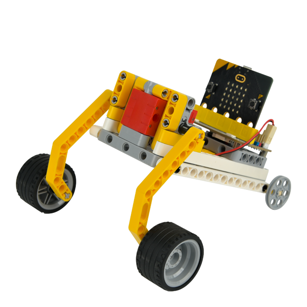

## Purchase Link

[ELECFREAKS micro:bit 32 IN 1 Wonder Building Kit (Without micro:bit Board)](https://item.taobao.com/item.htm?id=649813731275&spm=2015.23436601.0.0)

## Materials required

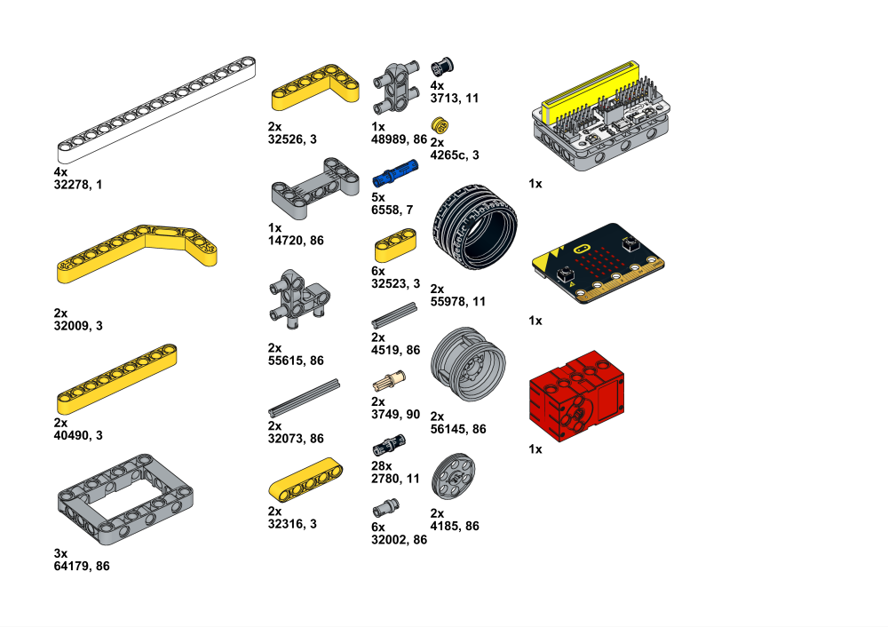

## Build Steps

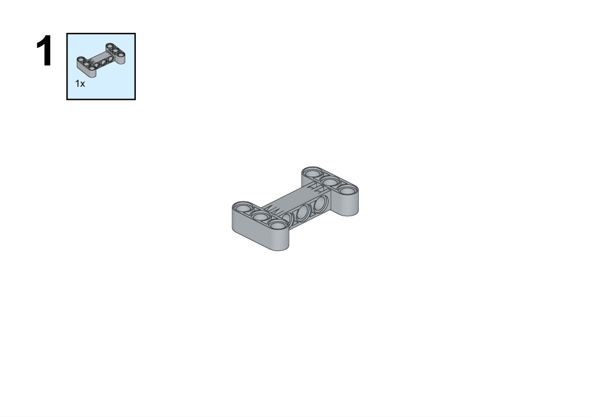

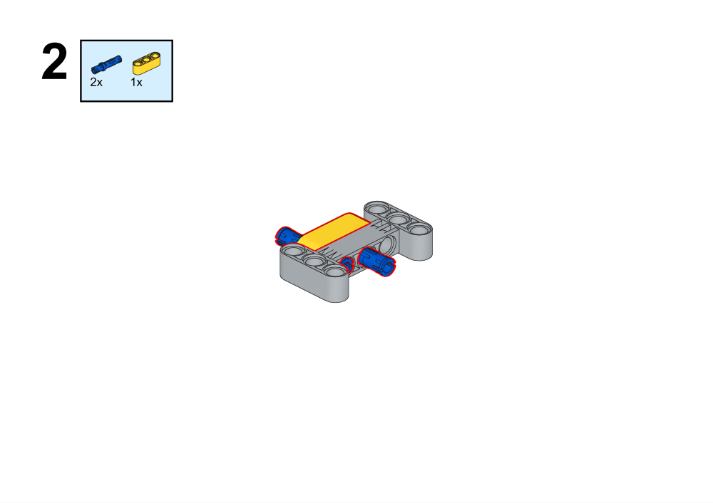

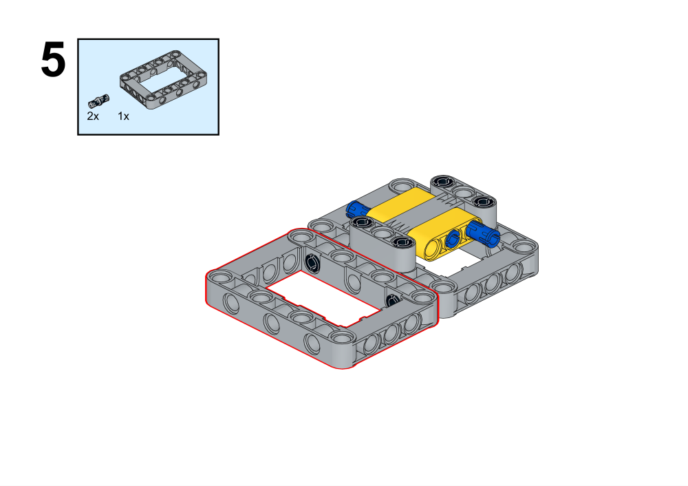

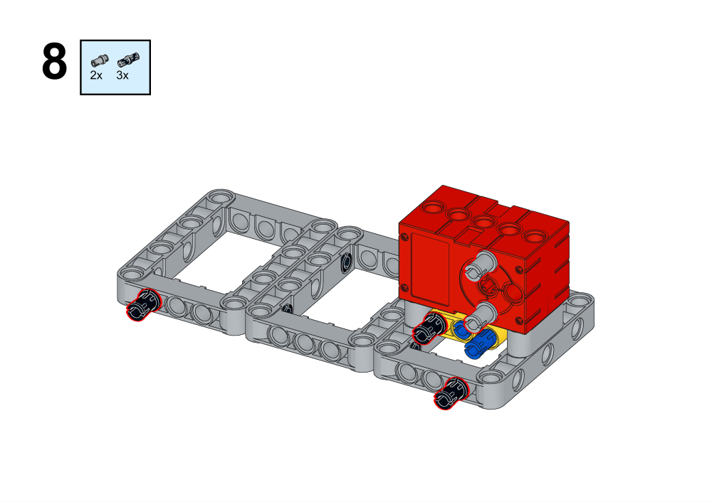

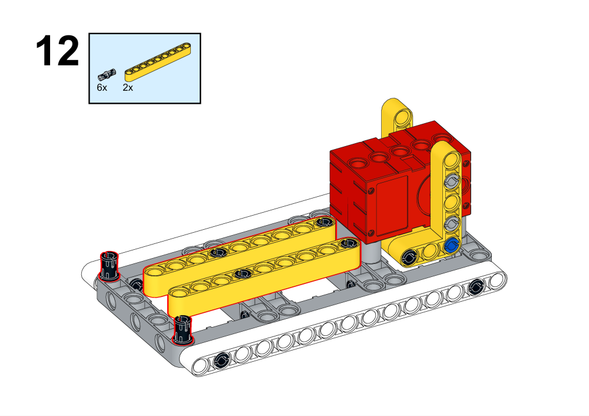

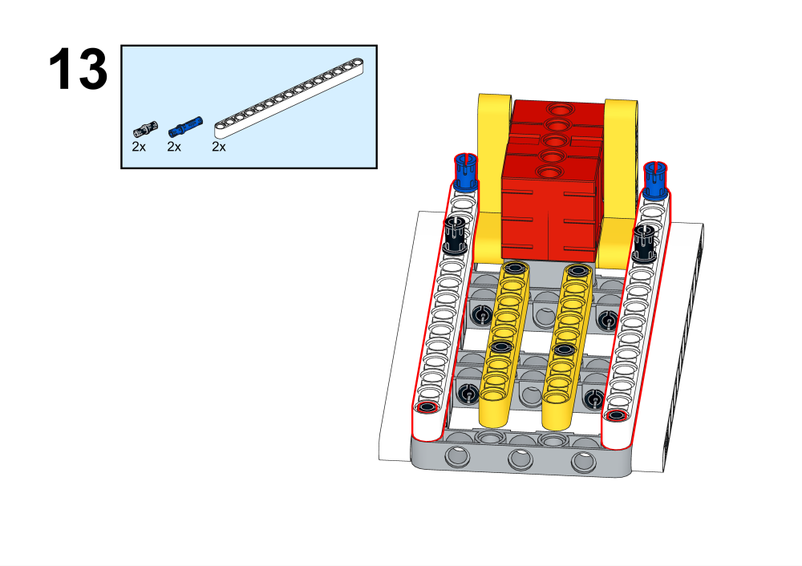

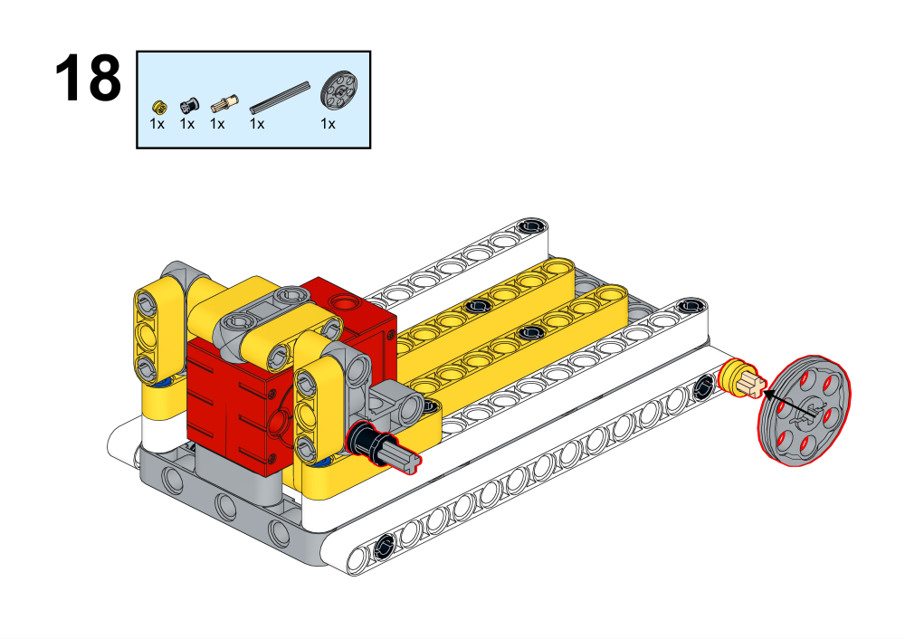

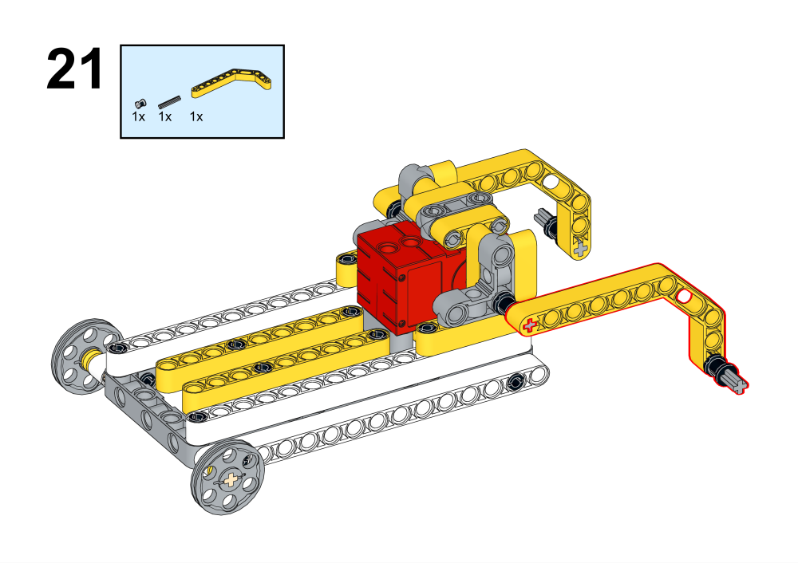

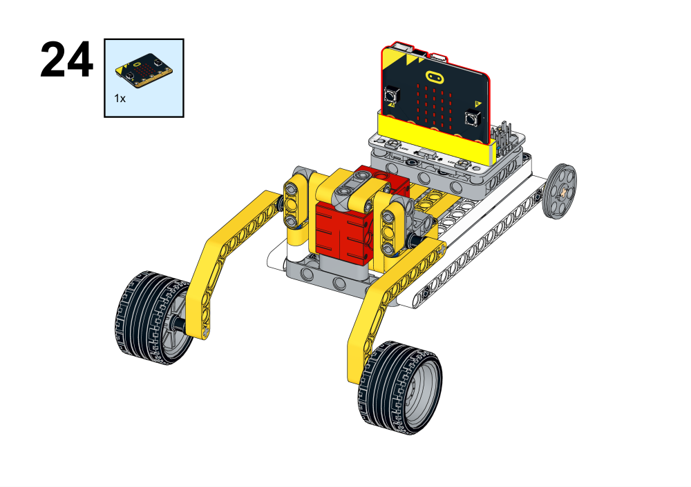

## Hardware Connection

## Programming Platform

[MakeCode](https://makecode.microbit.org/)

## Programming
## Add extension
Click Advanced in MakeCode's code drawer to see more code options and click on Extensions.

Search for wukong in the search box, click on wukong in the image and add the expansion pack.

### Procedures

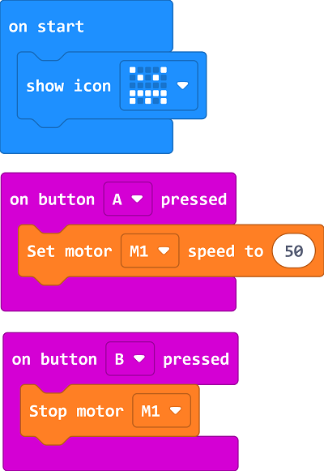

Link: [https://makecode.microbit.org/_FJEJecVXe8au](https://makecode.microbit.org/_FJEJecVXe8au)
