# Case 37: The Steering Vehicle
## Purpose
Make a steering car.

## Purchase Link

[ELECFREAKS micro:bit 32 IN 1 Wonder Building Kit](https://www.elecfreaks.com/micro-bit-wonder-building-kit-without-micro-bit-board.html)

## Materials required

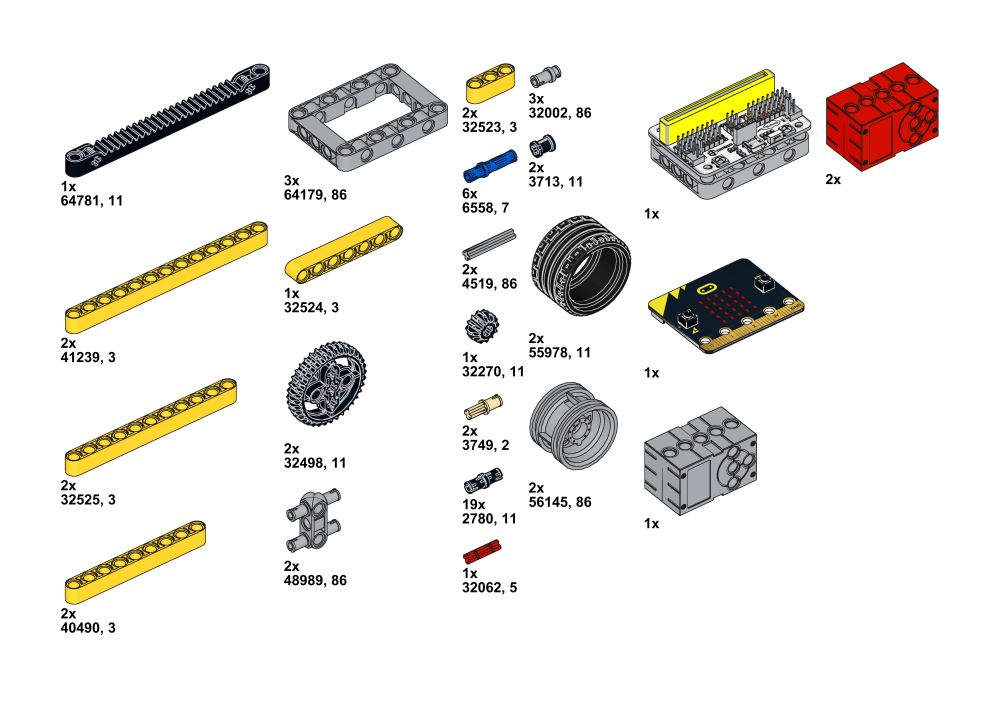

## Assembly Steps

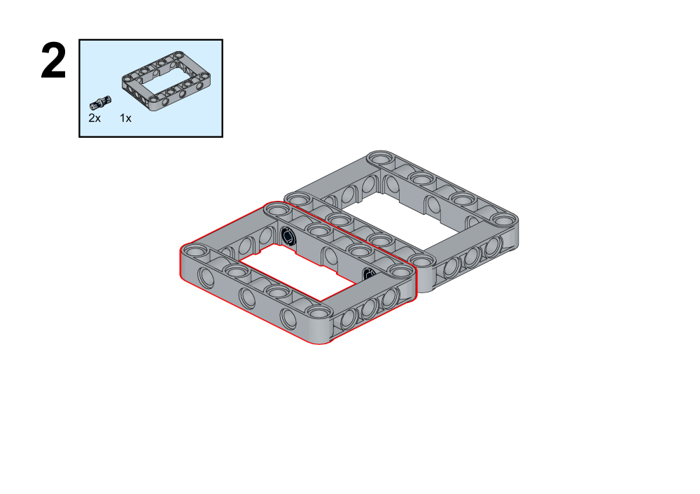

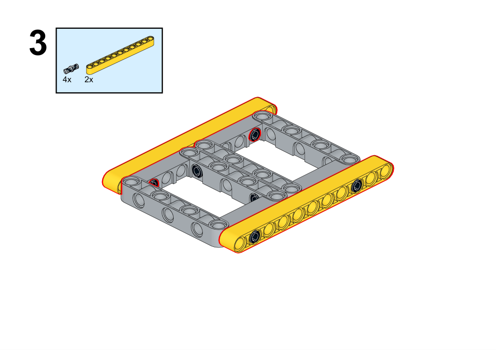

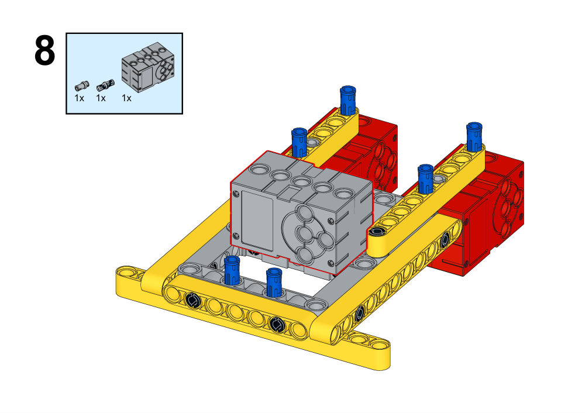

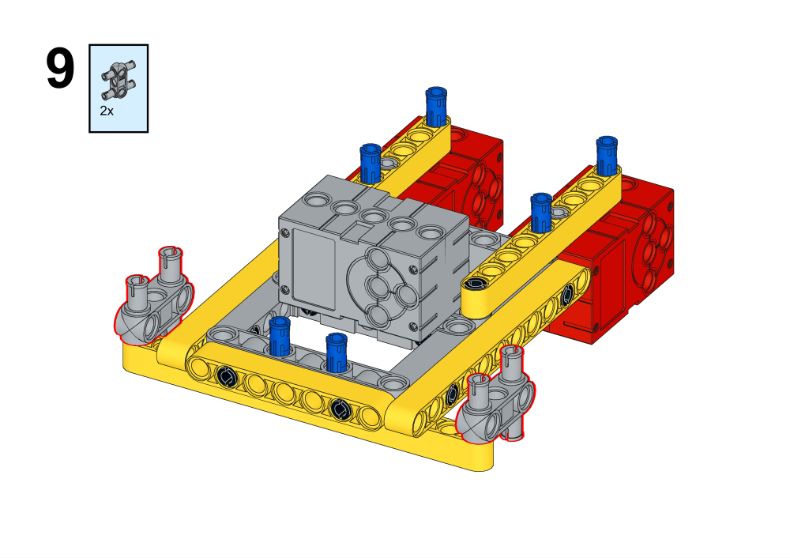

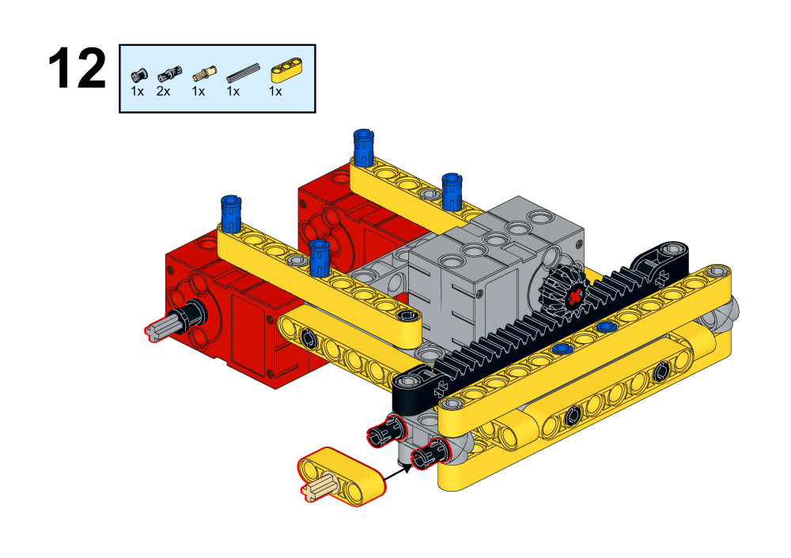

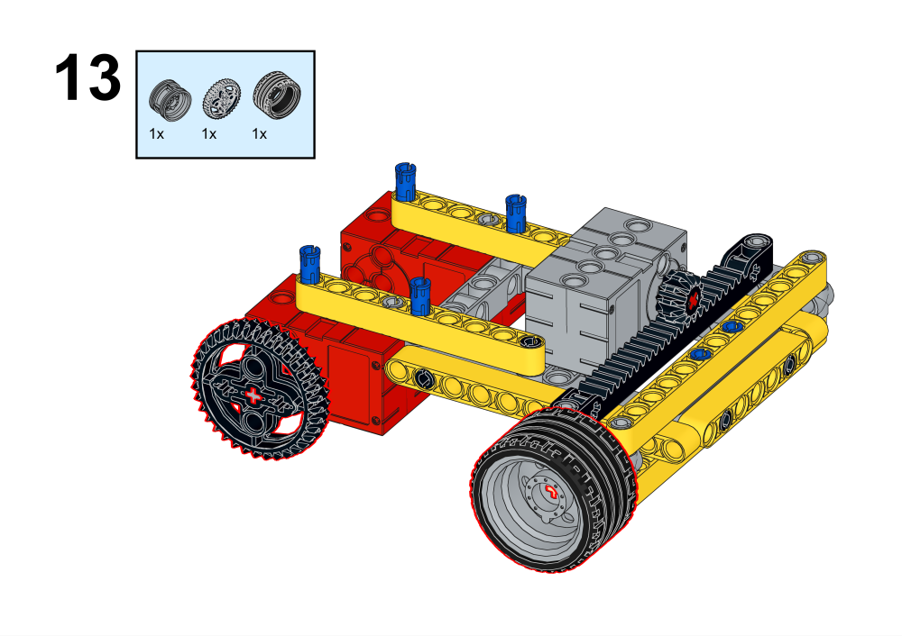

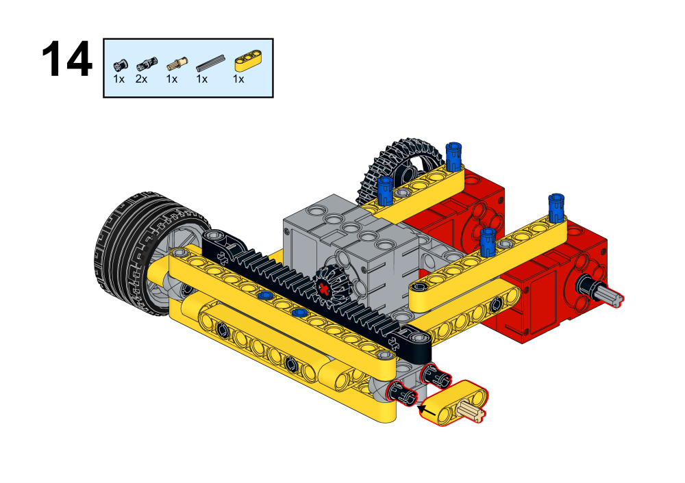

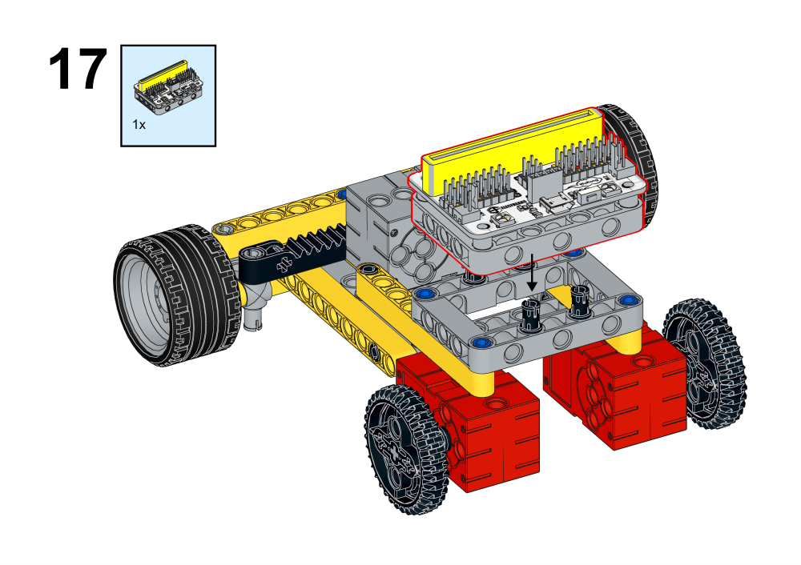

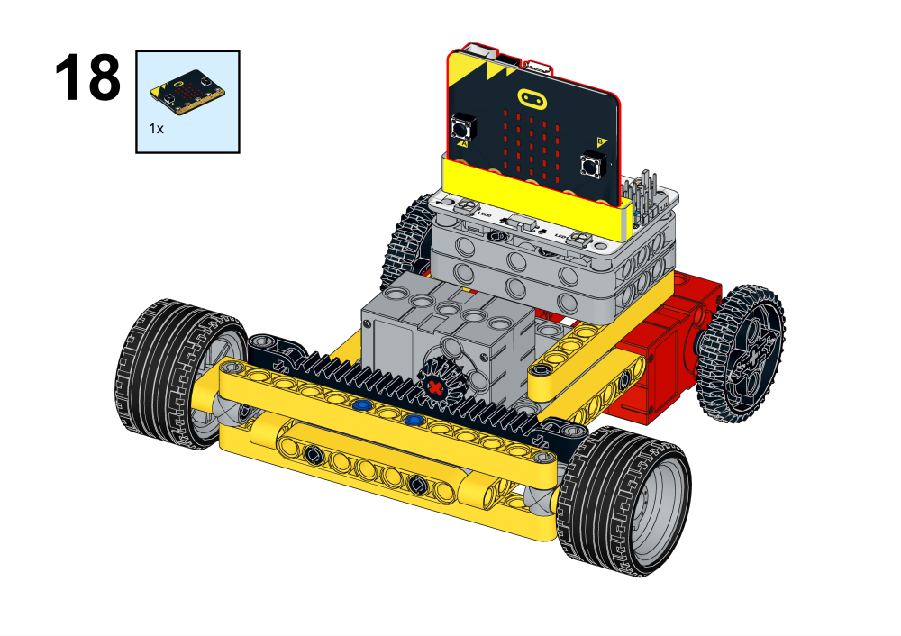

## Hardware Connectivity

## Programming Platform

[MakeCode](https://makecode.microbit.org/)

## Programming
## Add extension
Click Advanced in the drawer to see more code options and click on Extensions.

Search for wukong in the search box, click on wukong in the image and add the expansion pack.

### Procedures

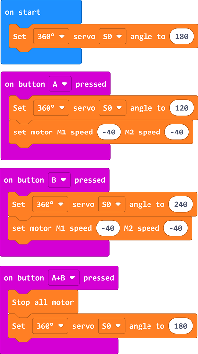

Link: [https://makecode.microbit.org/_Eqb7fEREYacV](https://makecode.microbit.org/_Eqb7fEREYacV)
