# Case 40: The Bow
## Purpose
To make a bow. 

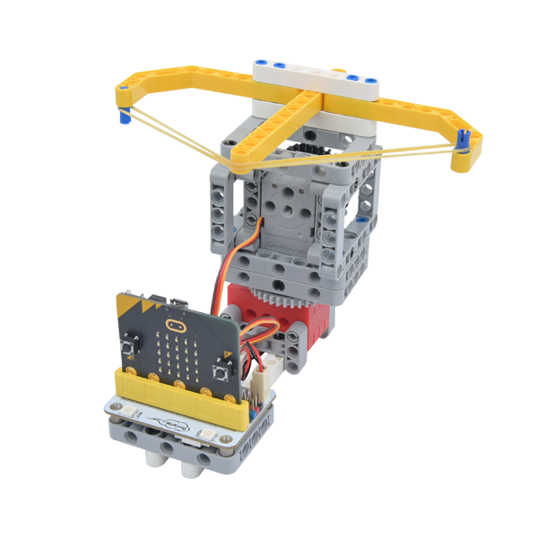

## Purchase link:

[ELECFREAKS micro:bit 32 IN 1 Wonder Building Kit](https://item.taobao.com/item.htm?id=649813731275&spm=2015.23436601.0.0)

## Materials required

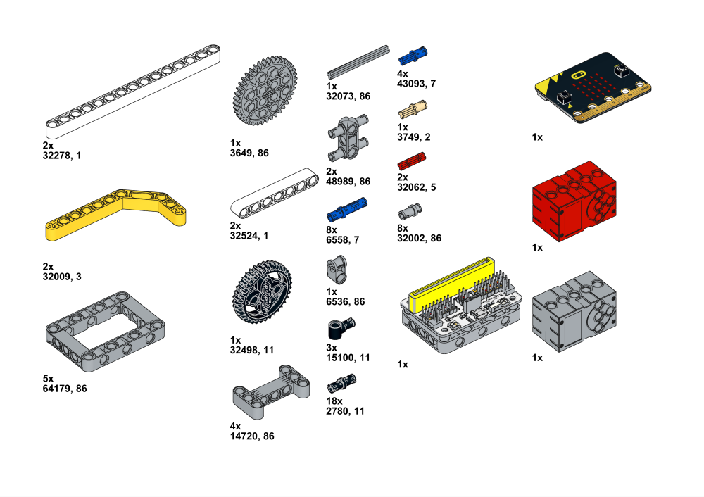

## Assembly Steps

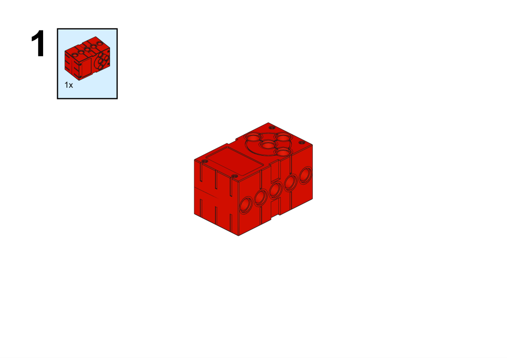

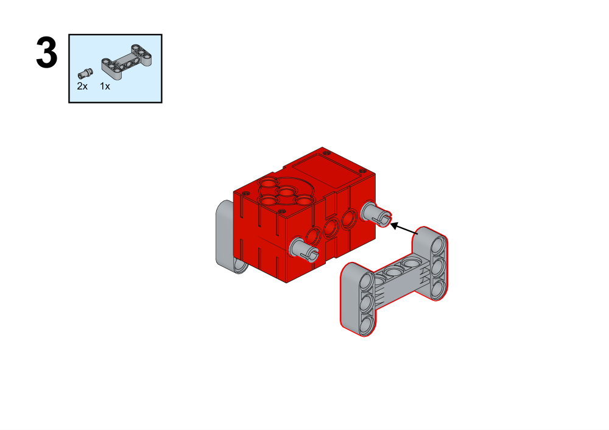

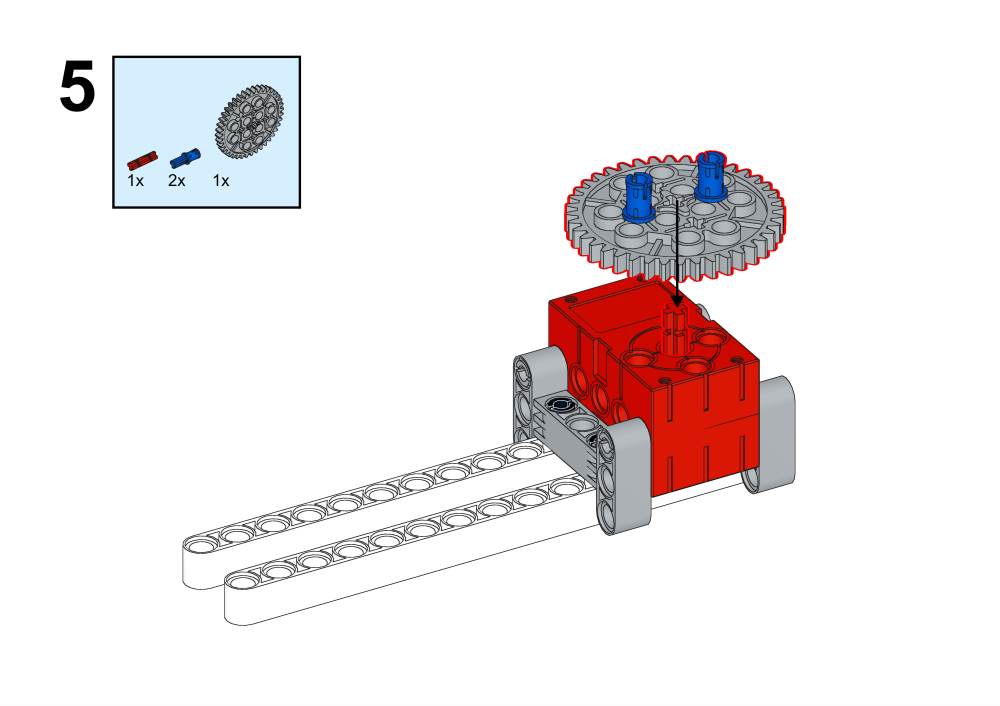

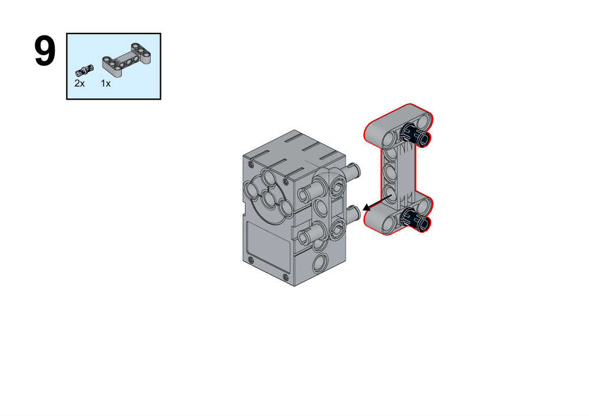

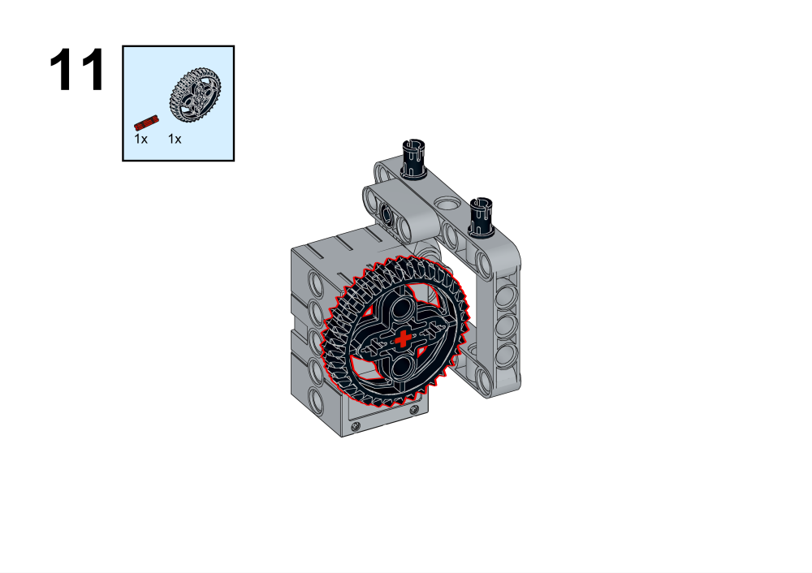

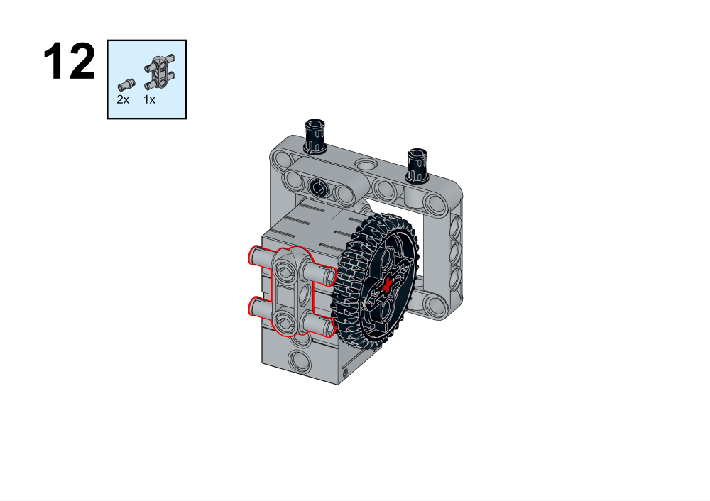

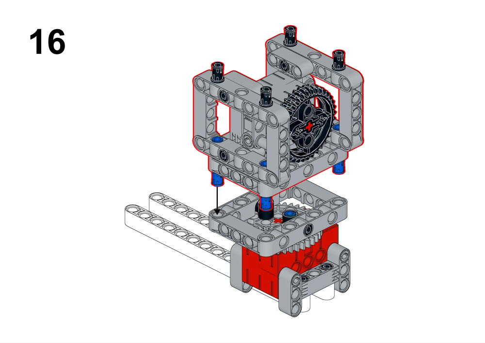

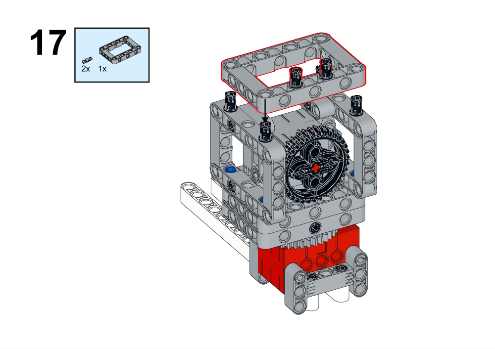

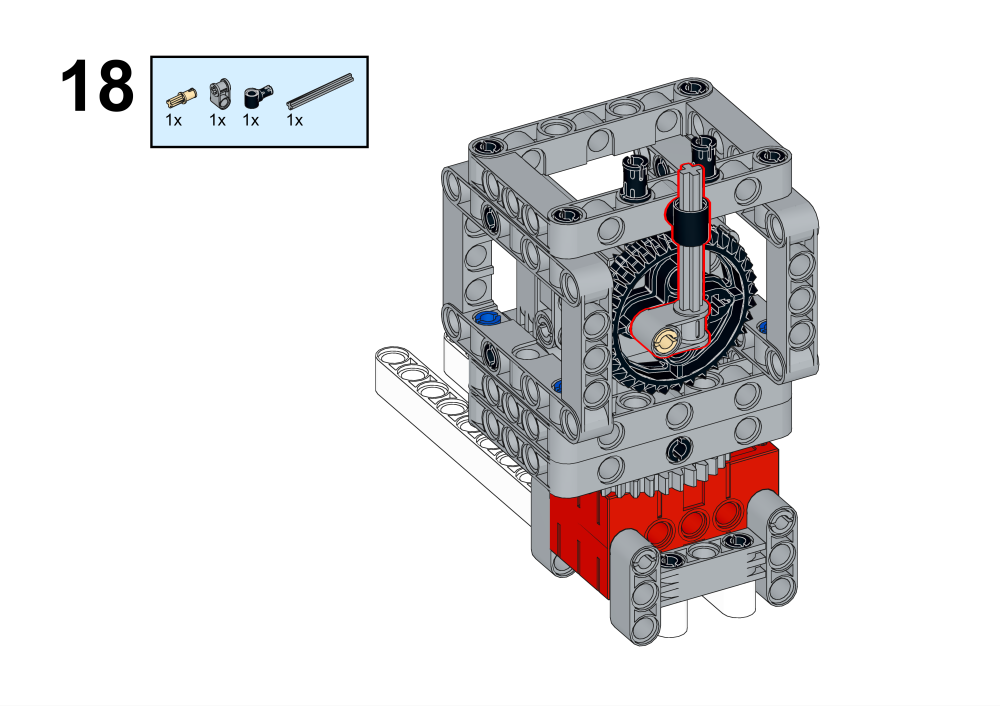

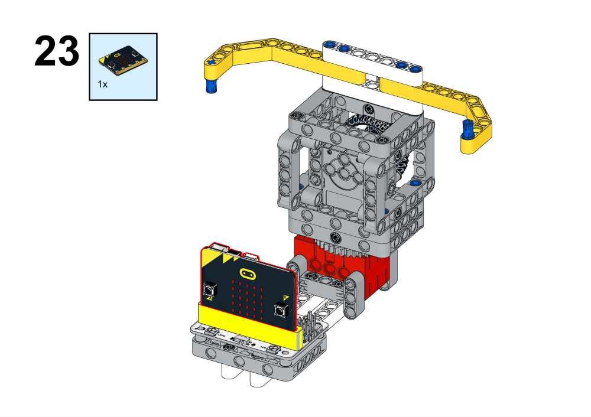

## Hardware Connections

## Programming Platform

[MakeCode](https://makecode.microbit.org/)

## Programming
## Extensions
Click Advanced in MakeCode's code drawer to see more code options and click on Extensions.

Search for wukong in the search box, click on wukong in the image and add the expansion pack.

### Code

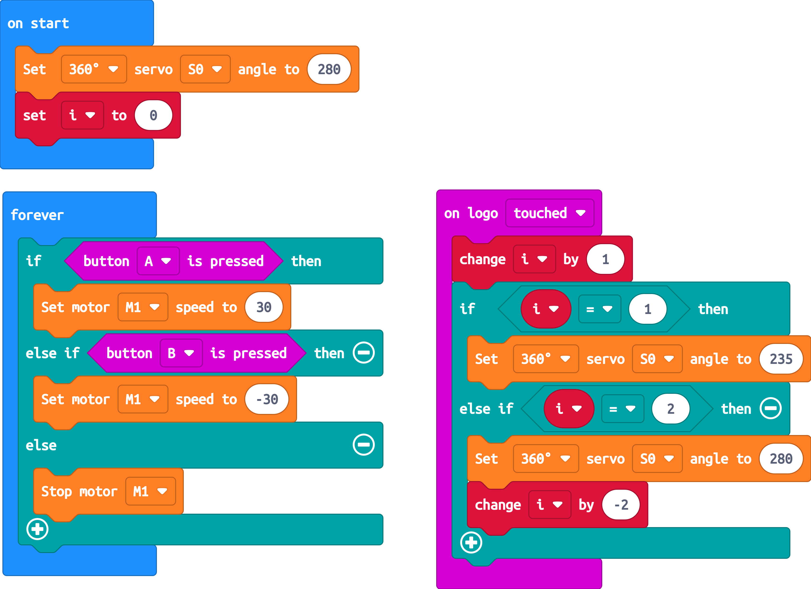

Link: [https://makecode.microbit.org/_4U1CcwP1bCXi](https://makecode.microbit.org/_4U1CcwP1bCXi)
