# Case 43: The Worm car
## Purpose
Make a worm car.

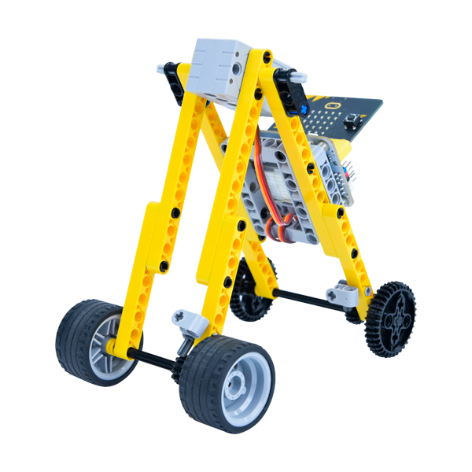

## Purchase Link

[ELECFREAKS micro:bit 32 IN 1 Wonder Building Kit](https://www.elecfreaks.com/micro-bit-wonder-building-kit-without-micro-bit-board.html)

## Materials required

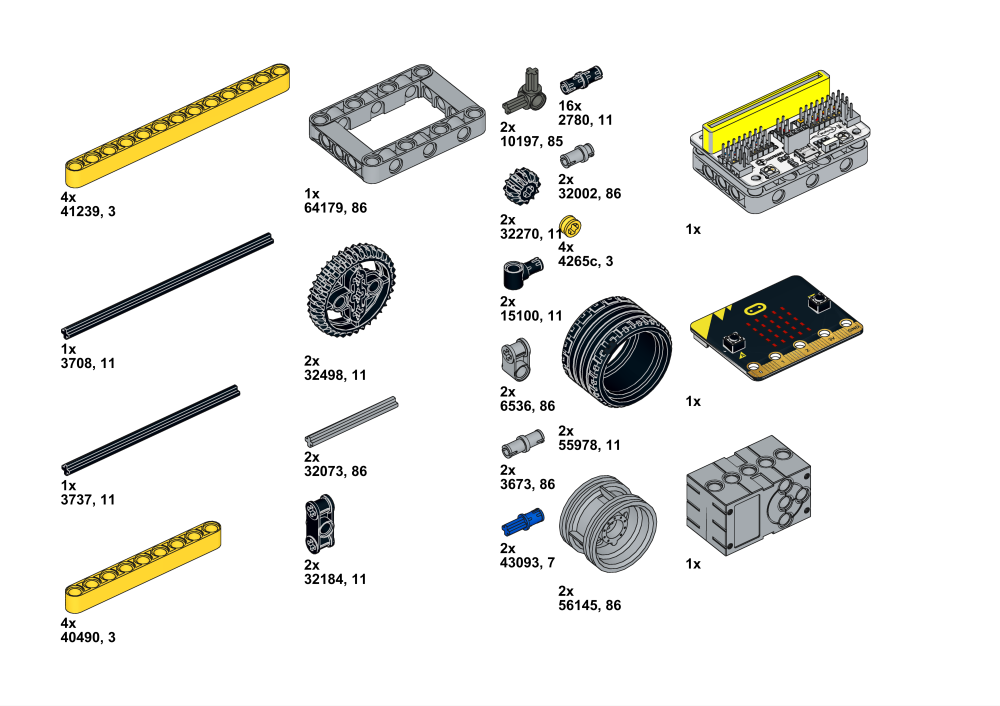

## Build Steps

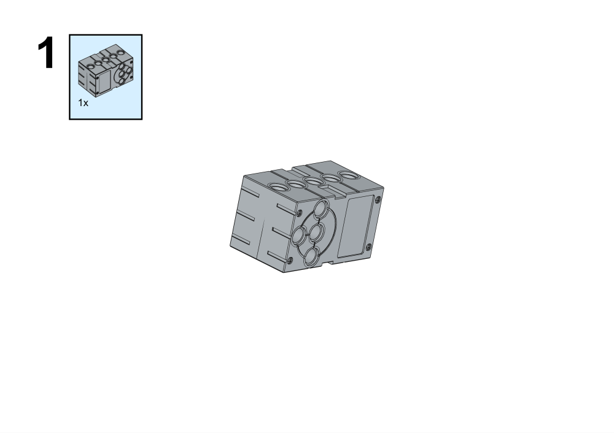

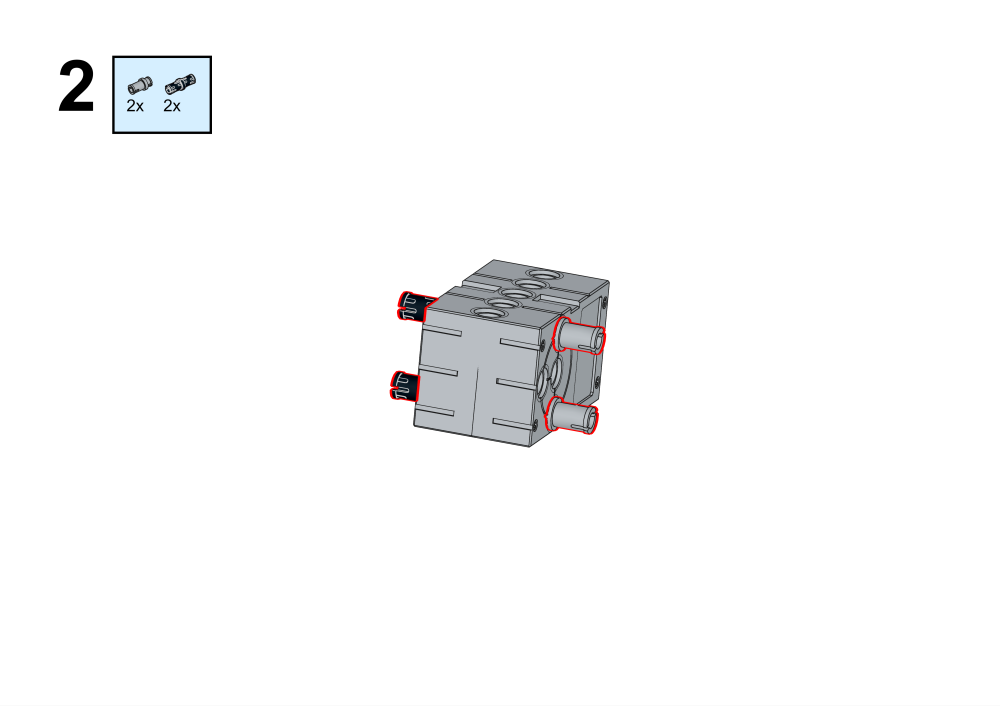

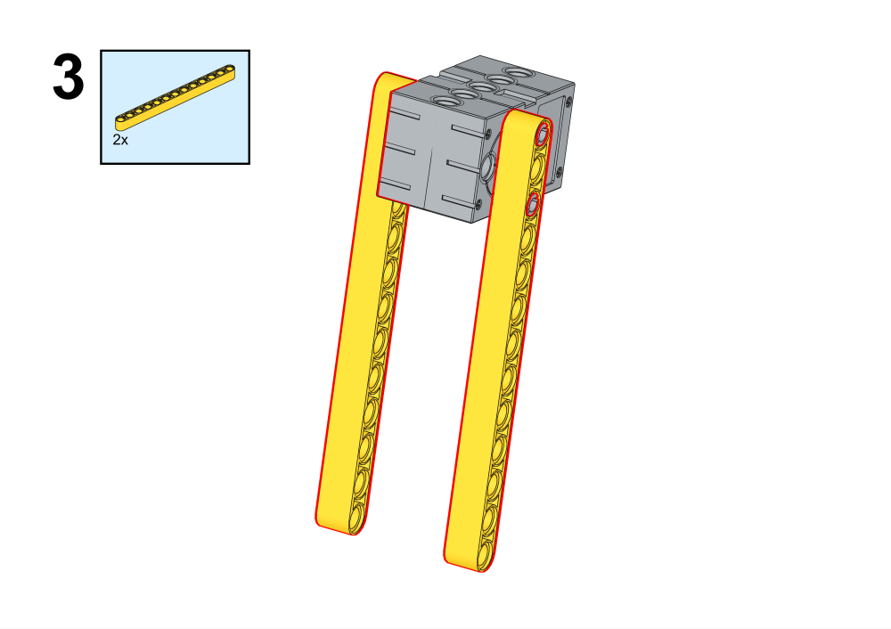

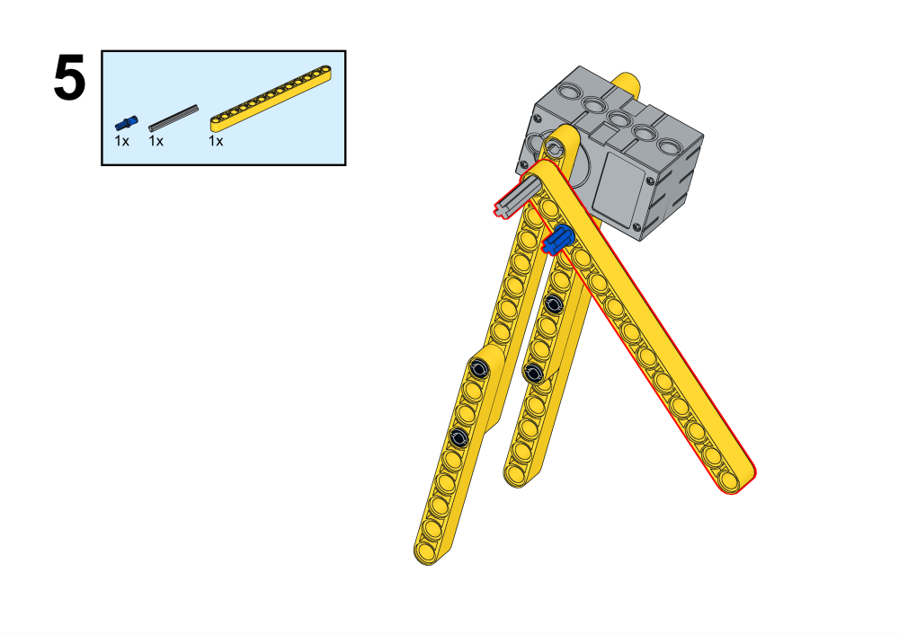

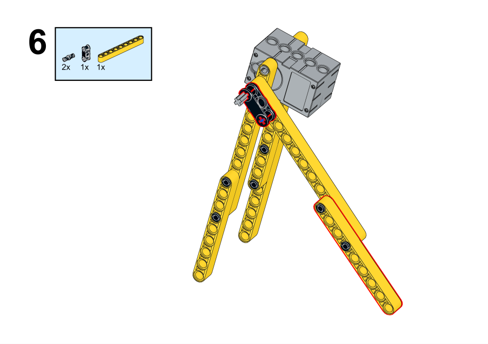

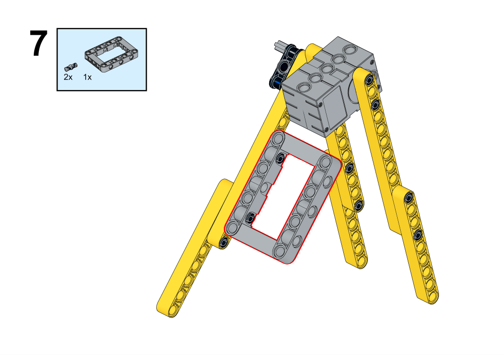

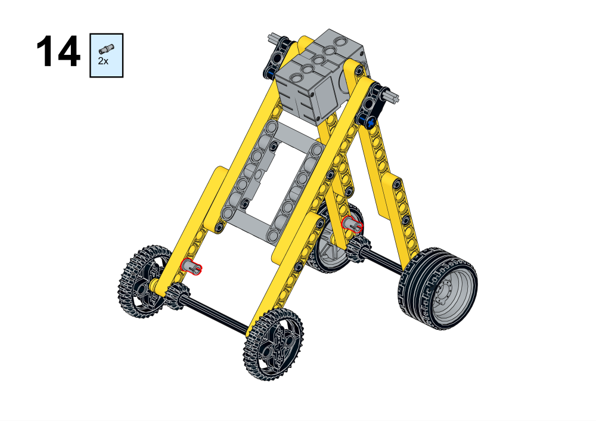

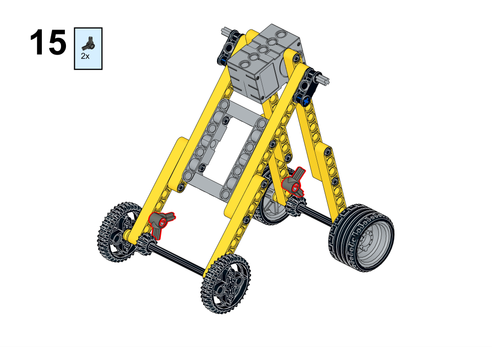

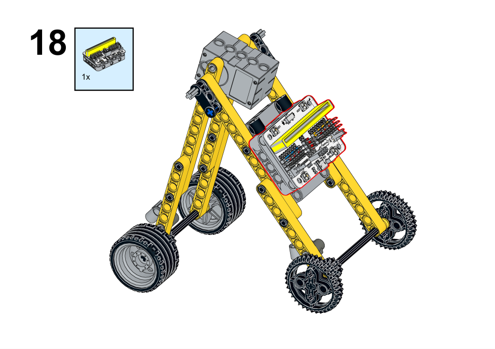

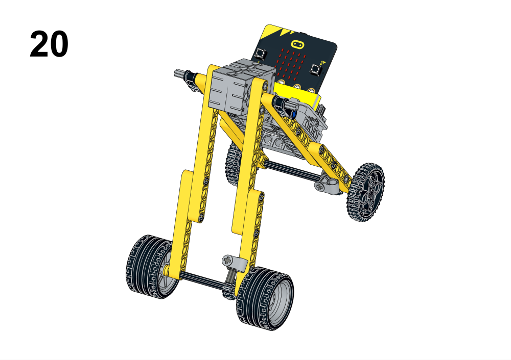

## Hardware Connectivitym  

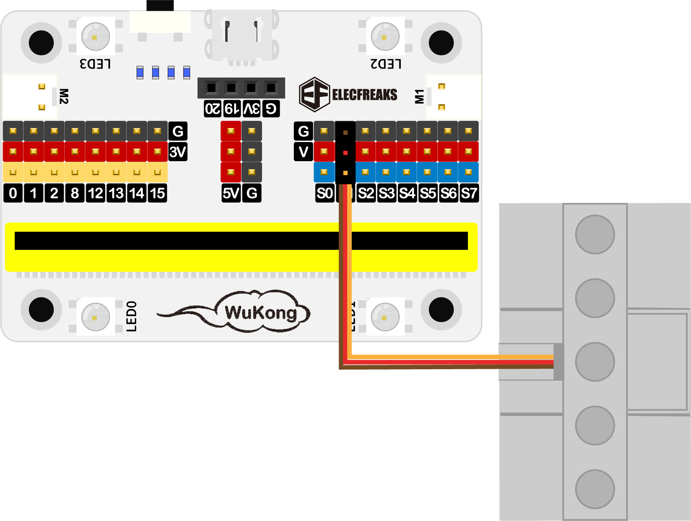

## Programming Platform

[MakeCode](https://makecode.microbit.org/)

## Programming
## Add extension
Click Advanced in MakeCode's code drawer to see more code options and click on Extensions.

Search for wukong in the search box, click on wukong in the image and add the expansion pack.

### Procedures

Link: [https://makecode.microbit.org/_Dp7TAW80jJAE](https://makecode.microbit.org/_Dp7TAW80jJAE)
