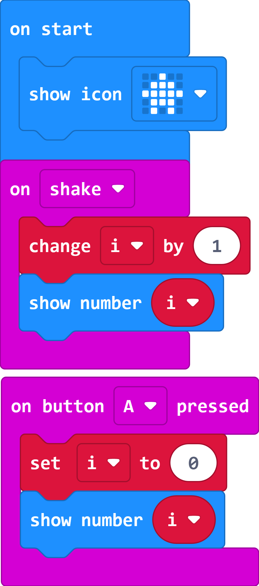

# Case 05: Pedometer

## Purpose

 Use the Smart Coding Kit to create a wearable pedometer.

## Products Link

 1 x [ELECFREAKS micro:bit Smart Coding Watch Kit](https://shop.elecfreaks.com/products/elecfreaks-micro-bit-smart-coding-watch-kit-without-micro-bit-board?_pos=2&_sid=ce4e7cb69&_ss=r)

## Software

[MicroSoftmakecode](https://makecode.microbit.org/#)

## Programming

 Show the preset icon while on start; Set i=i+1 while on shake and display the value of the variable `i`; set `i` as 0 while button A being pressed and display the value of `i` at the same time.

### Link
 Link：[https://makecode.microbit.org/_hHo0dv3yVMsh](https://makecode.microbit.org/_hHo0dv3yVMsh)

 You can also download it direcly below:

    <iframe
        src="https://makecode.microbit.org/_hHo0dv3yVMsh"
        frameborder="0"
        sandbox="allow-popups allow-forms allow-scripts allow-same-origin"
        style={{
            position: 'absolute',
            width: '100%',
            height: '100%',
        }}
    />

## Result

While detecting the shake, the displaying number will add up 1 automatically for each time being detected,  and the value will be back to 0 once button A being pressed.

## Exploration

## FAQ

## Relevant File
